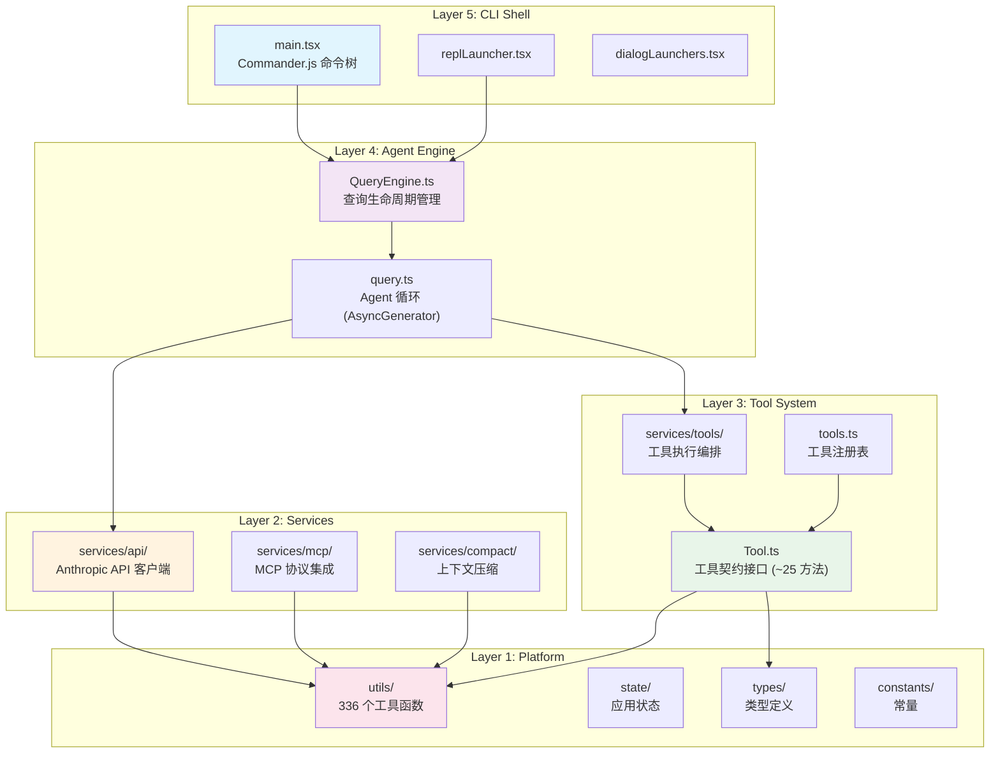
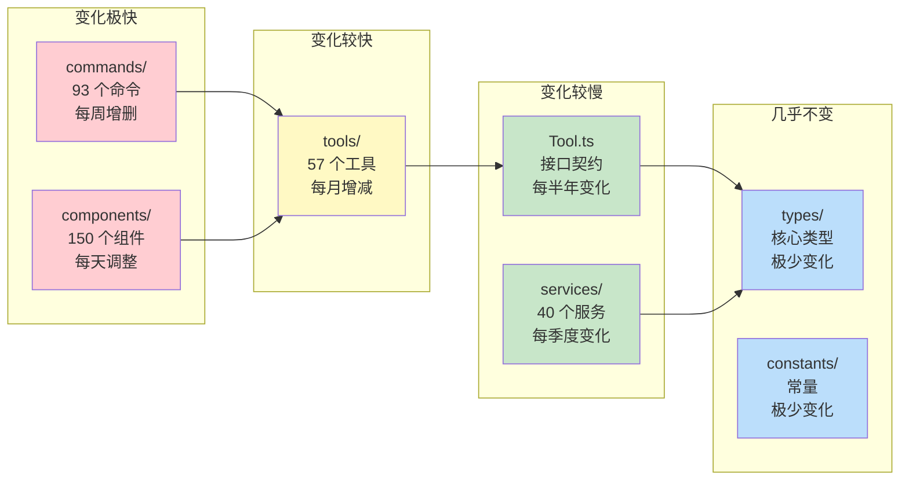

# 第 1 章：架构全景——分层、边界与依赖方向

> **核心思想**：优秀的大型系统不是一堆功能的堆砌，而是一组精心划定的边界。Claude Code 的架构揭示了一个原则：**让依赖方向永远指向稳定的一侧**。

---

## 1.1 为什么需要架构分层？

📖 **费曼式引入**

想象你要建造一栋 50 层的摩天大楼。你不会把电梯系统、供水管道和办公家具搅在一起设计——你会先确定结构承重层，再铺设管道层，最后才是室内装修。每一层的变化频率不同：结构柱 50 年不变，水管可能 10 年换一次，而办公桌可能每年调整。

软件系统同理。Claude Code 有 2,010 个源文件、512,000+ 行代码，包含 57 个工具、93 个命令、150 个 UI 组件。如果这些模块之间可以随意互相引用，任何一处修改都可能引发雪崩式的连锁反应。

**分层的本质是：让变化频率相似的模块住在同一层，让依赖方向永远指向更稳定（变化更慢）的一侧。**

🔬 **首先看一个关键证据**：打开 `src/Tool.ts`——这是定义所有工具契约的核心文件。它的 import 列表揭示了一个重要事实：

```typescript
// src/Tool.ts（前 60 行，import 部分）
import type { ToolResultBlockParam, ToolUseBlockParam } from '@anthropic-ai/sdk/resources/index.mjs'
import type { z } from 'zod/v4'
import type { Command } from './commands.js'
import type { Message, AssistantMessage, UserMessage } from './types/message.js'
import type { PermissionMode, PermissionResult } from './types/permissions.js'
import type { FileStateCache } from './utils/fileStateCache.js'
// ... 更多类型导入
```

注意：`Tool.ts` 只导入**类型**（`import type`），而且来自 `./types/`、`./utils/`、SDK 类型——它从不导入任何具体的工具实现（没有 `import { BashTool }`）。

相反，看 `src/tools.ts`——工具注册表：

```typescript
// src/tools.ts:2-8
import { toolMatchesName, type Tool, type Tools } from './Tool.js'
import { AgentTool } from './tools/AgentTool/AgentTool.js'
import { BashTool } from './tools/BashTool/BashTool.js'
import { FileReadTool } from './tools/FileReadTool/FileReadTool.js'
// ... 57 个工具的导入
```

这个依赖方向是单向的：`tools.ts` → `Tool.ts`，反向永远不存在。这不是偶然——这就是**稳定依赖原则**（Stable Dependencies Principle）在实践中的样子。

## 1.2 Claude Code 的五层架构

通过分析源码的 import 链，我们可以识别出 Claude Code 的五层架构。每一层只依赖其下方的层，从不依赖上方。



**图 1-1：Claude Code 五层架构与依赖方向。箭头表示"依赖于"，方向始终从上到下。**

让我们逐层解读：

### Layer 1: Platform（平台层）

这是整个系统的基石——变化最慢、被依赖最多的一层。

| 模块 | 文件数 | 职责 |
|------|--------|------|
| `types/` | 9 个目录 | 消息、权限、命令等核心类型定义 |
| `constants/` | 22 个文件 | API 限制、提示词模板、错误 ID |
| `utils/` | 336 个文件 | 通用工具函数（文件操作、Shell、Git、加密等）|
| `state/` | 6 个文件 | 类 Zustand 状态管理 |

🔬 **设计意图**：平台层的模块之间可以互相引用（`utils/config.ts` 可以引用 `constants/`），但它们从不 import 上层模块。这保证了即使上层发生剧烈重构，平台层依然稳定。

### Layer 2: Services（服务层）

封装所有外部系统的集成。

| 模块 | 职责 |
|------|------|
| `services/api/` | Anthropic SDK 封装、流式处理、重试逻辑 |
| `services/mcp/` | MCP 协议客户端（stdio/HTTP/SSE/WebSocket）|
| `services/compact/` | 上下文压缩算法 |
| `services/lsp/` | Language Server Protocol 集成 |
| `services/analyticsService.ts` | 遥测与分析 |

**关键边界**：服务层依赖平台层的工具函数和类型，但不知道"工具"和"Agent"的概念。`services/api/claude.ts` 只关心如何调用 API、处理流、重试失败——它不知道调用者是一个 Agent 循环还是一次压缩请求。

### Layer 3: Tool System（工具层）

定义"Agent 能做什么"的契约和实现。

| 模块 | 职责 |
|------|------|
| `Tool.ts` | 工具接口（~25 个方法的契约）|
| `tools.ts` | 工具注册表（组装、过滤、去重）|
| `tools/` | 57 个具体工具实现 |
| `services/tools/` | 工具执行编排（并行/串行）|

🔬 **核心设计**：`Tool.ts` 是工具层的"宪法"——它定义了所有工具必须遵守的契约，但自己不依赖任何具体工具。看 `buildTool()` 工厂函数（`Tool.ts:783`）：

```typescript
// src/Tool.ts:757-792
const TOOL_DEFAULTS = {
  isEnabled: () => true,
  isConcurrencySafe: (_input?: unknown) => false,  // 默认不安全
  isReadOnly: (_input?: unknown) => false,          // 默认视为写操作
  isDestructive: (_input?: unknown) => false,
  checkPermissions: (input) =>
    Promise.resolve({ behavior: 'allow', updatedInput: input }),
  toAutoClassifierInput: (_input?: unknown) => '',
}

export function buildTool<D extends AnyToolDef>(def: D): BuiltTool<D> {
  return {
    ...TOOL_DEFAULTS,
    userFacingName: () => def.name,
    ...def,
  } as BuiltTool<D>
}
```

**设计意图解读**：`TOOL_DEFAULTS` 遵循**安全失败（fail-closed）**原则——如果一个工具忘记声明自己的并发安全性，默认值是 `false`（不并发、视为写操作）。这意味着遗漏声明的后果是"性能降低"而非"安全漏洞"。这个哲学贯穿全书（详见第 4 章）。

### Layer 4: Agent Engine（引擎层）

实现 Agent 的"思考-行动"循环。

| 模块 | 职责 |
|------|------|
| `query.ts` | Agent 循环的 AsyncGenerator 实现 |
| `QueryEngine.ts` | 查询生命周期管理（创建会话、管理中断）|

引擎层是连接"用户意图"和"工具执行"的桥梁。它依赖工具层（知道有哪些工具可用）和服务层（调用 API），但不关心 UI 如何渲染。

### Layer 5: CLI Shell（外壳层）

用户直接交互的最外层——变化最频繁。

| 模块 | 职责 |
|------|------|
| `main.tsx` | Commander.js 命令树、CLI 入口 |
| `commands/` | 93+ 个子命令 |
| `components/` | 150+ 个 React/Ink 终端组件 |
| `screens/` | REPL 等顶层 UI 屏幕 |

**关键洞察**：外壳层是唯一知道"终端"这个概念的层。如果将来 Claude Code 要支持 Web UI，理论上只需要替换这一层——引擎层和工具层完全不需要修改。

## 1.3 验证分层：三个 import 链实验

理论说得再好，不如用代码验证。让我们做三个实验：

**实验 1：Tool.ts 不导入任何具体工具**

```bash
# 在 Tool.ts 中搜索 BashTool、FileReadTool 等具体工具名
grep -n "BashTool\|FileReadTool\|GrepTool" src/Tool.ts
# 结果：0 匹配
```

✅ 验证通过。`Tool.ts` 定义了"工具应该长什么样"，但对"有哪些工具"一无所知。

**实验 2：tools.ts 依赖 Tool.ts，反之不成立**

```typescript
// src/tools.ts:2 —— tools.ts 导入 Tool.ts
import { toolMatchesName, type Tool, type Tools } from './Tool.js'

// src/Tool.ts —— 搜索 tools.ts 的导入
// 结果：0 匹配。Tool.ts 从不导入 tools.ts
```

✅ 依赖方向是单向的：注册表 → 契约，从不反向。

**实验 3：循环依赖的刻意打破**

```typescript
// src/tools.ts:61-72 —— 三个工具使用懒加载打破循环依赖
// Lazy require to break circular dependency: tools.ts -> TeamCreateTool -> ... -> tools.ts
const getTeamCreateTool = () =>
  require('./tools/TeamCreateTool/TeamCreateTool.js').TeamCreateTool
const getTeamDeleteTool = () =>
  require('./tools/TeamDeleteTool/TeamDeleteTool.js').TeamDeleteTool
const getSendMessageTool = () =>
  require('./tools/SendMessageTool/SendMessageTool.js').SendMessageTool
```

🔬 **设计意图解读**：`TeamCreateTool` 需要知道"当前有哪些工具可用"（它创建的团队需要配置工具集），这导致了 `tools.ts → TeamCreateTool → ... → tools.ts` 的循环。解决方案不是重构分层，而是用 `require()` 懒加载——在函数调用时才解析依赖，而非在模块加载时。这是一种务实的权衡：保持了声明式的注册表结构，代价是三个函数的运行时延迟（可忽略）。

## 1.4 "稳定依赖原则"在 AI Agent 中的体现

Robert C. Martin 的稳定依赖原则（SDP）说：**模块应该依赖比自己更稳定的模块。** 在 Claude Code 中，"稳定"有一个具体的衡量标准——**变更频率**。



**图 1-2：模块变更频率与依赖方向的关系。颜色越红变化越快，越蓝越稳定。依赖方向从红色指向蓝色。**

这个原则有一个直接的工程价值：**当你想添加第 58 个工具时，你需要创建 `tools/NewTool/` 目录并在 `tools.ts` 中注册——仅此而已。** 你不需要修改 `Tool.ts`（契约层）、`query.ts`（引擎层）或任何 UI 组件。变化被限制在了变化最频繁的层。

## 1.5 Bun 运行时选择的工程考量

Claude Code 选择 Bun 而非 Node.js 作为运行时，这不仅是性能考量，更是架构决策。

🔬 **源码中的 Bun 特征**：

```typescript
// src/tools.ts:104 —— 编译时 Feature Flag
import { feature } from 'bun:bundle'

// 用法：
const SleepTool = feature('PROACTIVE') || feature('KAIROS')
  ? require('./tools/SleepTool/SleepTool.js').SleepTool
  : null
```

`bun:bundle` 是 Bun 独有的编译时 API。`feature()` 调用在打包阶段被替换为 `true` 或 `false` 常量，然后死代码消除（DCE）会移除未启用的分支。这意味着：

- **发布包中不包含未启用功能的代码**——不是运行时跳过，而是编译时物理删除
- **零运行时开销**——没有 `if (featureFlag)` 的分支判断成本
- **包体积最优**——20MB 的编译产物中只包含实际启用的功能

这与 Node.js 生态中常见的运行时 Feature Flag（如 LaunchDarkly、GrowthBook）形成对比。Claude Code 两者都用：`bun:bundle` 处理编译时确定的功能（如实验性工具），GrowthBook 处理需要运行时动态控制的功能（如渐进式发布）。

🛠️ **迁移指南**：如果你的项目不使用 Bun，可以用 webpack 的 `DefinePlugin` 或 Vite 的 `define` 配置达到类似效果——在编译时将 Feature Flag 替换为常量，然后由 Tree Shaking 移除死代码。

## 1.6 自包含 Ink：从依赖到掌控

Claude Code 做了一个不寻常的决定：将 Ink（React 终端 UI 框架）的源码直接内嵌到 `src/ink/` 目录（核心文件 251KB），而非作为 npm 依赖使用。

为什么？三个原因：

1. **渲染定制**：Claude Code 需要硬件滚动（DECSTBM 终端序列）支持、自定义选区复制、鼠标事件处理——标准 Ink 不提供这些能力。
2. **帧率控制**：Claude Code 的流式输出需要 60fps 的渲染目标和脏区域检测——这需要修改 Ink 的核心渲染循环。
3. **版本稳定**：作为 CLI 工具，Claude Code 不能因为 Ink 的 breaking change 而崩溃。内嵌后，Ink 的更新完全由 Claude Code 团队控制。

🛠️ **迁移指南**：当你深度依赖一个框架，并且需要修改它的内部行为时，"fork 并内嵌"是一个合理的选择。判断标准：
- 如果你只是使用框架的公开 API → 保持 npm 依赖
- 如果你需要修改框架的内部实现 → 考虑 fork
- 如果框架的稳定性直接影响你的产品 → 考虑内嵌

## 1.7 设计权衡与替代方案

### 单仓库 vs 多包

Claude Code 选择了**单仓库 + 内部模块边界**，而非 monorepo 多包（如 Lerna/Turborepo）。

| 方面 | 单仓库（Claude Code） | 多包（替代方案）|
|------|---------------------|-----------------|
| 部署 | 一次打包 → 20MB 单文件 | 多包协调发布 |
| 提示词缓存 | 工具排序稳定 → 缓存命中率高 | 包加载顺序可能变化 |
| 重构 | 全局搜索替换 | 跨包修改需要协调版本 |
| 物理隔离 | 无（靠约定） | 有（包边界强制） |
| 新人上手 | 一个 repo 搞定 | 多个 repo 需要了解 |

**关键 trade-off**：单仓库牺牲了物理隔离（一个模块可以"偷偷" import 不该依赖的模块），换取了部署简单性和提示词缓存一致性。对于需要每秒处理多次 API 调用的 AI Agent 来说，缓存命中率直接影响成本——这个权衡是合理的。

### 工具层的模块组织

57 个工具每个有自己的目录（如 `tools/BashTool/`），而 150+ 个 UI 组件则平铺在 `components/` 中。为什么不一致？

- **工具**：每个工具是一个自包含的单元（有自己的类型定义、权限逻辑、渲染方法），目录结构反映了高内聚。
- **组件**：大多数组件是简单的展示组件（一个文件搞定），层级化目录会增加导航成本而无实质收益。

🛠️ **迁移指南**：模块组织没有银弹。原则是：**内聚的单元给目录，简单的原子给平铺。** 当一个模块有 3 个以上关联文件时，给它一个目录。

## 1.8 迁移指南：应用到你的项目

如果你正在构建一个类似的系统（AI Agent、CLI 工具、插件化平台），以下是可以直接应用的架构原则：

1. **识别变化轴**：列出你系统中所有模块，按变更频率排序。频率相似的放同层。
2. **验证依赖方向**：画出 import 关系图，确保箭头从"变化快"指向"变化慢"。每一个反向箭头都是一颗定时炸弹。
3. **契约与实现分离**：为你的核心抽象创建独立的接口文件（如 `Tool.ts`），确保接口文件不依赖任何实现。
4. **安全默认值**：当你提供 `buildXxx()` 工厂函数时，默认值应该选择"限制更多"的选项（如 `isConcurrencySafe: false`）。
5. **懒加载打破循环**：当循环依赖不可避免时，用 `require()` 或动态 `import()` 在使用时才解析，而非加载时。

## 1.9 费曼检验

如果你能用自己的话回答以下问题，说明你真正理解了本章：

**Q1**：如果你要给 Claude Code 新增一个"数据库查询工具"（DatabaseQueryTool），你需要修改哪些文件？哪些层不需要任何改动？为什么？

> 提示：你需要创建 `tools/DatabaseQueryTool/` 目录（Layer 3），在 `tools.ts` 中注册（Layer 3），可能在 `constants/tools.ts` 中添加分组信息（Layer 1）。Layer 2（Services）、Layer 4（Engine）、Layer 5（CLI Shell）都不需要修改——因为它们通过 `Tool` 接口和注册表间接发现新工具，而非直接依赖。

**Q2**：`Tool.ts` 中 `TOOL_DEFAULTS` 的 `isConcurrencySafe` 默认为 `false`。如果改为 `true` 会怎样？这说明了什么设计哲学？

> 提示：如果改为 `true`，一个忘记声明并发安全性的工具会被系统视为"可以并行执行"——这可能导致并发写入冲突。默认 `false` 意味着"不确定就不冒险"，这就是安全失败（fail-closed）的哲学。

## 本章小结

1. Claude Code 的五层架构（Platform → Services → Tool System → Agent Engine → CLI Shell）是通过 import 链可验证的事实，而非抽象理论。
2. 依赖方向始终从"变化快"指向"变化慢"——这是**稳定依赖原则**的直接应用。
3. `Tool.ts` 是整个工具系统的"宪法"——它定义契约但不依赖实现，`buildTool()` 的默认值遵循安全失败原则。
4. 循环依赖通过**懒加载**（`require()`）务实地解决，而非强制重构分层。
5. Bun 的 `bun:bundle` 提供了编译时 Feature Flag，实现了真正的零成本抽象。

---

> **上一章**：[前言](./00-preface.md) | **下一章**：[第 2 章：启动与生命周期](./02-lifecycle.md)
