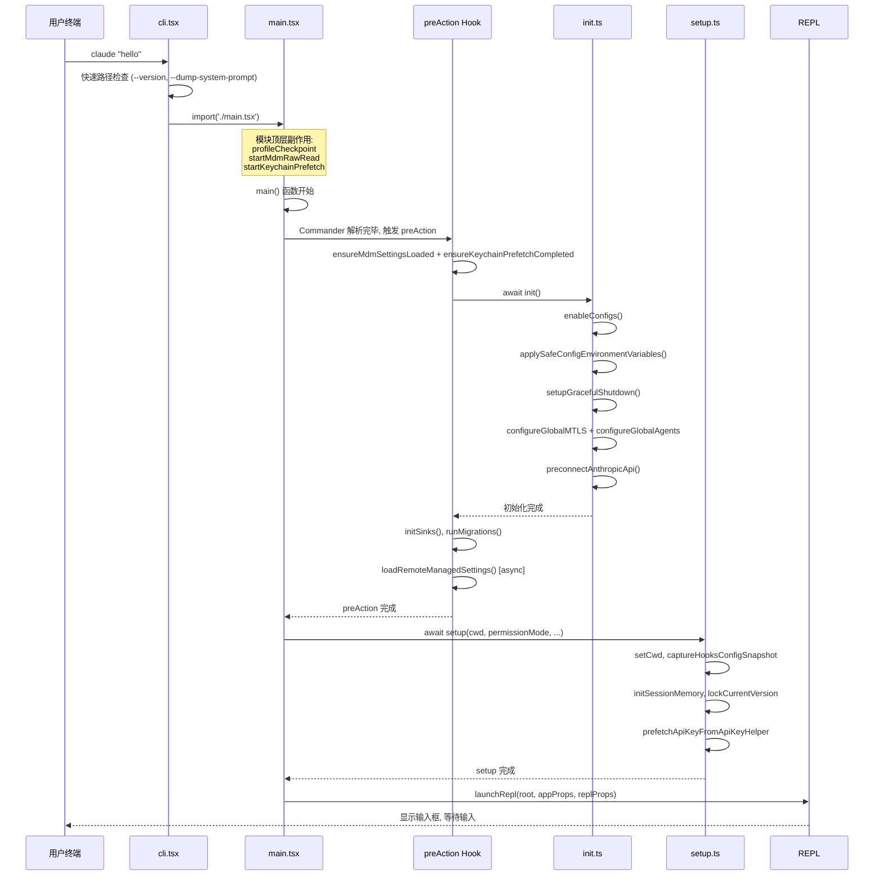
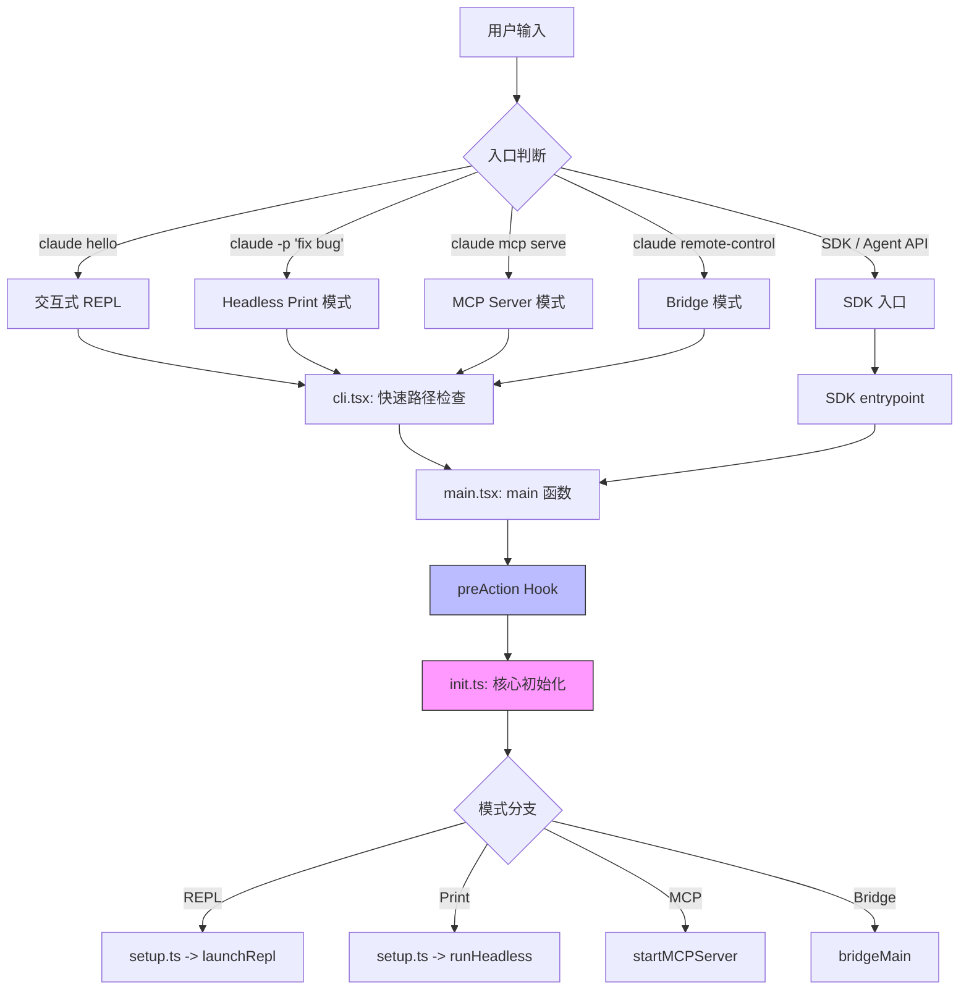

# 第 2 章：启动与生命周期——从 `main.tsx` 到第一个 Token

> **核心思想**：一个程序的启动路径，暴露了它全部的"初始化假设"。Claude Code 的启动是一场精心编排的**依赖注入仪式**：先建立信任边界，再注入能力，最后进入循环。

---

## 2.1 为什么需要理解启动路径？

想象你第一天走进一家新公司上班。你不能一进门就开始写代码——首先要刷门禁卡（**认证**），然后领取工牌和笔记本电脑（**注入能力**），接着签署保密协议（**建立信任边界**），最后才是坐到工位上开始工作（**进入主循环**）。如果你在签保密协议之前就接触了公司代码库，这就是一个安全漏洞。

Claude Code 的启动路径和这个过程惊人地相似。从用户在终端输入 `claude` 到屏幕上出现第一个 Token 的响应，中间经历了一场精密的初始化舞蹈。每一步都有严格的顺序依赖——打乱这个顺序，要么会崩溃，要么会留下安全缺口。

理解启动路径有三个实际价值：

1. **调试效率**：当 Claude Code 启动失败时，你需要知道它卡在了哪个阶段。是 MDM 设置加载超时？还是 OAuth token 过期？还是 MCP server 连接不上？
2. **扩展能力**：如果你要给 Claude Code 添加一个新的入口模式（比如 IDE 插件），你需要知道哪些初始化步骤必须保留，哪些可以跳过。
3. **架构直觉**：启动路径是理解任何大型系统的最佳切入点——它像一份依赖关系的清单，告诉你"这个系统认为自己需要什么才能运行"。

本章将带你从 `cli.tsx` 的第一行开始，一路追踪到 REPL 渲染出来等待用户输入的那一刻。我们会看到 Commander.js 的 `preAction` 模式如何延迟初始化、四种入口模式如何共享同一套骨架、以及 `bun:bundle` 的 `feature()` 函数如何在编译时消除死代码。

---

## 2.2 Commander.js 的 `preAction` 模式

### 日常类比

在一个餐厅里，服务员不会在你还没点菜的时候就去厨房炒菜。`preAction` 就是"等客人确认要吃什么之后，再去备菜"的机制。当用户只是敲了 `claude --help`，我们不需要初始化 OAuth、加载 MCP 服务器、或者连接 API——直接打印帮助文本然后退出就好。

### 源码分析

Claude Code 的命令行接口基于 Commander.js 构建。核心的程序定义在 `main.tsx` 中：

```typescript
// src/main.tsx:902-903
const program = new CommanderCommand()
  .configureHelp(createSortedHelpConfig())
  .enablePositionalOptions();
profileCheckpoint('run_commander_initialized');
```

**设计意图解读**：`enablePositionalOptions()` 允许子命令拥有独立的选项解析空间，这对于 `claude mcp serve` 这样的嵌套命令至关重要——`--debug` 可以出现在 `claude` 级别或 `serve` 级别，含义不同。

真正的关键在 `preAction` 钩子：

```typescript
// src/main.tsx:907-967
program.hook('preAction', async thisCommand => {
  profileCheckpoint('preAction_start');

  // 1. 等待 MDM 和 Keychain 预取完成
  await Promise.all([
    ensureMdmSettingsLoaded(),
    ensureKeychainPrefetchCompleted()
  ]);
  profileCheckpoint('preAction_after_mdm');

  // 2. 运行核心初始化
  await init();
  profileCheckpoint('preAction_after_init');

  // 3. 设置进程标题
  if (!isEnvTruthy(process.env.CLAUDE_CODE_DISABLE_TERMINAL_TITLE)) {
    process.title = 'claude';
  }

  // 4. 挂载日志 sink
  const { initSinks } = await import('./utils/sinks.js');
  initSinks();
  profileCheckpoint('preAction_after_sinks');

  // 5. 处理 --plugin-dir 选项
  const pluginDir = thisCommand.getOptionValue('pluginDir');
  if (Array.isArray(pluginDir) && pluginDir.length > 0
      && pluginDir.every(p => typeof p === 'string')) {
    setInlinePlugins(pluginDir);
    clearPluginCache('preAction: --plugin-dir inline plugins');
  }

  // 6. 运行迁移
  runMigrations();
  profileCheckpoint('preAction_after_migrations');

  // 7. 加载远程托管设置（非阻塞）
  void loadRemoteManagedSettings();
  void loadPolicyLimits();
  profileCheckpoint('preAction_after_remote_settings');

  // 8. 上传用户设置同步（非阻塞）
  if (feature('UPLOAD_USER_SETTINGS')) {
    void import('./services/settingsSync/index.js')
      .then(m => m.uploadUserSettingsInBackground());
  }
  profileCheckpoint('preAction_after_settings_sync');
});
```

**设计意图解读**：这个 `preAction` 钩子是整个启动路径的枢纽。它的设计遵循一个关键原则：**只在确认要执行命令时才初始化**。`claude --help` 不会触发此钩子，因此帮助文本的渲染是零初始化成本的。注意步骤 7 和 8 中大量使用了 `void`——这是"发射后不管"（fire-and-forget）的模式，让非关键路径的网络请求在后台并行执行，不阻塞主路径。

让我们用一个时序图来可视化这个过程：



### 模块顶层的三个副作用

在 `main.tsx` 的最开始，甚至在任何 `import` 语句之前，有三行特殊的代码：

```typescript
// src/main.tsx:9-20
profileCheckpoint('main_tsx_entry');

startMdmRawRead();

startKeychainPrefetch();
```

**设计意图解读**：这三个调用利用了 JavaScript 模块的求值语义——`import` 语句会触发被导入模块的顶层代码执行。`main.tsx` 被加载后，后续的 ~135ms 都在执行其他 `import` 语句。这三个调用启动了异步子进程（MDM 策略读取、macOS Keychain 读取），让它们和后续的 `import` 链并行执行。等到 `preAction` 钩子中的 `await ensureMdmSettingsLoaded()` 执行时，子进程多半已经完成——几乎零等待。

这是一种**并行流水线**优化：模块求值是 CPU 密集型的，子进程 spawn 后的等待是 IO 密集型的，两者恰好可以重叠。

### 迁移指南

如果你的项目使用 Commander.js，考虑将初始化逻辑从构造时移到 `preAction` 中：

```typescript
// 不推荐：构造时初始化
const program = new Command();
await initDatabase(); // --help 时也会执行
program.action(() => { /* ... */ });

// 推荐：preAction 延迟初始化
const program = new Command();
program.hook('preAction', async () => {
  await initDatabase(); // 只有在实际执行命令时才初始化
});
program.action(() => { /* ... */ });
```

---

## 2.3 多入口统一：四种模式共享同一骨架

### 日常类比

同一个飞机场可以服务国际航班、国内航班、货运航班和私人包机。它们走不同的航站楼和安检通道，但共享同一条跑道、同一套空管系统、同一个塔台。Claude Code 的四种入口模式就是这样——不同的"航站楼"，同一个"跑道"。

### 源码分析

Claude Code 有四种主要的入口模式，它们都最终汇入同一套初始化骨架：



#### 1. 交互式 REPL 模式

这是默认模式。用户输入 `claude` 或 `claude "some prompt"` 时进入。它走完整的初始化路径，最终调用 `launchRepl`：

```typescript
// src/replLauncher.tsx:12-22
export async function launchRepl(
  root: Root,
  appProps: AppWrapperProps,
  replProps: REPLProps,
  renderAndRun: (root: Root, element: React.ReactNode) => Promise<void>,
): Promise<void> {
  const { App } = await import('./components/App.js')
  const { REPL } = await import('./screens/REPL.js')
  await renderAndRun(
    root,
    <App {...appProps}>
      <REPL {...replProps} />
    </App>,
  )
}
```

**设计意图解读**：`launchRepl` 使用了**动态 import**——`App` 和 `REPL` 组件直到真正要渲染时才加载。这意味着在 headless 模式下，这些 React 组件的模块求值成本为零。这个函数本身被单独放在 `replLauncher.tsx` 中而不是内联在 `main.tsx` 里，是为了让 bundler 可以将 React 渲染相关的代码放入独立的 chunk。

#### 2. Headless Print 模式 (`-p` / `--print`)

当用户输入 `claude -p "fix the bug"` 时，Claude Code 运行在无头模式下——执行完任务后直接打印结果并退出。这种模式跳过了信任对话框（Trust Dialog），因为非交互式模式隐含了信任。

入口模式的判断发生在 `cli.tsx` 和 `main.tsx` 的早期阶段：

```typescript
// src/main.tsx:517-539
function initializeEntrypoint(isNonInteractive: boolean): void {
  if (process.env.CLAUDE_CODE_ENTRYPOINT) {
    return; // SDK 或其他入口点已设置
  }
  const cliArgs = process.argv.slice(2);

  // 检查 MCP serve 命令
  const mcpIndex = cliArgs.indexOf('mcp');
  if (mcpIndex !== -1 && cliArgs[mcpIndex + 1] === 'serve') {
    process.env.CLAUDE_CODE_ENTRYPOINT = 'mcp';
    return;
  }

  if (isEnvTruthy(process.env.CLAUDE_CODE_ACTION)) {
    process.env.CLAUDE_CODE_ENTRYPOINT = 'claude-code-github-action';
    return;
  }

  // 根据交互状态设置
  process.env.CLAUDE_CODE_ENTRYPOINT = isNonInteractive ? 'sdk-cli' : 'cli';
}
```

**设计意图解读**：入口类型通过环境变量 `CLAUDE_CODE_ENTRYPOINT` 传播。这个设计的巧妙之处在于：SDK 调用方可以在进程启动前就设定入口类型（通过预设环境变量），而 CLI 则在解析完命令行参数后推断。环境变量比函数参数更适合这种"元信息"——它跨越模块边界，无需修改函数签名。

#### 3. SDK 入口与 Agent API

Claude Code 也可以作为一个编程式 SDK 被其他程序调用。SDK 入口的关键区别在于：它的 session 参数（`sessionId`、`registeredHooks`、`jsonSchema`）由调用方提供，而不是从命令行解析。`entrypoints/sdk/` 目录下的 `coreSchemas.ts`（56KB）和 `controlSchemas.ts`（19KB）定义了 SDK 的输入输出 schema，这些 schema 同时作为类型约束和运行时验证的依据。

SDK 模式和 Print 模式共享 `sdk-cli` 入口类型标识。SDK 调用方可以在启动前通过 `CLAUDE_CODE_ENTRYPOINT` 环境变量声明自己的入口类型，覆盖默认的推断逻辑。这使得 VSCode 扩展可以标识为 `'claude-vscode'`，Desktop 应用标识为 `'claude-desktop'`，各自享有不同的认证策略和权限模型。

#### 4. MCP Server 模式

当用户运行 `claude mcp serve` 时，Claude Code 变身为一个 MCP（Model Context Protocol）服务器：

```typescript
// src/entrypoints/mcp.ts:35-57
export async function startMCPServer(
  cwd: string,
  debug: boolean,
  verbose: boolean,
): Promise<void> {
  const READ_FILE_STATE_CACHE_SIZE = 100
  const readFileStateCache = createFileStateCacheWithSizeLimit(
    READ_FILE_STATE_CACHE_SIZE,
  )
  setCwd(cwd)
  const server = new Server(
    {
      name: 'claude/tengu',
      version: MACRO.VERSION,
    },
    {
      capabilities: {
        tools: {},
      },
    },
  )
  // ... 注册工具处理器
}
```

**设计意图解读**：MCP 模式是 Claude Code 最轻量的入口——它不需要 REPL、不需要 Ink 渲染、不需要信任对话框。它只需要工具注册和一个 stdio 传输层。注意 `'claude/tengu'` 这个服务器名称——"tengu" 是 Claude Code 的内部代号（天狗），这个名字在整个代码库中随处可见。

#### 5. Bridge / Remote Control 模式

`cli.tsx` 中的快速路径处理展示了 Bridge 模式如何在加载完整 CLI 之前就被拦截。Bridge 模式将本地机器作为远程 Claude Code 会话的"桥接环境"——它需要 OAuth 认证、GrowthBook 特性门控、版本兼容性检查和策略限制检查，但不需要 REPL 或 Ink 渲染：

```typescript
// src/entrypoints/cli.tsx:112-162
if (feature('BRIDGE_MODE') && (
    args[0] === 'remote-control' || args[0] === 'rc' ||
    args[0] === 'remote' || args[0] === 'sync' || args[0] === 'bridge'
)) {
  profileCheckpoint('cli_bridge_path');
  const { enableConfigs } = await import('../utils/config.js');
  enableConfigs();
  // ... 认证检查 ...
  const { bridgeMain } = await import('../bridge/bridgeMain.js');
  await bridgeMain(args.slice(1));
  return;
}
```

**设计意图解读**：Bridge 模式是一个"快速路径"——它在 `cli.tsx` 阶段就被拦截，根本不会进入 `main.tsx` 的 Commander 解析。这是因为 Bridge 有自己完全不同的生命周期：它是一个长期运行的 WebSocket 服务器，不是一个命令行工具。快速路径避免了加载 ~200 个模块的 `main.tsx` 导入链。

### `cli.tsx` 的快速路径层级

`cli.tsx` 是整个 Claude Code 的真正入口点。它实现了一个精巧的**快速路径层级**，让最简单的命令走最短的代码路径：

```typescript
// src/entrypoints/cli.tsx:33-42
async function main(): Promise<void> {
  const args = process.argv.slice(2);

  // 快速路径 1: --version — 零模块加载
  if (args.length === 1 && (
      args[0] === '--version' || args[0] === '-v' || args[0] === '-V'
  )) {
    console.log(`${MACRO.VERSION} (Claude Code)`);
    return;
  }
  // ... 其他快速路径 ...
}
```

**设计意图解读**：`--version` 是最极端的快速路径——它甚至不加载 `startupProfiler`。`MACRO.VERSION` 是构建时内联的常量，所以这个路径的总模块加载量接近于零。这种分层设计让 `claude --version` 在 <10ms 内返回，而完整启动可能需要 300-500ms。

### 迁移指南

设计多入口 CLI 工具时，考虑使用"快速路径分层"模式：

1. **Level 0**（零依赖）：`--version`、`--help` 等纯信息命令
2. **Level 1**（最小配置）：只需要配置文件的子命令（如 `mcp list`）
3. **Level 2**（完整初始化）：需要认证、网络、UI 的主命令

每一层只加载自己需要的模块，避免一个 `--version` 查询触发整个依赖图的求值。

#### `cli.tsx` 中的 Ablation Baseline

`cli.tsx` 的顶层还有一个有趣的机制——消融基线（Ablation Baseline），它用于衡量各个功能对 Claude Code 性能的贡献：

```typescript
// src/entrypoints/cli.tsx:20-26
if (feature('ABLATION_BASELINE') &&
    process.env.CLAUDE_CODE_ABLATION_BASELINE) {
  for (const k of [
    'CLAUDE_CODE_SIMPLE',
    'CLAUDE_CODE_DISABLE_THINKING',
    'DISABLE_INTERLEAVED_THINKING',
    'DISABLE_COMPACT',
    'DISABLE_AUTO_COMPACT',
    'CLAUDE_CODE_DISABLE_AUTO_MEMORY',
    'CLAUDE_CODE_DISABLE_BACKGROUND_TASKS'
  ]) {
    process.env[k] ??= '1';
  }
}
```

**设计意图解读**：这段代码必须放在 `cli.tsx` 的模块顶层（而不是在 `init.ts` 中），因为 `BashTool`、`AgentTool` 和 `PowerShellTool` 在模块加载时就将 `DISABLE_BACKGROUND_TASKS` 等环境变量捕获到模块级常量中。如果延迟到 `init()` 运行时再设置这些变量，相关模块的常量已经被初始化为 `undefined`——为时已晚。这是一个模块求值顺序导致的微妙约束：side effect 的执行时机必须早于依赖该 side effect 的模块被 `import`。

---

## 2.4 初始化顺序的工程意义

### 日常类比

建造一栋房子有严格的顺序：地基 -> 框架 -> 管线 -> 内装。你不能在浇地基之前铺水管，也不能在框架没搭好之前刷墙漆。Claude Code 的初始化就是一个"建造"过程，每一步都依赖前一步的成果。

### 源码分析

Claude Code 的初始化可以分为六个有序阶段。让我们逐一分析为什么必须是这个顺序。

#### 阶段 1：配置与安全基础 (`init.ts`)

```typescript
// src/entrypoints/init.ts:57-89
export const init = memoize(async (): Promise<void> => {
  // 1a. 验证并启用配置系统
  enableConfigs()

  // 1b. 仅应用"安全"的环境变量
  applySafeConfigEnvironmentVariables()

  // 1c. 应用额外的 CA 证书
  applyExtraCACertsFromConfig()

  // 1d. 设置优雅退出处理
  setupGracefulShutdown()

  // 1e. 配置 mTLS 和代理
  configureGlobalMTLS()
  configureGlobalAgents()

  // 1f. 预连接 Anthropic API
  preconnectAnthropicApi()
});
```

**为什么这个顺序？**

- `enableConfigs()` 必须第一个执行，因为后续所有的设置读取都依赖它。
- `applySafeConfigEnvironmentVariables()` 只应用不涉及安全风险的环境变量（与后面的 `applyConfigEnvironmentVariables()` 对比——后者会应用 `PATH` 和 `LD_PRELOAD` 等危险变量，必须等到信任建立后才能执行）。
- `applyExtraCACertsFromConfig()` 必须在任何 TLS 连接之前执行——Bun 在启动时缓存 TLS 证书存储。
- `configureGlobalMTLS()` 和 `configureGlobalAgents()` 必须在 `preconnectAnthropicApi()` 之前执行——否则预连接会使用错误的传输配置。

**设计意图解读**：`init` 被 `memoize` 包装，确保无论被调用多少次，只执行一次。这种模式在多个入口路径汇聚时特别有用——REPL 模式和 Print 模式最终都会调用 `init()`，`memoize` 保证了幂等性。

注意 `applySafeConfigEnvironmentVariables()` 和 `applyConfigEnvironmentVariables()` 的区分——这是一个**信任分级**的设计。在信任对话框出现之前，只有"安全"的环境变量被应用；信任建立后，才应用完整的环境变量集。这防止了恶意的 `.claude/settings.json` 通过 `LD_PRELOAD` 劫持进程。

#### 阶段 2：preAction 钩子中的迁移与远程设置

正如 2.2 节分析的，`preAction` 钩子在 `init()` 之后执行迁移和远程设置加载。迁移有版本控制：

```typescript
// src/main.tsx:325-352
const CURRENT_MIGRATION_VERSION = 11;
function runMigrations(): void {
  if (getGlobalConfig().migrationVersion !== CURRENT_MIGRATION_VERSION) {
    migrateAutoUpdatesToSettings();
    migrateBypassPermissionsAcceptedToSettings();
    // ... 更多迁移 ...
    migrateSonnet45ToSonnet46();
    migrateOpusToOpus1m();
    saveGlobalConfig(prev =>
      prev.migrationVersion === CURRENT_MIGRATION_VERSION
        ? prev
        : { ...prev, migrationVersion: CURRENT_MIGRATION_VERSION }
    );
  }
}
```

**设计意图解读**：迁移版本号是一个简单的整数递增。当且仅当本地存储的版本号不等于当前版本号时，才执行全部迁移。这里有一个微妙之处：`saveGlobalConfig` 的回调检查了 `prev.migrationVersion === CURRENT_MIGRATION_VERSION`——这是一个**竞态保护**。如果两个 Claude Code 进程同时启动，第二个进程会发现版本号已经被第一个进程更新，从而跳过写入。

#### 阶段 3：setup.ts —— 工作目录与 Hook 系统

```typescript
// src/setup.ts:56-66
export async function setup(
  cwd: string,
  permissionMode: PermissionMode,
  allowDangerouslySkipPermissions: boolean,
  worktreeEnabled: boolean,
  worktreeName: string | undefined,
  tmuxEnabled: boolean,
  customSessionId?: string | null,
  worktreePRNumber?: number,
  messagingSocketPath?: string,
): Promise<void> {
```

`setup()` 是第三阶段的核心。它的职责包括：

1. **Node.js 版本检查**（`setup.ts:69-79`）：确保 Node.js >= 18
2. **设置工作目录**（`setup.ts:161`）：`setCwd(cwd)` 必须在所有依赖 cwd 的代码之前执行
3. **捕获 Hook 配置快照**（`setup.ts:165-169`）：冻结当前的 hook 配置，防止运行时被修改
4. **UDS 消息服务器**（`setup.ts:95-101`）：启动 Unix Domain Socket 进程间通信
5. **工作树创建**（`setup.ts:175-285`）：如果用户传了 `--worktree`，创建 Git 工作树
6. **会话内存初始化**（`setup.ts:294`）：注册 hook，延迟门控检查
7. **权限校验**（`setup.ts:397-441`）：`--dangerously-skip-permissions` 的安全检查

**设计意图解读**：`setup()` 中最关键的是 `setCwd()` 调用的位置。注释写得很明确："IMPORTANT: setCwd() must be called before any other code that depends on the cwd"。这不是空话——`captureHooksConfigSnapshot()` 在下一行就需要从正确的目录读取 hook 配置。工作树创建（如果启用）会改变 `cwd`，所以它必须在 `setCwd()` 之后、但在后续的命令加载之前完成。

#### 阶段 4：命令与工具加载（回到 `main.tsx`）

```typescript
// src/main.tsx:1918-1934
const preSetupCwd = getCwd();
if (process.env.CLAUDE_CODE_ENTRYPOINT !== 'local-agent') {
  initBuiltinPlugins();   // 纯内存操作，<1ms
  initBundledSkills();    // 纯内存操作，<1ms
}

const setupPromise = setup(preSetupCwd, permissionMode, ...);
const commandsPromise = worktreeEnabled
  ? null
  : getCommands(preSetupCwd);    // 并行！
const agentDefsPromise = worktreeEnabled
  ? null
  : getAgentDefinitionsWithOverrides(preSetupCwd);  // 并行！

commandsPromise?.catch(() => {});  // 防止未处理的 rejection
agentDefsPromise?.catch(() => {});

await setupPromise;  // 等待 setup 完成
```

**设计意图解读**：这里展示了一种精细的**并行策略**。`setup()` 的 ~28ms 主要花在 UDS socket 绑定上（IO 密集型），而 `getCommands()` 主要做文件系统读取（也是 IO 密集型但使用不同的系统资源）。两者可以安全地并行执行——**除非**用户启用了 `--worktree`。工作树模式下 `setup()` 会 `process.chdir()`，改变工作目录，而 `getCommands()` 依赖正确的 cwd。因此 `worktreeEnabled` 作为门控条件，决定是否启用并行加载。

注意 `commandsPromise?.catch(() => {})` 这个看似多余的调用——它防止了一种微妙的 bug：如果 `getCommands()` 在 `await setupPromise` 的 ~28ms 窗口内 reject 了，Node.js 会报 unhandled rejection。这个空 catch 相当于告诉运行时"我知道这个 promise 可能失败，我稍后会处理它"。

`initBuiltinPlugins()` 和 `initBundledSkills()` 被特意放在 `setup()` 之前调用。源码注释解释了原因：这两个函数是纯内存的数组 push（<1ms，零 IO）。之前它们在 `setup()` 内部的 `await` 点之后执行，导致并行的 `getCommands()` 已经 memoize 了一个空的 bundledSkills 列表——一个竞态条件。

#### 阶段 5：MCP 工具加载与信任建立

MCP 服务器的连接和工具获取发生在 setup 完成之后。信任对话框（Trust Dialog）也在这个阶段显示。`showSetupScreens()` 在主动作处理器中被调用，它会检查用户是否已经接受了当前目录的信任。

信任对话框是 Claude Code 安全模型的核心。它解决了一个关键问题：用户可能在一个不受信任的 git 仓库中运行 `claude`，而该仓库的 `.claude/settings.json` 可能包含恶意配置（比如注入 `LD_PRELOAD` 到 `PATH` 中）。信任对话框出现的时间点是精心设计的——在 `applySafeConfigEnvironmentVariables()`（只应用安全变量）之后，但在 `applyConfigEnvironmentVariables()`（应用所有变量，包括危险的）之前。

在非交互式模式（`-p`）下，信任是隐式的——文档明确说明："Only use this flag in directories you trust." 这个决策反映了一个实用主义的安全权衡：CI/CD 管道和脚本自动化不可能弹出对话框等待人工确认，因此信任责任被转移给了执行脚本的操作者。

系统上下文的预取也与信任紧密耦合：

```typescript
// src/main.tsx:360-380
function prefetchSystemContextIfSafe(): void {
  const isNonInteractiveSession = getIsNonInteractiveSession();

  // 非交互式模式：信任是隐式的
  if (isNonInteractiveSession) {
    void getSystemContext();
    return;
  }

  // 交互式模式：仅在信任已建立时预取
  const hasTrust = checkHasTrustDialogAccepted();
  if (hasTrust) {
    void getSystemContext();
  }
  // 否则，等待信任建立后再预取
}
```

**设计意图解读**：`getSystemContext()` 内部会执行 `git status` 和 `git log` 等命令。Git 命令可以通过 `core.fsmonitor`、`diff.external` 等配置执行任意代码。在不受信任的仓库中执行 git 命令等于执行不受信任的代码。因此，系统上下文预取必须在信任建立之后。

#### 阶段 6：REPL 渲染与延迟预取

最终，一切就绪后，REPL 被渲染出来：

```typescript
// src/main.tsx（action handler 末尾部分，概念性）
await launchRepl(root, appProps, replProps, renderAndRun);
// 首次渲染完成后：
startDeferredPrefetches();
```

`startDeferredPrefetches()` 是一个有意设计的延迟点：

```typescript
// src/main.tsx:388-431
export function startDeferredPrefetches(): void {
  if (isEnvTruthy(process.env.CLAUDE_CODE_EXIT_AFTER_FIRST_RENDER) ||
      isBareMode()) {
    return;  // 性能测量模式或精简模式：跳过所有预取
  }

  void initUser();              // 预取用户信息
  void getUserContext();        // 预取 CLAUDE.md 等上下文
  prefetchSystemContextIfSafe(); // 预取 git 状态（需信任）
  void getRelevantTips();       // 预取提示建议

  // AWS / GCP 凭证预取
  if (isEnvTruthy(process.env.CLAUDE_CODE_USE_BEDROCK)) {
    void prefetchAwsCredentialsAndBedRockInfoIfSafe();
  }

  void countFilesRoundedRg(getCwd(), AbortSignal.timeout(3000), []);
  void initializeAnalyticsGates();
  void refreshModelCapabilities();
  void settingsChangeDetector.initialize();
}
```

**设计意图解读**：这些预取操作被刻意推迟到 REPL 首次渲染之后。原因是：用户看到输入框后，通常会花几秒钟思考和打字。这个"用户正在打字"的窗口期是执行后台预取的黄金时间——git 状态查询、文件计数、凭证刷新都可以在这个窗口里完成。等用户按下回车时，这些数据多半已经准备就绪。

### 迁移指南

初始化顺序设计的核心原则：

1. **安全敏感的操作放在最前面**：证书配置、代理设置必须在第一个网络请求之前
2. **信任分级**：区分"安全"和"危险"的配置应用时机
3. **并行化一切可以并行的操作**：IO 密集型操作（网络、文件系统、子进程）之间通常不冲突
4. **延迟一切可以延迟的操作**：首次渲染后的预取利用用户输入的空闲时间

---

## 2.5 Feature Flag 的编译时消除

### 日常类比

想象你在出版一本书的两个版本——标准版和精装版。与其在印刷时手动撕掉精装版的额外章节，不如从排版阶段就生成两套不同的版面。`bun:bundle` 的 `feature()` 函数就是排版阶段的"条件编译"——不需要的功能在构建时就被物理消除，不是运行时跳过。

### 源码分析

Claude Code 大量使用 `feature()` 函数来实现功能开关：

```typescript
// src/main.tsx:21
import { feature } from 'bun:bundle';

// src/main.tsx:76-81（编译时消除示例）
const coordinatorModeModule = feature('COORDINATOR_MODE')
  ? require('./coordinator/coordinatorMode.js') as typeof import('./coordinator/coordinatorMode.js')
  : null;

const assistantModule = feature('KAIROS')
  ? require('./assistant/index.js') as typeof import('./assistant/index.js')
  : null;
```

**设计意图解读**：`feature()` 不是一个运行时函数——它是一个**构建时宏**。Bun 的 bundler 在打包时会将 `feature('KAIROS')` 替换为 `true` 或 `false` 字面量。当替换为 `false` 时，整个三元表达式的 true 分支变成死代码，被 tree shaking 移除。这意味着 `./coordinator/coordinatorMode.js` 和 `./assistant/index.js` 模块及其整个依赖子树在外部构建中完全不存在——不是"加载了但不执行"，而是字节码中根本没有这些代码。

在 `setup.ts` 中也能看到这种模式：

```typescript
// src/setup.ts:95-101
if (feature('UDS_INBOX')) {
  const m = await import('./utils/udsMessaging.js')
  await m.startUdsMessaging(
    messagingSocketPath ?? m.getDefaultUdsSocketPath(),
    { isExplicit: messagingSocketPath !== undefined },
  )
}
```

以及用于提交归属追踪的条件加载：

```typescript
// src/setup.ts:350-360
if (feature('COMMIT_ATTRIBUTION')) {
  setImmediate(() => {
    void import('./utils/attributionHooks.js').then(
      ({ registerAttributionHooks }) => {
        registerAttributionHooks()
      },
    )
  })
}
```

**设计意图解读**：注意这里的双重延迟——`feature()` 确保外部构建不包含归属追踪代码（编译时），而 `setImmediate()` 确保即使在内部构建中，git 子进程的 spawn 也被推迟到"下一个 tick"——在首次渲染之后而不是在 `setup()` 的微任务窗口中。代码注释明确说明了原因："Defer to next tick so the git subprocess spawn runs after first render rather than during the setup() microtask window."

### `feature()` 在 `cli.tsx` 快速路径中的应用

```typescript
// src/entrypoints/cli.tsx:100-106
if (feature('DAEMON') && args[0] === '--daemon-worker') {
  const { runDaemonWorker } = await import('../daemon/workerRegistry.js');
  await runDaemonWorker(args[1]);
  return;
}
```

整个 daemon worker 的入口路径——包括 `workerRegistry.js` 和它的所有依赖——在没有 DAEMON 特性标志的构建中会被完全消除。这不仅减少了包体积，更重要的是减少了攻击面。

### 编译时 vs 运行时功能开关的对比

| 维度 | `feature()` 编译时 | 运行时环境变量 |
|------|-------------------|--------------|
| 代码存在性 | 不存在于产物中 | 存在但不执行 |
| 包体积影响 | 模块及依赖树完全移除 | 全部保留 |
| 安全性 | 代码无法被逆向激活 | 理论上可被环境变量激活 |
| 灵活性 | 需要重新构建 | 运行时可切换 |
| 典型用例 | 内部功能、未发布特性 | A/B 测试、渐进发布 |

Claude Code 同时使用了两种模式：`feature()` 用于内部/外部构建的区分（如 `COMMIT_ATTRIBUTION`、`KAIROS`），运行时环境变量和 GrowthBook 用于渐进发布（如 `tengu_kairos` 特性门控）。

### 迁移指南

如果你的项目使用 Bun 打包，可以利用 `bun:bundle` 的 `feature()` 来区分不同的构建目标：

```typescript
// 编译时消除——适合内部/外部构建区分
import { feature } from 'bun:bundle';

if (feature('INTERNAL_TOOLS')) {
  // 整个分支（含导入）在外部构建中被物理移除
  const { debugPanel } = await import('./internal/debugPanel.js');
  debugPanel.mount();
}

// 运行时开关——适合动态特性控制
if (process.env.ENABLE_BETA_FEATURE === '1') {
  // 代码存在但可能不执行
  enableBetaFeature();
}
```

---

## 2.6 设计权衡与替代方案

### 权衡 1：Eager Init vs Lazy Init

Claude Code 选择了一种**混合策略**：核心安全和配置初始化是 eager 的（必须在第一个命令执行前完成），而网络预取和 UI 辅助数据是 lazy 的（延迟到首次渲染后）。

**替代方案：完全 Lazy Init**

一种极端方案是把所有初始化都变成 lazy 的——只在第一次真正需要时才加载。例如，OAuth token 只在第一次 API 调用时验证，MCP 服务器只在第一次使用 MCP 工具时连接。

这种方案的问题是**不可预测的首次延迟**。用户输入第一条消息后，可能需要等待 2-3 秒才能看到响应，因为系统在同步初始化 OAuth、MCP、git 上下文等。Claude Code 选择在"用户正在打字"的窗口预取这些数据，将延迟隐藏在用户行为中。

**替代方案：完全 Eager Init**

另一个极端是在启动时就初始化一切。这意味着 `claude --help` 也需要连接 API、加载 MCP 服务器。`preAction` 模式正是为了避免这种浪费。

### 权衡 2：全局状态 vs 依赖注入

`bootstrap/state.ts` 维护了一个巨大的全局 `STATE` 对象。这个文件有 1759 行，定义了 250+ 个字段的 `State` 类型，以及对应的 getter/setter 函数：

```typescript
// src/bootstrap/state.ts:260-277（State 类型的部分字段）
type State = {
  originalCwd: string
  projectRoot: string
  totalCostUSD: number
  totalAPIDuration: number
  modelUsage: { [modelName: string]: ModelUsage }
  mainLoopModelOverride: ModelSetting | undefined
  isInteractive: boolean
  sessionId: SessionId
  sessionBypassPermissionsMode: boolean
  scheduledTasksEnabled: boolean
  allowedChannels: ChannelEntry[]
  systemPromptSectionCache: Map<string, string | null>
  // ... 还有 230+ 个字段
}

// src/bootstrap/state.ts:429
const STATE: State = getInitialState()
```

源码中有两处警告注释值得关注：

```typescript
// src/bootstrap/state.ts:259
// DO NOT ADD MORE STATE HERE - BE JUDICIOUS WITH GLOBAL STATE

// src/bootstrap/state.ts:428
// AND ESPECIALLY HERE
```

这些注释不只是建议——它们反映了团队对全局状态膨胀的真实担忧。每新增一个字段，就意味着又多了一个需要在 `resetStateForTests()` 中清理的状态、又多了一个跨模块的隐式依赖。

**为什么选择全局状态而不是依赖注入容器？**

1. **性能**：全局对象的属性访问是 O(1) 的，而 DI 容器通常需要字符串查找或 Map 查询
2. **简单性**：getter/setter 函数比 DI 注解更容易理解和调试。当你在调试器中看到 `getSessionId()` 调用，你立刻知道它在读什么；而 `container.resolve('sessionId')` 需要你去查注册表
3. **TypeScript 友好**：全局状态的类型在编译时完全确定，DI 容器的类型常常需要运行时断言
4. **模块 DAG 约束**：`state.ts` 被设计为模块依赖图的叶节点。它的注释明确说明了 bootstrap 隔离规则——`state.ts` 不应该导入 `src/` 下的任何模块（除了通过特殊路径别名的工具模块）。如果使用 DI 容器，容器本身往往会变成一个"上帝对象"，打破模块 DAG 的拓扑约束

`state.ts` 中一个特别值得注意的模式是 `switchSession`：

```typescript
// src/bootstrap/state.ts:468-479
export function switchSession(
  sessionId: SessionId,
  projectDir: string | null = null,
): void {
  // 清理旧 session 的 plan slug 缓存
  STATE.planSlugCache.delete(STATE.sessionId)
  STATE.sessionId = sessionId
  STATE.sessionProjectDir = projectDir
  sessionSwitched.emit(sessionId) // 通知所有监听者
}
```

**设计意图解读**：`sessionId` 和 `sessionProjectDir` 通过 `switchSession` 原子性地一起更新——没有单独的 setter。注释引用了一个 bug 编号 "CC-34"，说明这两个字段曾经有独立的 setter，导致它们在竞态条件下出现不同步。将它们合并到一个函数中是修复该 bug 的方式。`sessionSwitched.emit()` 使用了一个轻量级的信号机制，让关注 session 变化的模块（如 `concurrentSessions.ts`）可以通过 `onSessionSwitch` 注册回调，而不需要直接导入 `state.ts`（这会违反 bootstrap 隔离）。

代价是：全局状态让测试变得困难（需要 `resetStateForTests()`），并且让模块之间的依赖关系变得隐式。

### 权衡 3：单文件 `main.tsx` vs 拆分架构

`main.tsx` 是一个 4000+ 行的巨型文件。为什么不拆分？

Claude Code 团队实际上做了一定程度的拆分——`cli.tsx` 处理快速路径，`init.ts` 处理核心初始化，`setup.ts` 处理会话准备。但主命令的 action handler 仍然在 `main.tsx` 中，原因是：

1. **启动性能**：Bun 的模块求值有开销。一个大文件的模块求值比多个小文件加起来更快，因为省去了模块图遍历和跨模块引用的解析。
2. **顺序可见性**：初始化顺序是 Claude Code 最关键的不变量之一。将它散布在多个文件中会让顺序约束变得更难维护。

这是一个典型的"可读性 vs 性能 vs 可维护性"三角权衡。Claude Code 选择了性能和顺序可见性，代价是单个文件的可读性。

### 权衡 4：`memoize` 初始化 vs 幂等函数

`init()` 使用了 `memoize`：

```typescript
// src/entrypoints/init.ts:57
export const init = memoize(async (): Promise<void> => {
  // ...
});
```

替代方案是让 `init()` 本身是幂等的——内部检查一个 `initialized` 标志。`memoize` 的好处是：它不仅避免重复执行，还**缓存了 Promise**。如果两个调用者同时 `await init()`，它们会拿到同一个 Promise 对象，确保只执行一次。手写的幂等检查容易在异步场景下产生竞态：

```typescript
// 有竞态风险的手写版本
let initialized = false;
async function init() {
  if (initialized) return; // 两个并发调用都通过了这个检查
  initialized = true;
  await heavyWork(); // 两个都执行了！
}
```

---

## 2.7 迁移指南：应用到你的项目

### 模式 1：分层快速路径

在你的 CLI 工具中实现分层快速路径：

```typescript
async function main() {
  const args = process.argv.slice(2);

  // Level 0: 零依赖快速路径
  if (args[0] === '--version') {
    console.log(VERSION);
    return;
  }

  // Level 1: 最小配置
  if (args[0] === 'config') {
    const config = loadConfig();
    handleConfigCommand(args.slice(1), config);
    return;
  }

  // Level 2: 完整初始化
  await fullInit();
  handleMainCommand(args);
}
```

### 模式 2：预取与空闲利用

利用用户交互的空隙进行预取：

```typescript
// 首次渲染后启动预取
function onFirstRender() {
  // 用户正在阅读 UI，利用这个时间预取数据
  void prefetchUserProfile();
  void prefetchRecentProjects();
  void warmConnectionPool();
}

// 用户按下回车时，数据已就绪
async function onSubmit(input: string) {
  const profile = await getCachedOrFetchProfile(); // 大概率命中缓存
  const result = await processInput(input, profile);
  render(result);
}
```

### 模式 3：安全的并行初始化

并行化不冲突的初始化步骤，但保持安全边界：

```typescript
// 安全的并行模式
const setupPromise = setup();          // IO: socket 绑定
const commandsPromise = loadCommands(); // IO: 文件读取
const agentsPromise = loadAgents();     // IO: 文件读取

// 防止 unhandled rejection
commandsPromise.catch(() => {});
agentsPromise.catch(() => {});

await setupPromise; // 等待必要的前置条件

// 现在安全地消费并行结果
const [commands, agents] = await Promise.all([
  commandsPromise,
  agentsPromise
]);
```

### 模式 4：编译时功能消除

如果你使用 Bun 打包，用 `feature()` 区分构建目标：

```typescript
import { feature } from 'bun:bundle';

// 开发工具在生产构建中完全消除
if (feature('DEV_TOOLS')) {
  const { DevPanel } = await import('./dev/DevPanel.js');
  DevPanel.mount();
}
```

如果使用其他打包工具（如 webpack、esbuild），可以用 `DefinePlugin` 或 `define` 实现类似效果：

```javascript
// webpack.config.js
new DefinePlugin({
  'process.env.FEATURE_DEV_TOOLS': JSON.stringify(false)
})
```

### 模式 5：性能剖析点（Profile Checkpoints）

Claude Code 在整个启动路径中埋设了大量的 `profileCheckpoint()` 调用。这些检查点不只是调试辅助——它们构成了一个**可观测的启动模型**：

```typescript
// 在你的项目中实现类似的启动剖析
import { performance } from 'perf_hooks';

const checkpoints: Array<[string, number]> = [];
function checkpoint(name: string): void {
  checkpoints.push([name, performance.now()]);
}

function reportStartup(): void {
  let prev = checkpoints[0]![1];
  for (const [name, time] of checkpoints) {
    const delta = time - prev;
    console.log(`${name}: +${delta.toFixed(1)}ms (total: ${(time - checkpoints[0]![1]).toFixed(1)}ms)`);
    prev = time;
  }
}

// 使用
checkpoint('entry');
await loadConfig();
checkpoint('config_loaded');
await initAuth();
checkpoint('auth_initialized');
// ...
reportStartup();
```

在 Claude Code 中，`profileCheckpoint` 的输出可以通过环境变量 `CLAUDE_CODE_STARTUP_PROFILE=1` 激活。这让团队可以在生产环境中按需收集启动性能数据，识别哪个初始化步骤变慢了。当你发现 `preAction_after_mdm` 到 `preAction_after_init` 之间多了 200ms，你立刻知道问题出在 `init()` 函数中，可以进一步缩小范围。

### 模式 6：优雅退出与资源清理

Claude Code 在 `init.ts` 中很早就设置了 `setupGracefulShutdown()`，并通过 `registerCleanup()` 机制允许各模块注册退出清理回调：

```typescript
// 实际用法：src/entrypoints/init.ts:189
registerCleanup(shutdownLspServerManager)

// 团队清理：src/entrypoints/init.ts:195-200
registerCleanup(async () => {
  const { cleanupSessionTeams } = await import(
    '../utils/swarm/teamHelpers.js'
  )
  await cleanupSessionTeams()
})
```

这种模式适合任何需要管理外部资源（子进程、临时文件、网络连接、数据库连接）的 CLI 工具。关键设计点是：清理回调使用**动态 import**，所以注册清理不会触发团队管理模块的加载——只有在实际退出时才加载和执行清理逻辑。

---

## 2.8 费曼检验

### 问题 1

**如果你把 `init.ts` 中的 `configureGlobalMTLS()` 和 `preconnectAnthropicApi()` 的调用顺序对调，会发生什么？**

> **提示**：想一想预连接时使用的 TLS 配置是什么。如果企业用户配置了自定义的客户端证书（mTLS），但预连接在 mTLS 配置之前就建立了连接......

<details>
<summary>参考答案</summary>

预连接会使用**默认的 TLS 配置**而不是企业配置的客户端证书。这意味着：

1. 预连接建立的 TCP + TLS 连接**不会包含客户端证书**
2. Anthropic API 的反向代理可能会拒绝这个没有客户端证书的连接
3. 即使不被拒绝，SDK 后续发起的真正 API 请求也不会复用这个连接（因为 TLS 参数不匹配），所以预连接的 ~100-200ms 节省被完全浪费
4. 更严重的情况：如果使用了自定义代理（`configureGlobalAgents`），预连接可能绕过了代理直接连接，造成安全策略违规

`init.ts` 中的顺序——先配置 mTLS，再配置代理，最后预连接——确保预连接使用的是完整配置后的网络栈。
</details>

### 问题 2

**`setup.ts` 中为什么要区分 `isBareMode()` 和 `getIsNonInteractiveSession()`？它们不是同一回事吗？一个 `--bare` 的 session 一定是非交互式的吗？**

> **提示**：阅读 `--bare` 选项的帮助文本："Minimal mode: skip hooks, LSP, plugin sync, attribution, auto-memory, background prefetches, keychain reads, and CLAUDE.md auto-discovery." 这是关于**跳过什么**，不是关于**交互方式**。

<details>
<summary>参考答案</summary>

这两个概念是正交的：

- `getIsNonInteractiveSession()` 检查的是**交互方式**——是否有 `-p/--print` 标志。非交互式意味着没有 REPL、没有用户输入循环、执行完就退出。
- `isBareMode()` 检查的是**功能丰富度**——是否跳过 hooks、插件、自动内存等"装饰性"功能。

一个 `--bare` 的 session 可以是交互式的（`claude --bare`，用户在 REPL 中输入），也可以是非交互式的（`claude --bare -p "hello"`）。反过来，一个非交互式 session 可以是功能完整的（`claude -p "hello"`）。

这种区分在 `setup.ts` 中体现为不同的跳过逻辑：

- `isBareMode()` 跳过的是**功能**：插件预取、会话内存、归属追踪、团队内存
- `getIsNonInteractiveSession()` 跳过的是**UI**：终端备份恢复、iTerm2 设置检查

两者独立控制，允许四种组合：全功能交互式（默认）、全功能非交互式（`-p`）、精简交互式（`--bare`）、精简非交互式（`--bare -p`）。
</details>

---

## 本章小结

1. **`preAction` 模式是启动路径的枢纽**：Commander.js 的 `preAction` 钩子让 Claude Code 只在实际执行命令时才初始化，`--help` 和 `--version` 走零成本的快速路径。

2. **初始化顺序编码了安全不变量**：配置 -> 安全环境变量 -> mTLS -> 代理 -> 预连接，这个顺序不是随意的——它确保每一步都使用了前一步建立的安全基础。信任建立前只应用"安全"的环境变量，信任建立后才应用完整的（包括 PATH、LD_PRELOAD 等）。

3. **四种入口模式共享同一套初始化骨架**：REPL、Print、MCP、Bridge 模式通过层级化的快速路径分流，但核心的 `init()` -> `preAction` -> `setup()` 链条是共享的。`cli.tsx` 的快速路径让最简单的命令（`--version`）走最短的路径。

4. **`feature()` 实现编译时功能消除**：不是运行时跳过，而是构建时物理删除整个模块子树。这同时优化了包体积和安全性——不存在的代码无法被激活。

5. **并行与延迟是性能优化的两板斧**：模块顶层的 `startMdmRawRead()` / `startKeychainPrefetch()` 与 import 链并行执行；`setup()` 与 `getCommands()` 并行执行；`startDeferredPrefetches()` 利用用户打字的空闲时间预取数据。每一处并行都有明确的"不冲突"论证。
