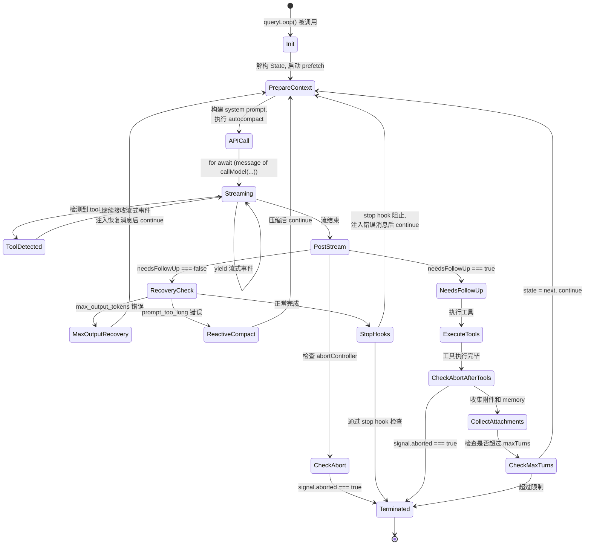
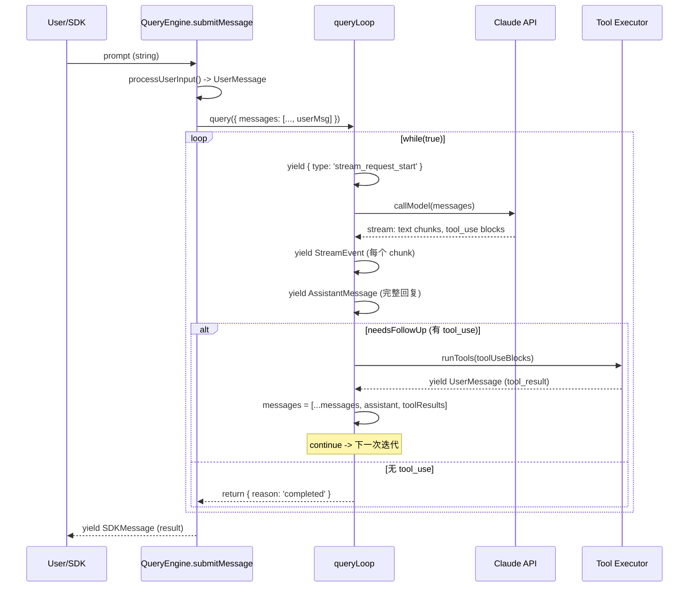
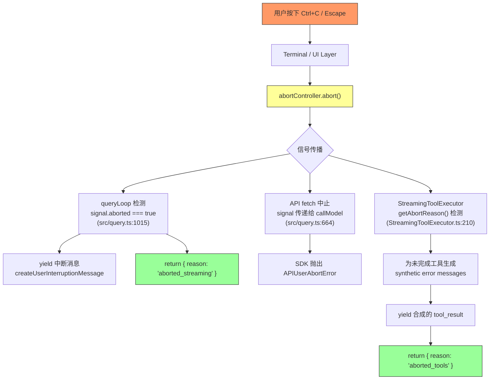

# 第 3 章：Agent 循环——用 AsyncGenerator 编织思考链

> **核心思想**：Agent 的本质不是一次 API 调用，而是一个**无界循环**——"思考->行动->观察->再思考"。Claude Code 用 `async function*` 将这个循环表达为一条流式管道，这是整个系统最精妙的设计之一。

---

## 3.1 为什么需要无界循环？

想象你请了一位厨师来做一桌宴席。如果这位厨师只能给你一条指令——"先炒鸡蛋、再煮鱼汤、最后蒸米饭"——然后就离开厨房，那会发生什么？鸡蛋可能糊了，鱼汤可能太咸，米饭可能夹生。一位真正的厨师需要不断**品尝和调整**：尝一口汤，加点盐；看一眼锅，调小火。这就是"思考->行动->观察->再思考"的循环。

AI Agent 面临的情况完全一样。如果一个 Agent 只做一次 API 调用：

1. **它无法使用工具**——模型说"我需要读取这个文件"，但没有人把文件内容喂回给它。
2. **它无法纠错**——第一次写的代码编译失败了，没有机会修复。
3. **它无法分解复杂任务**——一个需要 10 步才能完成的工作，被压缩成了一次预测。

Claude Code 的解决方案是一个 `while(true)` 循环。每次迭代中：

- **思考**：调用 Claude API，获得模型的回复（可能包含工具调用请求）。
- **行动**：执行模型请求的工具（读文件、写文件、运行命令等）。
- **观察**：将工具执行结果拼回消息列表。
- **判断**：如果模型没有请求更多工具调用，循环结束；否则，带着新的上下文再次调用 API。

这个循环**没有预设的上限**（除了可选的 `maxTurns` 参数）。它可以运行 1 次（简单问答），也可以运行 50 次（复杂重构任务）。循环次数完全由模型的判断决定——当模型认为任务完成时，它会停止请求工具调用，循环自然终止。

## 3.2 AsyncGenerator：流式管道的组合性优势

### 为什么不是回调？为什么不是 Promise？

在设计这个循环时，有三种可选的异步范式：

| 方案 | 优势 | 劣势 |
|------|------|------|
| 回调（Callback） | 简单直接 | 回调地狱，无法表达"流" |
| Promise/async-await | 清晰的错误处理 | 只能返回一个值，无法表达中间状态 |
| AsyncGenerator | 可暂停、可恢复、可组合 | 学习曲线稍陡 |

Agent 循环的特殊需求是：它既要**持续产出中间结果**（流式文本、工具调用进度、系统消息），又要**最终返回一个终止状态**。这恰好是 AsyncGenerator 的强项——`yield` 产出中间值，`return` 给出终止信号。

### 水管隐喻

把 AsyncGenerator 想象成一段水管。水（事件流）从上游流入，经过管道中的每一段处理，最终流向下游消费者：

```
[Claude API Stream] --> [queryLoop generator] --> [QueryEngine.submitMessage] --> [UI/SDK]
       水源                    处理管道                     分发器               水龙头
```

每一段水管都是一个 `async function*`。水管可以自由组合——`yield*` 就是把两段水管接在一起的接头。整个系统的数据流完全通过 generator 的 yield/return 协议来编排，没有全局事件总线，没有回调注册表。

### 最小可行的 Agent 循环

在深入真实代码之前，先看一个 30 行的伪代码版本。如果你理解了这 30 行，就理解了 Claude Code 80% 的核心逻辑：

```typescript
// 最小可行 Agent 循环——伪代码
async function* minimalAgentLoop(
  userMessage: string,
  tools: Tool[]
): AsyncGenerator<StreamEvent | Message, TerminalState> {
  // 初始化消息列表
  const messages: Message[] = [{ role: 'user', content: userMessage }];

  while (true) {
    // 1. 思考：调用 API，流式获取回复
    yield { type: 'request_start' };
    const assistantResponse = await callClaudeAPI(messages);
    yield assistantResponse;  // 将助手回复推给消费者

    // 2. 判断：是否有工具调用？
    const toolUseBlocks = assistantResponse.content
      .filter(block => block.type === 'tool_use');

    if (toolUseBlocks.length === 0) {
      // 没有工具调用，任务完成
      return { reason: 'completed' };
    }

    // 3. 行动：执行工具
    for (const toolUse of toolUseBlocks) {
      const result = await executeTool(toolUse, tools);
      yield result;  // 将工具结果推给消费者
      messages.push(result);  // 同时追加到上下文
    }

    // 4. 观察：将助手回复和工具结果都加入消息列表
    messages.push(assistantResponse);
    // 回到循环顶部，带着新上下文再次调用 API
  }
}
```

现在，让我们看看真实的 `queryLoop` 比这 30 行多出了什么。

## 3.3 queryLoop 的核心状态机

### 从伪代码到真实代码

真实的 `queryLoop`（位于 `src/query.ts:241`）是一个约 1500 行的 `async function*`。它比伪代码复杂得多，但核心骨架完全一致。多出来的部分是对真实世界复杂性的应对：上下文压缩、错误恢复、中断处理、模型回退、token 预算管理等。

让我们先提取其状态机：



### State 类型：循环的全部记忆

`queryLoop` 用一个可变的 `State` 对象在迭代之间传递上下文。这个设计值得仔细研读（`src/query.ts:204-217`）：

```typescript
// src/query.ts:204-217
type State = {
  messages: Message[]
  toolUseContext: ToolUseContext
  autoCompactTracking: AutoCompactTrackingState | undefined
  maxOutputTokensRecoveryCount: number
  hasAttemptedReactiveCompact: boolean
  maxOutputTokensOverride: number | undefined
  pendingToolUseSummary: Promise<ToolUseSummaryMessage | null> | undefined
  stopHookActive: boolean | undefined
  turnCount: number
  transition: Continue | undefined
}
```

每个字段都有其存在的理由：

- **`messages`**：从第一条用户消息到最新一条工具结果，整个对话的完整历史。这是 Agent 的"记忆"。
- **`turnCount`**：当前是第几轮循环，用于 `maxTurns` 限制。
- **`maxOutputTokensRecoveryCount`**：模型输出被截断时，已经尝试了几次恢复。上限是 3 次（`MAX_OUTPUT_TOKENS_RECOVERY_LIMIT`，`src/query.ts:164`）。
- **`hasAttemptedReactiveCompact`**：是否已经尝试过"响应式压缩"来应对 prompt-too-long 错误。此标记防止无限循环：压缩->仍然太长->压缩->仍然太长...
- **`transition`**：上一次迭代是为什么 `continue` 的？这个字段是调试金矿——它记录了每次循环继续的原因（`next_turn`、`reactive_compact_retry`、`max_output_tokens_recovery` 等）。

### 循环的初始化

在进入 `while(true)` 之前，`queryLoop` 做了两件关键的事情（`src/query.ts:268-304`）：

```typescript
// src/query.ts:268-280
let state: State = {
  messages: params.messages,
  toolUseContext: params.toolUseContext,
  maxOutputTokensOverride: params.maxOutputTokensOverride,
  autoCompactTracking: undefined,
  stopHookActive: undefined,
  maxOutputTokensRecoveryCount: 0,
  hasAttemptedReactiveCompact: false,
  turnCount: 1,
  pendingToolUseSummary: undefined,
  transition: undefined,
}
```

然后启动 memory prefetch——一个后台 side query，预加载可能相关的 CLAUDE.md 文件。这里使用了 `using` 关键字（TC39 Explicit Resource Management 提案），确保无论 generator 如何退出（正常 return、throw、或 `.return()` 被调用），prefetch 资源都会被清理：

```typescript
// src/query.ts:301-304
using pendingMemoryPrefetch = startRelevantMemoryPrefetch(
  state.messages,
  state.toolUseContext,
)
```

### while(true)——无界循环的核心

进入循环后（`src/query.ts:307`），每次迭代的流程可以分为六个阶段：

**阶段 1：上下文准备**（约 200 行）——消息裁剪、微压缩、自动压缩、上下文折叠。这些机制确保消息列表不会超出模型的上下文窗口。

**阶段 2：API 调用**（约 200 行）——通过 `deps.callModel()` 调用 Claude API，使用 `for await...of` 消费流式响应。

**阶段 3：后流处理**（约 200 行）——检查中断、处理错误恢复（prompt-too-long、max-output-tokens）、运行 stop hooks。

**阶段 4：工具执行**（约 50 行）——通过 `runTools()` 或 `StreamingToolExecutor` 执行工具。

**阶段 5：附件收集**（约 100 行）——收集 memory、skill discovery、queued commands 等附件。

**阶段 6：循环决策**（约 30 行）——更新 state，`continue` 到下一次迭代。

## 3.4 消息协议解剖

Claude Code 的消息系统是 Agent 循环的血管——所有信息都通过消息流动。消息类型大致可以分为以下层次：

### 核心消息类型

```
Message (联合类型)
  |
  +-- UserMessage          // 用户输入 或 工具执行结果
  |     role: 'user'
  |     content: string | ContentBlockParam[]  // 可以包含 tool_result
  |     isMeta?: boolean     // 合成的元消息（如恢复指令）
  |     toolUseResult?: string  // 工具结果的文本摘要
  |
  +-- AssistantMessage     // 模型回复
  |     role: 'assistant'
  |     content: ContentBlock[]  // text, tool_use, thinking 等
  |     message.usage: Usage    // token 用量
  |     message.stop_reason: string  // 'end_turn' | 'tool_use' | ...
  |     isApiErrorMessage?: boolean  // 合成的错误消息
  |
  +-- SystemMessage        // 系统级事件（不发送给 API）
  |     subtype: 'compact_boundary' | 'api_error' | 'local_command' | ...
  |
  +-- AttachmentMessage    // 附件（memory, file changes, hooks 等）
  |     attachment: Attachment  // 多种子类型
  |
  +-- ProgressMessage      // 工具执行进度
```

### 流事件类型

在 `queryLoop` 的 `yield` 中，除了 `Message` 之外还有两种特殊事件：

```
StreamEvent
  |-- event: RawMessageStreamEvent  // 来自 Anthropic SDK 的原始流事件
  |     message_start / content_block_start / content_block_delta /
  |     content_block_stop / message_delta / message_stop

RequestStartEvent
  |-- type: 'stream_request_start'  // 标记一次 API 请求的开始

ToolUseSummaryMessage
  |-- summary: string  // 工具使用的自然语言摘要（由 Haiku 生成）
  |-- precedingToolUseIds: string[]  // 关联的 tool_use ID
```

### 消息在循环中的流转

一条用户消息进入系统后，经历以下流转：



### normalizeMessagesForAPI：消息的"协议转换器"

Claude Code 内部的消息格式（`Message`）和 API 要求的格式（`MessageParam`）并不完全一致。`normalizeMessagesForAPI`（`src/utils/messages.ts`）承担了转换工作：

- 将 `AttachmentMessage` 转换为普通的 `UserMessage`，把附件内容嵌入 `content` 字段。
- 将 `ProgressMessage` 等非 API 消息类型过滤掉。
- 确保消息序列符合 API 要求（user/assistant 严格交替）。

## 3.5 yield 的语义：每一个 yield 点都是可观测事件

`queryLoop` 中的每一个 `yield` 都代表一个可被外部消费者观测到的事件。理解这些 yield 点就是理解整个系统的可观测性设计。让我们逐一列举：

### yield 点清单

| yield 位置 (src/query.ts) | 产出类型 | 语义 |
|---|---|---|
| `:337` | `RequestStartEvent` | 一次 API 请求即将发起 |
| `:530-532` | `Message` (compact 相关) | 自动压缩完成，输出压缩后的消息 |
| `:642-647` | `AssistantMessage` | 上下文过长的阻塞错误 |
| `:713-727` | `TombstoneMessage` | 流式回退时，删除孤儿消息 |
| `:823` | `StreamEvent \| AssistantMessage` | API 流式响应的每一个事件 |
| `:851-858` | `UserMessage` | StreamingToolExecutor 的已完成结果（流式执行期间） |
| `:884` | `SystemMicrocompactBoundaryMessage` | 缓存编辑的微压缩边界 |
| `:945-948` | `SystemMessage` | 模型回退通知 |
| `:984` | `UserMessage` | 异常时补全缺失的 tool_result |
| `:991` | `AssistantMessage` | 异常时的错误消息 |
| `:1019-1023` | `UserMessage` | 中断时清理 StreamingToolExecutor 的残留 |
| `:1047-1049` | `UserMessage` | 用户中断消息 |
| `:1057-1059` | `ToolUseSummaryMessage` | 上一轮的工具使用摘要 |
| `:1149-1151` | `Message` | 响应式压缩后的新消息 |
| `:1173` | `AssistantMessage` | 无法恢复时释放被扣留的错误 |
| `:1255` | `AssistantMessage` | max_output_tokens 恢复失败时释放错误 |
| `:1384-1407` | `UserMessage` | 工具执行结果（非流式路径） |
| `:1509` | `AttachmentMessage` | max_turns 达到限制 |
| `:1580-1589` | `AttachmentMessage` | 附件（memory, file changes 等） |
| `:1609-1611` | `AttachmentMessage` | memory prefetch 结果 |
| `:1624-1627` | `AttachmentMessage` | skill discovery 结果 |
| `:1706-1709` | `AttachmentMessage` | maxTurns 限制消息 |

### yield 的两重含义

每个 `yield` 同时完成两件事：

1. **输出**：将事件推送给消费者（UI 渲染、SDK 输出、transcript 记录）。
2. **暂停**：generator 在 yield 点挂起，控制权交还给消费者。消费者可以在此时做任何事情——更新 UI、检查预算、甚至调用 `generator.return()` 来终止循环。

这种"合作式调度"是 generator 最优雅的特性。`queryLoop` 不需要知道谁在消费它——它只管 yield，消费者决定如何处理。

## 3.6 中断与恢复：AbortController 的传播链

当用户按下 Ctrl+C 时，一个取消信号需要从终端层传播到 API 层。Claude Code 使用 `AbortController` 来实现这个传播链：



### 两个中断检查点

`queryLoop` 在两个关键位置检查中断信号：

**检查点 1：API 流式响应结束后**（`src/query.ts:1015`）：

```typescript
// src/query.ts:1015-1051
if (toolUseContext.abortController.signal.aborted) {
  if (streamingToolExecutor) {
    // 消费剩余结果——executor 会为被中断的工具生成合成的 tool_result
    for await (const update of streamingToolExecutor.getRemainingResults()) {
      if (update.message) {
        yield update.message
      }
    }
  } else {
    yield* yieldMissingToolResultBlocks(
      assistantMessages,
      'Interrupted by user',
    )
  }
  // ...
  yield createUserInterruptionMessage({ toolUse: false })
  return { reason: 'aborted_streaming' }
}
```

**检查点 2：工具执行完成后**（`src/query.ts:1485`）：

```typescript
// src/query.ts:1485-1515
if (toolUseContext.abortController.signal.aborted) {
  if (toolUseContext.abortController.signal.reason !== 'interrupt') {
    yield createUserInterruptionMessage({ toolUse: true })
  }
  return { reason: 'aborted_tools' }
}
```

### 为什么需要补全 tool_result？

这是一个关键的设计约束。Claude API 要求：**每个 `tool_use` block 都必须有对应的 `tool_result`**。如果模型发出了一个工具调用请求，但用户在工具执行前中断了，消息历史中会出现一个"孤儿" `tool_use`。下一次对话时，API 会因为缺少 `tool_result` 而报错。

`yieldMissingToolResultBlocks`（`src/query.ts:123-149`）的作用就是为所有孤儿 `tool_use` 生成合成的错误 `tool_result`：

```typescript
// src/query.ts:123-149
function* yieldMissingToolResultBlocks(
  assistantMessages: AssistantMessage[],
  errorMessage: string,
) {
  for (const assistantMessage of assistantMessages) {
    const toolUseBlocks = assistantMessage.message.content.filter(
      content => content.type === 'tool_use',
    ) as ToolUseBlock[]
    for (const toolUse of toolUseBlocks) {
      yield createUserMessage({
        content: [{
          type: 'tool_result',
          content: errorMessage,
          is_error: true,
          tool_use_id: toolUse.id,
        }],
        toolUseResult: errorMessage,
        sourceToolAssistantUUID: assistantMessage.uuid,
      })
    }
  }
}
```

### StreamingToolExecutor 的子级 AbortController

`StreamingToolExecutor`（`src/services/tools/StreamingToolExecutor.ts:58-62`）创建了一个子级 `AbortController`，形成层级取消链：

```typescript
// src/services/tools/StreamingToolExecutor.ts:58-62
constructor(...) {
  this.toolUseContext = toolUseContext
  this.siblingAbortController = createChildAbortController(
    toolUseContext.abortController,
  )
}
```

当一个 Bash 工具出错时，`siblingAbortController` 被中止（`src/services/tools/StreamingToolExecutor.ts:359-363`），**但不会中止父级 `abortController`**。这意味着：

- 兄弟工具被取消（一个 Bash 命令失败后，其他并行的 Bash 命令也被取消）。
- 但 Agent 循环本身不会终止——它会收到这些工具的错误结果，然后决定下一步该做什么。

## 3.7 System Prompt 的动态组装

System prompt 不是一个静态字符串——它是在每次查询开始前动态组装的。整个组装链涉及多个层次：

### 组装层次

`QueryEngine.submitMessage`（`src/QueryEngine.ts:286-325`）展示了组装的完整过程：

```typescript
// src/QueryEngine.ts:292-297 — 获取组件
const {
  defaultSystemPrompt,  // 核心系统提示（身份、能力、规则）
  userContext: baseUserContext,  // 用户级上下文（环境信息）
  systemContext,  // 系统级上下文（工具列表、项目配置）
} = await fetchSystemPromptParts({ tools, mainLoopModel, ... })

// src/QueryEngine.ts:321-325 — 组装最终 prompt
const systemPrompt = asSystemPrompt([
  ...(customPrompt !== undefined ? [customPrompt] : defaultSystemPrompt),
  ...(memoryMechanicsPrompt ? [memoryMechanicsPrompt] : []),
  ...(appendSystemPrompt ? [appendSystemPrompt] : []),
])
```

在 `queryLoop` 内部（`src/query.ts:449-452`），还有额外的上下文注入：

```typescript
// src/query.ts:449-452
const fullSystemPrompt = asSystemPrompt(
  appendSystemContext(systemPrompt, systemContext),
)
```

以及用户级上下文通过 `prependUserContext` 注入到消息列表中（`src/query.ts:660`）：

```typescript
// src/query.ts:660
messages: prependUserContext(messagesForQuery, userContext),
```

### 上下文的三层结构

```
System Prompt（发送给 API 的 system 参数）
  |-- 核心 identity prompt（"你是 Claude Code..."）
  |-- 工具使用规则
  |-- CLAUDE.md memory 文件内容
  |-- 自定义 system prompt（SDK/appendSystemPrompt）
  |-- systemContext（运行时环境信息）

User Context（注入到第一条 user message 前）
  |-- 工作目录信息
  |-- 操作系统信息
  |-- IDE 状态
  |-- Coordinator 模式上下文

Attachments（工具执行后注入的附件）
  |-- 相关 memory 文件（prefetch 的结果）
  |-- 文件变更通知
  |-- skill discovery 结果
  |-- queued commands（来自消息队列的用户追加消息）
```

这种分层设计让每一层都可以独立变化。SDK 调用者可以替换核心 prompt 而不影响环境信息；自动压缩可以删除旧消息而不丢失 system prompt 中的规则。

## 3.8 设计权衡与替代方案

### 权衡 1：Generator 的背压问题

AsyncGenerator 有一个天然的背压（backpressure）机制：消费者不调用 `.next()`，生产者就暂停在 `yield` 点。这在大多数情况下是优势，但在 Agent 循环中也带来了一个微妙问题：

**流式工具执行的并发问题**。在 `queryLoop` 的流式循环中（`src/query.ts:659-863`），generator 必须同时做两件事：

1. 消费 API 的流式响应（`for await...of callModel(...)`）。
2. 消费 `StreamingToolExecutor` 的完成结果（`getCompletedResults()`）。

解决方案是在流式循环的每次迭代中交错检查两个源（`src/query.ts:848-862`）：

```typescript
// src/query.ts:848-862 (简化)
for await (const message of deps.callModel({...})) {
  // 处理 API 流式事件...
  yield message

  // 交错检查 StreamingToolExecutor
  if (streamingToolExecutor) {
    for (const result of streamingToolExecutor.getCompletedResults()) {
      if (result.message) {
        yield result.message
        toolResults.push(...)
      }
    }
  }
}
```

这种"手动交错"是 generator 单线程特性的妥协——它不如 Rx Observable 的 `merge` 操作符优雅，但避免了引入响应式编程库的复杂性。

### 权衡 2：循环终止的保证

`while(true)` 循环有一个显而易见的风险——它可能永远不终止。Claude Code 通过多层防护来应对：

1. **`maxTurns` 参数**（`src/query.ts:1705`）：硬性限制最大循环次数。
2. **`maxBudgetUsd`**：费用上限（在 `QueryEngine` 中检查）。
3. **`taskBudget`**：API 级别的 token 预算限制。
4. **错误恢复限制**：`MAX_OUTPUT_TOKENS_RECOVERY_LIMIT = 3`（`src/query.ts:164`），`hasAttemptedReactiveCompact` 标记确保响应式压缩只尝试一次。
5. **`AbortController`**：用户总是可以通过 Ctrl+C 强制终止。

### 权衡 3：可变 State 对象 vs 函数式不变性

`queryLoop` 的 State 是可变的——每次 `continue` 时通过 `state = next` 整体替换。这是一个务实的选择：

```typescript
// src/query.ts:1715-1727 (continue site 示例)
const next: State = {
  messages: [...messagesForQuery, ...assistantMessages, ...toolResults],
  toolUseContext: toolUseContextWithQueryTracking,
  autoCompactTracking: tracking,
  turnCount: nextTurnCount,
  maxOutputTokensRecoveryCount: 0,
  hasAttemptedReactiveCompact: false,
  // ...
  transition: { reason: 'next_turn' },
}
state = next
```

代码中有 7 个 `continue` 点，每一个都构造一个完整的新 `State` 对象。这比逐字段赋值更安全（不会遗漏字段），但不是纯函数式的（`state` 变量是 `let`，通过重新赋值来更新）。

如果用纯函数式风格，`queryLoop` 需要变成尾递归形式——这在 JavaScript 中既不被引擎优化，也会让代码更难理解。务实胜于教条。

### 替代方案：为什么不用状态机库？

像 XState 这样的状态机库可以让状态转换更加显式和可测试。但 Claude Code 选择了"隐式状态机"——通过 `while(true)` + `continue` + `return` 来表达状态转换。原因是：

- Agent 循环的状态转换**不是离散的**——在"streaming"状态中，可能同时发生流式事件、工具执行、错误恢复。
- Generator 的 `yield` 已经提供了足够的可观测性——每个 yield 点就是一个隐式状态。
- 避免额外依赖——Claude Code 的依赖列表刻意保持精简。

## 3.9 迁移指南：应用到你的项目

### 模式：最小 Agent 循环

如果你正在构建自己的 Agent 系统，以下是一个可直接使用的 Agent 循环骨架：

```typescript
import Anthropic from '@anthropic-ai/sdk';

// 定义终止状态
type TerminalState = { reason: 'completed' | 'aborted' | 'error'; error?: Error };

// 定义你的工具
type ToolDefinition = {
  name: string;
  description: string;
  input_schema: Record<string, unknown>;
  execute: (input: Record<string, unknown>) => Promise<string>;
};

async function* agentLoop(
  client: Anthropic,
  userPrompt: string,
  tools: ToolDefinition[],
  options: { maxTurns?: number; signal?: AbortSignal } = {},
): AsyncGenerator<Anthropic.Messages.RawMessageStreamEvent, TerminalState> {
  const messages: Anthropic.Messages.MessageParam[] = [
    { role: 'user', content: userPrompt },
  ];

  let turnCount = 0;
  const maxTurns = options.maxTurns ?? 50;

  while (turnCount < maxTurns) {
    turnCount++;

    // 检查中断
    if (options.signal?.aborted) {
      return { reason: 'aborted' };
    }

    // 调用 API（流式）
    const stream = client.messages.stream({
      model: 'claude-sonnet-4-20250514',
      max_tokens: 8192,
      messages,
      tools: tools.map(t => ({
        name: t.name,
        description: t.description,
        input_schema: t.input_schema,
      })),
    });

    // 收集完整的 assistant 回复
    const assistantBlocks: Anthropic.Messages.ContentBlock[] = [];

    for await (const event of stream) {
      yield event;  // 将流式事件推给消费者
    }

    const finalMessage = await stream.finalMessage();
    messages.push({ role: 'assistant', content: finalMessage.content });

    // 检查是否有工具调用
    const toolUseBlocks = finalMessage.content.filter(
      (b): b is Anthropic.Messages.ToolUseBlock => b.type === 'tool_use'
    );

    if (toolUseBlocks.length === 0) {
      return { reason: 'completed' };
    }

    // 执行工具，收集结果
    const toolResults: Anthropic.Messages.ToolResultBlockParam[] = [];
    for (const toolUse of toolUseBlocks) {
      const tool = tools.find(t => t.name === toolUse.name);
      if (!tool) {
        toolResults.push({
          type: 'tool_result',
          tool_use_id: toolUse.id,
          content: `Error: Unknown tool ${toolUse.name}`,
          is_error: true,
        });
        continue;
      }
      try {
        const result = await tool.execute(toolUse.input as Record<string, unknown>);
        toolResults.push({
          type: 'tool_result',
          tool_use_id: toolUse.id,
          content: result,
        });
      } catch (error) {
        toolResults.push({
          type: 'tool_result',
          tool_use_id: toolUse.id,
          content: `Error: ${error instanceof Error ? error.message : String(error)}`,
          is_error: true,
        });
      }
    }

    messages.push({ role: 'user', content: toolResults });
    // continue -> 下一轮循环
  }

  return { reason: 'completed' };  // maxTurns 耗尽
}

// 使用方式
async function main() {
  const client = new Anthropic();
  const tools: ToolDefinition[] = [/* ... */];

  const generator = agentLoop(client, 'Help me refactor this file', tools, {
    maxTurns: 10,
  });

  for await (const event of generator) {
    // 处理流式事件——渲染到 UI、写入日志等
    if (event.type === 'content_block_delta' && event.delta.type === 'text_delta') {
      process.stdout.write(event.delta.text);
    }
  }
}
```

### 关键设计建议

从 Claude Code 的实现中提炼出的三条核心建议：

1. **用 `transition` 字段记录每次 `continue` 的原因**。这是调试无界循环的最佳工具。当循环出现异常行为时，你可以通过 `transition` 字段追踪完整的状态变迁历史。

2. **为每个 `tool_use` 补全 `tool_result`**。无论工具是正常完成、出错、还是被中断，都必须生成对应的 `tool_result`。这是 API 的硬性要求，也是消息历史一致性的保证。

3. **把错误恢复设计为 `continue`，而不是嵌套循环**。Claude Code 的 prompt-too-long 恢复、max-output-tokens 恢复、模型回退，都是通过修改 state 然后 `continue` 到 `while(true)` 的下一轮来实现的。这让所有恢复路径共享同一套上下文准备和 API 调用逻辑，避免代码重复。

## 3.10 费曼检验

用以下两个问题检验你是否真正理解了本章内容：

**问题 1**：假设模型在一次回复中同时请求了 3 个工具调用（`tool_use` block），其中第 2 个工具（Bash 命令）执行失败了。在 `StreamingToolExecutor` 的设计下，第 1 个和第 3 个工具会发生什么？请描述完整的事件序列。

> **提示**：关注 `siblingAbortController`、`hasErrored` 标记、以及 `createSyntheticErrorMessage` 的 `sibling_error` 原因。区分"已完成"和"尚未开始"的工具。

**问题 2**：`queryLoop` 在什么情况下会执行"响应式压缩"（reactive compact）？这个过程涉及哪些 yield？压缩失败后会发生什么？

> **提示**：从 `isWithheld413` 开始追踪。注意 `hasAttemptedReactiveCompact` 标记的作用——它如何防止无限循环？追踪被"扣留"（withheld）的错误消息最终是如何被释放或吞没的。

---

## 本章小结

本章深入剖析了 Claude Code 的 Agent 循环机制。核心要点：

1. **无界循环是 Agent 的本质**。`queryLoop` 用 `while(true)` 表达了"思考->行动->观察->再思考"的核心循环，循环次数完全由模型决定。

2. **AsyncGenerator 是表达 Agent 循环的理想范式**。`yield` 产出可观测事件，`return` 给出终止状态，`yield*` 组合子 generator。水管式的组合能力让数据流在 `queryLoop` -> `QueryEngine` -> `UI/SDK` 之间自由流动。

3. **State 对象是循环的全部记忆**。7 个 `continue` 点，每一个都构造完整的新 State，`transition` 字段记录了跳转原因，构成了隐式的状态机。

4. **中断通过 AbortController 层级传播**。父级控制器中止 Agent 循环，子级控制器中止兄弟工具。`yieldMissingToolResultBlocks` 确保消息历史的一致性。

5. **错误恢复是 `continue`，不是嵌套**。prompt-too-long、max-output-tokens、模型回退——所有恢复路径都是修改 state 然后回到循环顶部，共享同一套处理逻辑。

下一章我们将深入工具系统——Agent 循环中"行动"阶段的内部世界。
