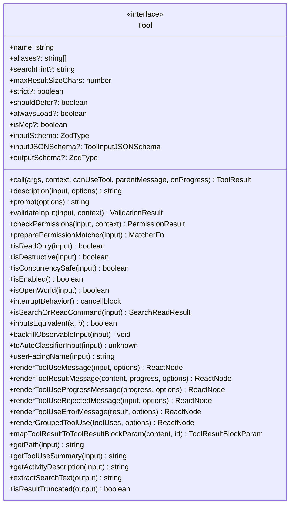
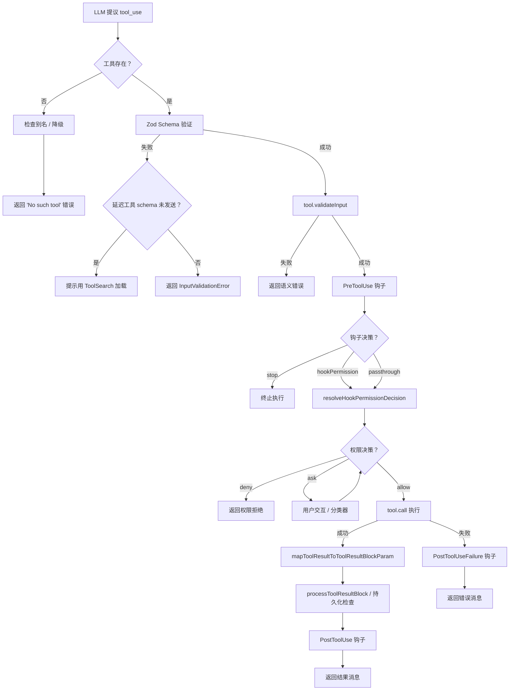
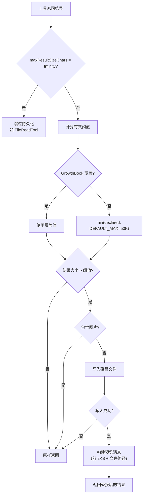

# 第 4 章：工具系统——25 个方法的契约

> **核心思想**：工具系统是 Agent 的"手"。Claude Code 用一个包含约 25 个方法的 `Tool` 接口，将 57 个完全异质的操作统一到同一个调度框架下。**接口的宽度决定了系统的表达力，接口的约束决定了系统的安全性。**

---

## 4.1 为什么需要统一的工具接口？

想象你在指挥一支交响乐队。小提琴、大号、定音鼓——每种乐器的物理机制完全不同，但指挥家只需要一套统一的手势：起拍、强弱、速度。工具接口就是 Claude Code 的"指挥手势集"。

Claude Code 面对的异质操作包括：

- **文件系统操作**：读文件、写文件、编辑文件、搜索文件
- **Shell 执行**：任意 bash 命令，从 `ls` 到 `docker compose up`
- **外部服务**：MCP（Model Context Protocol）连接的浏览器控制、数据库查询、API 调用
- **Agent 管理**：子 agent 创建、任务调度、计划模式切换

如果每种操作都用一套专有 API，调度器就需要为每种工具写特殊逻辑——权限检查、UI 渲染、错误处理、结果持久化全部耦合。这正是 `Tool` 接口要解决的问题：**用一个统一的 25 方法契约，让调度器对工具一无所知，却能安全地驱动一切。**

这个设计选择的代价是什么？接口变"宽"了——25 个方法比大多数接口都要多。但正如我们将看到的，这个宽度是精心设计的：每个方法都承担一个不可替代的职责，而且 `buildTool()` 工厂用安全的默认值填充了大部分方法，使得实际的定义负担远小于 25。

> **来源**：`src/Tool.ts`（第 362-695 行）定义了完整的 `Tool` 类型。

---

## 4.2 Tool 接口全解：25 个方法的语义

让我们把这 25 个方法按功能域分组，逐一理解它们的语义。



### 4.2.1 核心执行域（5 个方法）

| 方法 | 职责 | 失败安全 |
|------|------|---------|
| `call()` | 执行工具的核心逻辑 | 必须实现 |
| `inputSchema` | Zod schema，定义输入类型 | 必须实现 |
| `description()` | 生成对 LLM 的工具描述 | 必须实现 |
| `prompt()` | 生成系统提示中的指导文本 | 必须实现 |
| `mapToolResultToToolResultBlockParam()` | 将输出映射为 API 格式 | 必须实现 |

`call()` 是唯一真正"做事"的方法。它的签名揭示了工具系统的信息流：

```typescript
call(
  args: z.infer<Input>,         // Zod 验证后的输入
  context: ToolUseContext,       // 运行时上下文（消息历史、权限、状态）
  canUseTool: CanUseToolFn,      // 子工具权限检查器（用于嵌套调用）
  parentMessage: AssistantMessage, // 触发此调用的 assistant 消息
  onProgress?: ToolCallProgress,  // 进度回调
): Promise<ToolResult<Output>>
```

注意 `ToolResult` 不只是数据——它还可以包含 `newMessages`（注入新消息到对话）和 `contextModifier`（修改后续调用的上下文）。这使得工具可以影响 Agent 的状态机，而不只是返回字符串。

> **来源**：`src/Tool.ts`（第 378-385 行），`ToolResult` 类型（第 321-336 行）。

### 4.2.2 安全边界域（7 个方法）

这是接口设计最精妙的部分。七个方法构成了一个**分层的安全网格**：

```
validateInput()     → 输入合法性（格式、路径黑名单）
checkPermissions()  → 工具级权限（用户授权、钩子决策）
isReadOnly()        → 并发安全标记
isDestructive()     → 不可逆操作标记
isConcurrencySafe() → 是否可并行执行
isEnabled()         → 功能开关
preparePermissionMatcher() → 钩子条件匹配器
```

**关键设计**：`validateInput()` 和 `checkPermissions()` 是**分离的**。验证在权限之前运行，这意味着如果输入不合法，用户永远不会被无谓地询问"是否允许这个操作"——操作直接被拒绝。

`isReadOnly()` 的语义值得深思。它不只是一个标签——它直接影响 `isConcurrencySafe()` 的默认行为。BashTool 的实现完美展示了这一点：

```typescript
// src/tools/BashTool/BashTool.tsx 第 434-441 行
isConcurrencySafe(input) {
  return this.isReadOnly?.(input) ?? false;
},
isReadOnly(input) {
  const compoundCommandHasCd = commandHasAnyCd(input.command);
  const result = checkReadOnlyConstraints(input, compoundCommandHasCd);
  return result.behavior === 'allow';
},
```

`ls` 是只读的，可以并行；`git push` 不是，必须串行。这个判断发生在命令执行之前，让调度器能够安全地并行化读操作而不引入竞态条件。

> **来源**：`src/Tool.ts`（第 402-513 行），`src/tools/BashTool/BashTool.tsx`（第 434-441 行）。

### 4.2.3 调度控制域（6 个方法）

| 方法 | 用途 |
|------|------|
| `isOpenWorld()` | 标记输入空间无法枚举的工具（如 MCP） |
| `interruptBehavior()` | 用户中断时取消还是阻塞 |
| `isSearchOrReadCommand()` | UI 折叠优化：搜索/读取操作可压缩显示 |
| `inputsEquivalent()` | 去重：检测等价的工具调用 |
| `backfillObservableInput()` | 在钩子/权限看到输入前注入派生字段 |
| `toAutoClassifierInput()` | 为安全分类器提取命令的本质特征 |

`toAutoClassifierInput()` 特别值得注意——它的默认实现是 `() => ''`（跳过分类），这意味着**安全相关的工具必须主动覆写这个方法**。BashTool 返回 `input.command`，FileReadTool 返回 `input.file_path`。这是"安全默认 + 显式声明"模式的又一体现。

### 4.2.4 UI 渲染域（约 10 个方法）

工具接口中最"宽"的部分是渲染方法。这看起来违反了"关注点分离"，但实际上是一个深思熟虑的决定：**只有工具自己知道如何最好地呈现自己的输入和输出。**

```
renderToolUseMessage()         → 工具调用时的显示（如 "Running: ls -la"）
renderToolResultMessage()       → 执行结果的显示
renderToolUseProgressMessage()  → 进度指示器（BashTool 显示实时输出）
renderToolUseRejectedMessage()  → 用户拒绝后的显示
renderToolUseErrorMessage()     → 错误状态的显示
renderGroupedToolUse()          → 多个并行工具的聚合显示
```

每个渲染方法都是**可选的**，缺省时回退到通用的 Fallback 组件。这让简单工具可以零 UI 代码地工作，而复杂工具（如 BashTool 的流式输出）可以完全定制显示。

---

## 4.3 buildTool() 工厂：安全失败的默认值

25 个方法看起来是沉重的实现负担。`buildTool()` 工厂函数通过 **fail-closed 默认值** 消除了这个问题：

```typescript
// src/Tool.ts 第 757-791 行
const TOOL_DEFAULTS = {
  isEnabled: () => true,
  isConcurrencySafe: (_input?: unknown) => false,    // 假设不安全
  isReadOnly: (_input?: unknown) => false,            // 假设有写操作
  isDestructive: (_input?: unknown) => false,
  checkPermissions: (input, _ctx?) =>                 // 交给通用权限系统
    Promise.resolve({ behavior: 'allow', updatedInput: input }),
  toAutoClassifierInput: (_input?: unknown) => '',     // 跳过分类器
  userFacingName: (_input?: unknown) => '',
}

export function buildTool<D extends AnyToolDef>(def: D): BuiltTool<D> {
  return {
    ...TOOL_DEFAULTS,
    userFacingName: () => def.name,
    ...def,
  } as BuiltTool<D>
}
```

注意默认值的方向：

| 默认值 | 含义 | 安全方向 |
|-------|------|---------|
| `isConcurrencySafe: false` | 不允许并行 | 保守（安全） |
| `isReadOnly: false` | 假设写操作 | 保守（安全） |
| `isDestructive: false` | 非破坏性 | 宽松（用户体验） |
| `checkPermissions: allow` | 交给通用系统 | 中性（委托） |
| `toAutoClassifierInput: ''` | 跳过分类 | 需要关注 |

这里有一个微妙的设计张力：`isConcurrencySafe` 默认 false 是安全的（宁可串行也不要竞态），但 `toAutoClassifierInput` 默认空字符串意味着**新工具默认不参与安全分类**。这是一个有意识的 trade-off——强制所有工具实现分类器输入会增加大量样板代码，但安全关键工具（BashTool、FileEditTool）必须显式覆写。

`buildTool()` 的类型魔法也值得欣赏：

```typescript
type BuiltTool<D> = Omit<D, DefaultableToolKeys> & {
  [K in DefaultableToolKeys]-?: K extends keyof D
    ? undefined extends D[K] ? ToolDefaults[K] : D[K]
    : ToolDefaults[K]
}
```

这个条件类型确保：如果 `D` 提供了某个方法，用 `D` 的类型；如果没有提供，用默认值的类型。`-?` 去掉了可选性——结果类型的每个默认方法都是 **required**。这意味着调用者永远不需要写 `tool.isReadOnly?.() ?? false`。

> **来源**：`src/Tool.ts`（第 706-791 行），`DefaultableToolKeys` 类型（第 707-715 行）。

---

## 4.4 Zod Schema 驱动的输入验证

工具输入的验证分为两层：**结构验证**（Zod schema）和**语义验证**（`validateInput()`）。

### 4.4.1 结构验证

每个工具通过 `inputSchema` 属性声明 Zod schema。以 BashTool 为例：

```typescript
// src/tools/BashTool/BashTool.tsx 第 227-259 行
const fullInputSchema = lazySchema(() => z.strictObject({
  command: z.string().describe('The command to execute'),
  timeout: semanticNumber(z.number().optional()),
  description: z.string().optional(),
  run_in_background: semanticBoolean(z.boolean().optional()),
  dangerouslyDisableSandbox: semanticBoolean(z.boolean().optional()),
  _simulatedSedEdit: z.object({
    filePath: z.string(),
    newContent: z.string()
  }).optional(),
}))
```

几个关键点：

1. **`z.strictObject()`**：使用严格模式，拒绝未知属性。这是安全的——模型不能偷偷传入未声明的字段。
2. **`semanticNumber()`/`semanticBoolean()`**：这些包装器处理 LLM 常见的类型错误——模型有时会把数字写成字符串 `"5"` 而不是 `5`。语义类型让解析更宽容，同时保持类型安全。
3. **`lazySchema()`**：延迟初始化 schema，避免在模块加载时触发循环依赖。
4. **Schema 裁剪**：注意 `_simulatedSedEdit` 在面向模型的 schema 中被 `omit()` 掉了——它是纯内部字段，用于 sed 编辑预览后的权限流。暴露它会让模型绕过沙盒。

### 4.4.2 执行时的 Zod 验证

在工具执行引擎中，Zod 验证是第一道关卡：

```typescript
// src/services/tools/toolExecution.ts 第 614-680 行
const parsedInput = tool.inputSchema.safeParse(input)
if (!parsedInput.success) {
  let errorContent = formatZodValidationError(tool.name, parsedInput.error)

  // 对延迟加载的工具，检测 schema 是否已发送
  const schemaHint = buildSchemaNotSentHint(tool, toolUseContext.messages, ...)
  if (schemaHint) {
    errorContent += schemaHint  // 提示模型先用 ToolSearch 加载 schema
  }
  // ... 返回格式化的错误消息
}
```

`buildSchemaNotSentHint()` 是一个精巧的自修复机制：当 ToolSearch（延迟加载）启用时，模型可能在未加载 schema 的情况下调用工具，导致类型参数都是字符串。错误消息不是简单地报 "invalid input"，而是告诉模型："这个工具的 schema 没有发送到 API——先调用 ToolSearch 加载它。"

### 4.4.3 语义验证

结构验证通过后，`validateInput()` 执行工具特定的语义检查：

```typescript
// src/services/tools/toolExecution.ts 第 683-733 行
const isValidCall = await tool.validateInput?.(parsedInput.data, toolUseContext)
if (isValidCall?.result === false) {
  // 返回工具级错误，不进入权限流
}
```

FileReadTool 的 `validateInput()` 展示了语义验证的丰富性：

- 检查 PDF 页码范围是否合法（纯字符串解析，无 I/O）
- 检查路径是否在 deny 规则中（无 I/O）
- 检查 UNC 路径（安全：防止 NTLM 凭证泄露）
- 检查二进制文件扩展名
- 检查设备文件路径（`/dev/zero` 等，防止无限输出）

**设计原则**：`validateInput()` 中的检查**不应有文件系统 I/O**。所有 I/O 操作都延迟到 `checkPermissions()` 之后，确保在用户授权之前不访问任何可能的恶意路径。

> **来源**：`src/tools/FileReadTool/FileReadTool.ts`（第 418-495 行），`src/services/tools/toolExecution.ts`（第 614-733 行）。

---

## 4.5 工具注册与分组策略

### 4.5.1 工具注册表

所有工具的注册发生在 `src/tools.ts` 的 `getAllBaseTools()` 函数中：

```typescript
// src/tools.ts 第 193-251 行
export function getAllBaseTools(): Tools {
  return [
    AgentTool,
    TaskOutputTool,
    BashTool,
    ...(hasEmbeddedSearchTools() ? [] : [GlobTool, GrepTool]),
    FileReadTool,
    FileEditTool,
    FileWriteTool,
    NotebookEditTool,
    WebFetchTool,
    // ... 条件性加载的工具
    ...(isWorktreeModeEnabled() ? [EnterWorktreeTool, ExitWorktreeTool] : []),
    ...(isToolSearchEnabledOptimistic() ? [ToolSearchTool] : []),
  ]
}
```

这个注册表有几个值得注意的模式：

1. **条件编译**：`feature('COORDINATOR_MODE')` 等使用 Bun 的 DCE（Dead Code Elimination）在编译时裁剪功能。
2. **运行时条件**：`isWorktreeModeEnabled()` 等在运行时决定工具可用性。
3. **互斥替换**：`hasEmbeddedSearchTools()` 为 true 时，Glob 和 Grep 被移除（因为内嵌搜索已覆盖功能）。

### 4.5.2 分组策略

`src/constants/tools.ts` 定义了四个关键的工具集合：

```typescript
// 所有 Agent（子代理）禁用的工具
ALL_AGENT_DISALLOWED_TOOLS = new Set([
  TASK_OUTPUT_TOOL_NAME,
  EXIT_PLAN_MODE_V2_TOOL_NAME,
  ENTER_PLAN_MODE_TOOL_NAME,
  ASK_USER_QUESTION_TOOL_NAME,
  TASK_STOP_TOOL_NAME,
])

// 异步 Agent 允许的工具（白名单模式）
ASYNC_AGENT_ALLOWED_TOOLS = new Set([
  FILE_READ_TOOL_NAME,
  WEB_SEARCH_TOOL_NAME,
  GREP_TOOL_NAME,
  ...SHELL_TOOL_NAMES,
  FILE_EDIT_TOOL_NAME,
  FILE_WRITE_TOOL_NAME,
  // ...
])

// 协调者模式——仅管理工具
COORDINATOR_MODE_ALLOWED_TOOLS = new Set([
  AGENT_TOOL_NAME,
  TASK_STOP_TOOL_NAME,
  SEND_MESSAGE_TOOL_NAME,
  SYNTHETIC_OUTPUT_TOOL_NAME,
])
```

分组策略的核心原则是**最小权限**：

- 子 Agent 不能控制计划模式或直接询问用户——它们只能通过父 Agent 间接通信
- 异步 Agent（后台任务）用白名单限制为文件操作和搜索
- 协调者只能派发任务，不能直接执行文件操作

### 4.5.3 工具池组装

`src/utils/toolPool.ts` 的 `mergeAndFilterTools()` 负责最终的工具池组装：

```typescript
// src/utils/toolPool.ts 第 55-79 行
export function mergeAndFilterTools(
  initialTools: Tools,
  assembled: Tools,
  mode: ToolPermissionContext['mode'],
): Tools {
  // 分区排序：内置工具在前（连续前缀），MCP 工具在后
  const [mcp, builtIn] = partition(
    uniqBy([...initialTools, ...assembled], 'name'),
    isMcpTool,
  )
  const byName = (a: Tool, b: Tool) => a.name.localeCompare(b.name)
  const tools = [...builtIn.sort(byName), ...mcp.sort(byName)]

  // 协调者模式过滤
  if (feature('COORDINATOR_MODE') && coordinatorModeModule) {
    if (coordinatorModeModule.isCoordinatorMode()) {
      return applyCoordinatorToolFilter(tools)
    }
  }
  return tools
}
```

**排序的缓存意义**：内置工具排在前面并按名称排序，是为了**提示缓存（prompt cache）稳定性**。服务器在最后一个内置工具之后设置缓存断点。如果 MCP 工具混入内置工具中间，每次 MCP 工具变化都会使所有下游缓存失效。分区排序确保内置工具的缓存前缀永远稳定。

> **来源**：`src/tools.ts`（第 193-367 行），`src/constants/tools.ts`（第 36-112 行），`src/utils/toolPool.ts`（第 55-79 行）。

---

## 4.6 工具执行管道：从提议到结果

工具执行是 Claude Code 中最复杂的流程之一。让我们用一个 Mermaid 流程图来理解它：



### 4.6.1 第一阶段：查找与验证

```typescript
// src/services/tools/toolExecution.ts 第 337-411 行
export async function* runToolUse(
  toolUse: ToolUseBlock,
  assistantMessage: AssistantMessage,
  canUseTool: CanUseToolFn,
  toolUseContext: ToolUseContext,
): AsyncGenerator<MessageUpdateLazy, void> {
  let tool = findToolByName(toolUseContext.options.tools, toolName)

  // 降级查找：旧名称可能是别名
  if (!tool) {
    const fallbackTool = findToolByName(getAllBaseTools(), toolName)
    if (fallbackTool && fallbackTool.aliases?.includes(toolName)) {
      tool = fallbackTool
    }
  }
```

别名机制（`aliases` 属性）使得工具改名成为非破坏性操作。旧的对话历史中的工具名称仍然能被正确路由。

### 4.6.2 第二阶段：投机性分类器

BashTool 有一个独特的优化——**投机性分类器检查**：

```typescript
// src/services/tools/toolExecution.ts 第 740-752 行
if (tool.name === BASH_TOOL_NAME && parsedInput.data && 'command' in parsedInput.data) {
  startSpeculativeClassifierCheck(
    (parsedInput.data as BashToolInput).command,
    appState.toolPermissionContext,
    toolUseContext.abortController.signal,
    toolUseContext.options.isNonInteractiveSession,
  )
}
```

在 PreToolUse 钩子运行的同时，安全分类器已经开始分析 bash 命令。这是一个并行化优化——分类器和钩子同时运行，减少了用户等待时间。

### 4.6.3 第三阶段：执行与流式化

执行通过 `Stream` 实现流式化——进度事件和最终结果混合在同一个 `AsyncIterable` 中：

```typescript
// src/services/tools/toolExecution.ts 第 503-570 行
function streamedCheckPermissionsAndCallTool(...): AsyncIterable<MessageUpdateLazy> {
  const stream = new Stream<MessageUpdateLazy>()
  checkPermissionsAndCallTool(
    ...,
    progress => {
      stream.enqueue({
        message: createProgressMessage({
          toolUseID: progress.toolUseID,
          data: progress.data,
        }),
      })
    },
  )
    .then(results => { for (const result of results) stream.enqueue(result) })
    .catch(error => { stream.error(error) })
    .finally(() => { stream.done() })
  return stream
}
```

这种"进度消息 + 最终结果统一为消息流"的设计意味着 UI 层不需要区分"正在进行"和"已完成"——它只需要消费消息流。

### 4.6.4 第四阶段：输入的不可变性

执行管道中有一个精妙的不可变性机制。`backfillObservableInput()` 创建一个浅拷贝用于钩子和权限检查，而 `call()` 收到的是原始输入：

```typescript
// src/services/tools/toolExecution.ts 第 783-793 行
let callInput = processedInput
const backfilledClone = tool.backfillObservableInput && ...
  ? ({ ...processedInput } as typeof processedInput)
  : null
if (backfilledClone) {
  tool.backfillObservableInput!(backfilledClone)
  processedInput = backfilledClone  // 钩子看到的版本
}
// ... callInput 仍然是原始版本
```

为什么？因为 FileReadTool 的 `backfillObservableInput` 会对 `file_path` 做 `expandPath()`（展开 `~` 和相对路径），但 `call()` 需要看到模型发出的原始路径——工具结果中嵌入的路径必须和模型的输入一致，否则会破坏对话历史的哈希稳定性。

> **来源**：`src/services/tools/toolExecution.ts`（第 337-1745 行）。

---

## 4.7 大结果持久化：50KB 阈值的设计

当 `grep -r "TODO" .` 返回 200KB 文本时会发生什么？把它全部放入上下文窗口会浪费大量 token。Claude Code 的解决方案是**大结果持久化**——超过阈值的工具输出被写入磁盘文件，模型只看到一个预览和文件路径。

### 4.7.1 决策树



### 4.7.2 阈值体系

```typescript
// src/constants/toolLimits.ts
export const DEFAULT_MAX_RESULT_SIZE_CHARS = 50_000  // 全局上限
export const MAX_TOOL_RESULT_BYTES = 400_000         // 400KB 绝对上限
export const MAX_TOOL_RESULTS_PER_MESSAGE_CHARS = 200_000  // 单消息聚合上限
```

三个阈值形成一个分层防护：

1. **工具级阈值**（`maxResultSizeChars`）：每个工具声明自己的上限
   - BashTool: `30_000`
   - MCPTool: `100_000`
   - FileReadTool: `Infinity`（永不持久化）
2. **全局上限**（`DEFAULT_MAX_RESULT_SIZE_CHARS = 50_000`）：钳制工具声明的值
3. **消息级预算**（`MAX_TOOL_RESULTS_PER_MESSAGE_CHARS = 200_000`）：防止 N 个并行工具各自 40K 累加到 400K

### 4.7.3 FileReadTool 的 Infinity 设计

为什么 FileReadTool 的 `maxResultSizeChars` 是 `Infinity`？

```typescript
// src/tools/FileReadTool/FileReadTool.ts 第 342 行
maxResultSizeChars: Infinity,
```

因为持久化 Read 的输出会创建**循环读取**：工具输出写入文件 -> 模型看到 "请用 Read 读取此文件" -> 模型调用 Read -> 输出写入文件 -> 无限循环。FileReadTool 已经通过 `maxTokens` 和 `maxSizeBytes` 自我约束了输出大小，不需要外部的持久化机制。

### 4.7.4 预览的生成

持久化后，模型看到的消息格式是：

```
<persisted-output>
Output too large (195.3 KB). Full output saved to: /path/to/tool-results/abc123.txt

Preview (first 2.0 KB):
[前 2000 字节的内容]
...
</persisted-output>
```

预览在换行符边界截断——`generatePreview()` 会在限制的 50% 之后寻找最近的换行符，避免在行中间截断。

### 4.7.5 消息级预算机制

`enforceToolResultBudget()` 是一个更高层的控制：它跨所有工具结果执行总预算。它有三个关键的不变量：

1. **一旦看到，决策不变**：`seenIds` 记录所有已处理的结果 ID，确保同一个结果在后续轮次中做同样的决策（缓存稳定性）
2. **冻结 vs 替换**：已看到但未替换的结果永远不会被后来替换（改变会破坏已缓存的提示前缀）
3. **新鲜 vs 陈旧**：只有本轮新增的工具结果可以被替换

> **来源**：`src/utils/toolResultStorage.ts`（第 1-1041 行），`src/constants/toolLimits.ts`（第 1-57 行）。

---

## 4.8 三个工具的对比剖析

现在让我们把 BashTool、FileReadTool 和 MCPTool 放在一起比较，看看同一个接口如何适应截然不同的工具类型。

### 4.8.1 身份标识

| 属性 | BashTool | FileReadTool | MCPTool |
|------|----------|-------------|---------|
| `name` | `'Bash'` | `'Read'` | `'mcp'`（被 mcpClient.ts 覆写） |
| `aliases` | - | - | - |
| `isMcp` | `false`（默认） | `false`（默认） | `true` |
| `strict` | `true` | `true` | - |
| `shouldDefer` | - | - | 取决于服务器 |
| `maxResultSizeChars` | `30_000` | `Infinity` | `100_000` |

### 4.8.2 输入 Schema

```
BashTool:      z.strictObject({ command, timeout?, description?,
                                 run_in_background?, dangerouslyDisableSandbox? })
FileReadTool:  z.strictObject({ file_path, offset?, limit?, pages? })
MCPTool:       z.object({}).passthrough()  // 接受任何输入
```

**MCPTool 的 `passthrough()`** 是一个关键设计：MCP 工具的 schema 在外部服务器定义，Claude Code 无法提前知道。`.passthrough()` 让 Zod 接受任何对象但不验证具体字段——验证责任交给远程服务器。同时 MCPTool 提供了 `inputJSONSchema` 属性直接传递 JSON Schema，不经过 Zod 转换。

### 4.8.3 安全模型对比

| 方法 | BashTool | FileReadTool | MCPTool |
|------|----------|-------------|---------|
| `isReadOnly()` | 动态分析命令 | 始终 `true` | 默认 `false` |
| `isConcurrencySafe()` | `= isReadOnly()` | 始终 `true` | 默认 `false` |
| `validateInput()` | 检测阻塞 sleep 模式 | 路径黑名单、二进制检测 | 无（默认） |
| `checkPermissions()` | `bashToolHasPermission()` | `checkReadPermissionForTool()` | `{ behavior: 'passthrough' }` |
| `toAutoClassifierInput()` | `input.command` | `input.file_path` | 默认 `''` |

BashTool 的权限系统最复杂——它需要解析 bash 命令 AST 来判断读写性质。FileReadTool 相对简单，依赖文件路径的 allow/deny 规则。MCPTool 使用 `passthrough`，将权限决策完全委托给通用权限系统。

### 4.8.4 call() 的实现差异

**BashTool**: 最复杂的 `call()` 实现（约 500 行），处理了：
- 沙盒决策（是否使用 Seatbelt/Landlock）
- 超时管理（默认 120 秒，最大 600 秒）
- 背景执行（`run_in_background`）
- 大输出持久化（在 `call()` 内部而非框架层面，因为需要保持流式输出的同时截断）
- sed 编辑模拟（将 `sed -i` 转化为安全的文件编辑）
- `cd` 命令的工作目录管理
- git 操作追踪

**FileReadTool**: 中等复杂度（约 300 行），处理了：
- 五种文件类型的分支：文本、图片、PDF、Notebook、未变文件
- 读取去重（`readFileState` 缓存）
- token 预算控制（`validateContentTokens()`）
- 技能发现（读取文件时自动发现关联的 skills）

**MCPTool**: 最简单——`call()` 是空的占位符（`return { data: '' }`），真正的实现在 `mcpClient.ts` 中被覆写。MCPTool 是一个**模板对象**，为每个 MCP 工具创建副本并注入实际逻辑。

### 4.8.5 结果映射

三个工具的 `mapToolResultToToolResultBlockParam()` 差异巨大：

```typescript
// BashTool: 处理图片、结构化内容、大输出、背景任务
mapToolResultToToolResultBlockParam({
  stdout, stderr, isImage, structuredContent,
  persistedOutputPath, persistedOutputSize, ...
}, toolUseID)

// FileReadTool: 处理文本、图片、PDF、Notebook、去重 stub
mapToolResultToToolResultBlockParam(data, toolUseID) {
  switch (data.type) {
    case 'image': // Base64 图片块
    case 'notebook': // 单元格映射
    case 'pdf': // PDF 元数据
    case 'file_unchanged': // 去重 stub
    case 'text': // 带行号 + 安全提醒
  }
}

// MCPTool: 直接透传字符串
mapToolResultToToolResultBlockParam(content, toolUseID) {
  return { tool_use_id: toolUseID, type: 'tool_result', content }
}
```

这完美展示了统一接口的价值：调度器不需要知道结果是图片还是文本还是 PDF——它只调用 `mapToolResultToToolResultBlockParam()`，得到 API 兼容的格式。

> **来源**：`src/tools/BashTool/BashTool.tsx`（第 420-600 行），`src/tools/FileReadTool/FileReadTool.ts`（第 337-718 行），`src/tools/MCPTool/MCPTool.ts`（第 27-77 行）。

---

## 4.9 设计权衡与替代方案

### 4.9.1 宽接口 vs 窄接口

Claude Code 选择了一个约 25 方法的宽接口。另一个极端是 LangChain 风格的窄接口：

```typescript
// 假想的窄接口
interface SimpleTool {
  name: string
  description: string
  schema: JSONSchema
  execute(input: unknown): Promise<string>
}
```

宽接口的代价是学习曲线更陡峭，但收益是：

- **无需中间层**：不需要 PermissionMiddleware、ConcurrencyMiddleware 等层层包装
- **类型安全**：每个方法的输入输出类型由泛型精确控制
- **编译时保证**：`buildTool()` 的类型系统确保遗漏的方法在编译时被发现

### 4.9.2 渲染方法在接口中 vs 分离的 Renderer

把渲染方法放在 Tool 接口中看似违反关注点分离。替代方案是一个独立的 ToolRenderer 注册表：

```typescript
// 假想的分离方案
toolRenderers.register('Bash', {
  renderUse: (input) => ...,
  renderResult: (output) => ...,
})
```

Claude Code 选择内聚的原因是：

1. 渲染逻辑依赖工具的输出类型——分离后需要双重维护类型定义
2. 工具的新增/修改是高频操作，内聚减少了跨文件修改
3. 渲染方法都是可选的，简单工具可以完全忽略

### 4.9.3 Zod vs JSON Schema

MCP 工具使用 JSON Schema 而非 Zod，因为 MCP 协议是语言无关的。但内置工具全部使用 Zod。这个双轨设计通过 `inputJSONSchema` 属性桥接——MCP 工具设置 JSON Schema，跳过 Zod 转换。代价是验证路径分叉，但收益是内置工具的验证错误消息更人性化。

### 4.9.4 `maxResultSizeChars` 在工具级 vs 全局级

将持久化阈值放在工具级别而非全局统一，增加了配置的复杂性。但这是必要的：

- BashTool (`30_000`)：shell 输出通常是日志，超过 30K 的部分价值递减
- MCPTool (`100_000`)：外部工具可能返回结构化数据，需要更大空间
- FileReadTool (`Infinity`)：持久化会导致循环读取

如果使用全局统一阈值，要么 BashTool 浪费 token（阈值太高），要么 MCPTool 过于激进地截断（阈值太低）。

---

## 4.10 迁移指南

### 4.10.1 添加新的内置工具

1. 创建 `src/tools/MyTool/MyTool.ts`
2. 使用 `buildTool()` 定义工具：

```typescript
import { z } from 'zod/v4'
import { buildTool } from '../../Tool.js'
import { lazySchema } from '../../utils/lazySchema.js'

const inputSchema = lazySchema(() =>
  z.strictObject({
    param1: z.string().describe('Description for LLM'),
  }),
)

export const MyTool = buildTool({
  name: 'MyTool',
  maxResultSizeChars: 50_000,  // 或 Infinity 如果不需要持久化

  async description() { return 'What this tool does' },
  async prompt() { return 'Detailed usage instructions for LLM' },

  get inputSchema() { return inputSchema() },

  // 安全关键：如果工具执行只读操作
  isReadOnly() { return true },
  isConcurrencySafe() { return true },

  // 安全分类器输入
  toAutoClassifierInput(input) { return input.param1 },

  async call(input, context) {
    // 核心逻辑
    return { data: { result: '...' } }
  },

  mapToolResultToToolResultBlockParam(data, toolUseID) {
    return {
      tool_use_id: toolUseID,
      type: 'tool_result',
      content: JSON.stringify(data),
    }
  },

  renderToolUseMessage(input) { return <Text>MyTool: {input.param1}</Text> },
})
```

3. 在 `src/tools.ts` 的 `getAllBaseTools()` 中注册

### 4.10.2 安全检查清单

- [ ] `isReadOnly()` 对所有不修改状态的操作返回 `true`
- [ ] `isDestructive()` 对不可逆操作（删除、覆写）返回 `true`
- [ ] `validateInput()` 在执行 I/O 之前拒绝所有已知的危险输入
- [ ] `checkPermissions()` 不在内部执行副作用
- [ ] `toAutoClassifierInput()` 返回命令/路径而非空字符串
- [ ] `maxResultSizeChars` 不要无理由设为 `Infinity`
- [ ] 使用 `z.strictObject()` 而非 `z.object()` 以拒绝未声明字段

### 4.10.3 调试常见问题

**问题**：工具被模型调用但返回 "No such tool"
- 检查 `getAllBaseTools()` 中是否注册
- 检查 `isEnabled()` 是否返回 `true`
- 检查 `filterToolsByDenyRules()` 是否过滤了该工具

**问题**：Zod 验证失败，错误信息提示"expected array, got string"
- 延迟加载工具的 schema 可能未发送到 API
- 检查 `shouldDefer` 设置和 ToolSearch 配置

**问题**：工具输出被截断
- 检查 `maxResultSizeChars` 设置
- 检查 GrowthBook 标志 `tengu_satin_quoll` 是否覆盖了阈值
- 查看 `tool-results/` 目录下的持久化文件

---

## 4.11 费曼检验

让我们用费曼三步法检验本章的核心概念。

### 检验 1：为什么 buildTool() 的默认值偏向 "保守" 而非 "宽松"？

**直觉**：想象一个新员工入职第一天。公司的默认政策是"你不能做任何事直到获得授权"还是"你可以做任何事除非被禁止"？

Claude Code 选择了前者。`isConcurrencySafe: false` 意味着新工具默认串行执行——可能慢，但不会引入竞态条件。`isReadOnly: false` 意味着新工具默认被视为写操作——可能触发不必要的权限提示，但不会意外地并行执行修改操作。

这就是**安全失败**（fail-closed）原则：默认行为可能不是最优的，但它是安全的。工具作者需要主动"声明安全"才能获得并行化等优化。

### 检验 2：为什么 FileReadTool 的 maxResultSizeChars 是 Infinity？

**思想实验**：假设 FileReadTool 的阈值是 50K。模型读取一个 100K 的日志文件。结果被写入 `/tmp/session/tool-results/abc123.txt`。模型看到消息："输出已保存到 abc123.txt"。模型想看完整内容，于是调用 `Read("/tmp/session/tool-results/abc123.txt")`。这个 Read 也超过 50K，又被持久化到另一个文件...

**无限循环**。所以 Read 必须是 `Infinity`——它通过自己的 `maxTokens` 机制自我约束，不需要外部截断。

### 检验 3：为什么排序对缓存这么重要？

**物理类比**：提示缓存像一本书的页码。如果你在第 100 页插入一页，从第 101 页开始的所有页码都变了。API 的缓存也是如此——它缓存的是工具定义序列的前缀。如果 MCP 工具 `aardvark_tool` 按字母序排在内置工具 `Bash` 和 `Edit` 之间，那么每次 MCP 工具列表变化，`Edit` 之后的所有缓存都失效了。

把内置工具排在前面作为连续前缀，等于把"不变的部分"放在"书的前面"——后面怎么改都不影响前面的页码。

---

## 本章小结

本章深入剖析了 Claude Code 工具系统的架构。核心发现：

1. **Tool 接口的 25 个方法**按四个功能域组织：核心执行（5）、安全边界（7）、调度控制（6）、UI 渲染（约 10）。宽接口消除了中间层的需求。

2. **`buildTool()` 工厂**通过 fail-closed 默认值使得实际定义负担远小于 25 个方法。关键默认：`isConcurrencySafe: false`（保守），`checkPermissions: allow`（委托），`toAutoClassifierInput: ''`（需显式声明）。

3. **输入验证分两层**：Zod schema 做结构验证，`validateInput()` 做语义验证。语义验证在权限检查之前执行，且不执行 I/O，避免对恶意路径的无谓访问。

4. **工具注册**使用条件编译（`feature()`）和运行时条件的组合，支持功能渐进发布。分组策略（`ALL_AGENT_DISALLOWED_TOOLS` 等）实施最小权限原则。

5. **执行管道**是一个七阶段流水线：查找 -> Zod 验证 -> 语义验证 -> PreToolUse 钩子 -> 权限决策 -> 执行 -> PostToolUse 钩子。投机性分类器检查与钩子并行运行。

6. **大结果持久化**使用三层阈值（工具级、全局级、消息级），FileReadTool 的 `Infinity` 防止循环读取。预览在换行符边界截断。

7. **BashTool、FileReadTool、MCPTool 的对比**展示了同一接口如何适应动态安全分析、静态只读约束和完全透传三种截然不同的安全模型。

下一章我们将进入权限系统——工具接口中 `checkPermissions()` 方法背后的完整故事。
