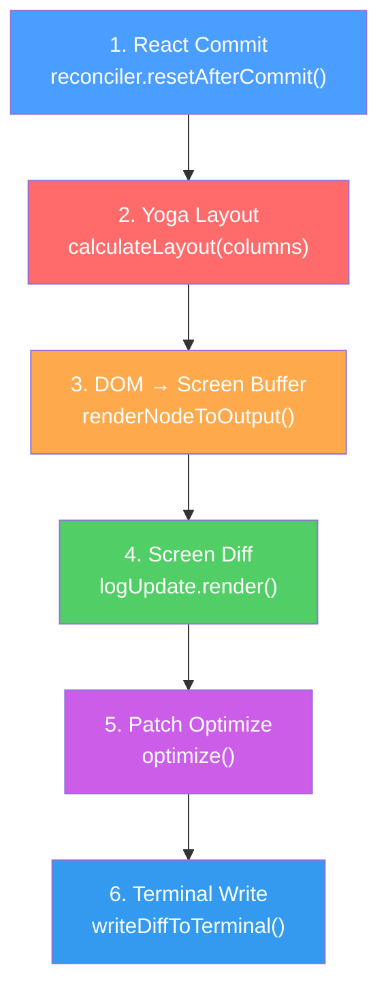
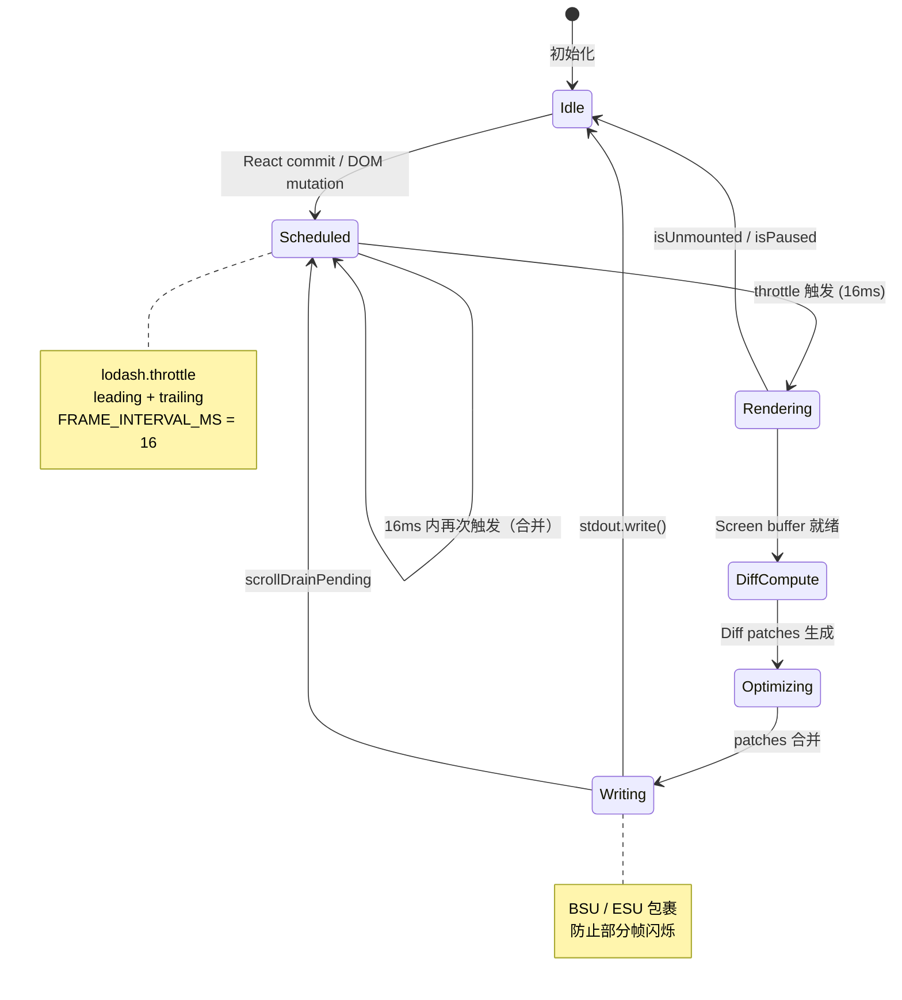
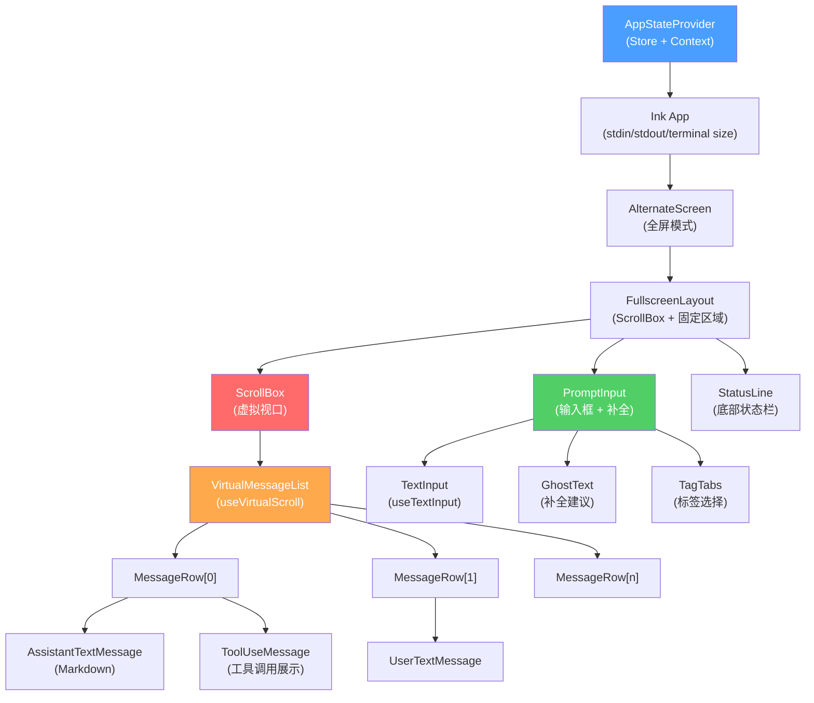

# 第 7 章：终端 UI——在 80 列 24 行里构建现代界面

> **核心思想**：**约束催生创造力。**当你只有文本和 ANSI 转义序列时，你必须更智慧地利用每一个像素。终端是最古老的 UI，也是最受约束的 UI。Claude Code 用 React 组件模型重新定义了终端 UI 开发——这不是在终端中模拟 Web，而是发明了一种全新的渲染范式。

---

## 7.1 为什么在终端中用 React？

### 费曼式引入

想象你要画一幅画。

命令式方法（imperative）就像拿着画笔一笔一笔地画：先在(10,5)画一个红色方块，再在(12,3)写一行文字，然后擦掉(10,5)的方块重画一个蓝色的。你必须精确追踪画布上每个像素的当前状态，任何顺序错误都会导致画面混乱。

声明式方法（declarative）就像**描述你想要的场景**：「我要一个蓝色方块在(10,5)，一行文字在(12,3)」。框架负责计算如何从当前画面变换到目标画面——你永远只描述"what"，不关心"how"。

传统终端程序（ncurses、blessed）本质上是命令式的。你调用 `mvaddstr(5, 10, "hello")`，直接操作屏幕缓冲区。一个拥有 150+ 组件、消息流实时滚动、工具状态并发更新、Markdown 实时渲染的应用——用命令式方式管理状态几乎是不可能的。

Claude Code 选择 React 的原因不是因为 React "流行"，而是因为 React 的核心抽象——**声明式渲染 + 虚拟 DOM diffing**——恰好是终端 UI 最需要的东西。来看一个具体的例子。打开 `src/components/Markdown.tsx`：

```typescript
// src/components/Markdown.tsx:78-101
export function Markdown(props) {
  const settings = useSettings();
  if (settings.syntaxHighlightingDisabled) {
    return <MarkdownBody {...props} highlight={null} />;
  }
  return (
    <Suspense fallback={<MarkdownBody {...props} highlight={null} />}>
      <MarkdownWithHighlight {...props} />
    </Suspense>
  );
}
```

这段代码声明了一个意图：「如果禁用了语法高亮就直接渲染，否则异步加载高亮器，加载期间显示无高亮的降级版本」。开发者不需要知道这段文本最终会变成什么 ANSI 转义序列，不需要手动管理屏幕坐标，不需要处理部分更新——React reconciler + Ink 引擎会把这个声明转换为高效的终端输出。

**关键洞察**：React 不是 Web 专属技术。它的核心是一个调度器（scheduler）+ 协调器（reconciler），可以对接任何渲染目标。react-dom 对接浏览器 DOM，react-native 对接原生视图，而 Ink 对接终端——三者共享同一个 reconciler 算法。

## 7.2 内嵌 Ink 引擎

### 什么是 Ink，为什么要内嵌它？

Ink 是一个开源库，允许用 React 组件构建终端应用。原版 Ink 是一个 npm 包，提供 `<Box>`、`<Text>` 等基础组件，将 JSX 映射到 Yoga 布局（Facebook 的跨平台 Flexbox 布局引擎），再渲染为 ANSI 字符串。

Claude Code 没有作为依赖引入 Ink——它**内嵌**了一个大幅修改的版本。整个 `src/ink/` 目录（70+ 文件）是 Ink 的深度 fork。为什么？

1. **性能临界路径**：原版 Ink 每帧重新序列化整个屏幕为字符串再输出。对于一个 24 行 80 列的终端，这意味着每秒 60 次、每次 1920 个字符的字符串拼接。当屏幕尺寸增大到 4K 终端的 200 行 300 列时（60,000 字符/帧），这成为瓶颈。
2. **缺失的核心功能**：原版 Ink 没有滚动、没有鼠标事件、没有文本选择、没有双缓冲、没有增量渲染。这些不是"nice to have"——它们是构建一个全屏交互式应用的基础。
3. **React 19 适配**：Claude Code 运行在 React 19 + Concurrent Mode 上，需要 reconciler 支持 `maySuspendCommit`、`startSuspendingCommit` 等新 API。

看 `src/ink/` 的文件结构就能感受到改造的深度：

```
src/ink/
├── ink.tsx          // 核心引擎（251KB，~5000 行）
├── reconciler.ts    // React Reconciler 适配
├── renderer.ts      // 帧渲染器
├── screen.ts        // 屏幕缓冲区（Cell-level 双缓冲）
├── output.ts        // 渲染操作收集器（blit/write/clip）
├── log-update.ts    // 帧 diff 与终端输出
├── optimizer.ts     // Patch 合并优化
├── dom.ts           // 自定义 DOM 树
├── selection.ts     // 文本选择（Alt-screen）
├── frame.ts         // 帧数据结构
├── components/      // 基础组件（Box, Text, ScrollBox...）
├── hooks/           // UI hooks（useInput, useSelection...）
├── events/          // 事件系统（capture/bubble）
├── layout/          // Yoga 布局抽象
└── termio/          // 终端 I/O 协议（CSI, DEC, OSC, SGR）
```

## 7.3 React Reconciler 的终端适配

### 费曼式引入

React reconciler 就像一个"差异探测器"。给它两棵树——上一次渲染的和这一次渲染的——它会找出最小变化集，然后告诉宿主环境（浏览器/终端/手机）如何应用这些变化。

要让 React 驱动终端，你需要实现一个 Host Config——告诉 reconciler 如何创建节点、如何更新属性、如何插入/删除子节点。这就是 `src/ink/reconciler.ts` 的工作。

### 自定义 DOM 树

打开 `src/ink/dom.ts`，这里定义了终端版的 "DOM"：

```typescript
// src/ink/dom.ts:19-27
export type ElementNames =
  | 'ink-root'
  | 'ink-box'
  | 'ink-text'
  | 'ink-virtual-text'
  | 'ink-link'
  | 'ink-progress'
  | 'ink-raw-ansi'
```

七种节点类型，对比浏览器 DOM 的上百种。这不是简化——这是终端环境下的**最佳抽象**。`ink-box` 对应 Flexbox 容器，`ink-text` 对应文本节点，`ink-raw-ansi` 是 Claude Code 新增的——用于已经预渲染好的 ANSI 字符串（如 diff 输出），跳过所有文本处理。

每个 `DOMElement` 携带完整的滚动状态：

```typescript
// src/ink/dom.ts:55-82（简化）
export type DOMElement = {
  nodeName: ElementNames
  childNodes: DOMNode[]
  style: Styles
  dirty: boolean
  yogaNode?: LayoutNode
  // 滚动状态
  scrollTop?: number
  pendingScrollDelta?: number
  scrollClampMin?: number
  scrollClampMax?: number
  stickyScroll?: boolean
  scrollAnchor?: { el: DOMElement; offset: number }
  // ...
}
```

注意 `dirty` 标志——这是 Claude Code 对 Ink 的核心改造之一。

### Reconciler Host Config

`src/ink/reconciler.ts` 实现了 `createReconciler<...>(hostConfig)` 的完整配置。看几个关键方法：

```typescript
// src/ink/reconciler.ts:331-359
createInstance(originalType, newProps, _root, hostContext, internalHandle) {
  if (hostContext.isInsideText && originalType === 'ink-box') {
    throw new Error(`<Box> can't be nested inside <Text> component`)
  }
  const type = originalType === 'ink-text' && hostContext.isInsideText
    ? 'ink-virtual-text'
    : originalType
  const node = createNode(type)
  for (const [key, value] of Object.entries(newProps)) {
    applyProp(node, key, value)
  }
  return node
}
```

这里有一个巧妙的设计：当 `<Text>` 嵌套在另一个 `<Text>` 内时，内层被自动降级为 `ink-virtual-text`——没有 Yoga 节点（不参与布局计算），只是一个样式容器。这避免了 Yoga 的嵌套文本开销。

**React 19 适配**是一个重要的改造。看 reconciler 末尾新增的方法：

```typescript
// src/ink/reconciler.ts:472-506
// React 19 required methods
maySuspendCommit(): boolean { return false },
preloadInstance(): boolean { return true },
startSuspendingCommit(): void {},
suspendInstance(): void {},
waitForCommitToBeReady(): null { return null },
HostTransitionContext: {
  $$typeof: Symbol.for('react.context'),
  _currentValue: null,
} as never,
```

这些方法让 React 19 的 Suspense 和并发特性在终端中工作。`maySuspendCommit` 返回 `false` 告诉 React "终端不需要资源预加载"，`resolveEventType` 和 `resolveEventTimeStamp` 将终端事件（键盘按键、鼠标点击）纳入 React 的事件优先级系统。

### 脏标记与增量更新

原版 Ink 每次 React commit 都重新渲染整棵树。Claude Code 引入了一个重要优化——`dirty` 标记传播：

```typescript
// src/ink/dom.ts:393-413
export const markDirty = (node?: DOMNode): void => {
  let current: DOMNode | undefined = node
  let markedYoga = false
  while (current) {
    if (current.nodeName !== '#text') {
      (current as DOMElement).dirty = true
      if (!markedYoga &&
        (current.nodeName === 'ink-text' || current.nodeName === 'ink-raw-ansi') &&
        current.yogaNode) {
        current.yogaNode.markDirty()
        markedYoga = true
      }
    }
    current = current.parentNode
  }
}
```

当一个属性变化时，只有从该节点到根节点路径上的节点被标记为 dirty。渲染时，clean 的子树可以被整体跳过（blit from previous frame）。这把帧渲染从 O(total nodes) 降到了 O(changed nodes + ancestors)。

同时，`setAttribute` 和 `setStyle` 都做了 shallow-equal 检查：

```typescript
// src/ink/dom.ts:258-274
export const setAttribute = (node, key, value) => {
  if (key === 'children') return;  // React 总是传新引用，跳过
  if (node.attributes[key] === value) return;  // 值相同，跳过
  node.attributes[key] = value;
  markDirty(node);
};
```

React 每次 render 都会创建新的 props 对象，但如果值没变，dirty 不会被设置。这阻断了"React re-render → Yoga re-layout → Ink re-paint"的连锁反应。

## 7.4 帧渲染与脏区域检测

### 费曼式引入

想象你在看一面墙上的 100 幅画。如果只有第 37 幅画换了，一个聪明的管理员不会把 100 幅都取下来重新挂——他只会换第 37 幅。这就是 Claude Code 的帧渲染策略。

### 渲染管线

Claude Code 的渲染管线是一个精心设计的六阶段流水线：



每个阶段都有性能监控。看 `src/ink/ink.tsx` 中的 `onRender` 方法：

```typescript
// src/ink/ink.tsx:420-449（简化）
onRender() {
  if (this.isUnmounted || this.isPaused) return;
  flushInteractionTime();
  const renderStart = performance.now();

  const frame = this.renderer({
    frontFrame: this.frontFrame,
    backFrame: this.backFrame,
    isTTY: this.options.stdout.isTTY,
    terminalWidth, terminalRows,
    altScreen: this.altScreenActive,
    prevFrameContaminated: this.prevFrameContaminated
  });
  const rendererMs = performance.now() - renderStart;
  // ... diff, optimize, write, 每个阶段都计时
}
```

### 双缓冲

`frontFrame` 和 `backFrame` 构成双缓冲。`frontFrame` 是当前显示在屏幕上的帧，`backFrame` 是正在渲染的帧。渲染完成后交换。这确保了：

1. **diff 有基线**：`logUpdate.render(prev, next)` 对比前后帧，只输出变化的部分
2. **选择不污染**：文本选择的高亮反转直接修改 `frontFrame.screen`，通过 `prevFrameContaminated` 标记告诉下一帧"不要 blit from 我"

看 `Frame` 的数据结构（`src/ink/frame.ts`）：

```typescript
// src/ink/frame.ts:1-20
export type Frame = {
  readonly screen: Screen      // 屏幕缓冲区（cell 级别）
  readonly viewport: Size      // 终端尺寸
  readonly cursor: Cursor      // 光标位置
  readonly scrollHint?: ScrollHint | null  // DECSTBM 硬件滚动提示
  readonly scrollDrainPending?: boolean    // ScrollBox 还有未排完的滚动
}
```

### Screen Buffer：Cell 级别的像素

`src/ink/screen.ts` 定义了终端版的"帧缓冲区"。每个 cell（字符格）用紧凑的数据表示：

```typescript
// src/ink/screen.ts（StylePool 核心概念）
export class StylePool {
  intern(styles: AnsiCode[]): number {
    // Bit 0: 该样式在空格字符上是否可见（背景色、反转等）
    // 高位: 样式数组的内部 ID
    id = (rawId << 1) | (hasVisibleSpaceEffect(styles) ? 1 : 0)
    return id
  }
}
```

StylePool 是一个**字符串驻留池**（string interning pool）。ANSI 样式序列（如 `\x1b[1;31m` = 红色加粗）被映射为整数 ID。这意味着：

- **比较两个 cell 的样式**：整数比较（1 个 CPU 周期），不是字符串比较
- **帧间 diff**：比较 styleId，不是 ANSI 字符串
- **Bit 0 技巧**：空格字符 + 无背景样式 = 不可见。渲染器用 `styleId & 1` 一次位运算就能跳过这些 cell

CharPool 和 HyperlinkPool 采用相同策略：

```typescript
// src/ink/screen.ts:21-53
export class CharPool {
  private ascii: Int32Array = initCharAscii() // ASCII 快速路径
  intern(char: string): number {
    if (char.length === 1) {
      const code = char.charCodeAt(0)
      if (code < 128) {
        const cached = this.ascii[code]!
        if (cached !== -1) return cached
        // ...
      }
    }
    // 非 ASCII 字符走 Map
    return this.stringMap.get(char) ?? this.addNew(char)
  }
}
```

ASCII 字符（占终端输出的 95%+）用直接数组索引，0 次 hash 计算。

### Output 收集器：操作队列

`src/ink/output.ts` 是渲染操作的收集器，支持六种操作：

```typescript
// src/ink/output.ts:62-71
export type Operation =
  | WriteOperation    // 写入文本到指定坐标
  | ClipOperation     // 设置裁剪区域
  | UnclipOperation   // 恢复裁剪区域
  | BlitOperation     // 从上一帧复制区域（blit = block image transfer）
  | ClearOperation    // 清除区域
  | NoSelectOperation // 标记不可选择区域
  | ShiftOperation    // 行移位（硬件滚动优化）
```

这个设计的精妙之处在于 **blit 操作**。当一个子树的 dirty 标志为 false 时，渲染器不会重新遍历它——而是从上一帧的 screen buffer 直接复制对应区域：

```typescript
// src/ink/output.ts:210-211
blit(src: Screen, x: number, y: number, width: number, height: number): void {
  this.operations.push({ type: 'blit', src, x, y, width, height })
}
```

这是终端渲染的 "游戏引擎技巧"：blit（block image transfer）来自图形学，意思是"把一块像素从一个缓冲区拷贝到另一个"。在这里，它把上一帧中没变化的区域直接拷贝到新帧，跳过了文本解析、样式计算、Yoga 布局——只剩 `TypedArray.set()` 的内存拷贝。

### 帧更新状态机

整个帧生命周期可以用一个状态机描述：



关键设计决策：

- **16ms 节流**（`FRAME_INTERVAL_MS = 16`，来自 `src/ink/constants.ts`）：60fps，匹配显示器刷新率
- **leading + trailing**：第一次触发立即渲染（低延迟），最后一次也不丢失（保证最终一致性）
- **microtask 延迟**：`queueMicrotask(this.onRender)` 确保 React 的 layout effects 已经执行（cursor 声明等）
- **滚动排水**（scroll drain）：ScrollBox 的 `pendingScrollDelta` 不会一帧内排完，通过 `scrollDrainPending` 自动调度后续帧

## 7.5 虚拟滚动

### 费曼式引入

一个 10,000 条消息的长对话。每条消息是一个 React 组件，包含 Markdown 解析、语法高亮、工具状态。如果全部渲染，需要 10,000 个 React fiber + 10,000 个 Yoga 节点 + 大约 2.5GB 的内存（每条消息约 250KB RSS）。

解决方案和现代 Web 列表相同：**只渲染视口内的内容**。但终端虚拟滚动比 Web 更难——没有 `overflow: auto`，没有原生滚动条，没有 IntersectionObserver。一切都要手动实现。

### 双层虚拟化

Claude Code 有两层虚拟化：

**第 1 层：Ink 输出级裁剪**（`render-node-to-output.ts`）

ScrollBox 的渲染阶段跳过视口外的子节点——它们的 Yoga 节点参与布局（正确计算滚动高度），但不生成任何 write 操作。这是"便宜"的虚拟化：Yoga 节点仍然存在，fiber 仍然存在，只是输出被裁剪。

**第 2 层：React 级虚拟化**（`src/hooks/useVirtualScroll.ts`）

这是真正的虚拟化——根本不创建视口外的 React 组件。看核心 hook 的签名：

```typescript
// src/hooks/useVirtualScroll.ts:142-162
export function useVirtualScroll(
  scrollRef: RefObject<ScrollBoxHandle | null>,
  itemKeys: readonly string[],
  columns: number,
): VirtualScrollResult {
  // 返回 [startIndex, endIndex) 半开区间
  // topSpacer / bottomSpacer 维持总滚动高度
  // measureRef 收集每个 item 的真实 Yoga 高度
}
```

关键参数与常量揭示了设计理念：

```typescript
const DEFAULT_ESTIMATE = 3     // 未测量 item 的估计高度（偏低：宁可多渲染）
const OVERSCAN_ROWS = 80       // 视口上下各 80 行超扫描
const COLD_START_COUNT = 30    // 布局前先渲染 30 项
const SCROLL_QUANTUM = 40      // scrollTop 量化为 40 行的 bin
const PESSIMISTIC_HEIGHT = 1   // 覆盖计算用最悲观高度
const MAX_MOUNTED_ITEMS = 300  // 挂载上限
const SLIDE_STEP = 25          // 每次 commit 最多新增 25 项
```

`SCROLL_QUANTUM` 是一个核心优化。useSyncExternalStore 的 snapshot 是 `Math.floor(scrollTop / 40)`——这意味着每滚动 40 行（约 2 个视口）才触发一次 React re-render。中间的滚动帧由 Ink 直接处理（ScrollBox 的 `forceRender` 触发 `scheduleRender`，不经过 React）。

### 滑动窗口与抖动抑制

快速滚动时（如长按 PageUp），`useVirtualScroll` 面临一个两难：如果一次挂载所有目标区域的组件，每个新 MessageRow 约 3ms（marked.lexer + formatToken），194 个 = 582ms 的阻塞。解决方案是**滑动窗口**：

```typescript
// src/hooks/useVirtualScroll.ts:465-477
const prev = prevRangeRef.current;
const scrollVelocity =
  Math.abs(scrollTop - lastScrollTopRef.current) + Math.abs(pendingDelta);
if (prev && scrollVelocity > viewportH * 2) {
  const [pS, pE] = prev;
  if (start < pS - SLIDE_STEP) start = pS - SLIDE_STEP;
  if (end > pE + SLIDE_STEP) end = pE + SLIDE_STEP;
}
```

当滚动速度超过 2 个视口时，每次 commit 最多向目标方向滑动 25 个 item。`scrollClampMin/Max` 确保 Ink 渲染器把 scrollTop 钳制在已挂载内容的边缘——用户看到的是边缘内容，而不是空白。几帧后，窗口追上，正确内容显现。

**终端窗口大小变化**也有专门处理。当 `columns` 变化时，所有缓存高度按比例缩放（而非清除）：

```typescript
// src/hooks/useVirtualScroll.ts:193-202
if (prevColumns.current !== columns) {
  const ratio = prevColumns.current / columns;
  for (const [k, h] of heightCache.current) {
    heightCache.current.set(k, Math.max(1, Math.round(h * ratio)));
  }
  freezeRendersRef.current = 2; // 冻结 2 帧
}
```

冻结 2 帧是因为：第 1 帧 Yoga 还在用旧宽度的布局数据（skipMeasurement），第 2 帧的 useLayoutEffect 读到新宽度的 Yoga 数据写入 heightCache，第 3 帧恢复正常。

## 7.6 Markdown 实时渲染

### 从文本到终端像素

Claude Code 的 Markdown 渲染链是：

```
原始文本
  → stripPromptXMLTags()     // 移除内部 XML 标记
  → cachedLexer()            // marked.lexer 解析为 Token 树
  → formatToken()            // 递归转换为 ANSI 字符串
  → <Ansi>                   // Ink 组件：ANSI → Screen cells
  → <MarkdownTable>          // 表格特殊路径：React 组件 + Flexbox
```

`cachedLexer` 是一个关键优化（`src/components/Markdown.tsx:37-71`）。虚拟滚动会频繁卸载/重新挂载消息组件，而 `useMemo` 不能跨挂载生存期。解决方案是模块级缓存：

```typescript
// src/components/Markdown.tsx:22-71
const TOKEN_CACHE_MAX = 500;
const tokenCache = new Map<string, Token[]>();

// 快速路径：无 Markdown 语法 → 跳过 marked.lexer（~3ms）
const MD_SYNTAX_RE = /[#*`|[>\-_~]|\n\n|^\d+\. |\n\d+\. /;
function hasMarkdownSyntax(s: string): boolean {
  return MD_SYNTAX_RE.test(s.length > 500 ? s.slice(0, 500) : s);
}

function cachedLexer(content: string): Token[] {
  if (!hasMarkdownSyntax(content)) {
    // 纯文本：0 次 marked 调用，1 次对象分配
    return [{ type: 'paragraph', raw: content, text: content, ... }];
  }
  const key = hashContent(content);
  // LRU 缓存：滚动回之前的消息不会重新解析
  const hit = tokenCache.get(key);
  if (hit) {
    tokenCache.delete(key); // 提升到 MRU 位置
    tokenCache.set(key, hit);
    return hit;
  }
  // ...
}
```

三层加速：(1) 正则预检跳过无 Markdown 语法的文本（大多数短回复），(2) 哈希 key 避免保留完整内容字符串，(3) LRU 淘汰防止缓存无限增长（500 条上限）。

### `ink-raw-ansi` 节点

Claude Code 新增的 `ink-raw-ansi` 节点类型是专门为已经渲染好的 ANSI 内容设计的。比如 diff 输出——颜色编码已经由 diff 工具生成，不需要再次解析。它的 measure 函数极其简单：

```typescript
// src/ink/dom.ts:379-387
const measureRawAnsiNode = function (node: DOMElement) {
  return {
    width: node.attributes['rawWidth'] as number,
    height: node.attributes['rawHeight'] as number,
  }
}
```

没有 `stringWidth` 计算，没有 wrap，没有 tab 展开——生产者已经把所有这些做好了。这让 diff 视图的渲染接近零成本。

## 7.7 输入系统

### 终端输入的挑战

终端输入不是"键盘按下触发事件"这么简单。stdin 是一个字节流，按键被编码为转义序列：

- `a` → 字节 `0x61`
- `Enter` → 字节 `0x0D`
- `↑` → 字节序列 `\x1b[A`（ESC + `[` + `A`）
- `Ctrl+Shift+A`（Kitty 协议）→ `\x1b[97;6u`

一次 stdin.read() 可能包含多个按键（粘贴文本、快速输入）。`src/ink/parse-keypress.ts` 负责把字节流解析为结构化的 `ParsedKey` 对象，处理各种终端协议的差异。

### 事件分发：终端中的 capture/bubble

Claude Code 实现了浏览器级的事件分发模型。`src/ink/events/dispatcher.ts` 采用 react-dom 的双阶段累积模式：

```typescript
// src/ink/events/dispatcher.ts:46-65
function collectListeners(target, event) {
  const listeners = []
  let node = target
  while (node) {
    // 捕获处理器：prepend（根先）
    const captureHandler = getHandler(node, event.type, true)
    if (captureHandler) listeners.unshift({ node, handler: captureHandler, phase: 'capturing' })
    // 冒泡处理器：push（目标先）
    const bubbleHandler = getHandler(node, event.type, false)
    if (bubbleHandler) listeners.push({ node, handler: bubbleHandler, phase: 'bubbling' })
    node = node.parentNode
  }
  // 结果: [root-cap, ..., parent-cap, target, parent-bub, ..., root-bub]
}
```

为什么终端需要事件捕获？考虑这个场景：全屏模式下，一个 Dialog 浮在 ScrollBox 上方。用户点击 Dialog 内的按钮——点击事件需要被 Dialog 消费，不能穿透到下层的 ScrollBox 触发滚动。`stopPropagation()` 在捕获阶段可以实现这一点。

### `useInput` hook

`src/ink/hooks/use-input.ts` 是用户空间接触输入系统的主要接口：

```typescript
// src/ink/hooks/use-input.ts:42-92
const useInput = (inputHandler: Handler, options: Options = {}) => {
  const { setRawMode, internal_exitOnCtrlC, internal_eventEmitter } = useStdin()

  // useLayoutEffect（不是 useEffect）：同步启用 raw mode
  // 否则终端在 cooked mode 下会回显按键
  useLayoutEffect(() => {
    if (options.isActive === false) return
    setRawMode(true)
    return () => setRawMode(false)
  }, [options.isActive, setRawMode])

  // useEventCallback：引用稳定，避免 listener 数组重排
  const handleData = useEventCallback((event: InputEvent) => {
    if (options.isActive === false) return
    const { input, key } = event
    if (!(input === 'c' && key.ctrl) || !internal_exitOnCtrlC) {
      inputHandler(input, key, event)
    }
  })
  // ...
}
```

注意两个设计细节：

1. **`useLayoutEffect` 而非 `useEffect`**：raw mode 必须在 commit 阶段同步启用。如果用 `useEffect`（异步），用户在 effect 执行前的按键会在 cooked mode 下回显到终端。
2. **`useEventCallback`**：listener 引用在组件生命周期内保持稳定，避免 EventEmitter 的 listener 数组因 re-render 而重排——否则 `stopImmediatePropagation()` 的顺序保证会被破坏。

### `useTextInput`：终端中的文本编辑器

`src/hooks/useTextInput.ts` 实现了一个完整的行内文本编辑器，支持：

- Emacs 快捷键（Ctrl+A/E/K/W/Y、Meta+B/F/D）
- Vim 模式（可配置）
- 多行编辑与自动滚动
- Kill ring（剪切环）与 yank-pop
- 内联 ghost text（补全建议）
- 图片粘贴检测
- CJK 输入法（IME）光标定位

这不是一个简单的 `<input>` 替代——这是一个专门为终端设计的微型编辑器。

## 7.8 状态管理：AppStateStore

### 为什么不用 Redux / Zustand？

Claude Code 的状态管理是一个仅 35 行的自定义 store：

```typescript
// src/state/store.ts（完整文件）
export type Store<T> = {
  getState: () => T
  setState: (updater: (prev: T) => T) => void
  subscribe: (listener: Listener) => () => void
}

export function createStore<T>(initialState: T, onChange?: OnChange<T>): Store<T> {
  let state = initialState
  const listeners = new Set<Listener>()
  return {
    getState: () => state,
    setState: (updater) => {
      const prev = state
      const next = updater(prev)
      if (Object.is(next, prev)) return
      state = next
      onChange?.({ newState: next, oldState: prev })
      for (const listener of listeners) listener()
    },
    subscribe: (listener) => {
      listeners.add(listener)
      return () => listeners.delete(listener)
    },
  }
}
```

35 行。没有 middleware，没有 action types，没有 reducer。为什么这就够了？

1. **单一来源**：Claude Code 的 UI 状态不像 Web 应用那样分散（路由、表单、缓存）。它本质上是一个聊天流 + 工具状态 + 设置，一个 `AppState` 对象就能描述全部。
2. **不可变更新**：`setState` 接受 `(prev) => next`，调用者必须返回新对象。`Object.is` 引用检查提供了免费的 "no change → no notify" 优化。
3. **React 集成**：通过 `useSyncExternalStore` 连接 React，这是 React 18+ 的标准外部状态集成方式。

`AppState` 本身是一个超大的不可变类型（`src/state/AppStateStore.ts`），包含设置、模型选择、权限状态、工具状态、远程会话状态等。用 `DeepImmutable<>` 包装确保了类型级别的不可变保证。

### 组件树

Claude Code 的完整组件树展示了状态如何流过 UI：



注意 ScrollBox 和 VirtualMessageList 的关系：ScrollBox 是 Ink 引擎层的组件（提供滚动 DOM 语义），VirtualMessageList 是应用层组件（决定哪些 MessageRow 需要挂载）。两层配合实现了高效的虚拟滚动。

## 7.9 设计权衡

### 1. 内嵌 vs. 依赖

**选择**：内嵌整个 Ink 引擎（70+ 文件、数万行代码）。

**收益**：
- 可以修改 reconciler 的 `resetAfterCommit` 插入 Yoga layout 计算
- 可以在 screen buffer 层面实现 cell-level diff
- 可以添加 blit、shift、clip、noSelect 等操作类型
- 可以适配 React 19 的新 API

**代价**：
- 上游 Ink 的 bug fix 需要手动 cherry-pick
- 维护负担巨大：这是一个完整的渲染引擎
- 新团队成员学习曲线陡峭

**判断**：正确的选择。Claude Code 对 Ink 的修改量已经远超原版代码量。这不再是"魔改一个库"，而是"基于 Ink 的 DNA 构建了一个新引擎"。`ink-raw-ansi` 节点、screen buffer 双缓冲、dirty 标记传播、文本选择系统、鼠标事件分发——这些不是 patch，是全新的子系统。

### 2. Yoga (WASM) 开销

Yoga 是 C++ 编写、编译为 WASM 的 Flexbox 布局引擎。每次 `calculateLayout()` 都是一次 WASM 调用，有跨越 JS/WASM 边界的开销。`getYogaCounters()` 追踪 `visited`、`measured`、`cacheHits`、`live` 计数器，帮助诊断布局性能。

优化策略：
- `ink-virtual-text` 不创建 Yoga 节点（嵌套 `<Text>` 只是样式容器）
- `ink-link` 和 `ink-progress` 也不创建 Yoga 节点
- dirty 标记阻止了不必要的 re-measure
- `markDirty` 只标记 `ink-text` 和 `ink-raw-ansi` 的 Yoga dirty（它们有 measure function）

### 3. 60fps 节流

`FRAME_INTERVAL_MS = 16`——60fps，在终端中。这不是过度工程。Claude Code 的 spinner 动画、流式文本输出、滚动动画都需要流畅的帧率。但 60fps 也意味着每帧只有 16ms 的预算，必须在这个时间内完成 React commit → Yoga → render → diff → optimize → write 全部六个阶段。

当帧时间超过 16ms，throttle 的 trailing 保证只丢帧不丢状态。`COMMIT_LOG` 环境变量可以追踪每帧的详细时间分解，用于性能调优。

### 4. 字符串驻留的内存换速度

CharPool、StylePool、HyperlinkPool 永远增长（session-lived）。一个长时间运行的会话可能积累数千个驻留字符串。定期重置？不行——blit 操作依赖 pool ID 跨帧有效。五分钟重置一次 HyperlinkPool 是因为超链接的生命周期短（不同消息有不同链接），但 CharPool 和 StylePool 必须永久存活。

`charCache`（output.ts 的 line→ClusteredChar[] 缓存）在超过 16,384 条时清空，因为它只是加速缓存，不是正确性依赖。

### 5. 没有 CSS，只有 Flexbox 子集

终端中没有 `grid`、没有 `float`、没有 `position: relative`、没有 `z-index`（只有 `position: absolute` 覆盖）。这看似限制，实际上是优势——布局模型的简单性让 Yoga 的单次遍历就能计算完整布局，不需要多次回流（reflow）。

所有"看起来像 CSS"的属性实际上都映射到 Yoga 的 Flexbox 模型：`<Box flexDirection="column" padding={1} borderStyle="round">`。边框渲染由 `render-border.ts` 在 output 阶段处理，是字符级别的"画框"（用 `─│╭╮╰╯` 等 Unicode box-drawing 字符），而非浏览器的 border-image/box-shadow。

## 7.10 迁移指南

### 从 "print + curses" 到 React 终端 UI

如果你的终端应用正在用 `process.stdout.write` + 手动 ANSI 管理，这是一个渐进迁移路径：

**阶段 1：引入 Ink 基础组件**

用 `<Box>` 和 `<Text>` 替代手动的 `\x1b[` 序列。这一步不需要内嵌 Ink——npm 包就够了。

```tsx
// 之前
process.stdout.write('\x1b[1;32mSuccess\x1b[0m\n')

// 之后
<Text bold color="green">Success</Text>
```

**阶段 2：状态驱动 UI**

用 React 状态替代命令式更新。

```tsx
// 之前
let isLoading = true;
function updateUI() {
  clearScreen();
  if (isLoading) drawSpinner();
  else drawResult();
}

// 之后
function App() {
  const [isLoading, setLoading] = useState(true);
  return isLoading ? <Spinner /> : <Result />;
}
```

**阶段 3：性能优化**

当你的应用达到数百个组件、需要全屏滚动时，开始考虑：

- dirty 标记（避免全树渲染）
- screen buffer diff（避免全屏重写）
- 虚拟滚动（避免全量 fiber 分配）
- 字符串驻留（避免重复的样式计算）

Claude Code 的实现可以作为参考，但不要过早复制这些优化——先 profile，再优化。

**阶段 4：深度定制**

当原版 Ink 的抽象阻碍了你的性能目标时，考虑内嵌。Claude Code 走到这一步是因为它需要：

- Cell-level screen buffer（不是 string-level）
- 硬件滚动（DECSTBM + CSI S/T）
- 文本选择 + 鼠标事件
- React 19 Concurrent Mode

大多数终端应用不需要走到这一步。

### 何时不用 React

- **一次性输出**（`ls`、`git status`）：直接 print，不需要组件树
- **纯交互式**（readline-style 的单问单答）：inquirer/prompts 足够
- **极度性能敏感**（每毫秒都重要的 TUI 游戏）：原始 ANSI + 手动 buffer 管理更快

React 的价值在于**状态管理复杂度**。当你的 UI 有并发异步操作（API 流式响应 + 工具执行 + 用户输入 + 后台任务状态）需要协调时，声明式渲染的收益远超框架开销。

## 7.11 费曼检验

用一句话向非程序员解释本章的核心概念：

**"Claude Code 把终端当作一块画布来使用——它不是一行一行地往终端里打字，而是在内存中维护了一幅完整的'画'。每次有变化时，它找出'画'的哪些地方需要改，只改那些地方，然后把改动送到终端。这就像一位画家不会为了修改一朵花而重画整幅画——他只修改那朵花所在的区域。"**

对开发者的检验问题：

1. **为什么 `setAttribute` 要检查 `key === 'children'` 并跳过？** 答：React 每次 render 都创建新的 children 引用，但 Ink 通过 appendChild/removeChild 管理子节点。如果把 children 当作 attribute 追踪，每次 render 都会 markDirty，使 blit 优化完全失效。

2. **为什么 `SCROLL_QUANTUM` 是 40 而不是 1？** 答：如果 scrollTop 变化 1 行就触发 React commit，快速滚动时每秒会有数百次 commit（每次 = Yoga + fiber + diff），CPU 爆炸。量化为 40 行（约半个 OVERSCAN）意味着 React 只在"需要改变挂载范围"时才 re-render，中间帧由 Ink 直接处理。

3. **为什么 StylePool 的 ID 用 `(rawId << 1) | visibleFlag`？** 答：终端屏幕 80% 是空格（缩进、对齐）。大多数空格没有背景色，是完全不可见的。渲染器用 `styleId & 1` 一次位运算就能跳过它们——不需要查 StylePool、不需要对比 ANSI 码、不需要写入 stdout。这一个 bit 消除了终端渲染中最大的无用功。

---

## 本章小结

| 维度 | 原版 Ink | Claude Code 内嵌 Ink |
|------|---------|---------------------|
| 渲染粒度 | 字符串 (line-level) | Cell (character-level) |
| 帧 diff | 全屏字符串对比 | Cell-by-cell TypedArray diff |
| 变更检测 | 每次全树遍历 | dirty 标记 + blit 跳过 |
| 滚动 | 无 | ScrollBox + DECSTBM 硬件滚动 |
| 虚拟化 | 无 | 双层（输出裁剪 + React 级） |
| 事件系统 | 扁平 callback | capture/bubble 双阶段分发 |
| 文本选择 | 无 | 全功能（word/line/drag/scroll） |
| React 版本 | React 18 | React 19 + Concurrent Mode |
| 布局引擎 | Yoga (npm) | Yoga (自编译 WASM + 计数器) |
| 字符串处理 | 每帧重新序列化 | 驻留池 (CharPool, StylePool) |

Claude Code 的终端 UI 不是一个"简陋的终端应用"。它是一个完整的渲染引擎，拥有双缓冲、脏区域检测、硬件加速滚动、虚拟化、事件系统——这些概念来自游戏引擎和浏览器引擎，但被巧妙地适配到了终端这个最受约束的环境中。

约束催生创造力。当你只有 80 列 24 行、文本和 ANSI 转义序列时，你被迫发明更高效的渲染策略——而这些策略的优雅程度，丝毫不逊于任何现代 Web 框架。
