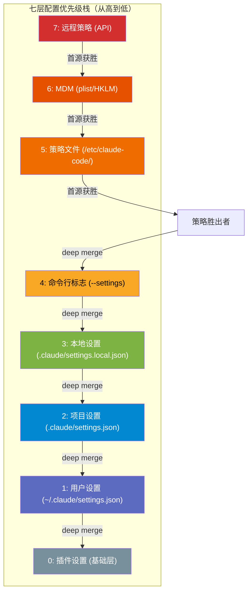
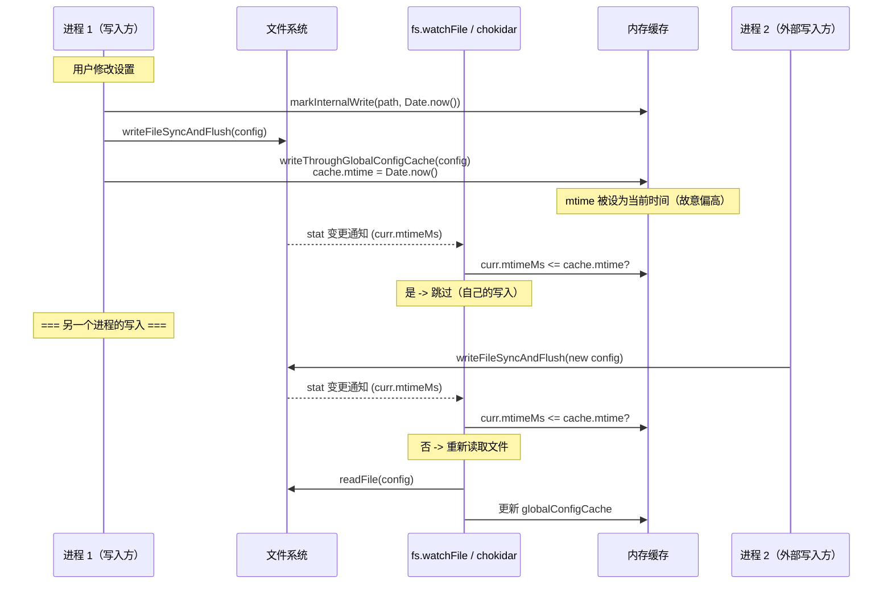

# 第 8 章：配置哲学——七层优先级的统一

> **核心思想**：配置是软件与现实世界的接口。Claude Code 的七层配置系统揭示了一个深刻原则：**配置的优先级反映了信任的层级——越难修改的配置，权威性越高。**

---

## 8.1 为什么需要七层配置？

想象你正在一栋写字楼里工作。进入大楼需要通过前台登记（个人偏好），到达你所在的楼层需要刷员工卡（项目级配置），进入特定房间需要房间钥匙（本地配置），而打开保险柜需要一个只有安全主管才知道的密码（企业策略）。每一道安全门都对应着不同的信任等级：越难通过的门，守护着越重要的东西。

Claude Code 的配置系统遵循完全相同的哲学。但这个系统不是一天建成的——它是随着使用场景的扩展而逐渐演化的。

### 第一阶段：个人开发者（2 层）

最初，一个开发者只需要两层配置：

- **用户级配置**（`~/.claude/settings.json`）——跨项目的个人偏好，比如主题、快捷键、默认模型
- **项目级配置**（`.claude/settings.json`）——提交到 Git 的共享约定，比如允许的工具列表

这已经足够一个人在多个项目之间切换了。就像你有一把万能的员工卡（用户配置）和每个房间的钥匙（项目配置）。

### 第二阶段：团队协作（4 层）

当团队开始使用 Claude Code，新的需求浮现了：

- 有人需要**本地覆盖**（`.claude/settings.local.json`），在不影响团队配置的情况下调试自己的特殊设置——这个文件被 `.gitignore` 排除
- SDK 集成者需要通过**命令行标志**（`--settings`）在自动化管道中传入配置

现在是四层。每一层的加入都是为了解决一个具体的协作摩擦。

### 第三阶段：企业部署（7 层）

当企业安全团队介入，一切变得更加丰富：

- **企业策略**需要通过 MDM（Mobile Device Management）、远程 API、或文件系统级管控来强制执行
- 策略本身有**多个子优先级**：远程 API > 操作系统 MDM > 本地策略文件 > 用户注册表
- **插件系统**需要作为最低优先级的基础层注入默认值

最终形成了七层：插件 < 用户 < 项目 < 本地 < 命令行标志 < 企业策略（含多个子源）。

这不是过度设计。每一层的存在都对应着一个真实的使用场景和一个明确的信任边界。正如 Fred Brooks 所说：*"增加的复杂度必须由它解决的真实问题来证明。"*

---

## 8.2 七层配置的精确语义

让我们从源代码出发，精确描述每一层的含义、路径和合并方式。

配置源的定义位于 `src/utils/settings/constants.ts:7-22`：

```typescript
export const SETTING_SOURCES = [
  'userSettings',      // 用户设置（全局）
  'projectSettings',   // 项目设置（按目录共享）
  'localSettings',     // 本地设置（gitignored）
  'flagSettings',      // 标志设置（--settings 标志）
  'policySettings',    // 策略设置（managed-settings.json 或远程 API）
] as const
```

**关键观察**：数组的顺序就是合并的顺序——**后者覆盖前者**。这意味着 `policySettings` 拥有最高权威，而插件设置（不在此数组中，作为预合并基础层）拥有最低优先级。

下表展示了完整的七层结构：

| 优先级 | 层名 | 文件路径 | 谁能修改 | 可编辑 | 典型用途 |
|:---:|:---|:---|:---|:---:|:---|
| 7（最高） | 企业策略 - 远程 | API 下发 | IT 管理员 + 服务端 | 否 | 集中式安全策略 |
| 6 | 企业策略 - MDM | macOS plist / Windows HKLM | 需要 root/admin | 否 | 操作系统级设备管理 |
| 5 | 企业策略 - 文件 | `/etc/claude-code/managed-settings.json` | 需要 root/admin | 否 | 本地策略文件 |
| 4 | 命令行标志 | `--settings <path>` 或 SDK inline | 调用者 | 否 | CI/CD 管道、SDK 集成 |
| 3 | 本地设置 | `$PROJECT/.claude/settings.local.json` | 开发者个人 | 是 | 个人调试覆盖 |
| 2 | 项目设置 | `$PROJECT/.claude/settings.json` | 团队成员 | 是 | 团队共享约定 |
| 1 | 用户设置 | `~/.claude/settings.json` | 开发者个人 | 是 | 跨项目偏好 |
| 0（最低） | 插件设置 | 插件注入 | 插件作者 | 否 | 默认值基础层 |

策略设置内部的子优先级在 `src/utils/settings/settings.ts:322-345` 中实现了**首源获胜**（first source wins）逻辑：

```typescript
// For policySettings: first source wins (remote > HKLM/plist > file > HKCU)
if (source === 'policySettings') {
  const remoteSettings = getRemoteManagedSettingsSyncFromCache()
  if (remoteSettings && Object.keys(remoteSettings).length > 0) {
    return remoteSettings
  }
  const mdmResult = getMdmSettings()
  if (Object.keys(mdmResult.settings).length > 0) {
    return mdmResult.settings
  }
  const { settings: fileSettings } = loadManagedFileSettings()
  if (fileSettings) {
    return fileSettings
  }
  const hkcu = getHkcuSettings()
  if (Object.keys(hkcu.settings).length > 0) {
    return hkcu.settings
  }
  return null
}
```

这段代码的语义非常清晰：对于企业策略，只取**优先级最高且非空**的那一个来源。这与其他层的"合并"策略不同——策略层是"选择"而非"混合"。

下图展示了完整的优先级栈：



### 策略文件的 drop-in 目录

企业策略文件不只有一个 `managed-settings.json`。它还支持 `managed-settings.d/` 目录下的**多文件分片**（drop-in fragments），遵循 systemd/sudoers 的惯例：

> 基础文件提供默认值，drop-in 文件按字母顺序叠加定制。不同团队可以独立维护各自的策略碎片（如 `10-otel.json`、`20-security.json`），无需协调编辑同一个管理员文件。

这段设计理念在 `src/utils/settings/settings.ts:63-71` 的注释中有明确表述。

平台路径由 `src/utils/settings/managedPath.ts:17-24` 定义：
- macOS: `/Library/Application Support/ClaudeCode`
- Windows: `C:\Program Files\ClaudeCode`
- Linux: `/etc/claude-code`

---

## 8.3 合并策略：当配置冲突时

配置层之间的合并不是简单的 `Object.assign`。Claude Code 使用 lodash 的 `mergeWith` 加上自定义合并器，实现了一个精确的语义：**对象递归深合并，数组拼接去重**。

核心合并器定义在 `src/utils/settings/settings.ts:528-547`：

```typescript
function mergeArrays<T>(targetArray: T[], sourceArray: T[]): T[] {
  return uniq([...targetArray, ...sourceArray])
}

export function settingsMergeCustomizer(
  objValue: unknown,
  srcValue: unknown,
): unknown {
  if (Array.isArray(objValue) && Array.isArray(srcValue)) {
    return mergeArrays(objValue, srcValue)
  }
  return undefined // 让 lodash 处理默认合并行为
}
```

这个设计选择值得深思。为什么不是"后者替换前者"？

考虑 `permissions.allow` 这样的权限列表。用户级设置允许 `["Bash", "Read"]`，项目级设置允许 `["Write", "Glob"]`。如果用替换语义，项目设置会**覆盖**用户设置——你突然失去了 Bash 权限。而拼接去重语义产生 `["Bash", "Read", "Write", "Glob"]`——权限是**累加**的，这才符合直觉。

但在 `updateSettingsForSource`（写入时的合并逻辑）中，数组行为恰好相反——使用**替换语义**（`src/utils/settings/settings.ts:488-491`）：

```typescript
if (Array.isArray(srcValue)) {
  return srcValue
}
```

为什么读和写的合并策略不同？因为它们解决的问题不同：

- **读取合并**（多源 -> 有效值）：各层权限应该累加，这是安全策略的常见需求
- **写入合并**（用户意图 -> 单个文件）：调用者传入的数组是最终状态，不应与旧值混合

这是一个微妙但重要的不对称设计。

### 删除键的特殊处理

写入合并器还处理了一个边缘情况——如何从 `mergeWith` 中删除一个键：

```typescript
if (srcValue === undefined && object && typeof key === 'string') {
  delete object[key]
  return undefined
}
```

将值设为 `undefined`（而非使用 `delete`）是 lodash `mergeWith` 的一个习惯用法。`mergeWith` 只处理源对象中**存在**的键——如果键被 `delete` 了，它根本不会触发合并回调。只有显式设为 `undefined` 才能被合并器捕获并转化为删除操作。

---

## 8.4 CLAUDE.md 的 @include 指令

如果说 `settings.json` 是 Claude Code 的"硬配置"（结构化数据），那么 `CLAUDE.md` 就是它的"软配置"（自然语言指令）。CLAUDE.md 文件是用 Markdown 编写的项目指令，直接影响 Claude 的行为。

CLAUDE.md 系统定义在 `src/utils/claudemd.ts` 中，它实现了一个复杂的多层加载机制，加载顺序（从低到高优先级）为：

1. **Managed memory**（`/etc/claude-code/CLAUDE.md`）——所有用户的全局指令
2. **User memory**（`~/.claude/CLAUDE.md`）——用户的私有全局指令
3. **Project memory**（`CLAUDE.md`、`.claude/CLAUDE.md`、`.claude/rules/*.md`）——提交到代码库的项目指令
4. **Local memory**（`CLAUDE.local.md`）——私有的项目特定指令

### @include 指令的递归加载

CLAUDE.md 支持通过 `@` 符号引用其他文件：

```markdown
## 我的项目规范

@./coding-standards.md
@~/global-rules.md
@/absolute/path/to/rules.md
```

支持的路径前缀：
- `@./relative` ——相对于当前文件
- `@~/home` ——相对于用户主目录
- `@/absolute` ——绝对路径
- `@path` ——无前缀时等同于 `@./path`

路径中的空格可以用反斜杠转义（`@./my\ file.md`），这在 `src/utils/claudemd.ts:473` 的正则中处理：

```typescript
const includeRegex = /(?:^|\s)@((?:[^\s\\]|\\ )+)/g
```

### 循环检测与深度限制

递归引用可能导致无限循环。系统通过两种机制防护：

1. **路径去重**：已处理的文件路径存入 `processedPaths` 集合，重复路径直接跳过（`src/utils/claudemd.ts:629-630`）
2. **深度限制**：最大递归深度为 5（`src/utils/claudemd.ts:537`）：

```typescript
const MAX_INCLUDE_DEPTH = 5
```

这两种保护缺一不可：路径去重防止直接循环（A -> B -> A），深度限制防止间接循环链过长（A -> B -> C -> D -> E -> F）。

### 安全边界：外部文件审批

当项目中的 CLAUDE.md 引用了项目目录**之外**的文件（如 `@/etc/passwd`），这构成安全风险。系统实现了一个审批机制：

- 用户级 CLAUDE.md **始终**可以引用外部文件（因为用户已经拥有这些文件的访问权）
- 项目级 CLAUDE.md 引用外部文件需要用户通过 `hasClaudeMdExternalIncludesApproved` 标志明确批准

这体现了同一个核心原则：**信任与修改难度成正比**。

---

## 8.5 条件规则与 frontmatter glob

`.claude/rules/` 目录下的 Markdown 文件支持 YAML frontmatter 中的 `paths` 字段，用于声明文件级别的条件规则。只有当 Claude 操作的目标文件匹配这些 glob 模式时，规则才会被注入上下文。

```yaml
---
paths: "src/api/**/*.ts, src/routes/**"
---

# API 编码规范

所有 API 端点必须包含输入验证和错误处理...
```

frontmatter 解析在 `src/utils/claudemd.ts:254-279`：

```typescript
function parseFrontmatterPaths(rawContent: string): {
  content: string
  paths?: string[]
} {
  const { frontmatter, content } = parseFrontmatter(rawContent)
  if (!frontmatter.paths) {
    return { content }
  }
  const patterns = splitPathInFrontmatter(frontmatter.paths)
    .map(pattern => {
      return pattern.endsWith('/**') ? pattern.slice(0, -3) : pattern
    })
    .filter((p: string) => p.length > 0)
  if (patterns.length === 0 || patterns.every((p: string) => p === '**')) {
    return { content }
  }
  return { content, paths: patterns }
}
```

glob 匹配使用 `ignore` 库（与 `.gitignore` 相同的语法），在 `src/utils/claudemd.ts:1370-1396` 中执行。路径相对性取决于规则来源：

- **项目规则**：glob 相对于包含 `.claude` 目录的父目录
- **Managed/User 规则**：glob 相对于当前工作目录

这确保了每种规则在其自然的作用域内解释路径——项目规则理解项目结构，全局规则理解工作区结构。

条件规则的一个关键设计是**非条件规则与条件规则分开处理**。`processMdRules` 函数接收 `conditionalRule` 布尔参数：

- 非条件规则（没有 `paths` frontmatter）在会话启动时**预加载**
- 条件规则在 Claude 操作特定文件时**按需加载**

这是性能与精确性的权衡：预加载通用规则减少延迟，按需加载条件规则减少噪声。

---

## 8.6 缓存一致性：多进程同步

Claude Code 面临一个经典的分布式系统问题：多个实例可能同时运行（多个终端窗口、CI 管道、IDE 集成），它们共享同一个全局配置文件 `~/.claude.json`。如何在不引入数据库或复杂 IPC 的情况下保持一致性？

答案是一个三层缓存架构：

### 三层缓存

**第一层：会话级缓存**（`src/utils/settings/settingsCache.ts:5-9`）

```typescript
let sessionSettingsCache: SettingsWithErrors | null = null
```

这是最高层的缓存，缓存**所有源合并后**的最终设置。大多数设置读取命中这一层，完全避免磁盘 I/O。

**第二层：源级缓存**（`src/utils/settings/settingsCache.ts:20`）

```typescript
const perSourceCache = new Map<SettingSource, SettingsJson | null>()
```

缓存每个配置源的独立解析结果。当需要查询"项目设置中 X 的值是什么"时，无需重新合并所有源。

**第三层：文件级缓存**（`src/utils/settings/settingsCache.ts:45`）

```typescript
const parseFileCache = new Map<string, ParsedSettings>()
```

缓存每个文件的解析（读取 + JSON 解析 + Zod 验证）结果。同一文件可能被多个代码路径引用（`getSettingsForSource` 和 `loadSettingsFromDisk`），这一层避免了重复解析。

所有三层通过一个原子操作同时失效（`src/utils/settings/settingsCache.ts:55-59`）：

```typescript
export function resetSettingsCache(): void {
  sessionSettingsCache = null
  perSourceCache.clear()
  parseFileCache.clear()
}
```

### 多进程同步：fs.watchFile + 写穿透

全局配置的多进程同步在 `src/utils/config.ts:997-1034` 中实现：

```typescript
const CONFIG_FRESHNESS_POLL_MS = 1000

function startGlobalConfigFreshnessWatcher(): void {
  if (freshnessWatcherStarted || process.env.NODE_ENV === 'test') return
  freshnessWatcherStarted = true
  const file = getGlobalClaudeFile()
  watchFile(
    file,
    { interval: CONFIG_FRESHNESS_POLL_MS, persistent: false },
    curr => {
      if (curr.mtimeMs <= globalConfigCache.mtime) return
      void getFsImplementation()
        .readFile(file, { encoding: 'utf-8' })
        .then(content => {
          if (curr.mtimeMs <= globalConfigCache.mtime) return
          const parsed = safeParseJSON(stripBOM(content))
          if (parsed === null || typeof parsed !== 'object') return
          globalConfigCache = {
            config: migrateConfigFields({
              ...createDefaultGlobalConfig(),
              ...(parsed as Partial<GlobalConfig>),
            }),
            mtime: curr.mtimeMs,
          }
        })
    },
  )
}
```

而设置文件（`settings.json` 系列）的变更检测使用 chokidar 文件监视器（`src/utils/settings/changeDetector.ts`），结合 `internalWrites.ts` 的时间戳标记来区分内部写入和外部写入。

下面的序列图展示了写穿透机制如何避免"自己通知自己"：



核心巧思是**写穿透时 mtime 使用 `Date.now()` 而非文件的实际 mtime**（`src/utils/config.ts:1039-1041`）。由于 `Date.now()` 总是大于或等于文件的 mtime，下一次 watchFile 回调中 `curr.mtimeMs <= cache.mtime` 条件为真，从而跳过对自己写入的重新读取。只有当另一个进程写入时，文件 mtime 才会超过缓存的 mtime，触发重新读取。

### 设置变更检测器

对于 `settings.json` 文件族，变更检测使用 chokidar（原生文件系统事件），在 `src/utils/settings/changeDetector.ts` 中实现。它的设计有几个精巧之处：

1. **写入稳定化**：使用 `awaitWriteFinish`（1000ms 稳定阈值 + 500ms 轮询间隔），避免处理写入一半的文件
2. **内部写入过滤**：通过 `consumeInternalWrite` 检查文件变更是否在 5 秒窗口内由本进程写入
3. **删除宽限期**：文件被删除后等待 1700ms，如果被重新创建则视为"修改"而非"删除"——这处理了自动更新器的 delete-and-recreate 模式
4. **MDM 轮询**：注册表/plist 无法通过文件监视器检测，因此每 30 分钟轮询一次

缓存重置集中在 `fanOut` 函数中（`src/utils/settings/changeDetector.ts:437-440`）——**一次变更通知 = 一次磁盘重载**，后续的监听器全部命中缓存。这解决了之前 N 个监听器各自重置缓存导致 N 次磁盘读取的抖动问题。

---

## 8.7 认证状态守护

配置文件不仅存储偏好设置，还存储了关键的认证状态（OAuth token、onboarding 标记）。一个看似无害的配置写入可能导致灾难性后果——丢失用户的登录状态。

这个问题的根源在于多进程竞争：进程 A 在写入时，进程 B 可能正在写入同一文件。如果进程 A 在进程 B 写入的中间读取了文件，它可能读到一个截断的或损坏的 JSON，解析失败后回退到默认配置——然后把这个"空"配置写回磁盘，**永久覆盖**了认证信息。

Claude Code 通过三道防线防止这种情况：

### 第一道防线：文件锁

`saveConfigWithLock`（`src/utils/config.ts:1153-1329`）在写入前获取文件锁，确保同一时刻只有一个进程在写入。锁获取超过 100ms 会记录遥测事件。

### 第二道防线：认证状态检测

即使在锁竞争、文件损坏等极端情况下，系统仍然会检测认证状态丢失（`src/utils/config.ts:783-795`）：

```typescript
function wouldLoseAuthState(fresh: {
  oauthAccount?: unknown
  hasCompletedOnboarding?: boolean
}): boolean {
  const cached = globalConfigCache.config
  if (!cached) return false
  const lostOauth =
    cached.oauthAccount !== undefined && fresh.oauthAccount === undefined
  const lostOnboarding =
    cached.hasCompletedOnboarding === true &&
    fresh.hasCompletedOnboarding !== true
  return lostOauth || lostOnboarding
}
```

逻辑很直接：如果内存缓存中有认证信息但磁盘读取的结果没有，说明磁盘数据已被损坏——**拒绝写入**。

### 第三道防线：时间戳备份

每次写入前，系统在 `~/.claude/backups/` 目录创建时间戳备份（`src/utils/config.ts:1244-1309`），保留最近 5 个。如果主配置文件损坏，用户可以手动从备份恢复。

损坏的配置文件也会被单独备份到 `.corrupted.*` 文件，方便事后分析根因。

这三道防线形成了一个**纵深防御**体系。任何单一防线的失效都不会导致数据丢失——这正是安全系统设计的黄金原则。

---

## 8.8 设计权衡与替代方案

### 七层复杂度 vs 可审计性

七层配置增加了认知负担。当一个设置"不生效"时，开发者需要检查所有七层才能找到原因。Claude Code 通过 `/status` 命令和 `getSettingsWithSources()` 函数来缓解这个问题——它返回每一层的原始值和合并后的有效值，让调试变得透明。

替代方案是只用 3 层（用户、项目、系统），但这会迫使企业客户在"安全可控"和"开发者自由"之间做非此即彼的选择。七层的存在让每一级的责任都是清晰且独立的。

### fs.watchFile 轮询 vs fs.watch 事件

`startGlobalConfigFreshnessWatcher` 使用 `fs.watchFile`（轮询），而不是 `fs.watch`（原生事件）或更高层的 chokidar。原因是：

- `fs.watch` 在 NFS、CIFS 等网络文件系统上不可靠——但 `~/.claude.json` 可能位于网络挂载的 home 目录
- `fs.watchFile` 基于 stat 轮询，在 libuv 线程池上执行，从不阻塞主线程
- 1 秒轮询间隔对配置变更的实时性要求来说完全足够

有趣的是，设置文件的变更检测使用了 chokidar（底层在支持的平台使用原生事件，不支持时退化为轮询）。这体现了"选择合适工具"的原则：全局配置选择最保守、最稳定的方案，设置文件选择功能更丰富的方案（chokidar 支持 `awaitWriteFinish`、目录监视等高级特性）。

### 首源获胜 vs 合并策略

策略设置使用"首源获胜"——当远程策略存在时，完全忽略本地策略文件和注册表。替代方案是合并所有策略子源。但合并会产生歧义：如果远程策略禁止某个工具，而本地策略允许，合并后的结果是什么？"首源获胜"语义简单、可预测、易于审计——对安全策略来说，这三个属性比灵活性更重要。

### 写入时的数组替换 vs 读取时的数组拼接

前面讨论的读/写不对称看似令人困惑，但它解决了一个真实问题。如果写入也用拼接语义，如何从权限列表中**移除**一个条目？你需要引入一个"删除标记"（如 `"-Bash"`），这会增加格式复杂度。而"写入时替换"让调用者全权负责计算最终状态，API 表面更简洁。

---

## 8.9 迁移指南：应用到你的项目

七层配置的完整形态适用于企业级 CLI 工具。但它的核心模式——**分层配置与信任梯度**——可以应用于任何规模的项目。

### 三步构建你的分层配置

**第一步：识别你的信任边界**

每一个配置层对应一个信任边界。问自己：
- 谁有权修改这个配置？
- 修改后的影响范围是什么？
- 如果这个配置被恶意修改会造成什么后果？

对于一个典型的团队 CLI 工具，三层通常就够了：
1. **用户层**（`~/.config/your-tool/config.json`）——个人偏好
2. **项目层**（`.your-tool/config.json`，提交到 Git）——团队约定
3. **环境层**（环境变量或 CLI 标志）——CI/CD 和自动化

**第二步：定义合并语义**

对于每种数据类型，明确你的合并规则：

```typescript
// 参考 Claude Code 的模式
function mergeConfigs(base: Config, overlay: Config): Config {
  return mergeWith({}, base, overlay, (objVal, srcVal) => {
    // 数组：根据你的语义选择拼接或替换
    if (Array.isArray(objVal) && Array.isArray(srcVal)) {
      return [...new Set([...objVal, ...srcVal])] // 拼接去重
    }
    // 对象：递归合并（lodash 默认行为）
    // 标量：后者覆盖前者（lodash 默认行为）
    return undefined
  })
}
```

**第三步：实现缓存和失效**

即使只有三层，缓存也很重要。参考 Claude Code 的模式：

```typescript
let cache: MergedConfig | null = null

function getConfig(): MergedConfig {
  if (cache) return cache
  cache = mergeAllLayers()
  return cache
}

function invalidateCache(): void {
  cache = null
}

// 写入时：invalidate + write-through
function writeConfig(layer: string, updates: Partial<Config>): void {
  writeToFile(layer, updates)
  invalidateCache()
}
```

### 安全检查清单

从 Claude Code 的经验中提炼出的安全规则：

1. **永远不要让低信任层覆盖高信任层的安全设置**——Claude Code 故意排除 `projectSettings` 对 `skipDangerousModePermissionPrompt` 的影响，因为恶意项目可能利用它绕过安全对话框
2. **配置写入必须是原子的**——使用 `writeFileSync` + flush，或者 rename 模式
3. **关键状态需要写入前验证**——`wouldLoseAuthState` 模式适用于任何不可丢失的配置
4. **备份是最后的保险**——时间戳备份比单一 `.backup` 文件更安全

---

## 8.10 费曼检验

**问题 1**：假设一家公司通过远程 API 下发了策略 `{ "permissions": { "deny": ["Bash(rm -rf *)"] } }`，而某个开发者在本地 `settings.local.json` 中设置了 `{ "permissions": { "allow": ["Bash(rm -rf *)"] } }`。最终生效的权限是什么？为什么？

提示：回顾 8.2 节的合并顺序和 8.3 节的数组合并语义。注意 `permissions.deny` 和 `permissions.allow` 是不同的键——合并时它们不会互相抵消。思考"数组拼接去重"对安全策略意味着什么。

**问题 2**：为什么 `startGlobalConfigFreshnessWatcher` 使用 `Date.now()` 而非文件的实际 `mtimeMs` 作为缓存的 mtime？如果使用实际 mtime 会发生什么问题？

提示：考虑写入文件和 `watchFile` 回调之间的时间顺序。写入完成后、stat 轮询触发前，如果另一个代码路径读取了缓存会看到什么？

---

## 本章小结

本章深入探讨了 Claude Code 的七层配置系统，揭示了一个贯穿始终的核心原则：**配置优先级反映信任层级**。

关键要点：

1. **渐进式演化**：七层不是过度设计，而是从个人 -> 团队 -> 企业的真实需求驱动的渐进式增长。每一层的存在都有对应的使用场景。

2. **精确的合并语义**：读取时数组拼接去重（权限累加），写入时数组替换（调用者负责最终状态）。这种读写不对称设计解决了真实的安全和可用性问题。

3. **策略层的首源获胜**：企业策略不使用合并，而是选择最高优先级的非空来源。简单、可预测、易审计——安全策略的核心属性。

4. **三层缓存与写穿透**：会话级 > 源级 > 文件级的缓存层次，配合 `Date.now()` 写穿透和 `fs.watchFile` 轮询，在不引入复杂 IPC 的情况下实现了多进程一致性。

5. **认证状态守护**：文件锁 + 认证丢失检测 + 时间戳备份的纵深防御，确保最关键的状态永远不会被意外覆盖。

6. **CLAUDE.md 的递归加载**：`@include` 指令支持 5 层深度递归、循环检测、外部文件审批、条件规则 glob 匹配——一个完整的声明式指令系统。

配置系统是软件工程中最容易被忽视、却最能体现设计哲学的子系统。Claude Code 的实现展示了一个清晰的观点：**好的配置系统不是让所有东西都可配置，而是让正确的人能在正确的层级做正确的事。**
