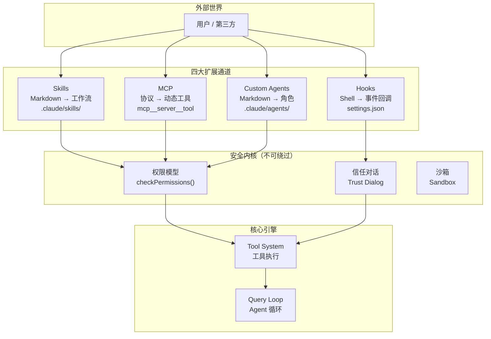
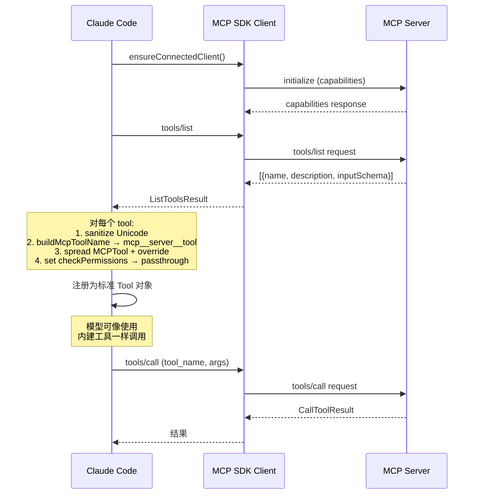
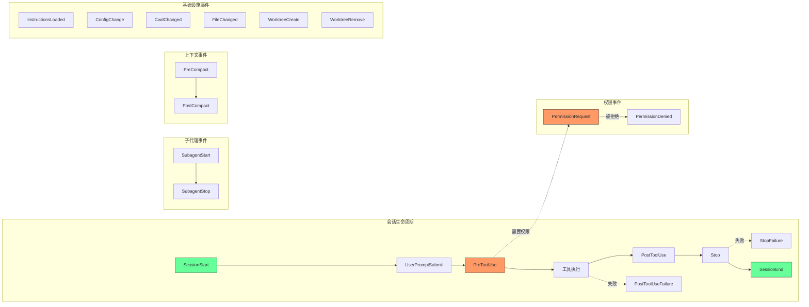

# 第 11 章：扩展机制——开放而不失控

> **核心思想**：一个好的系统不仅要自己能干活，还要让别人能在它之上构建。Claude Code 的扩展设计遵循一条铁律：**开放接口，封闭内核**——Skills、MCP、Hooks 和 Custom Agents 都是外部扩展点，但它们永远无法绕过权限模型。

---

## 11.1 四大扩展通道概览

### 费曼式引入

想象你经营一座商业大厦。你需要让各种商户入驻，但你不能把大楼的承重墙交给他们随便拆改。你的做法是：提供标准化的门面接口（水电气、网络端口、消防通道），商户在这些接口之上自由装修，但承重结构（安全系统、电梯控制、消防闸门）始终由物业管理。

Claude Code 的扩展系统就是这座大厦的"物业管理方案"。它提供了四个标准化的扩展通道，每个通道的开放程度不同，但都共享同一个安全内核：

| 扩展通道 | 本质 | 开放程度 | 典型用途 |
|---------|------|---------|---------|
| **Skills** | Markdown 驱动的可执行工作流 | 最高——任何人可写 .md 文件 | 自定义 `/commit`、`/review-pr` 等工作流 |
| **MCP** | 动态工具注入协议 | 高——标准协议对接外部服务 | 连接数据库、Slack、GitHub 等 |
| **Hooks** | 生命周期事件回调 | 中——Shell 命令拦截关键时刻 | 预提交检查、自动格式化、审计日志 |
| **Custom Agents** | 角色定制的子代理 | 中——受控的能力边界 | 专用搜索代理、计划代理、验证代理 |

这四个通道不是随意堆砌的。它们构成了一个完整的扩展光谱：从"给模型注入新知识"（Skills），到"给模型新工具"（MCP），到"拦截模型行为"（Hooks），到"创造新模型角色"（Agents）。



关键观察：所有四条通道最终都要经过安全内核。这不是"建议"——这是架构强制的。一个 Skill 不能声明 `allowedTools: ["*"]` 就跳过权限对话；一个 MCP 工具不能因为是外部服务就绕过 `checkPermissions()`；一个 Hook 的 Shell 命令不能在用户未接受信任对话前执行。

**类比其他插件生态系统**：如果把 Claude Code 比作 VS Code，那么 Skills 就是 Code Snippets（声明式、轻量），MCP 就是 Language Server Protocol（标准化的外部服务对接），Hooks 就是 Tasks（自动化的 Shell 脚本），Custom Agents 就是 Extension Host（独立进程的能力扩展）。

---

## 11.2 Skills：从 Markdown 到可执行工作流

### 11.2.1 Skill 是什么？

Skill 是 Claude Code 最轻量的扩展方式。它的本质是：**一段带前置元数据的 Markdown，被注入到模型的上下文中，指导模型按特定工作流执行任务**。

这听起来简单得令人怀疑——一个 `.md` 文件怎么能成为"可执行工作流"？答案在于：模型本身就是执行引擎。Skill 不需要编译、不需要运行时、不需要 API——它只需要告诉模型"在什么场景下，按什么步骤，使用什么工具，完成什么目标"。

### 11.2.2 Skill 的目录结构

Skill 有三个来源层级，按优先级排列：

```
~/.claude/skills/              ← 用户级（userSettings）
  my-skill/SKILL.md
.claude/skills/                ← 项目级（projectSettings）
  commit/SKILL.md
  review-pr/SKILL.md
<managed>/.claude/skills/      ← 策略级（policySettings）
  security-check/SKILL.md
```

每个 Skill 必须是**目录格式**：`skill-name/SKILL.md`。这不是任意决定——目录格式允许 Skill 附带辅助文件（模板、脚本、配置），而 `SKILL.md` 是入口文件。

### 11.2.3 加载机制

打开 `src/skills/loadSkillsDir.ts`，核心加载函数 `getSkillDirCommands` 揭示了完整的加载策略：

```typescript
// src/skills/loadSkillsDir.ts:638-714（简化）
export const getSkillDirCommands = memoize(
  async (cwd: string): Promise<Command[]> => {
    const [
      managedSkills,      // 策略级
      userSkills,         // 用户级
      projectSkillsNested, // 项目级（支持多层目录）
      additionalSkillsNested, // --add-dir 额外目录
      legacyCommands,     // 旧版 /commands/ 兼容
    ] = await Promise.all([
      loadSkillsFromSkillsDir(managedSkillsDir, 'policySettings'),
      loadSkillsFromSkillsDir(userSkillsDir, 'userSettings'),
      Promise.all(
        projectSkillsDirs.map(dir =>
          loadSkillsFromSkillsDir(dir, 'projectSettings'))),
      // ...
    ])
    // 去重逻辑（通过 realpath 解析符号链接）
    // 条件 Skill 分离（带 paths 前置条件的延迟激活）
  },
)
```

这里有两个值得注意的设计决策：

**决策一：memoize + 并行加载**。`getSkillDirCommands` 被 `memoize` 包装——同一个 `cwd` 只加载一次。而五个来源的加载是并行的（`Promise.all`），因为它们是独立的目录，没有共享状态。这在 Skill 数量较多时（几十到上百个）显著减少启动延迟。

**决策二：符号链接去重**。当用户通过符号链接从多个路径引用同一个 Skill 文件时，系统通过 `realpath` 解析到规范路径，避免同一个 Skill 被加载两次：

```typescript
// src/skills/loadSkillsDir.ts:118-124
async function getFileIdentity(filePath: string): Promise<string | null> {
  try {
    return await realpath(filePath)
  } catch {
    return null
  }
}
```

### 11.2.4 前置元数据（Frontmatter）解析

每个 `SKILL.md` 文件的头部是 YAML Frontmatter，定义了 Skill 的元数据。`parseSkillFrontmatterFields` 函数解析了超过 15 个字段：

```typescript
// src/skills/loadSkillsDir.ts:185-265（字段列表简化）
export function parseSkillFrontmatterFields(
  frontmatter: FrontmatterData,
  markdownContent: string,
  resolvedName: string,
): {
  displayName: string | undefined
  description: string
  allowedTools: string[]        // 该 Skill 可以使用哪些工具
  whenToUse: string | undefined  // 模型何时应该主动调用
  model: string | undefined      // 模型覆盖（如指定用 opus）
  hooks: HooksSettings | undefined // Skill 自带的 Hook
  executionContext: 'fork' | undefined // 是否在子代理中执行
  agent: string | undefined      // 指定使用哪个代理
  effort: EffortValue | undefined // 推理力度
  shell: FrontmatterShell | undefined // Shell 命令的执行环境
  // ...
} { /* ... */ }
```

这里最有趣的是 `allowedTools` 字段。一个 Skill 可以声明它需要使用哪些工具——比如一个 `commit` Skill 可能声明 `allowed-tools: [Bash, Read, Edit]`。但这不意味着这些工具可以无条件执行。`allowedTools` 被传递到 `contextModifier` 中，作为额外的 `alwaysAllowRules`：

```typescript
// src/tools/SkillTool/SkillTool.ts:776-805（contextModifier 中的 allowedTools 注入）
contextModifier(ctx) {
  if (allowedTools.length > 0) {
    const previousGetAppState = modifiedContext.getAppState
    modifiedContext = {
      ...modifiedContext,
      getAppState() {
        const appState = previousGetAppState()
        return {
          ...appState,
          toolPermissionContext: {
            ...appState.toolPermissionContext,
            alwaysAllowRules: {
              ...appState.toolPermissionContext.alwaysAllowRules,
              command: [
                ...new Set([
                  ...(appState.toolPermissionContext.alwaysAllowRules.command || []),
                  ...allowedTools,
                ]),
              ],
            },
          },
        }
      },
    }
  }
  // ...
}
```

注意：`alwaysAllowRules` 是"允许自动批准"，不是"绕过权限检查"。底层的 `checkPermissions` 仍然会被调用——只是如果工具在 `alwaysAllowRules` 中，权限决策会是 `allow` 而不是 `ask`。

### 11.2.5 内联执行 vs 分叉执行

Skill 有两种执行模式：

**内联执行（inline）**：Skill 的 Markdown 内容被注入到当前对话上下文中，模型在当前 Agent 循环中处理。这是默认模式。

**分叉执行（fork）**：Skill 在一个独立的子代理中执行，有自己的 token 预算和工具上下文。通过 Frontmatter 中 `context: fork` 声明。

```typescript
// src/tools/SkillTool/SkillTool.ts:622-628
// Check if skill should run as a forked sub-agent
if (command?.type === 'prompt' && command.context === 'fork') {
  return executeForkedSkill(
    command, commandName, args, context,
    canUseTool, parentMessage, onProgress,
  )
}
```

分叉执行的好处：隔离 token 消耗。一个复杂的 Skill（比如 `review-pr`）可能需要读取大量文件，如果在主对话中内联执行，会快速耗尽上下文窗口。分叉到子代理后，它有自己的 token 预算，完成后只返回一个结果摘要。

### 11.2.6 条件 Skill 和动态发现

系统支持"条件 Skill"——只在特定文件被操作时才激活：

```typescript
// src/skills/loadSkillsDir.ts:997-1058（简化）
export function activateConditionalSkillsForPaths(
  filePaths: string[],
  cwd: string,
): string[] {
  for (const [name, skill] of conditionalSkills) {
    const skillIgnore = ignore().add(skill.paths)
    for (const filePath of filePaths) {
      const relativePath = relative(cwd, filePath)
      if (skillIgnore.ignores(relativePath)) {
        dynamicSkills.set(name, skill)
        conditionalSkills.delete(name)
        activatedConditionalSkillNames.add(name)
        // ...
      }
    }
  }
}
```

这使用了与 `.gitignore` 相同的模式匹配库（`ignore`）。一个 Skill 可以在 Frontmatter 中声明 `paths: ["src/api/**"]`，那么只有当用户编辑了 `src/api/` 下的文件时，这个 Skill 才会出现在可用列表中。这避免了系统 prompt 中塞满永远不会用到的 Skill 描述。

### 11.2.7 内建 Skill

除了用户自定义 Skill，系统还内建了一批 Skill，通过编程方式注册：

```typescript
// src/skills/bundled/index.ts:24-79（简化）
export function initBundledSkills(): void {
  registerUpdateConfigSkill()
  registerKeybindingsSkill()
  registerVerifySkill()
  registerDebugSkill()
  registerLoremIpsumSkill()
  registerSkillifySkill()
  registerRememberSkill()
  registerSimplifySkill()
  registerBatchSkill()
  registerStuckSkill()
  // 条件注册（Feature Flag 控制）
  if (feature('KAIROS')) { registerDreamSkill() }
  if (feature('AGENT_TRIGGERS')) { registerLoopSkill() }
  // ...
}
```

内建 Skill 的注册调用 `registerBundledSkill()`，它将 `BundledSkillDefinition` 转换为标准的 `Command` 对象，统一了内建与用户自定义 Skill 的接口。

### 11.2.8 MCP Skill 融合

一个非常巧妙的设计：MCP 服务器也可以提供 Skill。这通过 `mcpSkillBuilders.ts` 实现——它是一个无依赖的"寄存器模块"，解决了 `mcpSkills.ts → loadSkillsDir.ts → ... → client.ts` 的循环依赖问题：

```typescript
// src/skills/mcpSkillBuilders.ts:31-44
let builders: MCPSkillBuilders | null = null

export function registerMCPSkillBuilders(b: MCPSkillBuilders): void {
  builders = b
}

export function getMCPSkillBuilders(): MCPSkillBuilders {
  if (!builders) {
    throw new Error(
      'MCP skill builders not registered — loadSkillsDir.ts has not been evaluated yet',
    )
  }
  return builders
}
```

注册发生在 `loadSkillsDir.ts` 模块初始化时——由于 `loadSkillsDir.ts` 通过 `commands.ts` 在启动时被静态导入，注册早于任何 MCP 服务器连接。这是一个经典的**延迟绑定**模式，用写入一次的全局寄存器打破了循环依赖。

但有一个重要的安全限制：MCP Skill 的 Markdown 内容**不会执行内联 Shell 命令**：

```typescript
// src/skills/loadSkillsDir.ts:373-396
// Security: MCP skills are remote and untrusted — never execute inline
// shell commands (!`…` / ```! … ```) from their markdown body.
if (loadedFrom !== 'mcp') {
  finalContent = await executeShellCommandsInPrompt(
    finalContent, /* ... */
  )
}
```

这是安全边界的一个具体体现：本地 Skill 可以包含 Shell 命令（因为用户已经信任了本地文件系统），但远程 MCP Skill 不行（因为内容来自不受信任的外部服务器）。

---

## 11.3 MCP：动态工具的诞生

### 11.3.1 MCP 协议简述

Model Context Protocol（MCP）是一个开放标准，用于将外部服务的能力暴露给 AI 模型。Claude Code 是 MCP 的原生消费者——它不只是"支持 MCP"，而是将 MCP 作为核心的工具扩展机制。

MCP 的核心理念：外部服务声明自己有哪些"工具"（tools）、"资源"（resources）和"提示"（prompts），客户端按需调用。对 Claude Code 而言，这意味着：**任何遵循 MCP 协议的服务器，都可以在运行时为模型注入新工具**。

### 11.3.2 MCP 工具的动态创建

打开 `src/services/mcp/client.ts`，`fetchToolsForClient` 函数展示了 MCP 工具如何从协议响应变成 Claude Code 的原生工具对象：

```typescript
// src/services/mcp/client.ts:1743-1813（简化）
export const fetchToolsForClient = memoizeWithLRU(
  async (client: MCPServerConnection): Promise<Tool[]> => {
    if (client.type !== 'connected') return []
    const result = await client.client.request(
      { method: 'tools/list' },
      ListToolsResultSchema,
    )
    const toolsToProcess = recursivelySanitizeUnicode(result.tools)

    return toolsToProcess.map((tool): Tool => {
      const fullyQualifiedName = buildMcpToolName(client.name, tool.name)
      return {
        ...MCPTool,                    // 继承 MCPTool 的所有基础行为
        name: fullyQualifiedName,      // mcp__serverName__toolName
        mcpInfo: { serverName: client.name, toolName: tool.name },
        isMcp: true,
        async description() { return tool.description ?? '' },
        async prompt() {
          const desc = tool.description ?? ''
          return desc.length > MAX_MCP_DESCRIPTION_LENGTH
            ? desc.slice(0, MAX_MCP_DESCRIPTION_LENGTH) + '… [truncated]'
            : desc
        },
        isConcurrencySafe() {
          return tool.annotations?.readOnlyHint ?? false
        },
        isReadOnly() {
          return tool.annotations?.readOnlyHint ?? false
        },
        isDestructive() {
          return tool.annotations?.destructiveHint ?? false
        },
        inputJSONSchema: tool.inputSchema as Tool['inputJSONSchema'],
        async checkPermissions() {
          return {
            behavior: 'passthrough' as const,  // ← 关键！
            message: 'MCPTool requires permission.',
          }
        },
        async call(args, context, _canUseTool, parentMessage, onProgress?) {
          // 调用远程 MCP 服务器
          const connectedClient = await ensureConnectedClient(client)
          const mcpResult = await callMCPToolWithUrlElicitationRetry({
            client: connectedClient,
            tool: tool.name,
            args,
            // ...
          })
          // ...
        },
      }
    })
  },
)
```

这段代码有几个关键设计点：

**设计点一：原型继承模式**。`{ ...MCPTool }` 将基础的 `MCPTool` 对象展开，然后用 MCP 服务器返回的具体信息覆盖关键字段。这是 JavaScript 的原型扩展模式——`MCPTool.ts` 中定义的是一个"空壳"：

```typescript
// src/tools/MCPTool/MCPTool.ts:27-77（简化）
export const MCPTool = buildTool({
  isMcp: true,
  name: 'mcp',            // 被覆盖
  async description() { return DESCRIPTION },  // 被覆盖
  async call() { return { data: '' } },        // 被覆盖
  async checkPermissions(): Promise<PermissionResult> {
    return { behavior: 'passthrough', message: 'MCPTool requires permission.' }
  },
  // ...
})
```

**设计点二：`passthrough` 权限行为**。MCP 工具的 `checkPermissions` 返回 `passthrough`——这意味着"我自己不做权限判断，交给上层统一的权限系统处理"。这确保了 MCP 工具不能自行决定是否需要权限。

**设计点三：描述长度截断**。`MAX_MCP_DESCRIPTION_LENGTH = 2048`——外部 MCP 服务器（尤其是 OpenAPI 自动生成的）可能在工具描述中塞入 15-60KB 的内容。不截断的话，这些描述会占据大量的系统 prompt 空间。



### 11.3.3 命名规范与安全隔离

MCP 工具的名称格式是 `mcp__<serverName>__<toolName>`。这个双下划线前缀不只是命名约定——它是安全边界的一部分。用户可以在权限配置中使用这个前缀来细粒度控制哪些 MCP 工具被允许：

```json
{
  "permissions": {
    "allow": ["mcp__github__*"],
    "deny": ["mcp__untrusted__*"]
  }
}
```

### 11.3.4 连接生命周期

MCP 客户端管理连接的生命周期涉及多种传输方式：

- **stdio**：通过子进程的 stdin/stdout 通信（本地 MCP 服务器）
- **SSE**：Server-Sent Events（远程 HTTP 服务器）
- **Streamable HTTP**：MCP 标准的 HTTP 传输
- **WebSocket**：全双工通信
- **SDK Control**：内部 SDK 控制通道

每种传输方式都有连接超时（默认 30 秒）和请求超时（默认 60 秒）的保护。当 MCP 会话过期时（HTTP 404 + JSON-RPC error code -32001），系统会自动检测并清除缓存：

```typescript
// src/services/mcp/client.ts:193-206
export function isMcpSessionExpiredError(error: Error): boolean {
  const httpStatus =
    'code' in error ? (error as Error & { code?: number }).code : undefined
  if (httpStatus !== 404) {
    return false
  }
  return (
    error.message.includes('"code":-32001') ||
    error.message.includes('"code": -32001')
  )
}
```

### 11.3.5 认证流程

MCP 支持 OAuth 认证。当服务器返回 401 时，Claude Code 会：
1. 检查本地 OAuth token 缓存（15 分钟有效期）
2. 尝试刷新 token
3. 如果 token 确实变化了，自动重试请求
4. 如果仍然失败，标记服务器为 `needs-auth` 状态

这个重试逻辑通过 `createClaudeAiProxyFetch` 实现——它包装了标准 fetch，在 401 时自动进行一次 token 刷新重试，避免了"一个过期 token 导致所有 MCP 连接批量失败"的雪崩效应。

---

## 11.4 Hooks：生命周期事件回调

### 11.4.1 Hook 事件矩阵

Hooks 是 Claude Code 最强大的拦截机制。它们在系统生命周期的关键节点执行用户定义的 Shell 命令（或 HTTP 调用），可以观察、修改甚至阻止系统行为。

系统定义了 **27 个** Hook 事件（截至当前版本）：

```typescript
// src/entrypoints/sdk/coreTypes.ts:25-53
export const HOOK_EVENTS = [
  'PreToolUse',        // 工具执行前（可阻止/修改输入）
  'PostToolUse',       // 工具执行后（可添加上下文）
  'PostToolUseFailure', // 工具执行失败后
  'Notification',      // 通知事件
  'UserPromptSubmit',  // 用户提交 prompt 时
  'SessionStart',      // 会话开始
  'SessionEnd',        // 会话结束
  'Stop',              // 模型停止响应时
  'StopFailure',       // 停止失败时
  'SubagentStart',     // 子代理启动
  'SubagentStop',      // 子代理停止
  'PreCompact',        // 上下文压缩前
  'PostCompact',       // 上下文压缩后
  'PermissionRequest', // 权限请求时
  'PermissionDenied',  // 权限被拒绝时
  'Setup',             // 初始化设置
  'TeammateIdle',      // 队友空闲
  'TaskCreated',       // 任务创建
  'TaskCompleted',     // 任务完成
  'Elicitation',       // 信息采集
  'ElicitationResult', // 采集结果
  'ConfigChange',      // 配置变更
  'WorktreeCreate',    // 工作树创建
  'WorktreeRemove',    // 工作树移除
  'InstructionsLoaded', // 指令加载完成
  'CwdChanged',        // 工作目录变更
  'FileChanged',       // 文件变更
] as const
```



### 11.4.2 Hook 的信任模型

Hooks 的安全设计有一个铁律：**所有 Hook 都需要工作区信任**。

```typescript
// src/utils/hooks.ts:286-296
export function shouldSkipHookDueToTrust(): boolean {
  // SDK（非交互模式）中信任是隐式的
  const isInteractive = !getIsNonInteractiveSession()
  if (!isInteractive) {
    return false
  }
  // 交互模式下，所有 Hook 都需要信任对话
  const hasTrust = checkHasTrustDialogAccepted()
  return !hasTrust
}
```

为什么这么严格？注释中记录了历史上的安全漏洞：

> Historical vulnerabilities that prompted this check:
> - SessionEnd hooks executing when user declines trust dialog
> - SubagentStop hooks executing when subagent completes before trust

`SessionEnd` Hook 曾经在用户拒绝信任对话时仍然执行——因为用户退出时触发了 `SessionEnd` 事件。这意味着一个恶意项目的 `.claude/settings.json` 可以在 `SessionEnd` Hook 中放入任意命令，即使用户从未接受信任对话，也会在退出时执行。修复后，所有 Hook 执行前都会检查信任状态。

### 11.4.3 Hook 输出解析

Hook 的 stdout 有两种格式：

**纯文本**：直接作为消息返回给模型。

**结构化 JSON**：可以控制更复杂的行为——继续/停止、阻止执行、修改工具输入、添加上下文、控制权限决策：

```typescript
// src/utils/hooks.ts:399-451（简化）
function parseHookOutput(stdout: string): {
  json?: HookJSONOutput
  plainText?: string
  validationError?: string
} {
  const trimmed = stdout.trim()
  if (!trimmed.startsWith('{')) {
    return { plainText: stdout }  // 非 JSON → 纯文本
  }
  try {
    const result = validateHookJson(trimmed)
    if ('json' in result) { return result }
    // JSON 验证失败 → 回退为纯文本
    return { plainText: stdout, validationError: result.validationError }
  } catch (e) {
    return { plainText: stdout }
  }
}
```

结构化输出的 schema 支持：
- `continue: boolean` — 是否继续执行
- `stopReason: string` — 停止原因
- `permissionDecision: "allow" | "deny" | "ask"` — 权限决策覆盖
- `updatedInput: object` — 修改后的工具输入（`PreToolUse` 专用）
- `additionalContext: string` — 注入额外上下文

### 11.4.4 Hook 的超时控制

不同类型的 Hook 有不同的超时：

```typescript
// src/utils/hooks.ts:166-182
const TOOL_HOOK_EXECUTION_TIMEOUT_MS = 10 * 60 * 1000  // 10 分钟

const SESSION_END_HOOK_TIMEOUT_MS_DEFAULT = 1500  // 1.5 秒！
export function getSessionEndHookTimeoutMs(): number {
  const raw = process.env.CLAUDE_CODE_SESSIONEND_HOOKS_TIMEOUT_MS
  const parsed = raw ? parseInt(raw, 10) : NaN
  return Number.isFinite(parsed) && parsed > 0
    ? parsed
    : SESSION_END_HOOK_TIMEOUT_MS_DEFAULT
}
```

工具相关的 Hook 有 10 分钟的宽裕超时（用户可能在等待复杂操作），但 `SessionEnd` Hook 只有 1.5 秒——因为它在用户退出时运行，不应该阻塞退出流程。如果需要更长时间，可以通过环境变量 `CLAUDE_CODE_SESSIONEND_HOOKS_TIMEOUT_MS` 覆盖。

### 11.4.5 异步 Hook

Hook 不一定是同步阻塞的。系统支持异步 Hook——它们在后台运行，完成后通过通知队列唤醒模型：

```typescript
// src/utils/hooks.ts:184-265（简化）
function executeInBackground({
  processId, hookId, shellCommand,
  asyncResponse, hookEvent, hookName, command, asyncRewake,
}): boolean {
  if (asyncRewake) {
    // 后台运行，完成后通过 notification 唤醒
    void shellCommand.result.then(async result => {
      // ...
      if (result.code === 2) {
        enqueuePendingNotification({
          value: wrapInSystemReminder(
            `Stop hook blocking error from command "${hookName}": ${stderr || stdout}`
          ),
          mode: 'task-notification',
        })
      }
    })
    return true
  }
  // 标准异步：注册到 AsyncHookRegistry
  shellCommand.background(processId)
  registerPendingAsyncHook({ processId, hookId, /* ... */ })
  return true
}
```

### 11.4.6 Skill 内嵌 Hook

一个 Skill 可以在 Frontmatter 中声明自己的 Hook——当 Skill 被调用时，这些 Hook 被注册到会话中：

```typescript
// src/skills/loadSkillsDir.ts:136-153
function parseHooksFromFrontmatter(
  frontmatter: FrontmatterData,
  skillName: string,
): HooksSettings | undefined {
  if (!frontmatter.hooks) { return undefined }
  const result = HooksSchema().safeParse(frontmatter.hooks)
  if (!result.success) {
    logForDebugging(`Invalid hooks in skill '${skillName}': ${result.error.message}`)
    return undefined
  }
  return result.data
}
```

这意味着 Skill 和 Hook 不是孤立的——一个 `commit` Skill 可以自带一个 `PreToolUse` Hook，在每次 Bash 命令执行前检查是否违反了某些规则。

---

## 11.5 Custom Agents：角色定制

### 11.5.1 什么是 Custom Agent？

Custom Agent 是 Claude Code 最重量级的扩展方式。它定义了一个**有独立身份的子代理**——有自己的系统 prompt、工具集、模型选择、权限模式和 MCP 服务器。

如果说 Skill 是"给模型一个剧本"，那么 Custom Agent 就是"给模型一个角色"。

### 11.5.2 Agent 的三种来源

```typescript
// src/tools/AgentTool/loadAgentsDir.ts:162-165
export type AgentDefinition =
  | BuiltInAgentDefinition     // 内建代理
  | CustomAgentDefinition      // 用户/项目/策略定义
  | PluginAgentDefinition      // 插件定义
```

**内建代理**通过代码注册：

```typescript
// src/tools/AgentTool/builtInAgents.ts:45-72（简化）
export function getBuiltInAgents(): AgentDefinition[] {
  const agents: AgentDefinition[] = [
    GENERAL_PURPOSE_AGENT,   // 通用搜索/分析代理
    STATUSLINE_SETUP_AGENT,  // 状态栏配置代理
  ]
  if (areExplorePlanAgentsEnabled()) {
    agents.push(EXPLORE_AGENT, PLAN_AGENT)  // 探索和计划代理
  }
  if (isNonSdkEntrypoint) {
    agents.push(CLAUDE_CODE_GUIDE_AGENT)    // 用户指导代理
  }
  if (feature('VERIFICATION_AGENT') && /* ... */) {
    agents.push(VERIFICATION_AGENT)         // 验证代理
  }
  return agents
}
```

**自定义代理**通过 Markdown 文件定义（`.claude/agents/my-agent.md`），Frontmatter 中声明元数据，正文就是系统 prompt。

### 11.5.3 Agent 定义的完整字段

Agent 的 Frontmatter 非常丰富，看 Zod schema：

```typescript
// src/tools/AgentTool/loadAgentsDir.ts:73-99（简化）
const AgentJsonSchema = lazySchema(() =>
  z.object({
    description: z.string().min(1),
    tools: z.array(z.string()).optional(),         // 可用工具白名单
    disallowedTools: z.array(z.string()).optional(), // 工具黑名单
    prompt: z.string().min(1),                      // 系统提示
    model: z.string().optional(),                   // 模型覆盖
    effort: z.union([z.enum(EFFORT_LEVELS), z.number()]).optional(),
    permissionMode: z.enum(PERMISSION_MODES).optional(), // 权限模式
    mcpServers: z.array(AgentMcpServerSpecSchema()).optional(), // 专用 MCP 服务器
    hooks: HooksSchema().optional(),               // 代理专属 Hook
    maxTurns: z.number().int().positive().optional(), // 最大轮次
    skills: z.array(z.string()).optional(),          // 预加载 Skill
    initialPrompt: z.string().optional(),            // 初始 prompt
    memory: z.enum(['user', 'project', 'local']).optional(), // 持久记忆
    background: z.boolean().optional(),              // 后台运行
    isolation: z.enum(['worktree']).optional(),       // 工作树隔离
  }),
)
```

值得注意的字段组合：

- **`tools` + `disallowedTools`**：白名单和黑名单可以同时使用，实现精细的工具控制。
- **`mcpServers`**：代理可以声明专属的 MCP 服务器——一个"Slack 代理"可以只连接 Slack MCP 服务器。
- **`isolation: 'worktree'`**：代理在独立的 git worktree 中运行，完全隔离文件系统修改。
- **`memory`**：代理可以有持久记忆——跨会话保留学习到的知识。

### 11.5.4 Agent 优先级与覆盖

当多个来源定义了同名 Agent 时，优先级如下：

```typescript
// src/tools/AgentTool/loadAgentsDir.ts:193-221
export function getActiveAgentsFromList(
  allAgents: AgentDefinition[],
): AgentDefinition[] {
  const agentGroups = [
    builtInAgents,     // 最低优先级
    pluginAgents,
    userAgents,
    projectAgents,
    flagAgents,
    managedAgents,     // 最高优先级
  ]
  const agentMap = new Map<string, AgentDefinition>()
  for (const agents of agentGroups) {
    for (const agent of agents) {
      agentMap.set(agent.agentType, agent)  // 后来者覆盖
    }
  }
  return Array.from(agentMap.values())
}
```

管理策略（`policySettings`）定义的 Agent 可以覆盖所有其他来源。这允许企业管理员强制某些 Agent 的行为，即使项目或用户级别有不同定义。

### 11.5.5 MCP 服务器依赖

Agent 可以声明依赖特定的 MCP 服务器：

```typescript
// src/tools/AgentTool/loadAgentsDir.ts:229-255
export function hasRequiredMcpServers(
  agent: AgentDefinition,
  availableServers: string[],
): boolean {
  if (!agent.requiredMcpServers || agent.requiredMcpServers.length === 0) {
    return true
  }
  return agent.requiredMcpServers.every(pattern =>
    availableServers.some(server =>
      server.toLowerCase().includes(pattern.toLowerCase()),
    ),
  )
}
```

如果一个 Agent 声明 `requiredMcpServers: ["slack"]`，但当前没有名称包含 "slack" 的 MCP 服务器连接，这个 Agent 不会出现在可用列表中。这避免了模型尝试调用一个缺少必要能力的 Agent。

---

## 11.6 延迟加载：当工具数量爆炸时

当 Skills、MCP 工具、Agents 的数量达到几十甚至上百时，一个实际问题出现了：**所有工具的描述都要放进系统 prompt 吗？**

Claude Code 的答案是分层延迟加载：

1. **条件 Skill**：带 `paths` 声明的 Skill 在对应文件被操作前不加载（11.2.6 节）。
2. **动态 Skill 发现**：当用户操作某个子目录的文件时，系统向上遍历目录树，发现子目录中的 `.claude/skills/` 并按需加载。
3. **MCP 工具的 LRU 缓存**：`fetchToolsForClient` 使用 `memoizeWithLRU`——工具列表被缓存，只在连接状态变化时重新获取。
4. **`searchHint` 与 `alwaysLoad`**：MCP 工具可以通过 `_meta` 字段声明 `anthropic/searchHint`（用于工具搜索排名）和 `anthropic/alwaysLoad`（始终加载到 prompt 中）。大多数工具不设置 `alwaysLoad`，只在模型主动搜索时才被发现。
5. **Skill 的 frontmatter-only token 估算**：加载阶段只估算 Frontmatter（name、description、whenToUse）的 token 数，完整 Markdown 内容只在调用时加载。

```typescript
// src/skills/loadSkillsDir.ts:100-105
export function estimateSkillFrontmatterTokens(skill: Command): number {
  const frontmatterText = [skill.name, skill.description, skill.whenToUse]
    .filter(Boolean)
    .join(' ')
  return roughTokenCountEstimation(frontmatterText)
}
```

这是一个务实的优化：一个 Skill 的 SKILL.md 可能有 5000 tokens，但 Frontmatter 只有 50 tokens。在 prompt 中只放 Frontmatter 可以让模型知道这个 Skill 的存在和用途，真正需要时再加载完整内容。

---

## 11.7 扩展的安全边界

### 11.7.1 统一的权限检查

所有扩展通道最终都要经过权限系统。SkillTool 的 `checkPermissions` 方法展示了这个流程：

```typescript
// src/tools/SkillTool/SkillTool.ts:432-578（简化）
async checkPermissions({ skill, args }, context): Promise<PermissionDecision> {
  const commandName = skill.trim().startsWith('/')
    ? skill.trim().substring(1) : skill.trim()

  // 1. 检查 deny 规则
  const denyRules = getRuleByContentsForTool(permissionContext, SkillTool, 'deny')
  for (const [ruleContent, rule] of denyRules.entries()) {
    if (ruleMatches(ruleContent)) {
      return { behavior: 'deny', message: 'Skill execution blocked' }
    }
  }

  // 2. 检查 allow 规则
  const allowRules = getRuleByContentsForTool(permissionContext, SkillTool, 'allow')
  for (const [ruleContent, rule] of allowRules.entries()) {
    if (ruleMatches(ruleContent)) {
      return { behavior: 'allow', updatedInput: { skill, args } }
    }
  }

  // 3. 自动允许安全 Skill（没有危险属性的 Skill）
  if (commandObj?.type === 'prompt' && skillHasOnlySafeProperties(commandObj)) {
    return { behavior: 'allow', updatedInput: { skill, args } }
  }

  // 4. 默认：询问用户
  return { behavior: 'ask', message: `Execute skill: ${commandName}` }
}
```

这里有一个巧妙的"安全属性白名单"机制：

```typescript
// src/tools/SkillTool/SkillTool.ts:875-908
const SAFE_SKILL_PROPERTIES = new Set([
  'type', 'progressMessage', 'contentLength', 'model', 'effort',
  'source', 'name', 'description', 'whenToUse', 'paths', 'version',
  // ... 所有"安全"属性
])

function skillHasOnlySafeProperties(command: Command): boolean {
  for (const key of Object.keys(command)) {
    if (SAFE_SKILL_PROPERTIES.has(key)) continue
    const value = (command as Record<string, unknown>)[key]
    if (value === undefined || value === null) continue
    if (Array.isArray(value) && value.length === 0) continue
    return false  // 有不安全属性且有值 → 需要权限
  }
  return true
}
```

关键思想：**白名单策略，新属性默认不安全**。如果未来添加了新的 Command 属性，它默认不在 `SAFE_SKILL_PROPERTIES` 中，因此需要权限检查。这是一个"fail-closed"的安全设计——遗忘比遗留更安全。

### 11.7.2 MCP 工具的安全沙箱

MCP 工具虽然来自外部服务器，但它们的输出经过严格处理：

- **Unicode 消毒**：`recursivelySanitizeUnicode(result.tools)` 清理可能的恶意 Unicode 字符
- **输出大小限制**：`maxResultSizeChars: 100_000`
- **二进制内容持久化**：大型二进制输出被保存到磁盘，只在上下文中放一个引用
- **描述截断**：防止 MCP 服务器通过超长描述占据模型注意力

### 11.7.3 Hook 的 gitignore 防护

动态发现的 Skill 目录会检查是否在 `.gitignore` 中：

```typescript
// src/skills/loadSkillsDir.ts:889-896
if (await isPathGitignored(currentDir, resolvedCwd)) {
  logForDebugging(`[skills] Skipped gitignored skills dir: ${skillDir}`)
  continue
}
```

这防止了 `node_modules/malicious-package/.claude/skills/` 中的恶意 Skill 被自动加载。

---

## 11.8 设计权衡

### 权衡一：Markdown 即代码 vs 类型安全

Skill 使用 Markdown 而不是 TypeScript/JavaScript——这意味着任何人都可以写 Skill，但也意味着没有编译期类型检查。Frontmatter 的 Zod 验证是运行时的，错误只能在加载时发现。

**为什么这样选择**：Skill 的核心价值是**降低创作门槛**。如果需要 TypeScript 才能写 Skill，那大多数用户就不会写了。Markdown 的"最差后果"是加载失败并跳过——不会崩溃。

### 权衡二：MCP 的运行时开销

每次 MCP 工具调用都需要跨进程（stdio）或跨网络（HTTP/SSE）通信。对于高频工具（如文件读取），这比内建工具慢一个数量级。

**缓解措施**：`memoizeWithLRU` 缓存工具列表，`ensureConnectedClient` 保持连接复用，重试逻辑避免短暂断连导致的失败。但根本限制仍在——如果你的关键工具需要毫秒级延迟，它应该是内建工具而不是 MCP 工具。

### 权衡三：Hook 的信任粒度

所有 Hook 共享同一个信任状态（workspace trust）。没有"这个 Hook 我信任，那个不信任"的选项。

**为什么不做细粒度**：Hook 在 `settings.json` 中配置，而 `settings.json` 来自项目目录。一旦用户接受了项目的信任对话，就意味着信任了整个 `settings.json`——包括里面所有的 Hook。如果要对每个 Hook 单独信任，UX 复杂度会急剧上升（想象每次提交代码前弹出 5 个 Hook 信任对话）。

### 权衡四：Agent 的覆盖优先级

管理策略可以覆盖用户和项目级别的 Agent 定义。这对企业管理有利（强制执行安全策略），但对个人开发者可能造成困惑——"为什么我的 Agent 不生效了？"

**缓解措施**：`logForDebugging` 在覆盖发生时记录日志，开发者可以通过 debug 模式看到哪个来源的 Agent 被使用。

---

## 11.9 迁移指南

### 从 /commands/ 到 /skills/

系统仍然支持旧版的 `/commands/` 目录格式（`loadSkillsFromCommandsDir`），但新的 Skill 应该使用 `/skills/` 目录格式。主要区别：

| 维度 | 旧版 /commands/ | 新版 /skills/ |
|------|----------------|--------------|
| 文件格式 | 单个 `.md` 文件或 `SKILL.md` | 仅 `skill-name/SKILL.md` 目录格式 |
| 附带文件 | 不支持 | 支持（同目录下放辅助文件） |
| 命名空间 | 目录路径 → 冒号分隔 | 目录名即 Skill 名 |
| `loadedFrom` | `'commands_DEPRECATED'` | `'skills'` |

```typescript
// src/skills/loadSkillsDir.ts:67-73
export type LoadedFrom =
  | 'commands_DEPRECATED'  // ← 旧版
  | 'skills'               // ← 新版
  | 'plugin'
  | 'managed'
  | 'bundled'
  | 'mcp'
```

### 从静态工具到 MCP 工具

如果你有一个自定义工具想集成到 Claude Code，优先考虑 MCP 方式。MCP 工具不需要修改 Claude Code 源码，可以用任何语言实现，通过标准协议通信。只有当你需要毫秒级延迟或深度集成内部状态时，才考虑写内建工具。

### 从硬编码逻辑到 Hook

如果你在代码中硬编码了"每次 Bash 执行前先做 X"的逻辑，考虑用 `PreToolUse` Hook 替代。Hook 的优势是声明式配置——不需要修改代码，在 `settings.json` 中一行搞定。

---

## 11.10 费曼检验

把这章的内容解释给一个没有接触过 Claude Code 的开发者：

**第一步——说人话**：

Claude Code 有四种让外部代码参与的方式。Skill 是你写的"说明书"，告诉 AI 怎么做某件事（比如怎么提交代码）。MCP 是让 AI 连接外部服务（比如调 Slack API）的标准接口。Hook 是在 AI 做事之前或之后自动跑你的脚本（比如每次写文件前自动格式化）。Agent 是给 AI 一个专门的角色（比如专门做代码审查的"审查员"角色）。

**第二步——看代码怎么保证安全**：

不管哪种方式，最终都要过权限检查。Skill 的 `allowedTools` 不是绕过权限，只是"自动同意"。MCP 工具的 `checkPermissions` 返回 `passthrough`——"我不做决定，你帮我决定"。Hook 要等用户接受信任对话才能跑。Agent 的工具白名单也要过同样的权限系统。

**第三步——找反例验证**：

一个恶意 MCP 服务器能不能在工具描述中注入 60KB 的文本来占据模型注意力？不能——`MAX_MCP_DESCRIPTION_LENGTH = 2048` 强制截断。

一个 `node_modules` 中的恶意 Skill 能不能被自动加载？不能——`isPathGitignored` 检查会跳过 gitignore 中的目录。

一个远程 MCP Skill 的 Markdown 能不能执行本地 Shell 命令？不能——`if (loadedFrom !== 'mcp')` 守住了 Shell 执行的入口。

如果未来 Command 类型新增了一个危险属性，Skill 会不会自动获得权限？不会——`SAFE_SKILL_PROPERTIES` 是白名单，新属性默认不安全。

---

## 本章小结

| 维度 | 核心要点 |
|------|---------|
| 四通道架构 | Skills（知识注入）、MCP（工具注入）、Hooks（行为拦截）、Agents（角色定制） |
| Skill 本质 | Markdown + Frontmatter → 注入到模型上下文的工作流指令 |
| MCP 本质 | 标准协议 → 动态创建的 `Tool` 对象，`{...MCPTool}` 原型扩展 |
| Hook 本质 | Shell 命令 + 27 个生命周期事件 + 结构化 JSON 输出 |
| Agent 本质 | 独立身份的子代理，有自己的 prompt/工具/MCP/权限/记忆 |
| 安全铁律 | 所有扩展都经过权限模型；白名单策略（新属性默认不安全）；信任对话先于 Hook 执行 |
| 延迟加载 | 条件 Skill、动态发现、LRU 缓存、frontmatter-only token 估算 |
| 关键权衡 | Markdown 降低门槛但无类型检查；MCP 灵活但有延迟；信任粒度粗但 UX 简单 |

**一句话总结**：Claude Code 的扩展系统就像一栋带消防系统的商业大厦——每个商户（Skill/MCP/Hook/Agent）可以自由装修自己的空间，但消防闸门（权限模型）由物业统一控制，任何人都不能拆。
