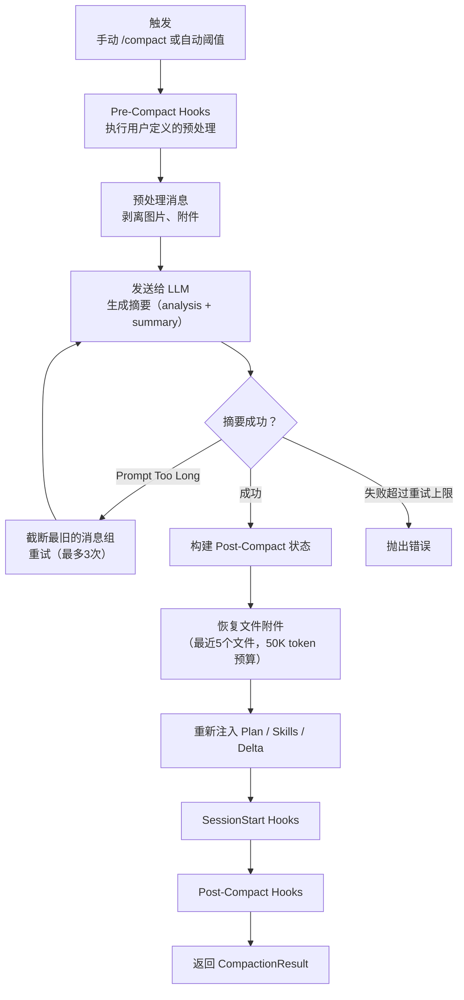
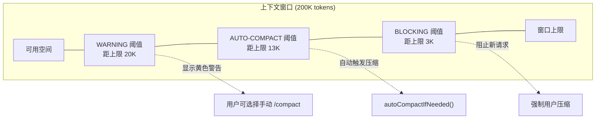
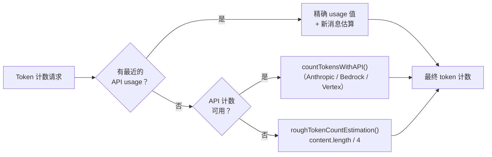

# 第 12 章：上下文管理——在有限窗口中维持无限对话

> **核心思想**：LLM 的上下文窗口是有限的，但用户的对话可以是无限的。Claude Code 的上下文管理解决了一个根本矛盾：**如何在信息丢失不可避免的前提下，丢失最不重要的信息。** 这是一个 AI 原生的工程挑战。

---

## 12.1 上下文窗口的经济学

**费曼式引入**

想象你是一个即将参加闭卷考试的学生。考试允许你带一张 A4 纸的"考试小抄"（cheat sheet）。整个学期的笔记有 500 页，但你只能把最关键的内容压缩到这一张纸上。

你会怎么做？

你不会随机选 1 页笔记。你会做三件事：(1) 评估哪些知识点最可能被考到；(2) 用缩写和符号来压缩信息密度；(3) 在考试过程中，如果发现某个知识点用不到了，就划掉它，腾出空间写新的备注。

Claude Code 的上下文管理做的就是同样的事。

LLM 的上下文窗口就是那张 A4 纸——默认 200K tokens（约 15 万英文单词），1M context 模式下可达 100 万 tokens。但一次长对话——比如重构一个大项目——产生的信息量可以轻松超过这个上限。每条消息、每个工具调用的输出、每次文件读取的结果，都在消耗这张纸上的空间。

**上下文窗口的"经济学"有三个基本变量**：

1. **总预算**：由模型决定。`src/utils/context.ts` 定义了这个预算：

```typescript
// src/utils/context.ts:9
export const MODEL_CONTEXT_WINDOW_DEFAULT = 200_000

// src/utils/context.ts:51-98
export function getContextWindowForModel(
  model: string,
  betas?: string[],
): number {
  // [1m] suffix — explicit client-side opt-in
  if (has1mContext(model)) {
    return 1_000_000
  }
  // ... capability detection, beta headers, ant overrides ...
  return MODEL_CONTEXT_WINDOW_DEFAULT
}
```

2. **实际占用**：系统提示词 + 工具定义 + 对话消息 + 输出预留。不是所有空间都给对话——系统提示词和工具定义是"固定房租"。

3. **安全阈值**：不能等到窗口满了才压缩，否则连压缩请求本身都放不进去。`src/services/compact/autoCompact.ts` 定义了多级缓冲区：

```typescript
// src/services/compact/autoCompact.ts:63-66
export const AUTOCOMPACT_BUFFER_TOKENS = 13_000
export const WARNING_THRESHOLD_BUFFER_TOKENS = 20_000
export const ERROR_THRESHOLD_BUFFER_TOKENS = 20_000
export const MANUAL_COMPACT_BUFFER_TOKENS = 3_000
```

这些常量构成了一个层次化的"水位告警系统"，我们在 12.3 节会详细分析。

**一个关键洞察**：上下文窗口的"成本"不仅是存储——还有经济成本。每个 token 的 API 调用都要计费。压缩不仅是为了让对话继续，也是为了控制成本。这是 AI 工程与传统软件工程的本质区别：在传统系统中，内存扩容就行了；在 AI 系统中，扩容 = 更大的账单，而且有物理上限。

## 12.2 Compaction 算法全解

**核心比喻**：Compaction 就是写考试小抄的过程——把 500 页笔记浓缩成 1 页，既不能遗漏关键公式，又要为新知识留出空间。

### 12.2.1 Compaction 的生命周期

一次完整的 compaction 包含以下阶段：



### 12.2.2 消息预处理——剥离无用信息

在把对话发给 LLM 生成摘要之前，Claude Code 会先"瘦身"。这就像写小抄前先把笔记里的废话划掉。

`compact.ts` 中的 `stripImagesFromMessages` 函数剥离所有图片和文档：

```typescript
// src/services/compact/compact.ts:145-200
export function stripImagesFromMessages(messages: Message[]): Message[] {
  return messages.map(message => {
    if (message.type !== 'user') {
      return message
    }
    const content = message.message.content
    if (!Array.isArray(content)) {
      return message
    }
    let hasMediaBlock = false
    const newContent = content.flatMap(block => {
      if (block.type === 'image') {
        hasMediaBlock = true
        return [{ type: 'text' as const, text: '[image]' }]
      }
      if (block.type === 'document') {
        hasMediaBlock = true
        return [{ type: 'text' as const, text: '[document]' }]
      }
      // Also strip images/documents nested inside tool_result content arrays
      // ...
    })
    // ...
  })
}
```

为什么剥离图片？因为图片对生成摘要没有帮助（LLM 在压缩模式下只需要理解文字对话），而且图片本身可能非常大，可能导致压缩请求自身超过 prompt-too-long 限制。用 `[image]` 占位符替代，让摘要知道"这里曾经有一张图"就够了。

`stripReinjectedAttachments` 则移除那些会在压缩后重新注入的附件（如技能发现、技能列表），避免浪费 token 来总结即将被刷新的内容。

### 12.2.3 摘要生成——让 LLM 总结自己

这是最精妙的部分：**Claude Code 用 LLM 来总结 LLM 的对话**。压缩提示词（`src/services/compact/prompt.ts`）定义了一个 9 节结构化摘要格式：

```
1. Primary Request and Intent（用户意图）
2. Key Technical Concepts（技术概念）
3. Files and Code Sections（文件和代码）
4. Errors and fixes（错误和修复）
5. Problem Solving（问题解决）
6. All user messages（所有用户消息）
7. Pending Tasks（待办任务）
8. Current Work（当前工作）
9. Optional Next Step（下一步）
```

注意第 6 项——**列出所有用户消息**。这看起来冗余，实际上至关重要。用户消息代表的是"意图"，是最不能丢失的信息。工具输出可以重新获取，但用户说过"不要用 TypeScript，改用 Go"这样的指令一旦丢失，模型就会走回老路。

提示词还使用了一个聪明的"草稿"技巧：

```typescript
// src/services/compact/prompt.ts:31-33
const DETAILED_ANALYSIS_INSTRUCTION_BASE = `Before providing your
final summary, wrap your analysis in <analysis> tags to organize
your thoughts...`
```

要求 LLM 先在 `<analysis>` 标签中做分析草稿，再在 `<summary>` 标签中输出最终摘要。`formatCompactSummary` 函数会在最终输出中剥离 `<analysis>` 部分——草稿只是为了提升摘要质量，不会占用后续对话的上下文空间。

### 12.2.4 Prompt-Too-Long 重试——当连总结本身都太大时

如果对话长到连"请总结这些内容"的请求都超过了上下文窗口，怎么办？这就像你的笔记太多，连"写小抄"这个动作本身都做不了。

`truncateHeadForPTLRetry` 处理这个极端情况：

```typescript
// src/services/compact/compact.ts:243-291
export function truncateHeadForPTLRetry(
  messages: Message[],
  ptlResponse: AssistantMessage,
): Message[] | null {
  const groups = groupMessagesByApiRound(input)
  if (groups.length < 2) return null

  const tokenGap = getPromptTooLongTokenGap(ptlResponse)
  let dropCount: number
  if (tokenGap !== undefined) {
    // 精确计算需要丢弃多少组
    let acc = 0
    dropCount = 0
    for (const g of groups) {
      acc += roughTokenCountEstimationForMessages(g)
      dropCount++
      if (acc >= tokenGap) break
    }
  } else {
    // 无法解析精确差值时，丢弃 20% 的组
    dropCount = Math.max(1, Math.floor(groups.length * 0.2))
  }
  // 至少保留一组用于生成摘要
  dropCount = Math.min(dropCount, groups.length - 1)
  // ...
}
```

策略很清晰：从最旧的消息组开始丢弃，直到腾出足够空间。最多重试 3 次（`MAX_PTL_RETRIES = 3`）。注释中甚至提到这是"last-resort escape hatch for CC-1180"——一个导致用户完全卡住的 bug 的修复。

### 12.2.5 Post-Compact 重建——小抄写完之后

压缩完成后，系统不是简单地用摘要替换旧消息。它还需要**重建上下文**，就像你写完小抄后还需要在旁边贴上公式表一样。

```typescript
// src/services/compact/compact.ts:122-124
export const POST_COMPACT_MAX_FILES_TO_RESTORE = 5
export const POST_COMPACT_TOKEN_BUDGET = 50_000
export const POST_COMPACT_MAX_TOKENS_PER_FILE = 5_000
```

重建过程包括：

- **文件恢复**：最近访问的 5 个文件会被重新注入，每个最多 5K tokens，总预算 50K tokens。按最近使用时间排序——就像小抄上先写"最可能考到的"公式。
- **Plan 恢复**：如果存在执行计划文件，重新附加。
- **Skills 恢复**：已调用的技能被重新注入，按最近使用排序，每个最多 5K tokens，总预算 25K tokens。超长技能会被截断（保留头部，因为头部通常是使用说明）。
- **Delta 重新注入**：延迟加载的工具、代理列表、MCP 指令全部重新广播。
- **SessionStart Hooks**：重新运行会话启动钩子。

这确保了压缩后的上下文"可以立即工作"，不需要用户重新告诉模型任何事情。

## 12.3 自动 vs 手动压缩

### 12.3.1 水位监控系统

Claude Code 的上下文监控像一个水坝的水位表——有多级告警，每级对应不同的动作：



计算逻辑在 `calculateTokenWarningState` 中：

```typescript
// src/services/compact/autoCompact.ts:93-145
export function calculateTokenWarningState(
  tokenUsage: number,
  model: string,
): { percentLeft, isAboveWarningThreshold, isAboveErrorThreshold,
     isAboveAutoCompactThreshold, isAtBlockingLimit } {
  const autoCompactThreshold = getAutoCompactThreshold(model)
  const threshold = isAutoCompactEnabled()
    ? autoCompactThreshold
    : getEffectiveContextWindowSize(model)

  const percentLeft = Math.max(
    0,
    Math.round(((threshold - tokenUsage) / threshold) * 100),
  )
  // ...
}
```

### 12.3.2 自动压缩的触发条件

`shouldAutoCompact` 函数是自动压缩的看门人。它有多个"递归守卫"来防止危险的循环：

```typescript
// src/services/compact/autoCompact.ts:160-239
export async function shouldAutoCompact(
  messages: Message[],
  model: string,
  querySource?: QuerySource,
  snipTokensFreed = 0,
): Promise<boolean> {
  // 递归守卫：session_memory 和 compact 是 forked agent，会死锁
  if (querySource === 'session_memory' || querySource === 'compact') {
    return false
  }
  // 上下文坍缩模式：压缩会与 collapse 竞争
  // 反应式压缩模式：让 API 的 prompt-too-long 自然触发
  if (!isAutoCompactEnabled()) {
    return false
  }
  const tokenCount = tokenCountWithEstimation(messages) - snipTokensFreed
  const threshold = getAutoCompactThreshold(model)
  return tokenCount >= threshold
}
```

注意 `snipTokensFreed` 参数——Snip 操作（用户删除部分消息）释放的 token 需要从计数中扣除，因为 API 返回的 usage 数据反映的是 snip 前的状态。

### 12.3.3 断路器——防止无限重试

一个精巧的防护机制：如果自动压缩连续失败 3 次，就停止尝试。

```typescript
// src/services/compact/autoCompact.ts:70
const MAX_CONSECUTIVE_AUTOCOMPACT_FAILURES = 3
```

注释中引用了真实数据："BQ 2026-03-10: 1,279 sessions had 50+ consecutive failures (up to 3,272) in a single session, wasting ~250K API calls/day globally." 这个断路器每天节省了 25 万次无用的 API 调用。

### 12.3.4 手动压缩

用户可以随时输入 `/compact` 命令手动触发压缩。与自动压缩的区别：

| 维度 | 自动压缩 | 手动压缩 |
|------|---------|---------|
| 触发 | token 超过阈值 | 用户输入 `/compact` |
| 自定义指令 | 无 | 可传入（如"重点保留测试代码"） |
| 跟进问题 | 抑制（`suppressFollowUpQuestions: true`） | 不抑制 |
| 错误通知 | 静默（下次重试） | 显示给用户 |
| 断路器 | 有（3次） | 无 |

手动压缩的 `customInstructions` 参数允许用户引导摘要方向——"请重点保留 TypeScript 代码变更和错误修复"。这就像告诉你的同学："我的小抄主要需要概率论部分，线性代数可以简略。"

## 12.4 微压缩：轻量级优化

如果 compaction 是"重写小抄"，那微压缩（microcompact）就是"在小抄上用橡皮擦掉一行旧内容"。它不需要调用 LLM 生成摘要，因此更快、更便宜。

### 12.4.1 三条微压缩路径

`microcompactMessages` 函数（`src/services/compact/microCompact.ts`）实现了三条路径，按优先级排列：

**路径 1：基于时间的微压缩（Time-Based MC）**

当用户离开一段时间后回来（比如去吃了个午饭），服务端的 prompt cache 已经过期。此时缓存是冷的，无论如何都要重新发送全部内容——既然如此，不如顺便清理掉旧的工具结果。

```typescript
// src/services/compact/microCompact.ts:446-530
function maybeTimeBasedMicrocompact(
  messages: Message[],
  querySource: QuerySource | undefined,
): MicrocompactResult | null {
  const trigger = evaluateTimeBasedTrigger(messages, querySource)
  if (!trigger) return null
  const { gapMinutes, config } = trigger

  const compactableIds = collectCompactableToolIds(messages)
  const keepRecent = Math.max(1, config.keepRecent)
  const keepSet = new Set(compactableIds.slice(-keepRecent))
  const clearSet = new Set(compactableIds.filter(id => !keepSet.has(id)))
  // 将旧的工具结果替换为 '[Old tool result content cleared]'
  // ...
}
```

**路径 2：缓存编辑微压缩（Cached MC）**

这是最精巧的路径。它使用 API 的 `cache_edits` 功能来删除工具结果，而**不破坏现有的 prompt cache**。这意味着不需要重新发送（和付费）整个缓存前缀。

关键区别：它不修改本地消息内容。`cache_reference` 和 `cache_edits` 指令在 API 层添加，告诉服务端"请从你缓存的版本中删除这些工具结果"。

**路径 3：无操作（Pass-through）**

如果以上两条路径都不触发，消息原样返回，交给自动压缩在需要时处理。

### 12.4.2 哪些工具的输出可以被清理？

不是所有工具的输出都能安全清理。`COMPACTABLE_TOOLS` 集合定义了"可清理"的工具：

```typescript
// src/services/compact/microCompact.ts:41-50
const COMPACTABLE_TOOLS = new Set<string>([
  FILE_READ_TOOL_NAME,    // 文件读取——可以重新读
  ...SHELL_TOOL_NAMES,    // Shell 命令——输出已过时
  GREP_TOOL_NAME,         // 搜索结果——可以重新搜
  GLOB_TOOL_NAME,         // 文件匹配——可以重新匹配
  WEB_SEARCH_TOOL_NAME,   // 网页搜索——结果已消费
  WEB_FETCH_TOOL_NAME,    // 网页抓取——同上
  FILE_EDIT_TOOL_NAME,    // 文件编辑——编辑结果已应用
  FILE_WRITE_TOOL_NAME,   // 文件写入——同上
])
```

逻辑很清楚：这些工具的输出要么可以重新获取（文件读取、搜索），要么结果已经被消费（编辑、写入的确认信息）。不在列表中的工具（如 AgentTool 的输出）则不能安全清理——它们的结果可能包含不可重新获取的信息。

### 12.4.3 图片的固定估算

微压缩对图片使用固定的 token 估算值：

```typescript
// src/services/compact/microCompact.ts:38
const IMAGE_MAX_TOKEN_SIZE = 2000
```

这与 Claude 的图片 token 计算公式 `(width * height) / 750` 一致——图片被缩放到最大 2000x2000 像素后约 5333 tokens，但使用保守的 2000 作为估算值，避免低估导致自动压缩触发太晚。

## 12.5 系统提示词的动态组装

系统提示词是上下文窗口中的"固定房租"——每次 API 调用都必须发送。Claude Code 的系统提示词不是一个静态字符串，而是一个精心编排的动态组装过程。

### 12.5.1 静态 vs 动态分区

`src/constants/prompts.ts` 中的 `getSystemPrompt` 函数揭示了一个关键的架构决策——系统提示词被分为**静态区**和**动态区**，用一个边界标记分隔：

```typescript
// src/constants/prompts.ts:114-115
export const SYSTEM_PROMPT_DYNAMIC_BOUNDARY =
  '__SYSTEM_PROMPT_DYNAMIC_BOUNDARY__'
```

```typescript
// src/constants/prompts.ts:560-577
return [
  // --- Static content (cacheable) ---
  getSimpleIntroSection(outputStyleConfig),
  getSimpleSystemSection(),
  getSimpleDoingTasksSection(),
  getActionsSection(),
  getUsingYourToolsSection(enabledTools),
  getSimpleToneAndStyleSection(),
  getOutputEfficiencySection(),
  // === BOUNDARY MARKER ===
  ...(shouldUseGlobalCacheScope() ? [SYSTEM_PROMPT_DYNAMIC_BOUNDARY] : []),
  // --- Dynamic content (registry-managed) ---
  ...resolvedDynamicSections,
].filter(s => s !== null)
```

为什么要分区？因为 **prompt cache**。边界标记之前的静态内容对所有用户、所有会话都一样——它可以使用 `scope: 'global'` 缓存，被所有请求共享。边界之后的动态内容（用户 CLAUDE.md、git 状态、语言偏好等）是会话特定的，不能全局缓存。

### 12.5.2 节（Section）注册系统

动态部分使用了一个轻量级的注册系统（`src/constants/systemPromptSections.ts`）：

```typescript
// src/constants/systemPromptSections.ts:20-26
export function systemPromptSection(
  name: string,
  compute: ComputeFn,
): SystemPromptSection {
  return { name, compute, cacheBreak: false }
}
```

`systemPromptSection` 创建的节会被**计算一次、缓存到 /clear 或 /compact 之前**。而 `DANGEROUS_uncachedSystemPromptSection` 创建的节每次都重新计算——每次计算都可能破坏 prompt cache：

```typescript
// src/constants/systemPromptSections.ts:32-38
export function DANGEROUS_uncachedSystemPromptSection(
  name: string,
  compute: ComputeFn,
  _reason: string,  // 必须解释为什么需要破坏缓存
): SystemPromptSection {
  return { name, compute, cacheBreak: true }
}
```

`_reason` 参数是一个审查机制——每个使用 `DANGEROUS_` 前缀的调用都必须提供理由。当前唯一的使用者是 MCP 指令（"MCP servers connect/disconnect between turns"），因为 MCP 服务器可能在任意两个 turn 之间上线或下线。

### 12.5.3 用户上下文的懒加载

`src/context.ts` 中的 `getUserContext` 和 `getSystemContext` 都使用 `memoize` 装饰器：

```typescript
// src/context.ts:155-189
export const getUserContext = memoize(
  async (): Promise<{ [k: string]: string }> => {
    const claudeMd = shouldDisableClaudeMd
      ? null
      : getClaudeMds(filterInjectedMemoryFiles(await getMemoryFiles()))
    setCachedClaudeMdContent(claudeMd || null)
    return {
      ...(claudeMd && { claudeMd }),
      currentDate: `Today's date is ${getLocalISODate()}.`,
    }
  },
)
```

这意味着 CLAUDE.md 文件只在会话开始时读取一次。如果用户在对话过程中编辑了 CLAUDE.md，变更不会立即生效——需要 `/clear` 或 `/compact` 来刷新。这是一个有意的权衡：缓存一致性 vs 实时性，选择了缓存一致性以保护 prompt cache。

## 12.6 提示词缓存稳定性

Prompt cache 是 Claude Code 成本控制的核心机制。理解它需要一个关键概念：**缓存的代价是创建的，收益是复用的。**

### 12.6.1 缓存的经济模型

Anthropic 的 prompt cache 工作方式是：
- **创建缓存**：比普通输入贵 25%（1.25x）
- **读取缓存**：比普通输入便宜 90%（0.1x）
- **缓存生存期**：5 分钟（最后一次使用后）

这意味着一个 100K token 的系统提示词：
- 首次发送（创建缓存）：125K token 的价格
- 后续每次发送（命中缓存）：10K token 的价格

如果一次对话有 20 轮 API 调用，缓存节省了 `(100K * 19 * 0.9) = 1,710K` token 的成本。但如果每次提示词都微小变化导致缓存失效，反而多付了 25% 的创建费。

### 12.6.2 保护缓存的设计决策

Claude Code 中有大量注释记录了"为了保护缓存而做出的看似奇怪的决策"：

**决策 1：压缩后不重置 sentSkillNames**

```typescript
// src/services/compact/compact.ts:527-529
// Intentionally NOT resetting sentSkillNames: re-injecting the full
// skill_listing (~4K tokens) post-compact is pure cache_creation with
// marginal benefit.
```

**决策 2：动态内容放在系统提示词末尾**

系统提示词中，静态内容在前，动态内容在后。这是因为 prompt cache 是按前缀匹配的——前缀越长越好。如果动态内容（如 MCP 指令）放在中间，即使只变了一个字，后面所有内容的缓存都会失效。

**决策 3：压缩后通知 cache break detector**

```typescript
// src/services/compact/compact.ts:698-703
if (feature('PROMPT_CACHE_BREAK_DETECTION')) {
  notifyCompaction(
    context.options.querySource ?? 'compact',
    context.agentId,
  )
}
```

压缩后 cache read 必然下降——这是预期行为，不是缓存故障。通知检测器可以避免误报。

### 12.6.3 缓存编辑——不破坏缓存的压缩

Cached Microcompact（12.4.2 中的路径 2）是缓存稳定性的极致体现。它利用 API 的 `cache_edits` 能力来删除工具结果：

```
[消息1] [消息2] [工具结果A] [消息3] [工具结果B] [消息4]
                                ↓ cache_edits: delete 工具结果A
[消息1] [消息2] [消息3] [工具结果B] [消息4]
```

服务端在缓存版本中执行删除操作，客户端不需要重新发送整个前缀。这把微压缩的成本从"重新创建缓存"降低到"几乎零"。

## 12.7 Token 预算追踪

准确知道"当前用了多少 token"是所有上下文管理决策的基础。但这比看起来要难得多。

### 12.7.1 精确计数 vs 估算

`src/utils/tokens.ts` 中的 `tokenCountWithEstimation` 是**权威的上下文大小测量函数**。注释明确指出这是其他所有阈值比较应该使用的唯一函数：

```typescript
// src/utils/tokens.ts:206-261
/**
 * Get the current context window size in tokens.
 * This is the CANONICAL function for measuring context size...
 * Always use this instead of:
 * - Cumulative token counting (which double-counts as context grows)
 * - messageTokenCountFromLastAPIResponse (which only counts output_tokens)
 * - tokenCountFromLastAPIResponse (which doesn't estimate new messages)
 */
export function tokenCountWithEstimation(
  messages: readonly Message[],
): number {
  // 找到最近一条有 API usage 数据的消息
  // 从那里开始，加上之后所有消息的估算值
  let i = messages.length - 1
  while (i >= 0) {
    const usage = getTokenUsage(messages[i])
    if (usage) {
      return (
        getTokenCountFromUsage(usage) +
        roughTokenCountEstimationForMessages(messages.slice(i + 1))
      )
    }
    i--
  }
  // 没有 API 数据时，完全使用估算
  return roughTokenCountEstimationForMessages(messages)
}
```

这是一个**混合策略**：用最近一次 API 返回的精确 usage 数据作为基准，再加上之后新增消息的粗略估算。

### 12.7.2 并行工具调用的陷阱

代码中有一段精细的处理逻辑，处理并行工具调用导致的消息交错问题：

```typescript
// 当模型并行调用多个工具时，消息数组看起来像：
// [..., assistant(id=A), user(result), assistant(id=A), user(result), ...]
// 如果只从最后一个 assistant 记录开始估算，会漏掉中间的 tool_result
```

解决方案是向前回溯，找到同一个 API 响应（相同 `message.id`）的第一条记录，确保所有交错的 `tool_result` 都被纳入估算。

### 12.7.3 粗略估算函数

当精确 API 计数不可用时（如消息还未发送），使用 `roughTokenCountEstimation`：

```typescript
// src/services/tokenEstimation.ts:203-208
export function roughTokenCountEstimation(
  content: string,
  bytesPerToken: number = 4,
): number {
  return Math.round(content.length / bytesPerToken)
}
```

默认的 4 字节/token 是英文文本的合理近似。但 JSON 内容更密集（大量单字符 token 如 `{`, `}`, `:`, `,`），所以有专门的文件类型感知版本：

```typescript
// src/services/tokenEstimation.ts:215-224
export function bytesPerTokenForFileType(fileExtension: string): number {
  switch (fileExtension) {
    case 'json':
    case 'jsonl':
    case 'jsonc':
      return 2  // JSON 的字节/token 比率约为 2
    default:
      return 4
  }
}
```

微压缩中对消息的估算还会乘以 4/3 的保守因子（`microCompact.ts:204`），宁可高估也不低估——低估可能导致自动压缩触发太晚。



## 12.8 设计权衡

### 12.8.1 信息保真度 vs 空间效率

**权衡**：摘要越详细，保留的信息越多，但占的空间也越大。

Claude Code 的选择是"宁可详细"——9 节结构化摘要是故意冗余的。这导致压缩后的摘要可能占 15-17K tokens（`MAX_OUTPUT_TOKENS_FOR_SUMMARY = 20_000`），但换来的是更高的信息保真度。注释引用了实际数据："p99.99 of compact summary output being 17,387 tokens"。

### 12.8.2 缓存成本 vs 压缩频率

**权衡**：压缩越频繁，上下文越精简，但每次压缩都可能破坏 prompt cache。

Claude Code 通过多层策略平衡这一点：
- 微压缩（不破坏缓存的清理）在每次 API 调用前运行
- 缓存编辑微压缩使用 API 的 cache_edits 避免破坏缓存
- 自动压缩只在阈值触发时运行
- 手动压缩完全由用户控制

### 12.8.3 压缩时 LLM 的可靠性

**风险**：用 LLM 来总结对话，LLM 可能会遗漏关键信息或产生幻觉。

缓解措施包括：
- 结构化的 9 节格式减少遗漏
- `<analysis>` 草稿提升准确性
- 强制列出所有用户消息（第 6 节）防止意图丢失
- `NO_TOOLS_PREAMBLE` 确保 LLM 不会在压缩时调用工具
- 压缩后重新注入关键文件和状态

### 12.8.4 复杂度预算

上下文管理代码本身就很复杂。`compact.ts` 超过 1700 行，`autoCompact.ts` 超过 350 行，`microCompact.ts` 超过 530 行。这个复杂度值得吗？

答案是：对于一个以对话为核心交互模式的 AI 工具，上下文管理是**最核心的用户体验保障**。如果压缩做得不好，用户会遇到：
- 模型"忘记"了之前的讨论
- 相同的错误被重复犯
- 文件修改不一致
- 对话突然断裂

这比任何 UI bug 都更严重——它直接破坏了"与 AI 结对编程"这一核心体验的可信度。

## 12.9 迁移指南

### 12.9.1 扩展压缩指令

如果你想自定义压缩行为，最直接的方式是通过 CLAUDE.md 文件添加 compact instructions：

```markdown
## Compact Instructions
When summarizing the conversation focus on:
- TypeScript type definitions and interfaces
- Test failures and their root causes
- File paths modified in this session
```

这些指令会通过 `customInstructions` 参数传递到压缩提示词中。

### 12.9.2 添加新的 Compactable Tool

如果你添加了一个新工具，其输出可以安全清理，将其名称加入 `COMPACTABLE_TOOLS`：

```typescript
// src/services/compact/microCompact.ts:41
const COMPACTABLE_TOOLS = new Set<string>([
  // ... existing tools ...
  YOUR_NEW_TOOL_NAME,  // 确保输出可以安全丢弃或重新获取
])
```

规则：只有当工具的输出满足以下条件之一时才应加入：
1. 输出可以通过重新调用工具来重新获取
2. 输出是对已完成操作的确认（编辑成功、写入成功等）

### 12.9.3 修改自动压缩阈值

通过环境变量调整（主要用于测试）：

```bash
# 设置自动压缩在上下文使用 50% 时触发
export CLAUDE_AUTOCOMPACT_PCT_OVERRIDE=50

# 自定义上下文窗口大小
export CLAUDE_CODE_AUTO_COMPACT_WINDOW=100000

# 完全禁用自动压缩（保留手动 /compact）
export DISABLE_AUTO_COMPACT=1
```

### 12.9.4 Post-Compact 恢复的定制

如果你需要在压缩后恢复自定义状态，使用 PreCompact / PostCompact hooks：

```jsonc
// .claude/settings.json
{
  "hooks": {
    "PreCompact": [
      { "command": "echo 'saving state...'" }
    ],
    "PostCompact": [
      { "command": "echo 'restoring state...'" }
    ]
  }
}
```

Hook 的结果会被合并到压缩流程中——`PreCompact` 可以提供额外的压缩指令，`PostCompact` 可以提供用户可见的恢复消息。

## 12.10 费曼检验

### 你能用一句话解释 Compaction 吗？

> Compaction 就是让 LLM 为自己的对话写一份"考试小抄"——把最重要的信息浓缩到有限空间里，确保对话可以无限继续。

### 如果有人问"为什么不直接增大上下文窗口"？

> 增大上下文窗口（如 1M tokens）确实有帮助，但有三个不可回避的问题：(1) 更大的窗口 = 更高的成本，每次 API 调用都要为全部内容付费；(2) 物理上限始终存在，足够长的对话最终会超过任何窗口；(3) 上下文越长，模型的注意力越分散，信息检索质量反而下降。压缩不是对抗窗口大小，而是对抗注意力稀释和成本增长。

### 微压缩和完整压缩有什么本质区别？

> 微压缩是"擦掉小抄上一行旧内容"——快速、廉价、不需要重新理解整张纸。完整压缩是"把整张小抄重写一遍"——慢、贵，但能实现最大程度的空间回收。微压缩保持缓存不变，完整压缩必然破坏缓存。

---

## 本章小结

| 机制 | 触发方式 | 成本 | 缓存影响 | 适用场景 |
|------|---------|------|---------|---------|
| 时间基微压缩 | 用户离开后回来 | 零 | 缓存已冷，无影响 | 午餐后的第一条消息 |
| 缓存编辑微压缩 | 工具结果累积到阈值 | 极低 | 保持缓存 | 连续高频工具调用 |
| 自动完整压缩 | token 超过阈值 | 一次 LLM 调用 | 破坏缓存 | 长对话的自然节点 |
| 手动完整压缩 | 用户 `/compact` | 一次 LLM 调用 | 破坏缓存 | 用户主动管理 |
| 部分压缩 | 用户选择消息范围 | 一次 LLM 调用 | 部分破坏 | 精细控制 |

**核心教训**：

1. **信息丢失是不可避免的**，但可以控制丢失什么——用结构化摘要保留最重要的信息。
2. **成本意识是 AI 工程的第一性原则**——每个 token 都有价格，缓存复用是省钱的关键。
3. **多层防御优于单一策略**——微压缩、自动压缩、手动压缩各有适用场景，组合使用才能覆盖所有情况。
4. **用 LLM 管理 LLM**——让模型总结自己的对话，是 AI 原生工程中"递归自管理"思路的典型应用。

下一章我们将研究 Claude Code 的工具调用编排——如何在单次对话中协调 57 种工具的并行、串行和嵌套执行。
