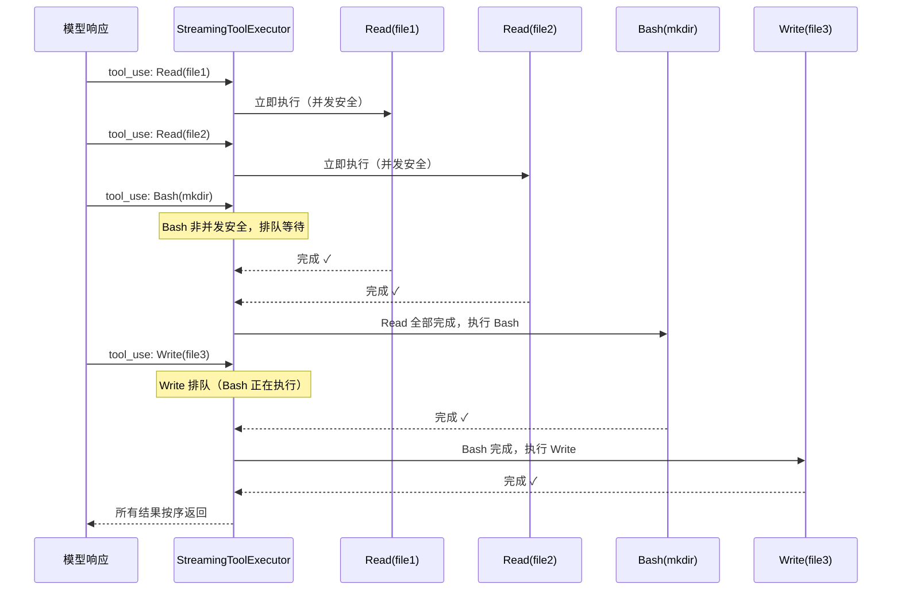
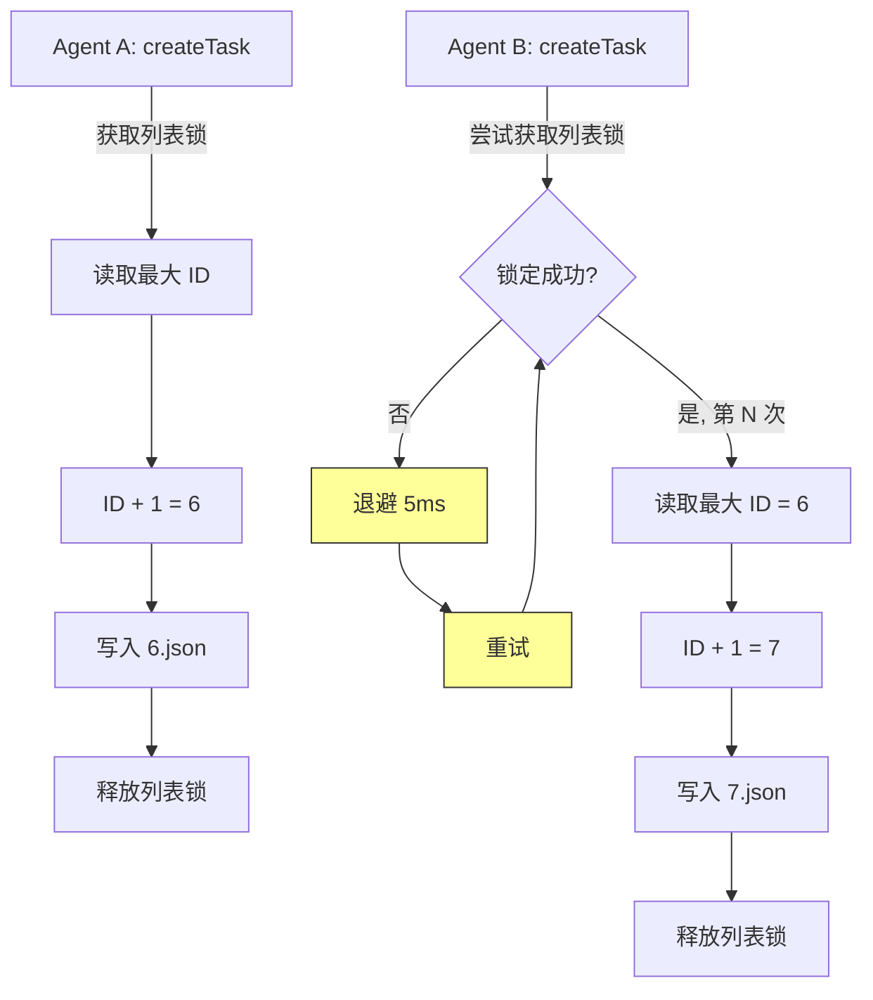
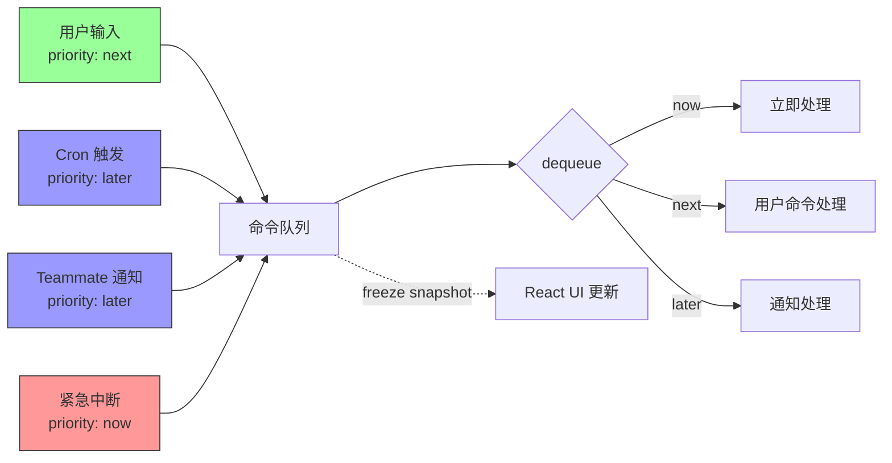
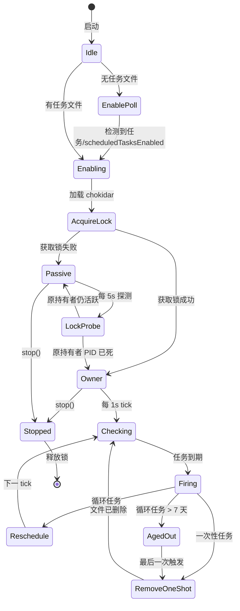

# 第 13 章：并发模型——单线程世界中的多任务

> **核心思想**：Claude Code 运行在单线程 JavaScript 上，却同时管理 API 调用、工具执行、文件监控和多个 Teammate。**正确的并发不需要线程——它需要的是良好的边界和明确的所有权。**

想象一个繁忙的十字路口。你不需要把道路拓宽成八车道——你需要的是清晰的交通信号灯。红灯亮时，所有方向的车都必须停下；绿灯亮时，只有一个方向可以通行；而"右转专用道"允许安全的操作并行进行。这正是 Claude Code 并发模型的精髓：不是更多车道，而是更好的信号灯。

在本章中，我们将拆解这个交通系统的每一个信号灯——从工具并发分区到文件锁退避，从消息队列到 Cron 调度器，从子进程管理到 Git Worktree 隔离。

---

## 13.1 事件循环中的并发

### 费曼第一步：这到底是什么问题？

JavaScript 是单线程的。这不是缺陷——这是一个强大的约束。当你只有一条线程时，你永远不需要担心两段代码同时修改同一个变量。没有竞态条件？没有死锁？听起来像天堂。

但现实更复杂。Claude Code 需要同时做很多事：

1. 等待 Anthropic API 返回流式响应
2. 并行执行多个只读工具（Glob、Grep、Read）
3. 监控文件系统变化（Cron 任务文件）
4. 管理多个 Teammate 的消息队列
5. 处理子进程的 stdout/stderr 输出
6. 响应用户中断（ESC、Ctrl+C）

所有这些都发生在同一个事件循环里。Node.js 的 `async/await` 让代码看起来像同步的，但底层全是回调和微任务。关键洞察是：**你的代码在每个 `await` 点都会"让出"控制权**。这意味着其他 Promise 可以在你的函数暂停时推进。

用交通路口的比喻来说：每个 `await` 就是一个路口。当你停下来等绿灯时（等 I/O 完成），其他车辆（其他 Promise）可以通行。

### 并发 vs 并行

这里需要区分一个重要概念：

- **并行（Parallelism）**：两件事真的在同一时刻执行。需要多线程或多进程。
- **并发（Concurrency）**：两件事的时间段重叠，但不一定同时执行。一个线程就够了。

Claude Code 是并发的，不是并行的（子进程除外——它们确实在不同的 OS 进程中并行运行）。这意味着 JavaScript 代码本身永远不会被"打断"——在两个 `await` 之间的同步代码段是原子的。这个保证简化了大量设计。

---

## 13.2 工具并发策略

### 费曼第一步：工具为什么需要并发？

当 Claude 模型一次返回五个工具调用时——比如三个 `Read` 和两个 `Grep`——串行执行意味着等待五次磁盘 I/O。但这些都是只读操作，完全不会相互干扰。并行执行可以把延迟从 5×T 降到约 1×T。

但如果五个调用中有一个 `Write`，情况就完全不同了。`Write` 修改文件系统状态，后续的 `Read` 可能依赖这个修改。这时你必须串行。

### 核心算法：分区（Partitioning）

工具并发的核心在 `toolOrchestration.ts` 的 `partitionToolCalls` 函数中：

```typescript
// src/services/tools/toolOrchestration.ts

function partitionToolCalls(
  toolUseMessages: ToolUseBlock[],
  toolUseContext: ToolUseContext,
): Batch[] {
  return toolUseMessages.reduce((acc: Batch[], toolUse) => {
    const tool = findToolByName(toolUseContext.options.tools, toolUse.name)
    const parsedInput = tool?.inputSchema.safeParse(toolUse.input)
    const isConcurrencySafe = parsedInput?.success
      ? (() => {
          try {
            return Boolean(tool?.isConcurrencySafe(parsedInput.data))
          } catch {
            return false
          }
        })()
      : false
    if (isConcurrencySafe && acc[acc.length - 1]?.isConcurrencySafe) {
      acc[acc.length - 1]!.blocks.push(toolUse)
    } else {
      acc.push({ isConcurrencySafe, blocks: [toolUse] })
    }
    return acc
  }, [])
}
```

算法很简单：扫描工具调用列表，把连续的只读工具归入同一批次，遇到非只读工具就开新批次。结果是一个交替的"并发批次/串行批次"序列。

注意 `isConcurrencySafe` 的保守策略：如果解析输入失败，或者 `isConcurrencySafe()` 抛出异常（比如 shell-quote 解析失败），一律视为非并发安全。**宁可慢一点，也不能错。** 这就像交通灯坏了时默认变红灯——安全优先。

### 并发上限

```typescript
// src/services/tools/toolOrchestration.ts

function getMaxToolUseConcurrency(): number {
  return (
    parseInt(process.env.CLAUDE_CODE_MAX_TOOL_USE_CONCURRENCY || '', 10) || 10
  )
}
```

默认上限 10。这不是随意的——它对应了"同时发起 10 个文件读取不会让 OS 文件描述符耗尽"这个实践经验。用户可以通过环境变量调整。

### 并发执行的秘密武器：`all()` 生成器

并行执行的核心是 `utils/generators.ts` 中的 `all` 函数：

```typescript
// src/utils/generators.ts

export async function* all<A>(
  generators: AsyncGenerator<A, void>[],
  concurrencyCap = Infinity,
): AsyncGenerator<A, void> {
  const next = (generator: AsyncGenerator<A, void>) => {
    const promise: Promise<QueuedGenerator<A>> = generator
      .next()
      .then(({ done, value }) => ({ done, value, generator, promise }))
    return promise
  }
  const waiting = [...generators]
  const promises = new Set<Promise<QueuedGenerator<A>>>()

  while (promises.size < concurrencyCap && waiting.length > 0) {
    const gen = waiting.shift()!
    promises.add(next(gen))
  }

  while (promises.size > 0) {
    const { done, value, generator, promise } = await Promise.race(promises)
    promises.delete(promise)
    if (!done) {
      promises.add(next(generator))
      if (value !== undefined) yield value
    } else if (waiting.length > 0) {
      const nextGen = waiting.shift()!
      promises.add(next(nextGen))
    }
  }
}
```

这是一个受限并发的 AsyncGenerator 合并器。`Promise.race` 在这里扮演"谁先到谁先通过"的调度角色——就像路口的先到先行规则。当一个生成器完成时，等待队列中的下一个立即启动，保持并发池的饱满。

### 流式工具执行器：StreamingToolExecutor

在流式场景中（模型还在生成时工具就开始执行），`StreamingToolExecutor` 提供更精细的控制：

```typescript
// src/services/tools/StreamingToolExecutor.ts

private canExecuteTool(isConcurrencySafe: boolean): boolean {
  const executingTools = this.tools.filter(t => t.status === 'executing')
  return (
    executingTools.length === 0 ||
    (isConcurrencySafe && executingTools.every(t => t.isConcurrencySafe))
  )
}
```

规则很直觉：
- 如果没有工具在执行，任何工具都可以开始
- 如果当前工具是并发安全的，**且**所有正在执行的工具也都是并发安全的，可以加入
- 否则等待

这就是交通路口的"绿灯规则"：只读的"直行车辆"可以同时通过，但"左转"（写操作）必须等所有直行车辆通过后独占路口。

### Bash 错误的级联取消

`StreamingToolExecutor` 有一个精妙的设计——**只有 Bash 工具的错误会取消兄弟工具**：

```typescript
// src/services/tools/StreamingToolExecutor.ts

if (isErrorResult) {
  thisToolErrored = true
  // Only Bash errors cancel siblings. Bash commands often have implicit
  // dependency chains (e.g. mkdir fails → subsequent commands pointless).
  // Read/WebFetch/etc are independent — one failure shouldn't nuke the rest.
  if (tool.block.name === BASH_TOOL_NAME) {
    this.hasErrored = true
    this.erroredToolDescription = this.getToolDescription(tool)
    this.siblingAbortController.abort('sibling_error')
  }
}
```

为什么？因为 Bash 命令通常有隐式依赖链：`mkdir` 失败了，后续在该目录下的操作都没意义。但 `Read` 文件 A 失败了不影响 `Read` 文件 B。这是一个基于领域知识的务实决策。



---

## 13.3 文件锁的指数退避

### 费曼第一步：为什么需要文件锁？

当多个 Claude 实例（Swarm 模式下的 10+ 个 Agent）同时操作同一个任务列表时，你需要防止经典的"读-改-写"竞态条件。在多线程编程中你用 mutex；在多进程的文件系统中，你用文件锁。

### 锁配置的数学

```typescript
// src/utils/tasks.ts

const LOCK_OPTIONS = {
  retries: {
    retries: 30,
    minTimeout: 5,
    maxTimeout: 100,
  },
}
```

这些数字不是随意的。注释里有详细解释：

> Budget sized for ~10+ concurrent swarm agents: each critical section does
> readdir + N×readFile + writeFile (~50-100ms on slow disks), so the last
> caller in a 10-way race needs ~900ms. retries=30 gives ~2.6s total wait.

让我们验证这个数学。`proper-lockfile` 使用指数退避，每次重试时间翻倍（在 min 和 max 之间）。30 次重试，最小 5ms，最大 100ms：

- 前几次：5, 10, 20, 40, 80, 100, 100, 100, ...（碰到 maxTimeout 后就固定 100ms）
- 大约在第 5-6 次就达到 100ms 上限
- 后续约 24 次都是 100ms
- 总等待时间 ≈ 5+10+20+40+80+100×25 ≈ 2655ms ≈ 2.6s

足够覆盖 10 个 Agent 的顺序争用。

### 两级锁粒度

任务系统使用两级锁：

1. **任务级锁**（锁住单个 `.json` 文件）——用于 `updateTask`、`claimTask` 等修改单个任务的操作
2. **列表级锁**（锁住 `.lock` 文件）——用于 `createTask`、`resetTaskList`、`claimTaskWithBusyCheck` 等需要原子操作整个列表的操作

```typescript
// src/utils/tasks.ts — createTask 使用列表级锁

export async function createTask(
  taskListId: string,
  taskData: Omit<Task, 'id'>,
): Promise<string> {
  const lockPath = await ensureTaskListLockFile(taskListId)
  let release: (() => Promise<void>) | undefined
  try {
    release = await lockfile.lock(lockPath, LOCK_OPTIONS)
    const highestId = await findHighestTaskId(taskListId)
    const id = String(highestId + 1)
    const task: Task = { id, ...taskData }
    const path = getTaskPath(taskListId, id)
    await writeFile(path, jsonStringify(task, null, 2))
    notifyTasksUpdated()
    return id
  } finally {
    if (release) {
      await release()
    }
  }
}
```

为什么 `createTask` 需要列表级锁？因为它必须原子地"读取最大 ID → 加一 → 写入新文件"。如果两个 Agent 同时读到最大 ID 是 5，它们都会创建 `6.json`，后写的覆盖先写的。列表级锁保证了这个序列的原子性。

而 `claimTaskWithBusyCheck` 需要列表级锁的原因更微妙——它必须原子地检查"Agent 是否已有其他任务"并完成认领，防止 TOCTOU（Time-of-Check-to-Time-of-Use）竞态。

### 避免死锁：`updateTaskUnsafe`

一个精巧的细节：当 `claimTask` 已经持有任务文件锁时，调用 `updateTaskUnsafe` 而不是 `updateTask`：

```typescript
// src/utils/tasks.ts

// Internal: no lock. Callers already holding a lock on taskPath must use this
// to avoid deadlock (claimTask, deleteTask cascade, etc.).
async function updateTaskUnsafe(
  taskListId: string,
  taskId: string,
  updates: Partial<Omit<Task, 'id'>>,
): Promise<Task | null> { ... }
```

如果 `claimTask` 调用带锁的 `updateTask`，就会尝试锁定同一个文件两次——死锁。`Unsafe` 后缀不是说它不安全，而是"调用者已经负责锁定了"。



---

## 13.4 消息队列管理

### 费曼第一步：为什么需要消息队列？

想象你正在和 Claude 对话，突然一个 Cron 任务触发了，同时一个 Teammate 完成了任务要汇报。这三个"消息源"（用户输入、Cron 通知、Teammate 通知）不能同时往模型嘴里塞——必须排队。

### 优先级队列

`messageQueueManager.ts` 实现了一个三级优先级队列：

```typescript
// src/utils/messageQueueManager.ts

const PRIORITY_ORDER: Record<QueuePriority, number> = {
  now: 0,    // 最高优先级
  next: 1,   // 用户输入的默认优先级
  later: 2,  // 任务通知的默认优先级
}
```

这个设计确保了用户输入永远不会被系统通知"饿死"。用户是"急救车"——永远优先通行。

入队的两个入口点清楚地表达了这个意图：

```typescript
// src/utils/messageQueueManager.ts

// 用户输入：默认 'next' 优先级
export function enqueue(command: QueuedCommand): void {
  commandQueue.push({ ...command, priority: command.priority ?? 'next' })
  notifySubscribers()
}

// 系统通知：默认 'later' 优先级
export function enqueuePendingNotification(command: QueuedCommand): void {
  commandQueue.push({ ...command, priority: command.priority ?? 'later' })
  notifySubscribers()
}
```

### 出队逻辑

`dequeue` 函数找到最高优先级的命令，同优先级内 FIFO：

```typescript
// src/utils/messageQueueManager.ts

export function dequeue(
  filter?: (cmd: QueuedCommand) => boolean,
): QueuedCommand | undefined {
  if (commandQueue.length === 0) return undefined

  let bestIdx = -1
  let bestPriority = Infinity
  for (let i = 0; i < commandQueue.length; i++) {
    const cmd = commandQueue[i]!
    if (filter && !filter(cmd)) continue
    const priority = PRIORITY_ORDER[cmd.priority ?? 'next']
    if (priority < bestPriority) {
      bestIdx = i
      bestPriority = priority
    }
  }

  if (bestIdx === -1) return undefined
  const [dequeued] = commandQueue.splice(bestIdx, 1)
  notifySubscribers()
  return dequeued
}
```

`filter` 参数的用途很关键：在 Teammate 场景中，主线程只应该处理 `agentId === undefined` 的命令，每个 Teammate 只处理自己的。这避免了重新架构整个队列系统——一个过滤器就够了。

### 与 React 的集成

队列使用 `useSyncExternalStore` 模式和 React 集成——每次突变都冻结一个新快照：

```typescript
// src/utils/messageQueueManager.ts

let snapshot: readonly QueuedCommand[] = Object.freeze([])

function notifySubscribers(): void {
  snapshot = Object.freeze([...commandQueue])
  queueChanged.emit()
}
```

`Object.freeze` 确保 React 的引用比较能正确检测变化。这是"单线程世界中的多任务"的一个美妙例子——不需要锁，因为 `notifySubscribers` 中的三行代码是同步的，不会被打断。



### ESC 取消和队列清空

当用户按 ESC 时，`clearCommandQueue()` 丢弃所有排队的通知。这是一个有意的设计选择——用户说"停"，就是停。排队的 Cron 通知和 Teammate 消息都不重要了。

---

## 13.5 Cron 调度器

### 费曼第一步：在单线程中怎么做定时任务？

Cron 调度器面临三个挑战：

1. 在 `setInterval` 的粗粒度（1 秒）中精确触发
2. 防止多个 Claude 会话重复触发同一任务
3. 在进程重启后恢复调度状态

### 调度器锁：谁拥有控制权？

当多个 Claude 会话在同一项目目录运行时，只有一个应该驱动 Cron。`cronTasksLock.ts` 使用 `O_EXCL` 原子创建实现"选举"：

```typescript
// src/utils/cronTasksLock.ts

async function tryCreateExclusive(
  lock: SchedulerLock,
  dir?: string,
): Promise<boolean> {
  const path = getLockPath(dir)
  const body = jsonStringify(lock)
  try {
    await writeFile(path, body, { flag: 'wx' })
    return true
  } catch (e: unknown) {
    const code = getErrnoCode(e)
    if (code === 'EEXIST') return false
    // ...
  }
}
```

`wx` 标志意味着"写入+排他"——文件已存在则失败。这是操作系统级别的原子操作，比任何用户空间锁都可靠。

### 抖动（Jitter）：避免万人冲锋

这是 Cron 系统最精巧的部分。想象 1000 个 Claude 用户都设置了 `0 * * * *`（每小时触发）——如果都在 :00 准时发请求，推理服务器会瞬间过载。解决方案是**确定性抖动（Deterministic Jitter）**：

```typescript
// src/utils/cronTasks.ts

function jitterFrac(taskId: string): number {
  const frac = parseInt(taskId.slice(0, 8), 16) / 0x1_0000_0000
  return Number.isFinite(frac) ? frac : 0
}

export function jitteredNextCronRunMs(
  cron: string, fromMs: number, taskId: string,
  cfg: CronJitterConfig = DEFAULT_CRON_JITTER_CONFIG,
): number | null {
  const t1 = nextCronRunMs(cron, fromMs)
  if (t1 === null) return null
  const t2 = nextCronRunMs(cron, t1)
  if (t2 === null) return t1
  const jitter = Math.min(
    jitterFrac(taskId) * cfg.recurringFrac * (t2 - t1),
    cfg.recurringCapMs,
  )
  return t1 + jitter
}
```

关键设计决策：

- **确定性**：同一个 `taskId` 总是产生相同的抖动偏移。进程重启后不会改变触发时间。
- **比例抖动**：每小时的任务延迟最多 6 分钟（`0.1 × 60min`），每分钟的任务只延迟几秒。
- **上限**：无论间隔多长，抖动不超过 15 分钟。

对于一次性任务，策略相反——**提前触发**而不是延迟：

```typescript
// src/utils/cronTasks.ts — 一次性任务的反向抖动

export function oneShotJitteredNextCronRunMs(
  cron: string, fromMs: number, taskId: string,
  cfg: CronJitterConfig = DEFAULT_CRON_JITTER_CONFIG,
): number | null {
  const t1 = nextCronRunMs(cron, fromMs)
  if (t1 === null) return null
  if (new Date(t1).getMinutes() % cfg.oneShotMinuteMod !== 0) return t1
  const lead = cfg.oneShotFloorMs +
    jitterFrac(taskId) * (cfg.oneShotMaxMs - cfg.oneShotFloorMs)
  return Math.max(t1 - lead, fromMs)
}
```

为什么提前而不是延迟？因为一次性任务通常是"3 点提醒我"这样的用户期望。延迟 90 秒用户会抱怨"怎么迟了"；提前 90 秒用户大概不会注意。而且只在 :00 和 :30 这些"人类喜欢的整点"才做抖动——因为人类确实喜欢设整点。

### 可热更新的配置

```typescript
// src/utils/cronTasks.ts

export const DEFAULT_CRON_JITTER_CONFIG: CronJitterConfig = {
  recurringFrac: 0.1,
  recurringCapMs: 15 * 60 * 1000,
  oneShotMaxMs: 90 * 1000,
  oneShotFloorMs: 0,
  oneShotMinuteMod: 30,
  recurringMaxAgeMs: 7 * 24 * 60 * 60 * 1000,  // 7 天自动过期
}
```

所有这些数字都可以通过 GrowthBook 功能标志实时推送更新——运维团队可以在 :00 负载高峰期间加宽抖动窗口，无需重启客户端。调度器每个 tick 都会重新读取配置：

```typescript
// src/utils/cronScheduler.ts — check() 中每 tick 读取配置

const jitterCfg = getJitterConfig?.() ?? DEFAULT_CRON_JITTER_CONFIG
```

### 7 天自动过期

循环任务在创建 7 天后自动删除（最后一次触发后删除）。这解决了一个实际问题：Cron 是长会话的主要驱动力（p99 运行时间从 61 分钟跳到 53 小时），无限循环让 Tier-1 内存泄漏无限累积。



---

## 13.6 子进程生命周期

### 费曼第一步：子进程有什么特别的？

子进程是 Claude Code 中**唯一真正并行**的东西。当 Bash 工具执行 `npm test` 时，那是一个独立的 OS 进程，和 Node.js 主进程真正同时运行。管理它的生命周期需要特别小心。

### ShellCommand 的状态机

```typescript
// src/utils/ShellCommand.ts

type ShellCommand = {
  background: (backgroundTaskId: string) => boolean
  result: Promise<ExecResult>
  kill: () => void
  status: 'running' | 'backgrounded' | 'completed' | 'killed'
  cleanup: () => void
  taskOutput: TaskOutput
}
```

四个状态，三个转换动作：

- `running` → `backgrounded`：用户按 Ctrl+B，或超时自动后台化
- `running` → `killed`：用户按 ESC，或 AbortSignal 触发
- `running` / `backgrounded` → `completed`：进程自然退出

### 超时：30 分钟

默认超时 30 分钟（从 `timeout` 参数传入）。到时后有两条路径：

```typescript
// src/utils/ShellCommand.ts

static #handleTimeout(self: ShellCommandImpl): void {
  if (self.#shouldAutoBackground && self.#onTimeoutCallback) {
    self.#onTimeoutCallback(self.background.bind(self))
  } else {
    self.#doKill(SIGTERM)
  }
}
```

如果允许自动后台化（`shouldAutoBackground`），超时后不是杀死进程，而是转入后台继续运行。这对长编译任务很重要——你不想因为超时丢掉 29 分钟的编译进度。

### 输出大小看门狗

后台进程有一个隐患：它的 stdout 直接写入文件 fd（绕过 JavaScript），如果进程卡在无限输出循环中，会填满磁盘。曾经发生过 768GB 的事故。现在有一个看门狗：

```typescript
// src/utils/ShellCommand.ts

#startSizeWatchdog(): void {
  this.#sizeWatchdog = setInterval(() => {
    void stat(this.taskOutput.path).then(s => {
      if (
        s.size > this.#maxOutputBytes &&
        this.#status === 'backgrounded' &&
        this.#sizeWatchdog !== null
      ) {
        this.#killedForSize = true
        this.#clearSizeWatchdog()
        this.#doKill(SIGKILL)
      }
    }, () => {})
  }, SIZE_WATCHDOG_INTERVAL_MS)
  this.#sizeWatchdog.unref()
}
```

每 5 秒检查一次输出文件大小。超过 `MAX_TASK_OUTPUT_BYTES` 就 SIGKILL。`unref()` 确保看门狗定时器不会阻止进程退出。

### AbortSignal 的微妙语义

注意中断处理的细节：

```typescript
// src/utils/ShellCommand.ts

#abortHandler(): void {
  // On 'interrupt' (user submitted a new message), don't kill — let the
  // caller background the process so the model can see partial output.
  if (this.#abortSignal.reason === 'interrupt') {
    return
  }
  this.kill()
}
```

`abort` 信号有两种原因：`'interrupt'`（用户提交了新消息）和其他（用户按 ESC 取消）。前者不应该杀死进程——让它后台化更好，模型还能看到部分输出。这是"交通信号"语义的又一个例子：不同的信号有不同的含义。

### 使用 'exit' 而非 'close'

```typescript
// src/utils/ShellCommand.ts

// Use 'exit' not 'close': 'close' waits for stdio to close, which includes
// grandchild processes that inherit file descriptors (e.g. `sleep 30 &`).
// 'exit' fires when the shell itself exits, returning control immediately.
this.#childProcess.once('exit', this.#exitHandler.bind(this))
```

这个选择至关重要。如果用户运行 `nohup server &`，`close` 事件会一直等到 server 退出才触发——那可能是永远。`exit` 事件在 shell 退出时就触发，不等子子进程。

---

## 13.7 Git Worktree 隔离

### 费曼第一步：多个 Agent 怎么共用一个仓库？

当 Swarm 模式下 10 个 Agent 同时工作时，它们不能在同一个 Git 工作目录中修改文件——那会造成无尽的合并冲突。解决方案是 Git Worktree：同一个 `.git` 目录，多个独立的工作树。

### Worktree 的创建

```typescript
// src/utils/worktree.ts

async function getOrCreateWorktree(
  repoRoot: string,
  slug: string,
  options?: { prNumber?: number },
): Promise<WorktreeCreateResult> {
  const worktreePath = worktreePathFor(repoRoot, slug)
  const worktreeBranch = worktreeBranchName(slug)

  // Fast resume path: if the worktree already exists skip fetch and creation.
  const existingHead = await readWorktreeHeadSha(worktreePath)
  if (existingHead) {
    return {
      worktreePath, worktreeBranch,
      headCommit: existingHead, existed: true,
    }
  }
  // ... fetch, create, setup
}
```

快速恢复路径避免了不必要的 `git fetch`——在大仓库中 fetch 可能要 6-8 秒（扫描 16M 个对象的提交图）。直接读取 `.git` 指针文件来检查 worktree 是否存在，比启动 `git` 子进程快得多。

### 陷名安全

```typescript
// src/utils/worktree.ts

export function validateWorktreeSlug(slug: string): void {
  if (slug.length > MAX_WORKTREE_SLUG_LENGTH) {
    throw new Error(`Invalid worktree name: must be 64 characters or fewer`)
  }
  for (const segment of slug.split('/')) {
    if (segment === '.' || segment === '..') {
      throw new Error(`Invalid worktree name: must not contain "." or ".."`)
    }
    if (!VALID_WORKTREE_SLUG_SEGMENT.test(segment)) {
      throw new Error(`Invalid worktree name: invalid characters`)
    }
  }
}
```

Worktree slug 会通过 `path.join` 拼接到 `.claude/worktrees/<slug>` 中。如果允许 `../../target`，就能逃逸到任意目录。严格的字符白名单和路径遍历检查防止了这种攻击。

### 临时 Worktree 的清理

Agent 和 Workflow 创建的临时 worktree 可能因为进程被 kill 而泄漏。`cleanupStaleAgentWorktrees` 使用精确的正则模式只清理临时 worktree，从不触碰用户命名的：

```typescript
// src/utils/worktree.ts

const EPHEMERAL_WORKTREE_PATTERNS = [
  /^agent-a[0-9a-f]{7}$/,
  /^wf_[0-9a-f]{8}-[0-9a-f]{3}-\d+$/,
  /^wf-\d+$/,
  /^bridge-[A-Za-z0-9_]+(-[A-Za-z0-9_]+)*$/,
  /^job-[a-zA-Z0-9._-]{1,55}-[0-9a-f]{8}$/,
]
```

清理时还会检查是否有未推送的提交或未暂存的更改——**失败时保留（fail-closed）**，宁可留着一个可能有价值的 worktree，也不要删掉有用的工作。

---

## 13.8 AsyncLocalStorage 的隔离妙用

### 费曼第一步：多个 Agent 怎么共存于同一进程？

当用户按 Ctrl+B 将一个 Agent 放入后台时，多个 Agent 可以同时在同一进程中运行。它们共享相同的 `AppState`——但每个 Agent 需要自己的上下文（ID、团队名、颜色等）。全局变量会被后一个 Agent 覆盖。

### AsyncLocalStorage 解决方案

Node.js 的 `AsyncLocalStorage` 为每个异步执行链维护独立的存储——就像每辆车有自己的仪表盘，即使它们在同一条路上行驶。

```typescript
// src/utils/agentContext.ts

const agentContextStorage = new AsyncLocalStorage<AgentContext>()

export function getAgentContext(): AgentContext | undefined {
  return agentContextStorage.getStore()
}

export function runWithAgentContext<T>(context: AgentContext, fn: () => T): T {
  return agentContextStorage.run(context, fn)
}
```

代码注释解释得很清楚：

> WHY AsyncLocalStorage (not AppState):
> When agents are backgrounded (ctrl+b), multiple agents can run concurrently
> in the same process. AppState is a single shared state that would be
> overwritten, causing Agent A's events to incorrectly use Agent B's context.
> AsyncLocalStorage isolates each async execution chain, so concurrent agents
> don't interfere with each other.

### 三层身份解析

Teammate 的身份解析有三个层次，`teammateContext.ts` 负责最内层：

```typescript
// src/utils/teammateContext.ts

// Relationship with other teammate identity mechanisms:
// - Env vars (CLAUDE_CODE_AGENT_ID): Process-based teammates spawned via tmux
// - dynamicTeamContext (teammate.ts): Process-based teammates joining at runtime
// - TeammateContext (this file): In-process teammates via AsyncLocalStorage
//
// The helper functions in teammate.ts check AsyncLocalStorage first, then
// dynamicTeamContext, then env vars.
```

优先级是内到外的：
1. AsyncLocalStorage（进程内 Teammate）
2. 动态团队上下文（运行时加入的进程级 Teammate）
3. 环境变量（tmux 启动的独立进程 Teammate）

这种分层设计让同一个 `getTeamName()` 函数在所有场景下都能工作，无需调用者关心身份来自哪里。

---

## 13.9 设计权衡

### 为什么不用 Worker Threads？

Node.js 有 `worker_threads` 模块，为什么不用？

1. **序列化成本**：Worker 之间传递数据需要序列化/反序列化。工具上下文（`ToolUseContext`）包含函数引用和闭包——无法序列化。
2. **复杂性**：线程引入竞态条件、死锁、原子性问题。当前的 async/await 模型概念简单得多。
3. **收益有限**：CPU 密集型工作（编译、测试）已经在子进程中并行。JavaScript 代码本身主要是 I/O 等待，不需要额外的 CPU 并行。

### 文件锁 vs 进程间通信

任务系统选择文件锁而不是 IPC/Unix Socket：

- **优点**：无需守护进程，崩溃恢复自动（锁文件的 PID 存活检查），多语言兼容
- **缺点**：慢（每次操作至少一次磁盘 I/O），NFS 不可靠，退避增加延迟
- **结论**：对于 Swarm（约 10 个 Agent，操作频率约每秒一次）来说，文件锁足够了

### 乐观 vs 悲观并发

工具并发是**乐观**的——默认并行执行只读工具，遇到写入才串行化。而不是悲观地所有工具都串行。

Cron 调度器是**悲观**的——用锁保证只有一个会话驱动调度。因为重复触发的代价（给模型发两次同样的提示）远高于等锁的代价。

### 信号量而非锁

`StreamingToolExecutor` 的并发控制不是传统的锁——它更像一个信号量。检查 `canExecuteTool()` 是一个同步操作，在两个 `await` 之间不会被打断。这利用了单线程的保证：**同步代码段是原子的。** 不需要真正的锁机制。

---

## 13.10 迁移指南

如果你要修改 Claude Code 的并发逻辑，这些是关键规则：

### 规则 1：新工具必须实现 `isConcurrencySafe()`

```typescript
// 只读工具返回 true
isConcurrencySafe(input: MyToolInput): boolean {
  return true  // 纯读取操作
}

// 写入工具返回 false
isConcurrencySafe(input: MyToolInput): boolean {
  return false  // 修改文件系统
}

// 条件性工具根据输入判断
isConcurrencySafe(input: BashToolInput): boolean {
  // 只有确认是只读命令才返回 true
  return isReadOnlyCommand(input.command)
}
```

错误返回 `true` 会导致写入操作并行执行——数据损坏。不确定就返回 `false`。

### 规则 2：文件操作必须用锁保护

如果多个进程可能同时操作同一个文件：

```typescript
const LOCK_OPTIONS = {
  retries: { retries: 30, minTimeout: 5, maxTimeout: 100 },
}

let release: (() => Promise<void>) | undefined
try {
  release = await lockfile.lock(filePath, LOCK_OPTIONS)
  // 读-改-写操作
} finally {
  await release?.()
}
```

**绝不要**在持有锁的情况下调用另一个需要同一把锁的函数（死锁）。使用 `Unsafe` 后缀标记无锁内部函数。

### 规则 3：AsyncLocalStorage 用于进程内多 Agent

```typescript
import { runWithAgentContext } from './agentContext.js'

// 在 Agent 的入口点设置上下文
runWithAgentContext(
  { agentId: 'agent-123', agentType: 'subagent' },
  async () => {
    // 这个异步执行链中的所有代码都能访问 Agent 上下文
    // 即使其他 Agent 同时运行也不会冲突
    const ctx = getAgentContext()  // { agentId: 'agent-123', ... }
  }
)
```

### 规则 4：子进程必须通过 `wrapSpawn` 管理

直接使用 `child_process.spawn` 而不包装会：
- 缺少超时保护（30 分钟限制）
- 缺少中断响应（AbortSignal）
- 缺少输出大小看门狗
- 缺少后台化能力（Ctrl+B）
- 可能阻止进程退出（`unref` 未设置）

### 规则 5：定时器务必 `unref()`

```typescript
const timer = setInterval(check, 1000)
timer.unref()  // 不阻止进程退出
```

遗漏 `unref()` 会让 `-p` 模式（单次对话后应退出）永远挂起。

---

## 13.11 费曼检验

让我们用最简单的语言总结每个概念，看看我们是否真正理解了：

**工具并发**：读操作可以一起做，写操作必须排队做。就像图书馆——大家可以同时看书（读），但同一时间只能一个人在借还台办理（写）。

**文件锁退避**：10 个人同时想进一个只容一人的门。第一个直接进去，其余的等。等多久？先等 5 毫秒，然后 10、20、40...最多 100 毫秒一次，总共试 30 次。数学上刚好覆盖 10 个人的最坏情况。

**消息队列**：用户说话比 AI 通知更重要。急救车（now）> 普通车辆（next）> 非机动车（later）。

**Cron 抖动**：如果 1000 人都设了"整点提醒"，不能 1000 人同时冲向服务器。给每人一个基于 ID 的固定偏移量，把冲击分散到一个时间窗口内。

**子进程管理**：开一个外部程序就像雇一个临时工。你需要：给他一个截止时间（30 分钟），能随时叫停他（kill），能让他在后台继续干（background），还要看着他别占太多磁盘（size watchdog）。

**AsyncLocalStorage**：就像给每辆车装一个独立的仪表盘。即使两辆车在同一条路上跑（同一进程），每辆车的里程表、油量表都是自己的。

如果某个解释你觉得"好像明白了但又说不清"——回去重读那一节。真正的理解应该能用简单的话说出来。

---

## 本章小结

Claude Code 的并发模型证明了一个反直觉的事实：**单线程可以非常好地处理复杂的并发场景**，只要你有清晰的规则。

我们从这个交通路口中学到的关键原则：

| 机制 | 类比 | 关键文件 |
|------|------|----------|
| 工具分区 | 绿灯（只读并行）/ 红灯（写入独占） | `toolOrchestration.ts` |
| 流式执行器 | 先到先行的环形路口 | `StreamingToolExecutor.ts` |
| 文件锁 | 单行道的让行标志 | `tasks.ts` (LOCK_OPTIONS) |
| 消息队列 | 急救车优先的车道规则 | `messageQueueManager.ts` |
| Cron 锁 | 路口只能有一个交警 | `cronTasksLock.ts` |
| Cron 抖动 | 错峰上下班 | `cronTasks.ts` (jitterFrac) |
| 子进程 | 带超时和看门狗的临时工 | `ShellCommand.ts` |
| Git Worktree | 每个司机有自己的车道 | `worktree.ts` |
| AsyncLocalStorage | 每辆车有自己的仪表盘 | `agentContext.ts` |

正确的并发不需要线程。它需要的是：
1. **明确的分类**——哪些操作可以并行，哪些必须串行
2. **清晰的所有权**——谁持有锁，谁驱动调度器，谁负责清理
3. **保守的默认值**——不确定就串行，锁获取失败就重试，进程超时就杀掉
4. **优雅的降级**——Bash 错误取消兄弟但 Read 错误不取消，ESC 清空队列但后台进程继续运行

这就是单线程世界中多任务的秘密：你不需要更多车道，你需要更好的交通信号灯。
