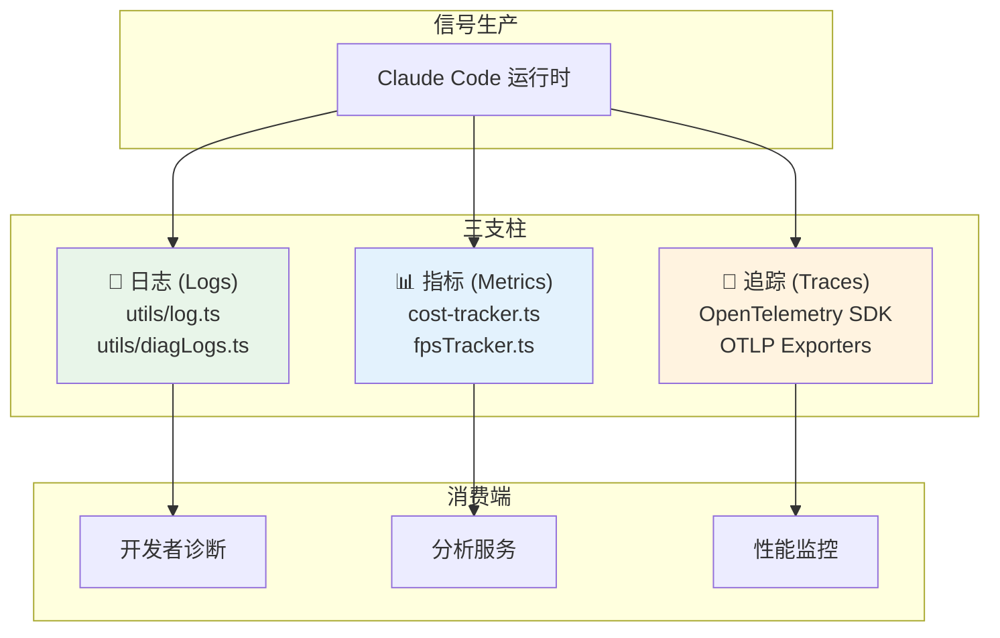
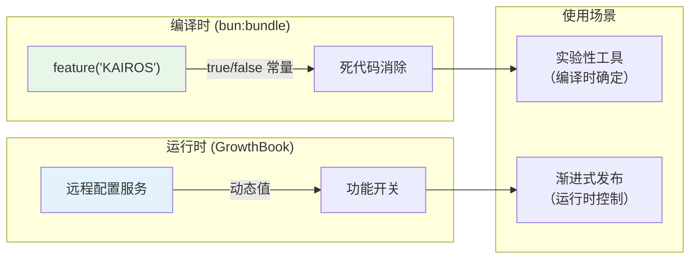

# 第 14 章：可观测性——看见系统的内心

> **核心思想**：**你不能优化你看不见的东西。** Claude Code 的可观测性体系构建了一个运行时自省系统，让开发者在不中断服务的情况下理解系统行为。

---

## 14.1 为什么 CLI 工具需要可观测性？

📖 **费曼式引入**

想象你在驾驶一辆没有仪表盘的汽车——没有速度表、没有油量表、没有发动机警告灯。你可以开，但无法知道自己开多快、还能开多远、发动机是否过热。

Claude Code 面临同样的问题。每次对话可能消耗数千个 token（等同于真金白银），Agent 循环可能因为重试而延迟几十秒，上下文压缩可能在用户不知情的情况下丢失关键信息。没有可观测性，这些都是黑箱。

**可观测性的本质不是"记录日志"——而是构建一个系统，让你能回答任何关于系统行为的问题，即使这个问题在设计时没有预见到。**

## 14.2 三种可观测信号

可观测性的三大支柱：日志（Logs）、指标（Metrics）、追踪（Traces）。Claude Code 通过 OpenTelemetry 实现了完整的三支柱覆盖。



**图 14-1：可观测性三支柱架构。每种信号回答不同类型的问题。**

| 信号 | 回答的问题 | Claude Code 中的实现 |
|------|-----------|---------------------|
| 日志 | "发生了什么？" | `utils/log.ts`, `utils/diagLogs.ts` |
| 指标 | "发生了多少次？花了多长时间？" | `cost-tracker.ts`, 启动 profiler |
| 追踪 | "请求经过了哪些路径？" | OpenTelemetry SDK + OTLP |

## 14.3 成本追踪：每一个 token 都是钱

🔬 Claude Code 的成本追踪系统是可观测性中最直接影响用户的部分。看 `cost-tracker.ts` 的核心结构：

```typescript
// src/cost-tracker.ts:1-48（关键导入和依赖）
import type { BetaUsage as Usage } from '@anthropic-ai/sdk/resources/beta/messages/messages.mjs'
import {
  getTotalCostUSD,
  getTotalInputTokens,
  getTotalOutputTokens,
  getTotalCacheCreationInputTokens,
  getTotalCacheReadInputTokens,
  getTotalAPIDuration,
  getTotalToolDuration,
  // ...
} from './bootstrap/state.js'
import { calculateUSDCost } from './utils/modelCost.js'
```

**设计意图解读**：成本追踪不是一个独立模块，而是从 `bootstrap/state.ts`（全局启动状态）中累积数据。每次 API 调用完成后，usage 信息被加到全局计数器上。这种"累积式"设计意味着：
- 任何时刻都可以查询当前会话的总成本
- Token 分为四类追踪：输入、输出、缓存创建、缓存读取
- 缓存读取 token 的成本远低于常规输入——这就是为什么提示词缓存稳定性如此重要（详见第 12 章）

注意类型名：`AnalyticsMetadata_I_VERIFIED_THIS_IS_NOT_CODE_OR_FILEPATHS`——这个故意写得很长的类型名是一个**流程守护**：开发者在使用它时必须确认元数据不包含用户代码或文件路径。类型名本身就是检查清单。

## 14.4 性能剖析：检查点机制

🔬 Claude Code 使用两个 profiler 来追踪性能：

```typescript
// src/utils/startupProfiler.ts — 启动性能
// 在启动流程中的关键点调用 profileCheckpoint()
// 记录：settings 加载时间、MCP 连接时间、工具注册时间等

// src/utils/headlessProfiler.ts — 运行时性能
// 用于 headless/SDK 模式的性能追踪
```

**设计意图解读**：profiler 使用**检查点模式**（checkpoint pattern）而非持续采样。在启动路径的关键步骤之间插入计时点，计算每步耗时。这比全量 profiling 开销小得多，但足以定位"启动慢在哪一步"。

诊断日志（`utils/diagLogs.ts`）记录了更细粒度的指标：

- 配置缓存命中率（`tengu_config_cache_stats`）
- 文件锁竞争时间（`lock_time_ms`）
- 配置认证状态守护触发次数（`tengu_config_auth_loss_prevented`）

这些指标不面向用户，而是面向开发团队——当用户报告问题时，这些数据帮助远程诊断。

## 14.5 TelemetrySafeError：隐私优先的错误传播

📖 遥测系统面临一个两难：你需要足够的错误信息来诊断问题，但不能泄露用户的代码或文件路径。

🔬 Claude Code 的解决方案是一个名字故意很长的类：

```typescript
// src/utils/errors.ts
class TelemetrySafeError_I_VERIFIED_THIS_IS_NOT_CODE_OR_FILEPATHS extends Error {
  // 只有经过人工验证不包含敏感信息的错误才能使用这个类
}
```

**设计意图解读**：这个类名是一种**人机协同的安全机制**。它的作用不是技术性的（类名对运行时行为无影响），而是流程性的：
- 开发者在 `throw new TelemetrySafeError_I_VERIFIED_THIS_IS_NOT_CODE_OR_FILEPATHS(msg)` 时，类名本身提醒他检查 `msg` 不含敏感信息
- 代码审查时，这个类名像一面红旗，促使审查者验证安全性
- 如果某天遥测中出现了文件路径，可以全局搜索这个类名找到所有安全断言点

🛠️ **迁移指南**：当你的系统需要区分"可以安全外传的错误"和"内部错误"时，用类型系统强制这种区分。一个 `SafeForLogging<T>` 泛型可以达到类似效果，但 Claude Code 选择了更粗暴（也更有效）的方式——让类名本身成为检查清单。

## 14.6 Feature Flag 与渐进式发布

Claude Code 使用两层 Feature Flag 系统：



**图 14-2：双层 Feature Flag 体系。编译时决定"是否包含代码"，运行时决定"是否启用功能"。**

| 层面 | 工具 | 决定时机 | 开销 |
|------|------|---------|------|
| 编译时 | `bun:bundle` `feature()` | 打包阶段 | 零（代码被删除）|
| 运行时 | GrowthBook | 每次会话 | 微小（远程配置拉取）|

**设计意图**：对于确定不发布的功能（如内部工具 `KAIROS`），编译时消除比运行时跳过更彻底——代码根本不存在于发布包中。对于需要渐进式发布的功能（如新的权限策略），运行时 Flag 允许在不重新发布的情况下控制启停。

## 14.7 设计权衡与替代方案

### OpenTelemetry 的成本

| 方面 | 收益 | 代价 |
|------|------|------|
| 标准化 | 与任何 OTLP 兼容的后端集成 | 依赖体积增加（多个 `@opentelemetry/*` 包）|
| 完整性 | Logs + Metrics + Traces 全覆盖 | 启动时间增加 |
| 可移植性 | 未来切换监控后端零改动 | CLI 工具的用户可能不需要这么"重"的方案 |

**对 CLI 工具来说，这是一个显著的代价**。大多数 CLI 工具用 `console.log` 就够了。但 Claude Code 不是"大多数 CLI 工具"——它是一个需要远程诊断、成本核算、性能优化的生产级 AI 系统。

### 隐私过滤的限制

遥测数据不能包含文件路径和代码——这意味着当用户报告"某个文件的工具调用失败"时，遥测数据中没有文件名。开发团队需要用户手动提供更多信息，或请求诊断日志导出。

🛠️ **迁移指南**：如果你的系统处理用户敏感数据，在遥测层建立一个"安全边界"——只有通过 `TelemetrySafe` 标记的数据才能发送到外部系统。宁可少一些调试信息，也不要泄露用户数据。

## 14.8 迁移指南：应用到你的项目

1. **从成本追踪开始**：如果你的系统调用付费 API，第一天就加成本追踪。不需要 OpenTelemetry——一个简单的计数器就够。
2. **检查点 > 采样**：在关键路径上插入计时点（`performance.now()`），比全量 profiling 更实用。
3. **类型系统强制隐私**：为遥测数据创建一个 wrapper 类型（`SafeForTelemetry<T>`），在类型层面防止敏感数据泄露。
4. **双层 Feature Flag**：编译时消除确定不发布的功能，运行时控制渐进式发布。

## 14.9 费曼检验

**Q1**：如果一个用户报告"Claude Code 启动很慢"，你会查看哪些可观测信号来定位问题？

> 提示：首先看启动 profiler 的检查点数据——哪一步耗时最长？是 settings 加载（可能是远程配置超时）、MCP 连接（可能是某个 MCP 服务器无响应）、还是工具注册（可能是 Feature Flag 评估耗时）？

**Q2**：`TelemetrySafeError_I_VERIFIED_THIS_IS_NOT_CODE_OR_FILEPATHS` 这个类名为什么故意写得这么长？这反映了什么组织流程？

> 提示：它不是技术约束而是流程约束——长类名强制开发者在每次使用时"阅读"安全声明，在代码审查时成为醒目的审计点。这是一种"让正确的事情容易做，让错误的事情显眼"的设计。

## 本章小结

1. 可观测性不是"记录日志"——而是构建一个能回答任意系统行为问题的框架。
2. Claude Code 的成本追踪是**累积式**的，区分四类 token（输入/输出/缓存创建/缓存读取）。
3. `TelemetrySafeError` 用类名作为安全检查清单——这是人机协同的流程守护。
4. 双层 Feature Flag（编译时 + 运行时）在"零成本消除"和"动态控制"之间取得平衡。
5. OpenTelemetry 对 CLI 工具偏重，但对需要远程诊断的 AI 系统是合理投资。

---

> **上一章**：[第 13 章：并发模型](./13-concurrency.md) | **下一章**：[第 15 章：测试工程](./15-testing.md)
