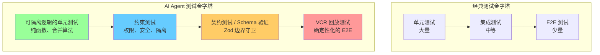
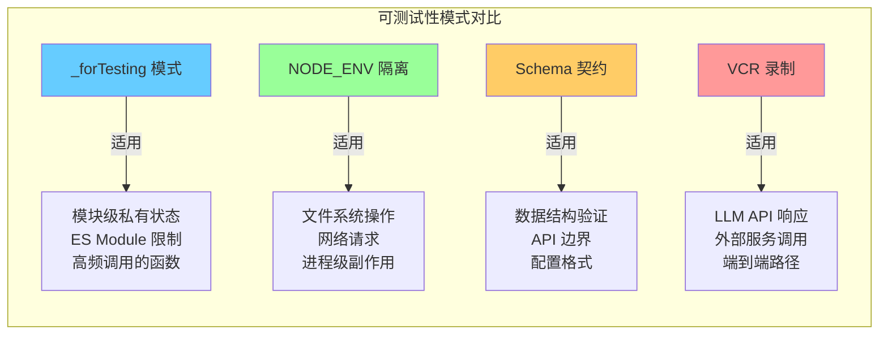

# 第 15 章：测试工程——验证一个不确定性系统

> **核心思想**：**在不确定性系统中，测试的对象不是输出，而是约束。系统必须不做什么，比系统会做什么更重要。**

---

## 15.1 AI Agent 测试的独特挑战

📖 **费曼式引入**

想象你是一家高档餐厅的质量检查员。对于一条流水线生产的饼干，你的工作很简单——拿出一块，测量直径是否为 5cm，重量是否为 30g，味道是否和标准样品一致。每块饼干应该一模一样，不一样就是缺陷。

但如果你要检查的是一位创意主厨的料理呢？每道菜都不一样——今天是松露意面，明天可能是分子料理甜点。你无法预测他下一道菜长什么样，味道如何。但你**可以**检查：食材有没有过期？有没有使用顾客申报的过敏原？厨房温度是否在安全范围内？盘子是否干净？

这就是 AI Agent 测试面临的根本困境。传统软件是"饼干工厂"——给定输入 `f(x)`，必须得到固定的输出 `y`。但 AI Agent 是"创意主厨"——同样的提示词，LLM 每次可能返回不同的工具调用序列、不同的文本措辞、不同的执行路径。

**你无法断言 AI Agent 的输出"是什么"，但你可以断言它"不是什么"。**

🔬 **从源码中看这个挑战的具体表现**

打开 `src/tools.ts` 第 244 行：

```typescript
// src/tools.ts:244
...(process.env.NODE_ENV === 'test' ? [TestingPermissionTool] : []),
```

这行代码揭示了一个深刻的设计选择：Claude Code 在测试环境下会注入一个专门的测试工具。这个工具不是用来验证"LLM 说了什么"，而是用来验证"权限系统是否正确拦截了未经授权的操作"。测试的对象是**约束**，不是**输出**。

再看 `src/services/vcr.ts` 中的 VCR（Video Cassette Recorder）系统：

```typescript
// src/services/vcr.ts:23-33
function shouldUseVCR(): boolean {
  if (process.env.NODE_ENV === 'test') {
    return true
  }
  if (process.env.USER_TYPE === 'ant' && isEnvTruthy(process.env.FORCE_VCR)) {
    return true
  }
  return false
}
```

VCR 系统将 API 响应录制为 fixture 文件，在测试时回放。这不是在测试"LLM 会生成什么"，而是在创造一个**确定性的隧道**，让你能在这个隧道中测试系统的其他部分——工具调度、权限检查、上下文管理——这些才是你能且应该严格验证的东西。

这就是 AI Agent 测试的第一条法则：**不要测试不确定性本身，把不确定性隔离起来，然后测试它周围的一切。**

---

## 15.2 测试金字塔的变形

经典的测试金字塔是：底层大量单元测试，中间少量集成测试，顶层极少的端到端测试。但对于 AI Agent 系统，这个金字塔发生了根本性的变形。



### 经典金字塔的四个失效点

**失效点 1：单元测试的覆盖率幻觉。** 你可以对 LLM 的 prompt 拼接函数写 100% 覆盖率的单元测试，但这完全无法保证 LLM 不会在某次调用中决定删除用户的整个 home 目录。

**失效点 2：端到端测试的不可重复性。** 传统 E2E 测试断言"点击按钮 A，页面显示文本 B"。但 AI Agent 的 E2E 测试怎么写？"发送提示词 A，AI 输出文本 B"——这个断言明天就会失败，因为 LLM 的输出本质上不确定。

**失效点 3：Mock 的语义真空。** 你可以 mock 掉 LLM API，返回一个固定的 JSON。但这个 mock 的行为和真实 LLM 之间的语义差距是巨大的——你在测试一个和真实系统完全不同的东西。

**失效点 4：集成测试的组合爆炸。** Agent 可以调用 57 个工具，每个工具有不同的输入空间。工具之间的调用序列是 LLM 动态决定的。你不可能穷举所有可能的工具调用链。

### AI Agent 的变形金字塔

Claude Code 的测试策略重新定义了每一层：

| 层级 | 经典含义 | AI Agent 含义 | Claude Code 实现 |
|------|----------|--------------|-----------------|
| **底层** | 纯函数单元测试 | 可隔离逻辑的纯函数测试 | `settingsMergeCustomizer`、config 解析 |
| **约束层** | 无对应 | 系统"不可越界"的约束验证 | 权限系统、`_forTesting` 状态重置 |
| **契约层** | API 契约测试 | Schema 作为运行时类型守卫 | Zod Schema 校验、`SettingsSchema` |
| **顶层** | E2E 回归 | VCR 录制/回放的确定性 E2E | `withVCR`、`withStreamingVCR` |

这个变形的核心洞察是：**在不确定性系统中，新增了一个"约束层"——它不测试系统做了什么，而测试系统没有越过哪些边界。**

---

## 15.3 `_forTesting` 模式：可测试性设计

在 Claude Code 的源码中，搜索 `_forTesting` 或 `ForTesting`，你会发现超过 **40 个**这样的导出。这不是偶然——这是一种系统级的可测试性设计模式。

### 模式剖析

看 `src/utils/config.ts` 最后几行：

```typescript
// src/utils/config.ts:1810-1817
// Exported for testing only
export const _getConfigForTesting = getConfig
export const _wouldLoseAuthStateForTesting = wouldLoseAuthState
export function _setGlobalConfigCacheForTesting(
  config: GlobalConfig | null,
): void {
  globalConfigCache.config = config
  globalConfigCache.mtime = config ? Date.now() : 0
}
```

这里发生了三件事：

1. **`_getConfigForTesting`**：将私有函数 `getConfig` 通过一个带 `_` 前缀的别名导出。`getConfig` 本身不在模块的公共 API 中——它是内部实现细节。但测试需要直接调用它来验证配置解析逻辑。

2. **`_wouldLoseAuthStateForTesting`**：同理，`wouldLoseAuthState` 是一个守卫函数，用来防止配置写入时意外丢失 OAuth 认证信息（GH #3117 修复的 bug）。这个函数不需要暴露给外部消费者，但测试必须能独立验证它。

3. **`_setGlobalConfigCacheForTesting`**：这是最关键的——它允许测试**注入**一个特定的缓存状态。生产代码中 `globalConfigCache` 是模块私有变量，外部无法触及。但测试需要在特定缓存状态下验证行为。

### 为什么用 `_` 前缀？

`_` 前缀是一种**社会契约**：它告诉所有开发者"这个导出只用于测试，不要在生产代码中依赖它"。这比以下替代方案更好：

- **`@internal` JSDoc 注解**：TypeScript 编译器不强制执行，只是文档。
- **拆分成独立的 `testUtils` 模块**：会导致循环依赖，因为测试辅助函数需要访问模块的私有状态。
- **通过依赖注入暴露所有内部状态**：过度设计，增加生产代码复杂度。

`_` 前缀是一种务实的妥协：它在不破坏模块封装的前提下，为测试开了一扇后门。

### `_forTesting` 的三种变体

纵观整个代码库，`_forTesting` 导出可以分为三种模式：

**模式 A：状态重置器（最常见）**

```typescript
// src/services/analytics/index.ts:170
export function _resetForTesting(): void { ... }

// src/utils/fullscreen.ts:199
export function _resetForTesting(): void { ... }

// src/utils/permissions/autoModeState.ts:35
export function _resetForTesting(): void { ... }
```

这些函数将模块的内部状态重置回初始值。它们解决的问题是：**测试隔离**。每个测试必须从干净的状态开始，否则测试 A 的副作用会污染测试 B。在真实运行中这些状态是进程生命周期的——它随进程启动而初始化，随进程退出而销毁。但测试在同一进程中运行多个用例，所以需要手动重置。

**模式 B：私有函数暴露器**

```typescript
// src/bridge/sessionRunner.ts:550
export { extractActivities as _extractActivitiesForTesting }

// src/utils/nativeInstaller/download.ts:523
export const _downloadAndVerifyBinaryForTesting = downloadAndVerifyBinary
```

这些将模块内部的私有函数以测试别名导出。核心理念是：**函数应该保持私有，但测试需要白盒访问**。

**模式 C：常量暴露器**

```typescript
// src/bridge/replBridge.ts:2403-2405
startWorkPollLoop as _startWorkPollLoopForTesting,
POLL_ERROR_INITIAL_DELAY_MS as _POLL_ERROR_INITIAL_DELAY_MS_ForTesting,
POLL_ERROR_MAX_DELAY_MS as _POLL_ERROR_MAX_DELAY_MS_ForTesting,
```

暴露内部常量让测试能精确断言超时、延迟等时序行为，而不必硬编码 magic number。

### 质量检查员的视角

回到餐厅比喻：`_forTesting` 就像厨房里专门为质检员设置的检查窗口。主厨在工作时不会通过这些窗口递东西（生产代码不使用这些导出），但质检员可以透过窗口检查食材储存温度（`_resetForTesting`）、查看秘制配方本身（`_extractActivitiesForTesting`）、核实定时器设置（`POLL_ERROR_INITIAL_DELAY_MS_ForTesting`）。

---

## 15.4 Schema-as-Contract

传统 API 测试中，你写一个断言："响应的 `status` 字段应该是 `'success'`"。但 AI Agent 系统的输入输出结构远比这复杂——配置文件有数十个嵌套字段，设置有来自不同来源的层级合并，权限规则有复杂的匹配逻辑。

Claude Code 的策略是：**用 Zod Schema 既做运行时验证，又做契约测试。Schema 本身就是测试。**

### SettingsSchema：一个活的契约

看 `src/utils/settings/types.ts` 中的 `SettingsSchema`：

```typescript
// src/utils/settings/types.ts:255-1073（简化展示核心结构）
export const SettingsSchema = lazySchema(() =>
  z
    .object({
      permissions: PermissionsSchema()
        .optional()
        .describe('Tool usage permissions configuration'),
      hooks: HooksSchema()
        .optional()
        .describe('Custom commands to run before/after tool executions'),
      sandbox: SandboxSettingsSchema().optional(),
      env: EnvironmentVariablesSchema()
        .optional()
        .describe('Environment variables to set for Claude Code sessions'),
      // ... 60+ 个字段
    })
    .passthrough(),
)
```

这个 Schema 做了四件事：

**1. 运行时验证。** 每次读取 settings 文件时，数据经过 `SettingsSchema().safeParse(data)`。格式错误会被捕获并报告，而不是默默传播到下游。

```typescript
// src/utils/settings/settings.ts:219
const result = SettingsSchema().safeParse(data)
if (!result.success) {
  const errors = formatZodError(result.error, path)
  return { settings: null, errors: [...ruleWarnings, ...errors] }
}
```

**2. 向后兼容性守卫。** 注意 `types.ts` 文件中长达 20 行的注释块：

```typescript
// src/utils/settings/types.ts:210-241（注释精华）
// ⚠️ BACKWARD COMPATIBILITY NOTICE ⚠️
// ✅ ALLOWED CHANGES:
// - Adding new optional fields (always use .optional())
// - Adding new enum values (keeping existing ones)
// ❌ BREAKING CHANGES TO AVOID:
// - Removing fields (mark as deprecated instead)
// - Removing enum values
// TO ENSURE BACKWARD COMPATIBILITY:
// 1. Run: npm run test:file -- test/utils/settings/backward-compatibility.test.ts
```

Schema 本身成了一种**契约测试的规范**。当有人修改 Schema 时，专门的后向兼容性测试会告诉你"你是否破坏了现有用户的配置文件"。这不是测试"输出正确"，而是测试"契约没被违反"。

**3. 渐进式迁移。** 看 `.passthrough()` 的使用——它允许 Schema 中未定义的字段通过验证而不被丢弃。这意味着：
- 老版本写入的未知字段不会被新版本的 Schema 删除
- 新字段可以安全添加而不影响老版本的配置读取
- 已弃用的字段可以保留在文件中供手动迁移

**4. 复杂约束的声明式表达。** 看 MCP 服务器条目的 `refine` 校验：

```typescript
// src/utils/settings/types.ts:142-157
.refine(
  data => {
    const defined = count([
      data.serverName !== undefined,
      data.serverCommand !== undefined,
      data.serverUrl !== undefined,
    ], Boolean)
    return defined === 1
  },
  {
    message:
      'Entry must have exactly one of "serverName", "serverCommand", or "serverUrl"',
  },
)
```

这个 `refine` 表达了一个互斥约束："三个字段中恰好有一个被定义"。在传统测试中，你需要写多个测试用例来覆盖所有非法组合。但 Zod 的 `refine` 把这个约束嵌入了 Schema 本身——它在每次数据进入系统时自动执行，效果等价于一个永远在运行的测试。

### Schema 是测试，还是生产代码？

答案是：**两者皆是。** 这就是 Schema-as-Contract 的核心洞察。在不确定性系统中，传统的"测试代码"和"生产代码"之间的边界变得模糊。Zod Schema 既是运行时的数据校验逻辑（生产代码），也是"数据必须满足这些约束"的自动化验证（测试代码）。

质检员的比喻：Zod Schema 就像餐厅入口的金属探测器。它不检查每位顾客穿什么衣服（不预测 LLM 输出），但它确保没有人带着武器进来（确保数据结构符合契约）。它同时是安保措施（生产代码）和安全检查（测试代码）。

---

## 15.5 配置系统的测试隔离

配置系统是 AI Agent 中最难测试的部分之一。配置影响一切——权限、模型选择、工具可用性、API 端点——但配置本身依赖文件系统、环境变量和进程状态。如何在不污染真实环境的前提下测试配置逻辑？

### NODE_ENV === 'test' 的隔离墙

Claude Code 在配置系统中建立了一道清晰的隔离墙：

```typescript
// src/utils/config.ts:764-770
const TEST_GLOBAL_CONFIG_FOR_TESTING: GlobalConfig = {
  ...DEFAULT_GLOBAL_CONFIG,
  autoUpdates: false,
}
const TEST_PROJECT_CONFIG_FOR_TESTING: ProjectConfig = {
  ...DEFAULT_PROJECT_CONFIG,
}
```

然后在每个配置读写函数中：

```typescript
// src/utils/config.ts:800-808（saveGlobalConfig 的测试分支）
export function saveGlobalConfig(
  updater: (currentConfig: GlobalConfig) => GlobalConfig,
): void {
  if (process.env.NODE_ENV === 'test') {
    const config = updater(TEST_GLOBAL_CONFIG_FOR_TESTING)
    if (config === TEST_GLOBAL_CONFIG_FOR_TESTING) {
      return
    }
    Object.assign(TEST_GLOBAL_CONFIG_FOR_TESTING, config)
    return
  }
  // ... 真实的文件系统写入逻辑
}
```

```typescript
// src/utils/config.ts:1044-1047（getGlobalConfig 的测试分支）
export function getGlobalConfig(): GlobalConfig {
  if (process.env.NODE_ENV === 'test') {
    return TEST_GLOBAL_CONFIG_FOR_TESTING
  }
  // ... 真实的缓存和文件读取逻辑
}
```

这种模式在 `getCurrentProjectConfig` 和 `saveCurrentProjectConfig` 中完全镜像。

### 隔离墙的设计考量

**为什么不用依赖注入？** 你可能会想：为什么不把文件系统操作抽象成接口，测试时注入 mock？Claude Code 确实在底层使用了 `getFsImplementation()` 进行 FS 抽象，但配置系统的隔离更彻底——它直接在函数入口处切换到内存中的对象。原因是：

1. **配置读取无处不在。** `getGlobalConfig()` 被数百个地方调用。如果每个调用点都要传入一个 FS 实例，代码会变得极其冗长。
2. **测试需要的不只是 FS mock。** 配置系统还涉及文件锁、备份逻辑、缓存一致性、watchFile 轮询。如果只 mock FS，你仍然需要处理这些复杂性。直接跳过所有文件系统操作，使用内存中的对象，更干净。
3. **性能。** 测试套件运行数千个用例。每次读写配置都经过文件系统（即使是 mock 的）会显著拖慢速度。

**为什么不用 Jest mock？** 源码中的注释直接回答了这个问题：

```typescript
// src/utils/config.ts:763
// We have to put this test code here because Jest doesn't support mocking ES modules :O
```

ES Module 的 mock 支持在 Jest 中一直是痛点。Claude Code 采用了一种更务实的方式：把测试桩（test stub）直接放在生产代码中，用 `NODE_ENV` 守卫隔离。

### 隔离的完整清单

搜索 `process.env.NODE_ENV === 'test'`，可以看到隔离点分布在系统的关键位置：

| 隔离点 | 文件 | 作用 |
|--------|------|------|
| 配置读写 | `utils/config.ts` | 切换到内存配置对象 |
| 遥测 | `services/analytics/config.ts` | 禁用所有数据上报 |
| 工具注册 | `tools.ts` | 注入 TestingPermissionTool |
| API 调用 | `services/vcr.ts` | 启用 VCR 录制/回放 |
| 上下文加载 | `context.ts` | 跳过某些初始化步骤 |
| 文件监控 | `utils/git/gitFilesystem.ts` | 缩短轮询间隔 |
| 渲染器 | `ink/reconciler.ts` | 跳过 UI 渲染副作用 |
| 自动更新 | `utils/autoUpdater.ts` | 禁用自动更新检查 |
| Shell 前缀 | `utils/shell/prefix.ts` | 简化 shell 环境 |
| 附件处理 | `utils/attachments.ts` | 跳过资源密集操作 |

这不是零散的 hack——这是一个**系统级的测试隔离策略**：在每个可能与外部世界交互的边界点，`NODE_ENV === 'test'` 充当一道隔离墙，把测试关在一个安全的沙箱中。

---

## 15.6 权限系统的测试策略

权限系统是 AI Agent 最关键的安全边界。如果权限系统有 bug，AI 可能在未经用户授权的情况下执行危险操作——删除文件、修改系统配置、执行恶意命令。权限系统的测试不是"nice to have"，而是"must have"。

### TestingPermissionTool：专为测试而生的工具

```typescript
// src/tools/testing/TestingPermissionTool.tsx（核心部分）
export const TestingPermissionTool: Tool<InputSchema, string> = buildTool({
  name: 'TestingPermission',
  isEnabled() {
    return "production" === 'test'  // 编译后始终为 false，仅测试环境注入
  },
  async checkPermissions() {
    return {
      behavior: 'ask' as const,
      message: `Run test?`
    }
  },
  async call() {
    return {
      data: `TestingPermission executed successfully`
    }
  },
  // ... 所有 render 方法返回 null
})
```

这个工具的设计值得仔细品味：

1. **`isEnabled()` 返回编译时常量 `false`。** 在生产构建中，`"production" === 'test'` 永远为 `false`。这个工具只通过 `tools.ts` 中的 `NODE_ENV` 检查注入测试环境。双重保险。

2. **`checkPermissions()` 总是返回 `'ask'`。** 这意味着每次调用都会触发权限对话框。测试可以借此验证：权限提示是否正确显示？用户拒绝后工具是否被阻止？权限记录是否正确保存？

3. **所有 `render` 方法返回 `null`。** 它不关心 UI 渲染——只关心权限流程。这是**最小化测试工具**的典范：只暴露你要测试的表面，其他一切为零。

4. **`call()` 返回简单字符串。** 不做任何真实操作。如果这个工具在生产环境被意外调用，唯一的副作用是一行无害的文本。防御性设计。

### 权限测试的"质检员"策略

对于权限系统，Claude Code 的测试策略可以归纳为：

**测试边界，不测试内容。** 你不需要测试"AI 是否会请求执行 `rm -rf /`"（你无法预测 AI 的行为）。你需要测试：
- 如果 AI **确实**请求了 `rm -rf /`，权限系统是否拦截它？
- 如果用户批准了一个工具，下次调用是否跳过权限提示？
- 如果设置中有 `deny` 规则匹配某个工具，该工具是否被隐藏？

看 `src/utils/settings/settings.ts` 中的权限相关函数：

```typescript
// src/utils/settings/settings.ts:877-889
export function hasSkipDangerousModePermissionPrompt(): boolean {
  return !!(
    getSettingsForSource('userSettings')?.skipDangerousModePermissionPrompt ||
    getSettingsForSource('localSettings')?.skipDangerousModePermissionPrompt ||
    getSettingsForSource('flagSettings')?.skipDangerousModePermissionPrompt ||
    getSettingsForSource('policySettings')?.skipDangerousModePermissionPrompt
  )
}
```

注意：`projectSettings` **故意被排除**。注释解释了原因："a malicious project could otherwise auto-bypass the dialog (RCE risk)"。这种"故意排除"本身就是一个可测试的约束——测试可以验证：即使 projectSettings 中设置了 `skipDangerousModePermissionPrompt: true`，权限对话框仍然会显示。

### 设置合并函数的测试暴露

```typescript
// src/utils/settings/settings.ts:538-547
// Custom merge function for lodash mergeWith when merging settings.
// Exported for testing.
export function settingsMergeCustomizer(
  objValue: unknown,
  srcValue: unknown,
): unknown {
  if (Array.isArray(objValue) && Array.isArray(srcValue)) {
    return mergeArrays(objValue, srcValue)
  }
  return undefined
}
```

`settingsMergeCustomizer` 被显式导出用于测试。合并逻辑是配置系统的核心——多个来源的设置如何合并直接决定了最终生效的权限规则。这个函数是纯函数，非常适合传统单元测试：给定两个数组，验证输出是去重后的并集。

---

## 15.7 遥测作为性能测试

大多数人把遥测（telemetry）视为运维工具——收集指标、画仪表盘、设告警。但在 Claude Code 中，遥测系统本身就是性能测试的基础设施。

### Perfetto Tracing 的测试接口

```typescript
// src/utils/telemetry/perfettoTracing.ts:1106-1120
export async function triggerPeriodicWriteForTesting(): Promise<void> {
  await periodicWrite()
}

export function evictStaleSpansForTesting(): void {
  evictStaleSpans()
}

export const MAX_EVENTS_FOR_TESTING = MAX_EVENTS
export function evictOldestEventsForTesting(): void {
  evictOldestEvents()
}
```

这三个 `ForTesting` 导出暴露了 Perfetto tracing 系统的内部操作：

- `triggerPeriodicWriteForTesting`：强制触发一次 trace 数据写入。正常运行中这是定时的，但测试需要同步控制。
- `evictStaleSpansForTesting`：手动驱逐过期的 span。测试可以验证：当 span 数量超过阈值时，旧的 span 是否被正确清理？
- `MAX_EVENTS_FOR_TESTING`：暴露事件上限常量。测试可以精确验证：当事件数达到 `MAX_EVENTS` 时，系统是否触发驱逐策略？

这些接口使得性能相关的行为变得可测试：你不需要运行系统数小时来观察内存是否泄漏——你可以程序化地注入大量 span、触发驱逐、验证结果。

### 遥测的测试隔离

```typescript
// src/services/analytics/config.ts:21,37
process.env.NODE_ENV === 'test' ||  // 在测试中禁用遥测
return process.env.NODE_ENV === 'test' || isTelemetryDisabled()
```

测试环境下遥测被完全禁用。这避免了两个问题：
1. 测试不会向遥测后端发送垃圾数据
2. 遥测的网络调用不会拖慢测试速度

但同时，遥测代码本身的逻辑（事件采样、缓冲、写入）仍然可以通过 `_forTesting` 接口独立测试。这是一种精巧的分层：**测试隔离了遥测的副作用，但保留了对遥测逻辑的可测试性。**

---

## 15.8 设计权衡

### 权衡 1：测试代码入侵生产代码

`_forTesting` 模式最大的争议是：测试辅助代码混入了生产代码。`src/utils/config.ts` 中有 10+ 行代码纯粹为测试服务（`TEST_GLOBAL_CONFIG_FOR_TESTING`、`_setGlobalConfigCacheForTesting` 等）。

**这有什么问题？**
- 增加了生产 bundle 大小（虽然 Tree-shaking 可以部分缓解）
- 模块的公共 API 表面变大，新开发者可能误用 `_forTesting` 导出
- `NODE_ENV === 'test'` 分支增加了代码路径复杂度

**为什么接受这个权衡？**
- ES Module 的 mock 限制使得替代方案更差
- `_` 前缀是足够清晰的社会信号
- 内存中的配置对象比 mock FS 更简单、更快
- 这些代码通常在模块末尾，不影响主逻辑的可读性

### 权衡 2：VCR 录制的维护成本

VCR fixture 需要定期更新。当 LLM 的行为变化（模型升级、prompt 调整）时，旧的 fixture 可能不再反映真实行为。Claude Code 的 VCR 系统通过 `VCR_RECORD=1` 环境变量支持重新录制，并且在 CI 环境中 fixture 缺失会直接报错：

```typescript
// src/services/vcr.ts:71-75
if ((env.isCI || process.env.CI) && !isEnvTruthy(process.env.VCR_RECORD)) {
  throw new Error(
    `Fixture missing: ${filename}. Re-run tests with VCR_RECORD=1, then commit the result.`,
  )
}
```

这是**显式失败优于默默降级**的设计——CI 中 fixture 缺失不会被忽略，而是立即阻断管道。

### 权衡 3：Schema 验证的宽容度

`SettingsSchema` 使用 `.passthrough()` 允许未知字段。这在向后兼容性上是优势，但也意味着拼写错误的字段名（如 `permisions` 而不是 `permissions`）会被静默忽略而不是报错。

Claude Code 的策略是：**宽容输入，严格内部。** Schema 在入口处宽容（`.passthrough()`），但在具体字段上严格（`z.enum()`、`.refine()`）。这是 Postel 法则——"对你接受的东西要宽容，对你发送的东西要严格"——在配置验证中的应用。



---

## 15.9 迁移指南

### 场景 1：为现有模块添加可测试性

**Before：**
```typescript
// myModule.ts
let cache: Map<string, Data> = new Map()

function processData(input: string): Data {
  if (cache.has(input)) return cache.get(input)!
  const result = expensiveComputation(input)
  cache.set(input, result)
  return result
}

export { processData }
```

**After：**
```typescript
// myModule.ts
let cache: Map<string, Data> = new Map()

function processData(input: string): Data {
  if (cache.has(input)) return cache.get(input)!
  const result = expensiveComputation(input)
  cache.set(input, result)
  return result
}

// 测试接口
export function _resetCacheForTesting(): void {
  cache.clear()
}

export { processData }
```

**原则：** 只添加 `_reset*ForTesting` 函数来重置状态。不要暴露缓存本身——测试不需要读取缓存内容，只需要确保每个测试用例从干净状态开始。

### 场景 2：为配置读取添加测试隔离

**Before：**
```typescript
export function getFeatureFlag(name: string): boolean {
  const config = readFileSync(CONFIG_PATH)
  return JSON.parse(config).features?.[name] ?? false
}
```

**After：**
```typescript
let testOverrides: Record<string, boolean> | null = null

export function getFeatureFlag(name: string): boolean {
  if (process.env.NODE_ENV === 'test' && testOverrides) {
    return testOverrides[name] ?? false
  }
  const config = readFileSync(CONFIG_PATH)
  return JSON.parse(config).features?.[name] ?? false
}

export function _setFeatureFlagOverridesForTesting(
  overrides: Record<string, boolean> | null
): void {
  testOverrides = overrides
}
```

**原则：** 测试分支在函数入口处，而不是在内部逻辑中。这保证了测试路径和生产路径的差异最小化。

### 场景 3：为 Zod Schema 添加契约测试

```typescript
// types.ts
export const MyConfigSchema = z.object({
  timeout: z.number().positive(),
  retries: z.number().int().min(0).max(10),
  mode: z.enum(['fast', 'safe', 'balanced']),
})

// backward-compatibility.test.ts
const KNOWN_VALID_CONFIGS = [
  { timeout: 30, retries: 3, mode: 'fast' },
  { timeout: 0.5, retries: 0, mode: 'safe' },
  { timeout: 100, retries: 10, mode: 'balanced' },
  // v2 新增的配置仍然兼容
  { timeout: 30, retries: 3, mode: 'fast', newField: 'ignored' },
]

for (const config of KNOWN_VALID_CONFIGS) {
  test(`backward compatible: ${JSON.stringify(config)}`, () => {
    expect(MyConfigSchema.passthrough().safeParse(config).success).toBe(true)
  })
}
```

**原则：** 维护一个"已知有效配置"的列表。每次修改 Schema 时，所有旧配置必须仍然通过验证。这就是 Claude Code 源码注释中提到的 `BACKWARD_COMPATIBILITY_CONFIGS` 方法。

---

## 15.10 费曼检验

> "如果你不能用简单的话向别人解释，说明你自己还没真正理解。"

**Q：AI Agent 的测试和传统软件测试有什么根本区别？**

传统测试断言"输出是 X"。AI Agent 测试断言"输出不是 Y"——不会越过权限边界，不会写入无效格式，不会丢失认证信息。你测试的是围栏，不是围栏里的动物会做什么。

**Q：`_forTesting` 模式的核心理念是什么？**

模块需要保持封装（外部不应依赖内部状态），但测试需要白盒访问（必须能重置状态、验证内部逻辑）。`_` 前缀是一种社会契约：它在不破坏模块封装的前提下，为测试开了一扇有标记的后门。

**Q：Zod Schema 如何同时充当生产代码和测试代码？**

Schema 在运行时验证每一条进入系统的数据（生产代码的职责）。但这个验证行为本身就等价于一个持续运行的测试——它断言"数据必须满足这些约束"。Schema 变更的向后兼容性测试则断言"所有旧的合法数据仍然通过验证"。

**Q：为什么 Claude Code 把测试辅助代码放在生产代码中，而不是测试文件中？**

因为 ES Module 不支持可靠的模块 mock。测试无法从外部替换模块的私有变量。把 `_forTesting` 函数放在模块内部是务实的妥协——它比 mock hack 更可靠、比依赖注入更简单、比拆分模块更少循环依赖。

**Q：VCR 测试的本质是什么？**

VCR 不是在测试 LLM 会说什么——它是在**消除**LLM 的不确定性，创造一个确定性的"录像带"。在这个确定性基础上，你可以测试系统的其他所有部分：工具调用是否正确路由？错误处理是否正确触发？上下文是否正确管理？

---

## 本章小结

| 维度 | 传统软件测试 | AI Agent 测试（Claude Code 实践） |
|------|-------------|----------------------------------|
| **测试对象** | 输出正确性 | 约束不被违反 |
| **核心断言** | `assertEquals(output, expected)` | `assertNever(violation)` |
| **不确定性处理** | 消除（给定输入=固定输出） | 隔离（VCR 录制、mock API） |
| **Schema 角色** | 文档 / 代码生成 | 运行时守卫 + 契约测试 |
| **测试隔离** | Mock / DI | `_forTesting` + `NODE_ENV` 守卫 |
| **金字塔形状** | 底宽顶窄（单元>集成>E2E） | 中间膨胀（约束层+契约层最厚） |
| **安全测试** | 渗透测试、漏洞扫描 | 权限边界的穷举验证 |

**核心法则回顾：**

1. **测试约束，不测试输出。** 在不确定性系统中，你无法预测输出，但你可以穷举约束。
2. **隔离不确定性。** 用 VCR 把 LLM 的不确定性"冻结"，然后测试冻结表面下的一切。
3. **Schema 即测试。** Zod Schema 是同时运行在生产和测试中的活文档。
4. **`_forTesting` 是务实的封装让步。** 不完美，但比所有替代方案都更实用。
5. **`NODE_ENV` 是系统级隔离开关。** 不是零散的 hack，而是贯穿 20+ 个模块的统一策略。

质量检查员的最终心得：你不能测试主厨会做出什么美食，但你可以确保厨房是干净的、食材是新鲜的、过敏原被正确标注。在 AI Agent 的世界里，**约束就是质量**。
