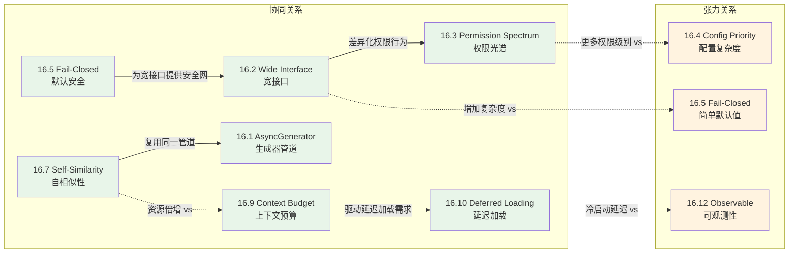
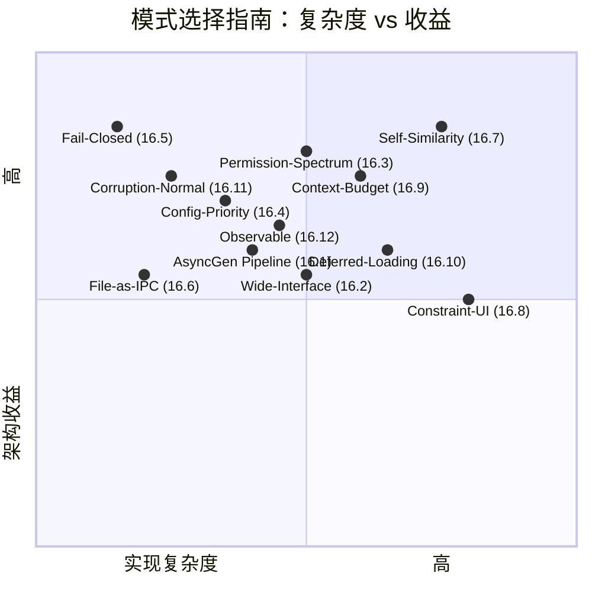

# 第 16 章：编程哲学总结——从 Claude Code 中可迁移的设计模式

> **核心思想**：每个成熟的大型系统都是一座"设计模式的矿"。Claude Code 的 512,000 行代码中凝结了 12 个可迁移的设计模式——它们不仅适用于 AI Agent，也适用于任何复杂的交互式系统。

---

前面 15 章，我们深入了 Claude Code 的每个子系统——从架构分层到工具契约，从权限模型到上下文压缩。现在退后一步，用"模式猎人"的视角重新审视整个代码库。本章不重复前面的源码分析，而是提炼出 12 个可以带走的设计模式，并讨论它们之间的张力。

每个模式的结构是：**定义 → 代码参照 → 迁移场景 → 与其他模式的张力**。

---

## 16.1 AsyncGenerator-as-Pipeline：用生成器编织多阶段流

**一句话定义**：将多阶段异步处理建模为 AsyncGenerator 链，每个阶段 yield 中间结果，让消费者决定何时拉取下一个。

**代码参照**（如第 2 章所述）：

```typescript
// src/query.ts — Agent 主循环
export async function* query(
  params: QueryParams,
): AsyncGenerator<
  StreamEvent | RequestStartEvent | Message | TombstoneMessage,
  Terminal
> {
  const terminal = yield* queryLoop(params, consumedCommandUuids)
  return terminal
}
```

`query()` 是一个 AsyncGenerator，它 yield 出流事件（StreamEvent）、消息、进度——消费者（REPL UI 或 SDK）按需拉取。`queryLoop` 内部再 `yield*` 给子生成器，形成流水线。

**迁移场景**：假设你在构建一个日志处理管道——采集、过滤、聚合、输出四个阶段。传统做法是 callback 嵌套或 RxJS。AsyncGenerator 方案：

```typescript
async function* collect(source) { /* yield raw logs */ }
async function* filter(upstream) { for await (const log of upstream) if (log.level >= 'warn') yield log }
async function* aggregate(upstream) { /* batch and yield summaries */ }

// 组装管道——惰性求值，背压天然内置
for await (const summary of aggregate(filter(collect(source)))) {
  dashboard.update(summary)
}
```

**张力**：AsyncGenerator 的背压语义（消费者不拉就不产生）与"尽快推送"的实时需求冲突。Claude Code 通过在 UI 层做缓冲来平衡（如第 11 章所述的渲染优化）。

---

## 16.2 Interface-Width-as-Control：宽接口给每个实现者留出差异化空间

**一句话定义**：刻意设计宽接口（~25 个方法），让每个实现者通过覆盖不同子集来表达自己的独特性。

**代码参照**（如第 3 章所述）：

```typescript
// src/Tool.ts — Tool 接口包含 ~25 个方法
export type Tool<Input, Output, P> = {
  name: string
  call(...): Promise<ToolResult<Output>>
  description(...): Promise<string>
  inputSchema: Input
  isReadOnly(input): boolean
  isDestructive?(input): boolean
  isConcurrencySafe(input): boolean
  isEnabled(): boolean
  shouldDefer?: boolean
  checkPermissions?(...): Promise<PermissionResult>
  validateInput?(...): Promise<ValidationResult>
  interruptBehavior?(): 'cancel' | 'block'
  isSearchOrReadCommand?(input): { isSearch; isRead; isList? }
  maxResultSizeChars: number
  // ... 更多方法
}
```

57 个工具共享同一个接口，但每个工具通过覆盖不同方法来表达差异：BashTool 覆盖 `isDestructive`、`interruptBehavior`；FileReadTool 标记 `isReadOnly: true`；MCP 工具设置 `shouldDefer`。

**迁移场景**：假设你在设计一个支付系统的 PaymentProvider 接口。窄接口（只有 `charge()`）迫使所有提供者看起来一样。宽接口让你表达差异：

```typescript
interface PaymentProvider {
  charge(amount, currency): Promise<Result>
  refund?(transactionId): Promise<Result>       // 不是所有都支持
  supportsRecurring(): boolean                    // 差异化能力
  requiresRedirect(): boolean                     // 影响 UI 流程
  webhookVerify?(payload, signature): boolean     // 安全模型差异
  estimatedSettlementTime(): Duration             // 运营差异
}
```

**张力**：宽接口增加实现者的认知负担。Claude Code 用 `buildTool()` 的默认值（模式 16.5）来缓解——你只需要覆盖你关心的部分。

---

## 16.3 Permission-as-Spectrum：安全是光谱而非开关

**一句话定义**：将权限设计为从"完全限制"到"完全放行"的连续光谱，让用户在安全与效率之间找到自己的平衡点。

**代码参照**（如第 5 章所述）：

```typescript
// src/types/permissions.ts
export const EXTERNAL_PERMISSION_MODES = [
  'default',        // 每次都问（最安全）
  'acceptEdits',    // 自动允许编辑，危险操作仍问
  'plan',           // 只读——只规划不执行
  'bypassPermissions', // 全部允许（最高效）
  'dontAsk',        // 静默拒绝未预批准的操作
] as const
```

再结合 `alwaysAllowRules`、`alwaysDenyRules`、`alwaysAskRules` 三个规则集，用户可以在 tool 粒度上微调权限光谱。

**迁移场景**：假设你在构建一个 CI/CD 系统。不要只有"admin"和"viewer"两个角色。设计一个光谱：

| 级别 | 能力 |
|------|------|
| observer | 查看 pipeline 状态 |
| trigger | 手动触发已定义的 pipeline |
| configure | 修改 pipeline 配置 |
| deploy-staging | 部署到 staging |
| deploy-production | 部署到 production（需要审批） |
| admin | 完全控制 |

关键洞察：光谱中的每个位置都是一个合法的使用模式，不是"降级"。

**张力**：更多的权限级别意味着更复杂的权限检查逻辑。Claude Code 通过将权限检查集中在 `checkPermissions` 和工具编排层来控制复杂度（如第 5 章所述）。

---

## 16.4 Config-Priority-as-Trust：配置层映射信任层级

**一句话定义**：多层配置的合并优先级应该映射到信任级别——越近的、越受控的源优先级越高。

**代码参照**（如第 4 章所述）：

```
Claude Code 的配置优先级（从低到高）：
1. 硬编码默认值（createDefaultGlobalConfig()）
2. 全局配置（~/.claude/settings.json）— 用户级
3. 企业配置（/etc/claude/settings.json）— 组织级，可强制覆盖
4. 项目配置（.claude/settings.json）— 项目级
5. 命令行参数（--permission-mode）— 会话级
6. 环境变量（CLAUDE_CODE_*）— 运行时级
```

企业配置的特殊之处：它可以设置 `alwaysDeny` 规则，项目级和用户级无法覆盖。这是"高信任源可以设置下限"的表达。

**迁移场景**：在任何 SaaS 产品中设计多租户配置：

```
Platform defaults < Org admin settings < Team settings < User preferences < Session overrides
```

关键规则：
- **向上合并**：低优先级填充空缺
- **向下限制**：高信任层可以设置不可覆盖的约束（如企业禁用某些工具）
- **同层覆盖**：同优先级的后写入覆盖先写入

**张力**：配置层越多，调试"为什么这个配置值是这样"越难。Claude Code 的 `getConfig()` 通过合并 `createDefault()` 和文件内容的简单展开（`{ ...createDefault(), ...parsedConfig }`）来保持可预测性。

---

## 16.5 Fail-Closed-by-Default：`buildTool()` 的默认值哲学

**一句话定义**：当工具/模块忘记声明某个安全相关的属性时，系统应该默认选择更安全的行为。

**代码参照**（如第 3 章所述）：

```typescript
// src/Tool.ts — buildTool 的默认值
const TOOL_DEFAULTS = {
  isEnabled: () => true,
  isConcurrencySafe: (_input?) => false,  // 假设不安全
  isReadOnly: (_input?) => false,          // 假设会写入
  isDestructive: (_input?) => false,       // 假设不破坏
  checkPermissions: (input) =>
    Promise.resolve({ behavior: 'allow', updatedInput: input }),
  toAutoClassifierInput: (_input?) => '',  // 跳过分类器
}
```

注意 `isConcurrencySafe` 默认 `false`——如果工具开发者忘记声明，系统不会并发执行它，这是安全的。`isReadOnly` 默认 `false`——忘记声明的工具会被当作写操作，需要权限检查。

**迁移场景**：在任何插件系统中，定义安全敏感的默认值：

```typescript
// 数据库查询插件系统
const QUERY_DEFAULTS = {
  maxRows: 1000,           // 不是 Infinity
  timeout: 30_000,         // 不是无限等待
  isolation: 'read_committed', // 不是 'read_uncommitted'
  allowMutation: false,    // 默认只读
  retryOnFailure: false,   // 默认不重试（幂等性未知）
}
```

**张力**：Fail-closed 默认值降低了新工具开发者的"首次成功"体验——一切都被锁定。Claude Code 通过 `buildTool()` 的文档注释（"Defaults (fail-closed where it matters)"）明确传达了这个设计意图。

---

## 16.6 File-as-IPC：用文件系统做进程间通信

**一句话定义**：当进程间需要共享状态时，用文件系统作为中介——它是最古老、最可靠、最可调试的 IPC 机制。

**代码参照**（如第 8 章所述）：

```typescript
// src/utils/sessionStorage.ts — 会话转录写入文件
await writeFile(path, JSON.stringify(metadata))

// src/services/autoDream/consolidationLock.ts — PID 锁文件
await writeFile(path, String(process.pid))
// 验证：
if (parseInt(verify.trim(), 10) !== process.pid) return null

// src/services/mcp/config.ts — 原子写入
const tempPath = `${mcpJsonPath}.tmp.${process.pid}.${Date.now()}`
```

Claude Code 大量使用文件来实现 IPC：
- **会话转录**：每个会话写入 JSON 文件，子 Agent 的转录写入子目录
- **PID 锁**：用文件写入 PID 实现互斥
- **原子更新**：写临时文件 + rename，避免半写状态
- **Scratchpad**：子 Agent 通过文件系统共享工作产物

**迁移场景**：在微服务架构中，当两个服务需要共享大型数据集时：

```
# 不是通过 HTTP 传输 50MB 的 JSON
Service A → /shared/exports/dataset-{uuid}.jsonl
Service B ← watches /shared/exports/ with inotify

# 优势：
# - 可以 cat 文件来调试
# - 崩溃后数据不丢失
# - 不需要额外的消息队列基础设施
```

**张力**：File-as-IPC 的延迟高于共享内存或 Unix Socket，且依赖文件系统的一致性保证。Claude Code 通过将文件操作限制在本地 SSD 上、使用原子写入模式来缓解。

---

## 16.7 Recursive-Self-Similarity：子 Agent 运行与父 Agent 相同的循环

**一句话定义**：系统的子单元应该是系统本身的缩小版——相同的核心循环、相同的工具接口、相同的权限模型。

**代码参照**（如第 6 章所述）：

```typescript
// src/tools/AgentTool/runAgent.ts
const agentToolUseContext = createSubagentContext(toolUseContext, {
  options: agentOptions,
  agentId,
  messages: initialMessages,
  readFileState: agentReadFileState,
  abortController: agentAbortController,
})

// 子 Agent 调用的是同一个 query() 函数
// query() → API 调用 → 工具执行 → query()
// 递归深度由 queryTracking.depth 控制
```

子 Agent 不是一个特殊的"轻量级"执行器——它运行的是与主 Agent 完全相同的 `query()` 循环，拥有同样的工具池、同样的权限检查、同样的上下文压缩。`createSubagentContext` 只是调整了共享/隔离边界。

**迁移场景**：在工作流引擎中，子工作流应该是工作流引擎本身的实例：

```typescript
// 不要这样：
class SubWorkflow {
  // 完全不同的执行模型...
}

// 而是这样：
function executeWorkflow(definition, context) {
  for (const step of definition.steps) {
    if (step.type === 'sub-workflow') {
      // 递归调用同一个函数，只是 context 不同
      await executeWorkflow(step.subDefinition, createChildContext(context))
    } else {
      await executeStep(step, context)
    }
  }
}
```

**张力**：自相似性意味着子 Agent 的资源消耗与父 Agent 相同。Claude Code 通过 `maxTurns` 限制和独立的 `abortController` 来控制递归深度和资源消耗。

---

## 16.8 Constraint-Driven-UI：终端约束下的 React 声明式模型

**一句话定义**：即使在严苛的输出约束下（终端宽度、无鼠标、有限颜色），仍然使用声明式 UI 模型——约束驱动创新而非限制。

**代码参照**（如第 11 章所述）：

```
Claude Code 的 UI 栈：
React (JSX 声明) → Ink 自定义 fork → Yoga 布局引擎 → ANSI 渲染

src/ink/ 目录：~50 个文件
- reconciler.ts   — React reconciler 适配
- layout/yoga.ts  — Yoga flexbox 布局
- screen.ts       — 虚拟屏幕缓冲
- renderer.ts     — 差异化 ANSI 输出
```

终端的约束清单：固定宽度（通常 80-200 列）、无像素级定位、有限的颜色空间、单向滚动。在这些约束下，Claude Code 仍然实现了一个完整的 React 渲染管线：组件树 → Yoga 布局 → 虚拟屏幕 → ANSI 差异更新。

**迁移场景**：在嵌入式设备的 LCD 屏幕（128x64 像素）上构建 UI：

```
不要放弃声明式模型！

PixelComponent tree → Layout engine → Frame buffer → LCD driver

约束反而简化了决策：
- 128px 宽 → 不需要响应式断点
- 单色 → 不需要颜色系统
- 无触摸 → 不需要手势处理
- 低刷新率 → 差异更新收益巨大
```

**张力**：声明式模型的抽象层增加了性能开销。在 Claude Code 中，每次按键都触发重新渲染——但通过虚拟屏幕差异和字符串宽度缓存（如第 11 章所述），实际 I/O 被最小化了。

---

## 16.9 Context-Budget-Thinking：有限窗口中的最优信息留存

**一句话定义**：当工作空间有固定大小限制时（上下文窗口、磁盘配额、内存限制），主动管理信息的保留和淘汰策略。

**代码参照**（如第 9 章所述）：

```typescript
// src/services/compact/autoCompact.ts
// 上下文窗口接近上限时自动触发压缩
const autocompactThreshold = contextWindowSize - maxOutputTokens
// 计算剩余预算百分比
const budgetPercent = Math.round(
  ((threshold - tokenUsage) / threshold) * 100
)

// src/utils/toolResultStorage.ts — 工具结果超限时写入文件
// maxResultSizeChars: 超过此限制的结果被持久化到磁盘
// Claude 收到的是预览 + 文件路径，而非完整内容
```

Claude Code 的上下文预算管理是多层次的：
1. **预防层**：工具结果超限时写文件（减少注入量）
2. **监控层**：每次 API 调用后计算 token 使用率
3. **压缩层**：接近阈值时触发对话压缩
4. **淘汰层**：压缩后 token 仍超标则再次压缩

**迁移场景**：在移动端 App 的本地存储管理中：

```typescript
class StorageBudget {
  private budget = 50 * 1024 * 1024 // 50MB

  // 预防：大资源直接流式处理，不缓存
  shouldCache(resource): boolean {
    return resource.size < this.budget * 0.1 // 单个不超过 10%
  }

  // 监控：定期检查总用量
  async checkBudget() {
    const usage = await this.calculateUsage()
    if (usage > this.budget * 0.8) this.triggerEviction()
  }

  // 淘汰：LRU + 优先级混合策略
  async triggerEviction() {
    const entries = await this.listByPriority()
    while (this.usage > this.budget * 0.6) {
      await this.evict(entries.pop())
    }
  }
}
```

**张力**：激进的淘汰策略提高了预算利用率，但可能丢弃有价值的上下文。Claude Code 的压缩策略是让模型自己总结对话——这是一个"有损压缩"过程，总结质量取决于模型能力。

---

## 16.10 Deferred-Loading-for-Scale：运行时自适应的工具发现

**一句话定义**：当系统的能力集合超过单次呈现的容量时，按需加载——让系统在运行时发现自己需要什么。

**代码参照**（如第 3 章所述）：

```typescript
// src/Tool.ts — 工具可以标记为延迟加载
readonly shouldDefer?: boolean  // 设置 defer_loading: true
readonly alwaysLoad?: boolean   // 永不延迟

// 使用 ToolSearch 工具在运行时发现延迟加载的工具
// 模型先调用 ToolSearch("notebook edit")
// → 系统返回匹配的工具定义
// → 模型再调用实际工具
```

57 个内置工具 + 无限的 MCP 工具——不可能全部放入 system prompt。Claude Code 的方案：核心工具始终加载，非核心工具通过 `shouldDefer` 标记为延迟加载，模型通过 `ToolSearch` 工具按需发现。

**迁移场景**：在 IDE 的插件系统中：

```typescript
// 启动时只加载清单
const pluginManifests = loadManifests() // 轻量：名称 + 描述 + 激活条件

// 用户打开 .py 文件时
function onFileOpen(file) {
  const needed = pluginManifests.filter(p =>
    p.activationEvents.includes(`onLanguage:${file.language}`)
  )
  for (const manifest of needed) {
    if (!manifest.loaded) {
      manifest.instance = await loadPlugin(manifest.path) // 按需加载
    }
  }
}
```

**张力**：延迟加载增加了首次使用的延迟（cold start）。Claude Code 通过 `ToolSearch` 的 `searchHint` 字段提供关键词索引来加速发现，且 `alwaysLoad` 可以豁免关键工具。

---

## 16.11 Corruption-as-Normal：将损坏视为常态而非异常

**一句话定义**：配置文件会损坏、网络会中断、进程会崩溃——不要为此抛出异常并退出，而是优雅降级。

**代码参照**（如第 4 章所述）：

```typescript
// src/utils/config.ts — 配置文件损坏处理
function getConfig<A>(file, createDefault, throwOnInvalid?): A {
  try {
    const parsedConfig = jsonParse(stripBOM(fileContent))
    return { ...createDefault(), ...parsedConfig }
  } catch (error) {
    if (error instanceof ConfigParseError) {
      // 1. 记录错误日志
      logForDebugging(`Config file corrupted, resetting to defaults`)
      // 2. 备份损坏文件（供用户稍后恢复）
      const corruptedBackupDir = getConfigBackupDir()
      // 3. 返回默认配置——系统继续运行
      return createDefault()
    }
  }
}
```

损坏不是"bug"——它是现实世界的常态。Claude Code 的 `getConfig` 对此的处理链是：检测 → 记录 → 备份损坏文件 → 使用默认值继续运行。用户不会看到崩溃，只会看到一条通知。

**迁移场景**：在任何读取外部数据的系统中：

```typescript
// 数据库连接的 Corruption-as-Normal 模式
class ResilientConnection {
  async query(sql) {
    try {
      return await this.primary.query(sql)
    } catch (e) {
      if (isCorruptionError(e)) {
        // 1. 记录，不崩溃
        logger.warn('Primary connection corrupt, failover', { error: e })
        // 2. 自动故障转移
        return await this.replica.query(sql)
      }
      if (isTimeoutError(e)) {
        // 3. 降级：返回缓存数据 + 标记为过期
        return { data: this.cache.get(sql), stale: true }
      }
      throw e // 只有真正不可恢复的错误才抛出
    }
  }
}
```

**张力**：将损坏视为常态可能掩盖真正的 bug。Claude Code 通过 analytics 事件（`logEvent('tengu_config_parse_error')`）来监控损坏频率——如果损坏率突然上升，那就不是"常态"而是 bug。

---

## 16.12 Observable-Internals：从可观测到可控的运行时内省

**一句话定义**：系统的内部状态应该是可观测的——不是通过调试器，而是通过系统自身暴露的接口。

**代码参照**（如第 10 章所述）：

```typescript
// src/Tool.ts — 工具进度上报
type ToolCallProgress<P> = (progress: ToolProgress<P>) => void

// 每个工具通过 onProgress 回调暴露执行状态
call(args, context, canUseTool, parentMessage, onProgress?)

// src/types/tools.ts — 结构化的进度类型
type BashProgress = { type: 'bash_progress'; command; stdout; stderr }
type AgentToolProgress = { type: 'agent_progress'; agentId; content }
type MCPProgress = { type: 'mcp_progress'; serverName; data }
```

Claude Code 的每个工具都通过类型化的 `onProgress` 回调暴露内部状态。UI 层消费这些进度事件来显示 spinner、streaming output、进度条。SDK 消费者可以用同样的接口构建自定义 UI。

**迁移场景**：在机器学习训练框架中：

```typescript
interface TrainingObserver {
  onEpochStart(epoch: number, totalEpochs: number): void
  onBatchComplete(batch: number, loss: number, metrics: Metrics): void
  onCheckpointSaved(path: string, metrics: Metrics): void
  onGradientAnomaly(layer: string, norm: number): void
  onMemoryPressure(usage: MemoryStats): void
}

// 观测不只是"看"——它驱动控制
class AdaptiveLRObserver implements TrainingObserver {
  onBatchComplete(batch, loss) {
    if (this.detectPlateau(loss)) {
      this.trainer.adjustLearningRate(0.5) // 从观测到控制
    }
  }
}
```

**张力**：过多的可观测性事件增加了运行时开销和 API 表面积。Claude Code 通过让 `onProgress` 成为可选参数来平衡——不需要观测的场景不付出任何成本。

---

## 16.13 模式之间的张力

12 个模式不是孤立存在的——它们之间有协作也有冲突。



### 关键张力对

**1. 自相似性 (16.7) vs 上下文预算 (16.9)**

子 Agent 运行完整的 `query()` 循环——这意味着每个子 Agent 消耗独立的上下文窗口。3 层嵌套的子 Agent 就是 3 倍的 token 消耗。Claude Code 的平衡策略：子 Agent 有独立的 `maxTurns` 限制，且子 Agent 的结果被压缩后返回给父 Agent。

**2. 宽接口 (16.2) vs Fail-Closed (16.5)**

接口越宽，需要设置安全默认值的方法越多。如果 `Tool` 接口有 25 个方法，`buildTool()` 就需要为所有安全相关的方法提供 fail-closed 默认值。Claude Code 的平衡策略：`TOOL_DEFAULTS` 只为安全相关的方法提供默认值（`isConcurrencySafe: false`），功能性方法（如 `description`）必须由工具自己实现。

**3. 延迟加载 (16.10) vs 可观测性 (16.12)**

延迟加载的工具在被发现之前是不可观测的——你无法监控一个尚未加载的工具的状态。Claude Code 的平衡策略：`ToolSearch` 本身是一个可观测的工具，它的调用和结果都暴露给 UI 层。

**4. 权限光谱 (16.3) vs 配置优先级 (16.4)**

更细粒度的权限需要更复杂的配置合并逻辑。当企业配置说 `alwaysDeny: BashTool`，用户配置说 `alwaysAllow: BashTool` 时，谁赢？Claude Code 的答案明确：高信任源（企业）的 deny 规则不可覆盖。

### 模式适用性矩阵



**从图中可以读出三条建议**：

1. **先做左上角**：Fail-Closed 和 Corruption-as-Normal 是成本最低、收益最高的模式。任何项目都应该首先采用。

2. **中间区域按需选择**：Config-Priority、Permission-Spectrum、Observable-Internals 在系统达到一定规模后才值得投入。

3. **右侧是架构级决策**：Self-Similarity 和 Constraint-Driven-UI 是系统设计之初就需要决定的——它们改变的是系统的基本形状，而非局部优化。

---

## 16.14 费曼检验

理查德·费曼说："如果你不能简单地解释某件事，你就没有真正理解它。"让我们用一句话检验对每个模式的理解：

| # | 模式 | 一句话费曼解释 |
|---|------|--------------|
| 1 | AsyncGenerator-as-Pipeline | 用"你拉一个我给一个"的方式串起多个处理阶段，天然带背压。 |
| 2 | Interface-Width-as-Control | 接口留足 25 个"槽位"，让 57 个工具各自决定填哪些。 |
| 3 | Permission-as-Spectrum | 安全不是"开/关"，而是一把有 6 个档位的旋钮。 |
| 4 | Config-Priority-as-Trust | 离你越近的配置越优先，但老板的"禁令"谁也覆盖不了。 |
| 5 | Fail-Closed-by-Default | 忘记说明的属性默认选最安全的值——宁可多问一句，不可悄悄放行。 |
| 6 | File-as-IPC | 进程间传数据？写文件——最古老、最可调试、崩溃后还在。 |
| 7 | Recursive-Self-Similarity | 子 Agent 就是一个缩小版的父 Agent，跑的是同一段代码。 |
| 8 | Constraint-Driven-UI | 终端只有 80 列？正好用 React + Yoga 做声明式布局。 |
| 9 | Context-Budget-Thinking | 上下文窗口像钱包——花之前先看余额，快花光了就压缩旧信息。 |
| 10 | Deferred-Loading-for-Scale | 57 个工具太多了？先展示 10 个，其余的让模型自己搜。 |
| 11 | Corruption-as-Normal | 配置文件坏了？备份它，用默认值继续——别崩溃。 |
| 12 | Observable-Internals | 每个工具都有一根"进度线"，拉一拉就知道它在干什么。 |

如果你能不看上表，用自己的话复述每个模式，说明你真正理解了。

---

## 本章小结

1. **12 个模式不是 Claude Code 特有的**——它们是复杂交互式系统的通用模式。你可以在数据库、编译器、操作系统、游戏引擎中找到它们的变体。

2. **模式的价值不在于"正确"，而在于"明确"**。当团队共享"我们用 Permission-as-Spectrum"这个词汇时，讨论的效率会大幅提升——不需要每次都从头解释为什么权限不是二元的。

3. **模式之间的张力比模式本身更重要**。知道 12 个模式是入门，知道何时在 Self-Similarity 和 Context-Budget 之间做取舍才是进阶。

4. **从左上角开始**。如果你只能从 12 个模式中选 3 个立即应用，选 Fail-Closed-by-Default、Corruption-as-Normal、Config-Priority-as-Trust——它们的实现成本最低，收益最可衡量。

5. **模式是语言，不是法律**。Claude Code 的代码库里，这 12 个模式没有写在任何设计文档里——它们是从 512,000 行代码中浮现的。真正的好模式不需要被"执行"，它们在解决问题的过程中自然生长。

> **最后一个迁移建议**：回到你自己的项目，带着这 12 个模式的眼镜重新审视代码。你会发现，有些模式你已经在无意识地使用了——给它们命名，让它们从隐性知识变成团队共识。
