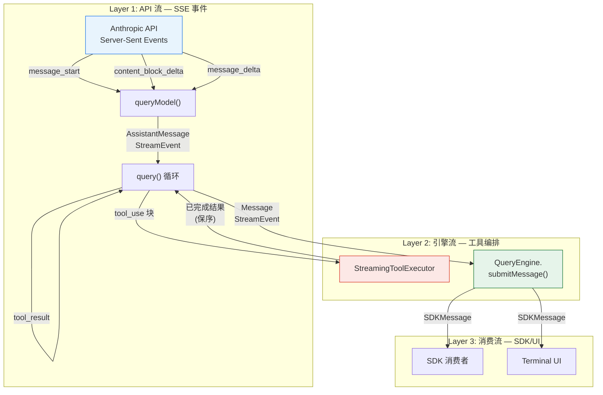
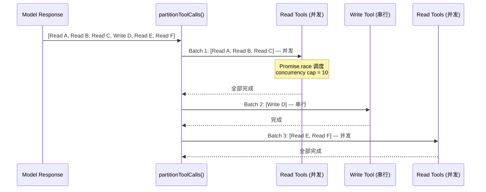
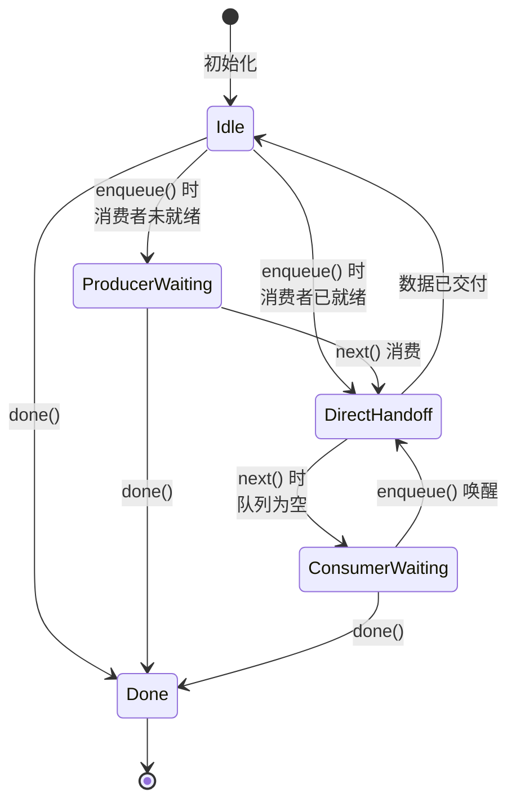

# 第 6 章：流式架构——从第一个 byte 到最后一个 token

> **核心思想**：在 LLM 应用中，**延迟不是性能问题，而是用户体验问题**。Claude Code 的流式架构横跨 API 响应到终端像素。核心哲学：数据应该"流过"系统，而不是"存在"系统里。

---

## 6.1 为什么流式比批式更重要？

**费曼式引入**

想象一条汽车装配线。在福特发明流水线之前，一辆车从头到尾由一个小组完成——你必须等整辆车装完才能开始下一辆。流水线的革命性在于：底盘刚焊好，发动机就开始装配；发动机还没装完，内饰团队已经在准备。每个零件都在"流过"产线，而不是"停在"某个工位等待所有工序完成。

LLM 应用面临完全相同的问题。一次 Claude API 调用可能需要 5-30 秒才能完成全部输出。如果用批式模型——等模型说完再显示——用户会盯着一个空白终端半分钟，然后一大段文字突然出现。这种体验是灾难性的。

**但流式架构的价值远不止"让字符逐个出现"。** 在 Claude Code 中，流式解决了三个层次的问题：

| 层次 | 批式的痛点 | 流式的解法 |
|------|-----------|-----------|
| 感知延迟 | 用户觉得系统"卡死了" | 第一个 token 在 ~200ms 内出现 |
| 工具执行 | 等所有 tool_use 块解析完才开始执行 | tool_use 块一完成就立即启动 |
| 中断控制 | 要么全做完，要么全丢弃 | 任意时刻可以优雅中断 |

看 `query.ts` 中的关键行——当流式工具执行开启时，工具在模型还在输出时就开始执行：

```typescript
// src/query.ts:838-844
if (
  streamingToolExecutor &&
  !toolUseContext.abortController.signal.aborted
) {
  for (const toolBlock of msgToolUseBlocks) {
    streamingToolExecutor.addTool(toolBlock, message)
  }
}
```

这就是装配线思维：底盘（第一个 tool_use 块）一出来，发动机工位（工具执行器）就开始工作，不用等整个模型响应（整辆车）完成。

---

## 6.2 三层流模型

Claude Code 的流式架构可以分为三个清晰的层次，每一层解决不同的问题：



**Layer 1：API 流** 负责将 Anthropic API 的 SSE（Server-Sent Events）转换为内部消息类型。关键在 `claude.ts` 的 `queryModel()` 函数中：

```typescript
// src/services/api/claude.ts:1940-1977 (简化)
for await (const part of stream) {
  resetStreamIdleTimer()
  // ...
  switch (part.type) {
    case 'message_start':
      partialMessage = part.message
      ttftMs = Date.now() - start
      usage = updateUsage(usage, part.message?.usage)
      break
    case 'content_block_start':
      // 初始化 contentBlocks[part.index]
      break
    case 'content_block_delta':
      // 增量累积 text/json/thinking 内容
      break
    case 'content_block_stop':
      // 完成一个 content block，yield AssistantMessage
      break
    case 'message_delta':
      // 更新 usage、stop_reason
      break
  }
}
```

注意这里没有任何"先收集所有事件再处理"的逻辑。每个 SSE 事件到达时都立即处理，就像装配线上每个零件到达工位时就立即加工。

**Layer 2：引擎流** 是最精巧的一层。`query.ts` 中的主循环同时做三件事：
1. 消费 Layer 1 的输出（模型响应）
2. 将 tool_use 块实时交给 `StreamingToolExecutor`
3. 轮询已完成的工具结果并 yield 给 Layer 3

```typescript
// src/query.ts:847-862 (简化)
if (streamingToolExecutor && !aborted) {
  for (const result of streamingToolExecutor.getCompletedResults()) {
    if (result.message) {
      yield result.message
      toolResults.push(/* ... */)
    }
  }
}
```

**Layer 3：消费流** 在 `QueryEngine.submitMessage()` 中，将引擎消息转换为 SDK 协议消息。它处理 transcript 持久化、usage 累积、budget 检查，并最终 yield 给外部消费者。

这三层的关键设计原则是：**每一层都是 AsyncGenerator，通过 `yield` 连接。** 数据像水流一样从 Layer 1 流向 Layer 3，没有任何中间缓冲区要求"全部到齐"。

---

## 6.3 StreamingToolExecutor 的队列模型

`StreamingToolExecutor` 是整个流式架构中最精妙的组件。让我们用装配线的比喻来理解它。

**问题场景**：模型可能在一次响应中请求多个工具调用。比如"读取 3 个文件，然后写入 1 个文件"。如果等所有 tool_use 块流完再执行，就浪费了宝贵的时间。但如果盲目并行执行所有工具，写操作可能在读操作之前完成，导致数据不一致。

**解法：带并发控制的流式队列。**

每个工具在其生命周期中经历四个状态：

```
queued → executing → completed → yielded
```

```typescript
// src/services/tools/StreamingToolExecutor.ts:19
type ToolStatus = 'queued' | 'executing' | 'completed' | 'yielded'
```

当一个 tool_use 块从模型流出时，`addTool()` 立即被调用：

```typescript
// src/services/tools/StreamingToolExecutor.ts:76-124 (关键逻辑)
addTool(block: ToolUseBlock, assistantMessage: AssistantMessage): void {
  const toolDefinition = findToolByName(this.toolDefinitions, block.name)
  // ...
  const isConcurrencySafe = parsedInput?.success
    ? (() => {
        try {
          return Boolean(toolDefinition.isConcurrencySafe(parsedInput.data))
        } catch {
          return false  // 保守策略：解析失败当作不安全
        }
      })()
    : false

  this.tools.push({
    id: block.id,
    block,
    assistantMessage,
    status: 'queued',
    isConcurrencySafe,
    pendingProgress: [],
  })

  void this.processQueue()
}
```

注意两个关键决策：

1. **并发安全性是每个工具实例动态决定的**，不是按工具类型静态标记。一个 `BashTool` 的 `ls` 命令是并发安全的，但 `rm -rf` 不是。`isConcurrencySafe()` 接收解析后的输入来判断。

2. **`void this.processQueue()`**——加入队列后立即尝试处理，不等待。这就是装配线的核心：零件一到工位就开始加工。

队列处理的核心逻辑：

```typescript
// src/services/tools/StreamingToolExecutor.ts:129-135
private canExecuteTool(isConcurrencySafe: boolean): boolean {
  const executingTools = this.tools.filter(t => t.status === 'executing')
  return (
    executingTools.length === 0 ||
    (isConcurrencySafe && executingTools.every(t => t.isConcurrencySafe))
  )
}
```

这个规则用一句话概括：**并发安全的工具可以和其他并发安全的工具并行；非并发安全的工具必须独占执行。** 就像装配线上，喷漆工位（有毒，独占）和质检工位（安全，可并行）的调度策略不同。

**结果保序机制**：即使工具并行执行、乱序完成，结果也要按接收顺序输出。`getCompletedResults()` 实现了这一点：

```typescript
// src/services/tools/StreamingToolExecutor.ts:412-440 (简化)
*getCompletedResults(): Generator<MessageUpdate, void> {
  for (const tool of this.tools) {
    // 进度消息立即 yield，不受排序限制
    while (tool.pendingProgress.length > 0) {
      yield { message: tool.pendingProgress.shift()! }
    }

    if (tool.status === 'yielded') continue

    if (tool.status === 'completed' && tool.results) {
      tool.status = 'yielded'
      for (const message of tool.results) {
        yield { message, newContext: this.toolUseContext }
      }
    } else if (tool.status === 'executing' && !tool.isConcurrencySafe) {
      break  // 非并发安全的工具还在执行，后面的结果必须等待
    }
  }
}
```

最后一个 `break` 至关重要：如果工具 B 是非并发安全的且仍在执行，即使后面的工具 C 已经完成了，也不会先 yield C 的结果。这保证了写操作的结果不会乱序。

但进度消息（`type === 'progress'`）不受此限制——它们总是立即输出。这就像装配线上的状态指示灯，不管零件到了哪个工位，灯总是实时更新。

---

## 6.4 工具批次分区策略

在理解了 `StreamingToolExecutor` 的队列模型后，让我们看另一个编排机制：`toolOrchestration.ts` 中的批次分区。这是非流式模式（当 `streamingToolExecution` feature gate 关闭时）使用的工具编排策略。

**核心思想：将工具调用序列分区为交替的"并发批"和"串行批"。**



分区算法在 `partitionToolCalls()` 中实现，使用了经典的 `reduce` 模式：

```typescript
// src/services/tools/toolOrchestration.ts:91-116
function partitionToolCalls(
  toolUseMessages: ToolUseBlock[],
  toolUseContext: ToolUseContext,
): Batch[] {
  return toolUseMessages.reduce((acc: Batch[], toolUse) => {
    const tool = findToolByName(toolUseContext.options.tools, toolUse.name)
    const parsedInput = tool?.inputSchema.safeParse(toolUse.input)
    const isConcurrencySafe = parsedInput?.success
      ? (() => {
          try {
            return Boolean(tool?.isConcurrencySafe(parsedInput.data))
          } catch {
            return false  // 保守策略
          }
        })()
      : false

    if (isConcurrencySafe && acc[acc.length - 1]?.isConcurrencySafe) {
      // 连续的并发安全工具合入同一批
      acc[acc.length - 1]!.blocks.push(toolUse)
    } else {
      // 开启新批
      acc.push({ isConcurrencySafe, blocks: [toolUse] })
    }
    return acc
  }, [])
}
```

分区逻辑非常简洁：连续的并发安全工具合并为一批，一旦遇到非安全工具就切断开启新批。就像装配线上遇到需要独占工位的操作（喷漆），前面的并行操作必须全部完成，然后独占操作单独进行，再之后恢复并行。

并发批的执行依赖 `generators.ts` 中的 `all()` 函数——一个带并发上限的 AsyncGenerator 合并器：

```typescript
// src/utils/generators.ts:32-72 (简化)
export async function* all<A>(
  generators: AsyncGenerator<A, void>[],
  concurrencyCap = Infinity,
): AsyncGenerator<A, void> {
  const waiting = [...generators]
  const promises = new Set<Promise<QueuedGenerator<A>>>()

  // 启动初始批次，不超过并发上限
  while (promises.size < concurrencyCap && waiting.length > 0) {
    promises.add(next(waiting.shift()!))
  }

  while (promises.size > 0) {
    const { done, value, generator, promise } = await Promise.race(promises)
    promises.delete(promise)

    if (!done) {
      promises.add(next(generator))
      if (value !== undefined) yield value
    } else if (waiting.length > 0) {
      // 一个完成了，启动下一个——保持并发池满载
      promises.add(next(waiting.shift()!))
    }
  }
}
```

这个 `all()` 函数就是装配线的"调度员"：它维护一个大小为 `concurrencyCap`（默认 10，可通过 `CLAUDE_CODE_MAX_TOOL_USE_CONCURRENCY` 环境变量调整）的工位池，每当一个工位空出来，立即从等待队列中拉入下一个零件。`Promise.race` 是等待"任意一个工位完成"的最优解。

**StreamingToolExecutor vs toolOrchestration 对比：**

| 维度 | StreamingToolExecutor | toolOrchestration |
|------|----------------------|-------------------|
| 执行时机 | 模型还在流式输出时就开始 | 等所有 tool_use 块收集完再开始 |
| 分区方式 | 逐个入队，动态调度 | 预先分区为批次 |
| 保序机制 | 内置在 `getCompletedResults()` 中 | 批次间天然有序 |
| 适用场景 | 默认路径（feature gate 开启） | 回退路径 |
| 错误传播 | Bash 错误取消兄弟工具 | 批内独立 |

---

## 6.5 背压机制

**费曼式引入**

装配线最怕的情况不是某个工位太慢，而是前面工位太快、后面工位来不及处理——零件堆积在传送带上，最终整条线停摆。这就是"背压"（backpressure）问题。

在 Claude Code 的流式架构中，背压出现在三个地方：

### 5.1 Stream 类的内置背压

`utils/stream.ts` 中的 `Stream` 类是一个单消费者、带背压的异步队列：

```typescript
// src/utils/stream.ts:1-76 (核心结构)
export class Stream<T> implements AsyncIterator<T> {
  private readonly queue: T[] = []
  private readResolve?: (value: IteratorResult<T>) => void
  private isDone: boolean = false
  private started = false

  next(): Promise<IteratorResult<T, unknown>> {
    if (this.queue.length > 0) {
      // 快路径：队列有数据，立即返回
      return Promise.resolve({ done: false, value: this.queue.shift()! })
    }
    if (this.isDone) {
      return Promise.resolve({ done: true, value: undefined })
    }
    // 慢路径：队列空，阻塞等待生产者
    return new Promise<IteratorResult<T>>((resolve, reject) => {
      this.readResolve = resolve
      this.readReject = reject
    })
  }

  enqueue(value: T): void {
    if (this.readResolve) {
      // 消费者正在等，直接交付（零拷贝）
      const resolve = this.readResolve
      this.readResolve = undefined
      resolve({ done: false, value })
    } else {
      // 消费者没在等，放入队列
      this.queue.push(value)
    }
  }
}
```

这个设计巧妙地处理了两种状态：



**关键约束：`Stream` 只能被迭代一次**（`started` 标志）。这是有意为之——单消费者意味着不需要复杂的分发逻辑，背压语义清晰：如果消费者慢了，`queue` 就会增长，如果生产者慢了，消费者自然阻塞在 `next()` 的 Promise 上。

### 5.2 StreamingToolExecutor 的进度唤醒

`StreamingToolExecutor` 面临一个特殊的背压场景：`getRemainingResults()` 需要等待工具完成，但也需要实时传递进度消息。它用一个手动的 Promise 信号量解决：

```typescript
// src/services/tools/StreamingToolExecutor.ts:453-490 (简化)
async *getRemainingResults(): AsyncGenerator<MessageUpdate, void> {
  while (this.hasUnfinishedTools()) {
    await this.processQueue()

    for (const result of this.getCompletedResults()) {
      yield result
    }

    if (this.hasExecutingTools() && !this.hasCompletedResults()
        && !this.hasPendingProgress()) {
      const executingPromises = this.tools
        .filter(t => t.status === 'executing' && t.promise)
        .map(t => t.promise!)

      // 进度信号量——任何工具的进度更新都会唤醒这个 await
      const progressPromise = new Promise<void>(resolve => {
        this.progressAvailableResolve = resolve
      })

      await Promise.race([...executingPromises, progressPromise])
    }
  }
}
```

这里的 `Promise.race` 同时等待两种事件：任意工具完成（`executingPromises`）或任意工具有新进度（`progressPromise`）。当工具执行中 `enqueue` 了一个进度消息时：

```typescript
// src/services/tools/StreamingToolExecutor.ts:368-374
if (update.message.type === 'progress') {
  tool.pendingProgress.push(update.message)
  if (this.progressAvailableResolve) {
    this.progressAvailableResolve()
    this.progressAvailableResolve = undefined
  }
}
```

进度消息绕过了正常的完成-保序机制，直接唤醒消费者。这就像装配线上的紧急信号灯——不管产品有没有完工，进度信息总是实时报告。

### 5.3 Transcript 写入的背压

`QueryEngine.submitMessage()` 中，assistant 消息的 transcript 写入是 fire-and-forget 的：

```typescript
// src/QueryEngine.ts:727-728
if (message.type === 'assistant') {
  void recordTranscript(messages)  // 不等待
}
```

而 user 消息和 compact boundary 则 await。为什么？注释给出了精确原因：`claude.ts` 对每个 content block yield 一个 assistant message，然后在 `message_delta` 事件中修改最后一个 message 的 usage/stop_reason。如果在这里 await，`message_delta` 就无法及时执行，导致 drain timer 超时。本质上，这是为了防止 transcript I/O 对流式路径产生背压。

---

## 6.6 流中断的优雅处理

在装配线上，突然按下"紧急停止"按钮不应该导致半成品散落一地。同样，当用户按下 ESC 或者某个 Bash 命令出错时，流式架构需要优雅地处理中断。

### 6.6.1 AbortController 层级

Claude Code 使用了一个三层 `AbortController` 架构：

1. **顶层 AbortController**：`toolUseContext.abortController`，代表整个查询会话
2. **兄弟 AbortController**：`StreamingToolExecutor` 内部的 `siblingAbortController`，仅用于取消并行工具
3. **工具级 AbortController**：每个工具执行时创建的 `toolAbortController`

```typescript
// src/services/tools/StreamingToolExecutor.ts:59-61
this.siblingAbortController = createChildAbortController(
  toolUseContext.abortController,
)
```

```typescript
// src/services/tools/StreamingToolExecutor.ts:301-302
const toolAbortController = createChildAbortController(
  this.siblingAbortController,
)
```

层级关系是：顶层 abort → 兄弟 abort → 所有工具 abort。但反向传播有细微差别——兄弟 abort 不会影响顶层。这意味着一个 Bash 工具出错（触发 `siblingAbortController.abort('sibling_error')`）会取消所有并行工具，但不会结束整个查询。

### 6.6.2 Bash 错误的级联取消

为什么只有 Bash 错误会触发级联取消？代码中有一段精准的注释：

```typescript
// src/services/tools/StreamingToolExecutor.ts:357-362
if (tool.block.name === BASH_TOOL_NAME) {
  this.hasErrored = true
  this.erroredToolDescription = this.getToolDescription(tool)
  this.siblingAbortController.abort('sibling_error')
}
```

> Only Bash errors cancel siblings. Bash commands often have implicit dependency chains (e.g. mkdir fails -> subsequent commands pointless). Read/WebFetch/etc are independent -- one failure shouldn't nuke the rest.

Bash 命令经常存在隐式依赖（`mkdir` 失败了，后面的 `cd` 和 `touch` 毫无意义），但 `Read` 和 `WebFetch` 是独立的——一个文件读取失败不应该取消其他文件的读取。

### 6.6.3 Streaming Fallback 的丢弃机制

当 API 触发 streaming fallback（从流式降级到非流式），所有正在执行的工具结果都必须丢弃，因为 fallback 会产生全新的 tool_use_id：

```typescript
// src/services/tools/StreamingToolExecutor.ts:69-71
discard(): void {
  this.discarded = true
}
```

```typescript
// src/query.ts:731-740 (简化)
if (streamingFallbackOccured) {
  // 为孤立消息 yield 墓碑
  for (const msg of assistantMessages) {
    yield { type: 'tombstone' as const, message: msg }
  }
  // 清空状态
  assistantMessages.length = 0
  toolUseBlocks.length = 0
  // 丢弃旧执行器，创建新的
  streamingToolExecutor.discard()
  streamingToolExecutor = new StreamingToolExecutor(/* ... */)
}
```

`discard()` 将 `discarded` 标志设为 true，之后 `getCompletedResults()` 和 `getRemainingResults()` 会立即返回空结果。已经在执行的工具仍然会运行到完成（或被 abort），但它们的结果被静默丢弃。这就像装配线上发现了一批有缺陷的零件，生产不停，但这批零件的输出直接进废品箱。

### 6.6.4 Agent 循环中的中断处理

`query.ts` 中流完成后的第一件事就是检查中断：

```typescript
// src/query.ts:1011-1052 (简化)
if (toolUseContext.abortController.signal.aborted) {
  if (streamingToolExecutor) {
    // 消费剩余结果——执行器会为排队/进行中的工具生成合成 tool_result
    for await (const update of streamingToolExecutor.getRemainingResults()) {
      if (update.message) yield update.message
    }
  } else {
    yield* yieldMissingToolResultBlocks(assistantMessages, 'Interrupted by user')
  }

  if (toolUseContext.abortController.signal.reason !== 'interrupt') {
    yield createUserInterruptionMessage({ toolUse: false })
  }
  return { reason: 'aborted_streaming' }
}
```

关键细节：即使被中断，也要确保每个 `tool_use` 块都有对应的 `tool_result`。Anthropic API 要求 tool_use 和 tool_result 严格配对——缺少 tool_result 会导致下一次 API 调用出错。`StreamingToolExecutor.getRemainingResults()` 中的 `getAbortReason()` 会为已排队但未执行的工具生成合成错误结果：

```typescript
// src/services/tools/StreamingToolExecutor.ts:278-290 (简化)
const initialAbortReason = this.getAbortReason(tool)
if (initialAbortReason) {
  messages.push(
    this.createSyntheticErrorMessage(
      tool.id, initialAbortReason, tool.assistantMessage
    )
  )
  tool.status = 'completed'
  return
}
```

---

## 6.7 设计权衡

### 7.1 AsyncGenerator vs EventEmitter

Claude Code 全程使用 `AsyncGenerator`（`async function*` / `yield`）而非 EventEmitter 或 RxJS Observable。为什么？

**AsyncGenerator 的优势：**
- **天然背压**：消费者不 `next()` 就不会产生下一个值
- **组合性**：`yield*` 可以将多个 generator 串联，`for await ... of` 是标准消费方式
- **取消语义**：`.return()` 可以从任意位置终止 generator

**代价：**
- **单消费者**：一个 generator 只能被一个 `for await` 消费（`Stream` 类的 `started` 守卫强制了这一点）
- **调试困难**：堆栈跟踪中充满 generator 恢复帧，`yield` 的暂停/恢复在 debugger 中不直观
- **无 fan-out**：如果多个下游需要相同的流，需要手动实现 tee/broadcast

Claude Code 接受了这些代价，因为其流是典型的单生产者-单消费者管道。`QueryEngine.submitMessage()` 产生的流只被一个 SDK 消费者或 UI 消费——不需要 fan-out。

### 7.2 StreamingToolExecutor 的"乐观启动"

`addTool()` 调用 `processQueue()` 时使用了 `void`（fire-and-forget）：

```typescript
void this.processQueue()
```

这意味着工具执行是"乐观"的：不等调用者确认就开始执行。这带来了延迟优势（工具在模型还在输出后续 token 时就开始运行），但也意味着如果模型响应后来被丢弃（如 streaming fallback），已经启动的工具需要通过 `discard()` 机制清理。

### 7.3 保序 vs 低延迟的取舍

`getCompletedResults()` 中的保序逻辑在遇到未完成的非并发工具时 `break`：

```typescript
} else if (tool.status === 'executing' && !tool.isConcurrencySafe) {
  break
}
```

这意味着如果工具序列是 `[Write A, Read B, Read C]`，即使 Read B 和 Read C 已经完成，它们也得等 Write A 完成后才能输出。这牺牲了一点延迟来换取正确性——写操作可能修改了 Read B/C 需要读的文件。

但对于并发安全工具，已完成的结果可以立即输出（skip `break`），实现了最优延迟。

### 7.4 Stream 类的"恰好够用"设计

`utils/stream.ts` 中的 `Stream` 类只有 76 行，没有取消令牌、没有多消费者、没有容量限制。它不是一个通用的流库，而是一个为 Claude Code 特定需求定制的最小实现。这符合 YAGNI 原则——不需要的功能就不实现。`returned()` 回调提供了唯一的清理钩子，刚好够用来释放 HTTP 流资源。

---

## 6.8 迁移指南

如果你正在将类似架构应用到自己的 LLM 应用中，以下是关键的迁移步骤和注意事项。

### 从批式到流式的三步迁移

**Step 1：API 层流式化**

将你的 API 调用从 `await client.messages.create()` 改为 `client.messages.create({ stream: true })`。Claude Code 使用原始流而非 SDK 封装的 `BetaMessageStream`，理由值得注意：

```typescript
// src/services/api/claude.ts:1818-1819 注释
// Use raw stream instead of BetaMessageStream to avoid O(n²) partial JSON parsing
// BetaMessageStream calls partialParse() on every input_json_delta, which we don't need
```

如果你不需要实时渲染 tool input 的中间状态，原始流更高效。

**Step 2：工具执行流式化**

将"收集所有 tool_use → 批量执行"改为"逐个入队 → 流式执行"。核心模式：

```typescript
// 伪代码
const executor = new StreamingToolExecutor(tools, canUse, context)

for await (const message of apiStream) {
  if (message.type === 'tool_use') {
    executor.addTool(message)  // 立即入队，可能立即开始执行
  }

  // 轮询已完成结果
  for (const result of executor.getCompletedResults()) {
    yield result
  }
}

// 流结束后，等待剩余工具
for await (const result of executor.getRemainingResults()) {
  yield result
}
```

**Step 3：消费层适配**

确保你的 UI/SDK 消费层能处理增量更新。关键考虑：
- transcript 持久化要区分 fire-and-forget（assistant 消息）和 await（user 消息）
- usage 累积要在 `message_stop` 事件时进行，不是在每个 delta 上
- 预算检查（token/USD）可以在消费层每次 yield 后进行

### 常见陷阱

1. **tool_use/tool_result 配对**：Anthropic API 要求严格配对。中断时必须为每个未完成的 tool_use 生成合成 tool_result。

2. **streaming fallback**：网络问题可能导致流式降级为非流式。你需要准备好丢弃已产生的部分结果（含 tool_use 块和对应的 tool_result）。Claude Code 用 tombstone 消息机制来从 UI 和 transcript 中清理孤立消息。

3. **并发控制的保守策略**：当 `isConcurrencySafe()` 抛出异常时，默认当作不安全（`return false`）。安全大于并发性能。

4. **AbortController 层级**：不要用单一的 abort signal。至少区分"整个会话中断"和"单个工具失败"两个层级。

---

## 6.9 费曼检验

用最简单的话说一遍：

> Claude Code 的流式架构就是一条装配线。API 的 SSE 事件是原材料入口——每个零件（token、tool_use 块）一到达就立即进入处理。`StreamingToolExecutor` 是车间调度员——安全的操作并行做，危险的操作排队做，结果按接单顺序交付。`Stream` 类是工位之间的传送带——一次只送一个零件，如果下游忙就自动暂停上游。整条线可以随时按"紧急停止"，每个工位都会清理半成品并报告状态。

三个自测问题：

1. **如果模型在一次响应中返回 `[Read A, Write B, Read C]`，它们的执行顺序是什么？**

   `partitionToolCalls` 会将其分为三个批次：`[Read A]`（并发批）、`[Write B]`（串行批）、`[Read C]`（并发批）。Read A 先执行，完成后 Write B 执行，完成后 Read C 执行。在 `StreamingToolExecutor` 模式下，Read A 在模型流出 tool_use 块时就开始执行，但 Write B 要等 Read A 完成后才能开始。

2. **如果一个 Bash 工具出错了，为什么要取消并行的其他 Bash 工具，但不取消并行的 Read 工具？**

   因为 Bash 命令经常有隐式依赖链（`mkdir` → `cd` → `touch`），一个失败意味着后续都没意义。但 Read 操作是独立的——一个文件不存在不影响另一个文件的读取。这体现了"领域知识指导并发策略"的原则。

3. **`Stream` 类的 `enqueue()` 在消费者正在等待时直接 resolve Promise，而不是先入队再通知。这有什么好处？**

   避免了一次不必要的 queue push/shift 操作（内存分配+GC 压力），更重要的是减少了一个 microtask 的延迟——值直接从生产者手里交给了消费者，是真正的"零拷贝"传递。在高频流式场景下（每秒数百个 SSE 事件），这个优化是有意义的。

---

## 本章小结

| 概念 | 关键文件 | 一句话 |
|------|---------|--------|
| 三层流模型 | `claude.ts` → `query.ts` → `QueryEngine.ts` | API 事件 → 工具编排 → SDK 消费，每层都是 AsyncGenerator |
| StreamingToolExecutor | `StreamingToolExecutor.ts` | 带并发控制、保序输出、进度旁路的流式工具队列 |
| 批次分区 | `toolOrchestration.ts` | 连续并发安全工具合批并行，非安全工具独占串行 |
| Stream 类 | `stream.ts` | 76 行的单消费者异步队列，内置背压 |
| 并发调度器 | `generators.ts` (`all()`) | Promise.race 驱动的滑动窗口并发池 |
| 中断处理 | 三层 AbortController | 顶层(会话) → 兄弟(工具组) → 工具(单个)，Bash 错误级联但不终止会话 |
| 流式 fallback | `discard()` + tombstone | 降级时丢弃旧结果，创建新执行器，tombstone 清理 UI |

**核心设计启示**：在 LLM 应用中，流式不是锦上添花的优化，而是架构的基本约束。当你把"数据应该流过系统"作为第一原则，许多复杂的设计决策——并发控制、背压管理、中断清理——都会自然而然地涌现出来。Claude Code 的装配线证明了一点：最好的流式架构不是在批式系统上加了一层流式外壳，而是从第一行代码开始就为流动而生。
