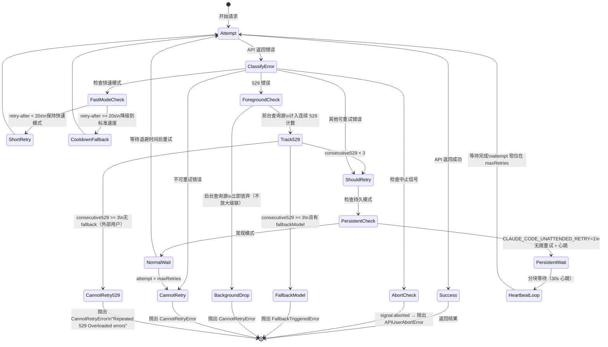
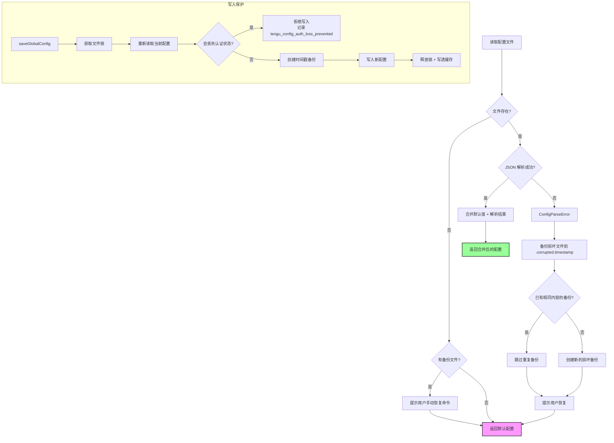
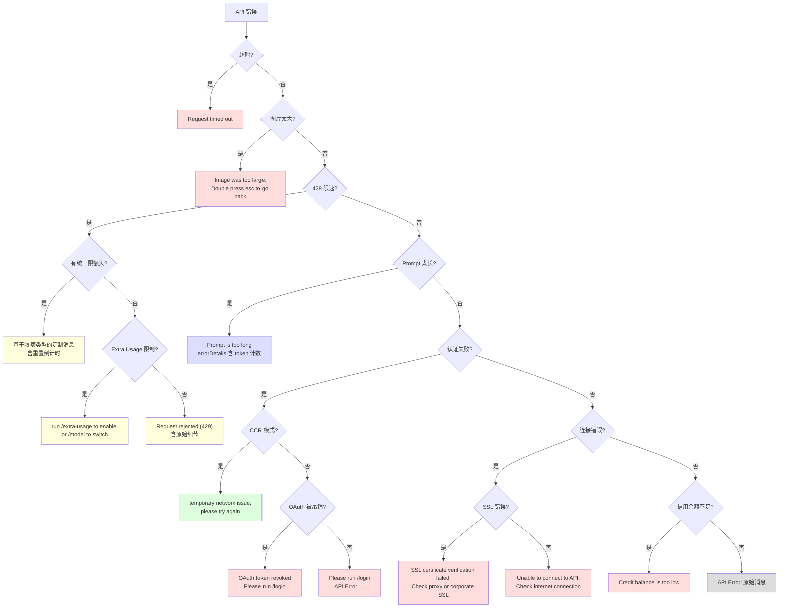

# 第 9 章：韧性设计——在不可靠的世界中保持优雅

> **核心思想**：**永远不要让用户看到未经处理的失败——每一种故障都应该有一个故事。**

---

想象你走进一家医院的急诊室。一个脚趾骨折的病人和一个心脏骤停的病人，不会得到同样的治疗。急诊室有一套**分诊系统**：根据严重程度分类，为每一类病人匹配合适的处置方案。没有人会被扔到走廊上无人理睬。

Claude Code 的错误处理系统就是这样一间急诊室。API 超时、网络断开、配置文件损坏、速率限制——每一种"病症"都有对应的分诊级别和治疗方案。本章将拆解这套分诊系统的设计思路。

## 9.1 为什么韧性不是可选项？

**第一步：找到核心问题。**

Claude Code 运行在一个充满不确定性的环境中：

- **网络不可靠**：家庭 Wi-Fi 会断，企业代理会拦截 TLS，CDN 会抽风
- **API 会过载**：529 Overloaded 是日常，429 Rate Limit 是家常便饭
- **本地文件会损坏**：另一个 Claude Code 实例正在写同一份配置文件
- **认证会过期**：OAuth token 可能被另一个进程刷新、吊销、甚至过期
- **用户会取消**：Ctrl+C 可能在任何时刻到来

如果对这些情况的回应只是一个冷冰冰的 `Unhandled error: ECONNRESET`，用户就会失去信任。韧性不是一个"锦上添花"的特性——它是用户体验的基础设施。

**关键洞察**：在 Claude Code 的世界里，"错误处理"不是在 catch 块里打一行日志。它是一个完整的决策树：这个错误应该重试吗？重试几次？等待多久？如果重试失败呢？用户应该看到什么信息？遥测系统应该记录什么？隐私边界在哪里？

## 9.2 错误分类学

**第二步：用最简单的语言解释。**

回到急诊室的比喻。当一个"病人"（错误）进入急诊时，分诊护士（错误分类系统）首先要回答一个问题：**这是什么类型的病症？**

Claude Code 在 `utils/errors.ts:3` 中定义了一套清晰的错误类型层级：

```typescript
// src/utils/errors.ts:3

// 基类——所有 Claude 特有错误的祖先
export class ClaudeError extends Error {
  constructor(message: string) {
    super(message)
    this.name = this.constructor.name
  }
}

// "手术取消"——用户主动中止
export class AbortError extends Error {
  constructor(message?: string) {
    super(message)
    this.name = 'AbortError'
  }
}

// "诊断报告格式错误"——配置文件解析失败
export class ConfigParseError extends Error {
  filePath: string
  defaultConfig: unknown
  constructor(message: string, filePath: string, defaultConfig: unknown) { ... }
}

// "手术室意外"——Shell 命令执行失败
export class ShellError extends Error {
  constructor(
    public readonly stdout: string,
    public readonly stderr: string,
    public readonly code: number,
    public readonly interrupted: boolean,
  ) { ... }
}
```

这些错误类不是随意创建的。每一个都携带了**处理该错误所需的全部上下文**：

| 错误类 | 急诊室比喻 | 携带的上下文 |
|--------|-----------|------------|
| `ClaudeError` | 通用病症 | 错误消息 |
| `AbortError` | 手术取消（患者自愿） | 可选消息 |
| `ConfigParseError` | 病历损坏 | 文件路径 + 默认配置 |
| `ShellError` | 手术室意外 | stdout + stderr + 退出码 + 是否被中断 |
| `TelemetrySafeError` | 可以写入公开病历的诊断 | 用户消息 + 遥测消息（可不同） |

### 中止检测：三重身份识别

一个特别精巧的设计是 `isAbortError` 函数——它要识别三种不同形态的"中止"：

```typescript
// src/utils/errors.ts:27
export function isAbortError(e: unknown): boolean {
  return (
    e instanceof AbortError ||              // Claude Code 自己的 AbortError
    e instanceof APIUserAbortError ||        // SDK 的中止错误
    (e instanceof Error && e.name === 'AbortError')  // DOM 的 AbortController
  )
}
```

为什么需要三重检查？注释里藏着一个生产环境的教训：

> SDK 类通过 instanceof 检查，因为**压缩后的构建会混淆类名**——constructor.name 变成类似 'nJT' 的东西，而 SDK 从来不设置 this.name，所以字符串匹配在生产环境中会静默失败。

这就是韧性设计的缩影：你不能假设运行环境是理想的。代码压缩是真实的，名称混淆是真实的，你的分诊系统必须在这些现实条件下仍然能正确识别"病人"。

### Axios 错误分类：网络层的分诊

对于非 API SDK 的网络请求（同步服务、策略限制检查等），`classifyAxiosError` 提供了一个统一的分类器：

```typescript
// src/utils/errors.ts:197
export type AxiosErrorKind =
  | 'auth'     // 401/403——通常跳过重试
  | 'timeout'  // ECONNABORTED
  | 'network'  // ECONNREFUSED/ENOTFOUND
  | 'http'     // 其他 axios 错误（可能有 status）
  | 'other'    // 非 axios 错误
```

这个分类替代了代码库中大约 20 行重复的 `isAxiosError → 401/403 → ECONNABORTED → ECONNREFUSED` 判断链。同一个模式出现在 settingsSync、policyLimits、remoteManagedSettings、teamMemorySync 四个地方——提取成一个分类器后，每个调用点只需要一个 switch 语句。

## 9.3 重试策略的层次

**第三步：回到更精确的解释。**

现在我们知道了如何分类错误，接下来的问题是：**什么时候应该重试？** 这不是一个简单的 yes/no 问题——它是一个多维决策。

### 重试的决策矩阵

`withRetry.ts:696` 中的 `shouldRetry` 函数实现了一个精密的决策矩阵：

```typescript
// src/services/api/withRetry.ts:696
function shouldRetry(error: APIError): boolean {
  // 模拟错误永不重试——来自 /mock-limits 测试命令
  if (isMockRateLimitError(error)) return false

  // 持久模式：429/529 始终可重试
  if (isPersistentRetryEnabled() && isTransientCapacityError(error)) return true

  // CCR 模式：401/403 是暂时性抖动，不是坏凭证
  if (isEnvTruthy(process.env.CLAUDE_CODE_REMOTE) &&
      (error.status === 401 || error.status === 403)) return true

  // 服务器显式指示
  const shouldRetryHeader = error.headers?.get('x-should-retry')
  if (shouldRetryHeader === 'true' &&
      (!isClaudeAISubscriber() || isEnterpriseSubscriber())) return true

  // 408 Request Timeout → 重试
  if (error.status === 408) return true
  // 409 Lock Timeout → 重试
  if (error.status === 409) return true
  // 429 Rate Limit → 非订阅用户或企业用户可重试
  if (error.status === 429) return !isClaudeAISubscriber() || isEnterpriseSubscriber()
  // 401 → 清除 API key 缓存，重试
  if (error.status === 401) { clearApiKeyHelperCache(); return true }
  // 5xx → 重试
  if (error.status >= 500) return true

  return false
}
```

注意这里的**上下文敏感性**。同样是 429 错误：
- **PAYG 用户**：可以重试，因为限制是暂时的
- **Max/Pro 订阅用户**：不重试，因为 retry-after 可能是几小时后（限额用完了）
- **企业用户**：可以重试，因为通常使用 PAYG 而非固定限额

这就是为什么错误处理不能是一个简单的 HTTP 状态码 → 行为的映射表。你需要知道**谁**遇到了这个错误。

### 退避算法：指数退避 + 抖动

当决定重试后，等待多久？

```typescript
// src/services/api/withRetry.ts:530
const BASE_DELAY_MS = 500

export function getRetryDelay(
  attempt: number,
  retryAfterHeader?: string | null,
  maxDelayMs = 32000,
): number {
  // 如果服务器告诉了你等多久，听它的
  if (retryAfterHeader) {
    const seconds = parseInt(retryAfterHeader, 10)
    if (!isNaN(seconds)) return seconds * 1000
  }

  // 否则：指数退避 + 25% 抖动
  const baseDelay = Math.min(BASE_DELAY_MS * Math.pow(2, attempt - 1), maxDelayMs)
  const jitter = Math.random() * 0.25 * baseDelay
  return baseDelay + jitter
}
```

退避序列：500ms → 1s → 2s → 4s → 8s → 16s → 32s（封顶）。每次加上 0-25% 的随机抖动，避免多个客户端在完全相同的时刻重试（"惊群效应"）。

为什么是 25% 抖动而不是 100%？因为如果抖动范围太大，重试间隔就变得不可预测——用户看到的等待时间会大幅波动。25% 在"避免惊群"和"可预测性"之间取了一个平衡。

### 重试状态机

下面的图展示了 `withRetry` 的完整状态机，包括前台和后台两条路径：



这个状态机揭示了几个关键设计决策：

1. **前台/后台分流**：后台任务（摘要、标题、建议、分类器）在 529 时立即放弃，不进入重试循环。因为在容量级联期间，每次重试的网关放大倍数是 3-10 倍，而用户根本看不到这些后台任务的失败。
2. **529 计数器**：连续 3 次 529 后触发模型降级（Opus → Sonnet），而不是无限重试同一个过载的模型。
3. **持久模式的心跳**：无人值守会话需要定期产生 stdout 活动，否则宿主环境会认为会话已空闲并终止它。

## 9.4 持久重试模式

对于无人值守的会话（CI/CD 管道、后台代理），Claude Code 提供了一种特殊的"持久重试"模式：

```typescript
// src/services/api/withRetry.ts:96
const PERSISTENT_MAX_BACKOFF_MS = 5 * 60 * 1000     // 5 分钟最大退避
const PERSISTENT_RESET_CAP_MS = 6 * 60 * 60 * 1000  // 6 小时上限
const HEARTBEAT_INTERVAL_MS = 30_000                  // 30 秒心跳

function isPersistentRetryEnabled(): boolean {
  return feature('UNATTENDED_RETRY')
    ? isEnvTruthy(process.env.CLAUDE_CODE_UNATTENDED_RETRY)
    : false
}
```

持久模式的核心思想是：**与其让一个 3 小时的 CI 任务因为一次暂时的 429 而彻底失败，不如等到配额重置再继续。**

实现上有三个精巧之处：

**1. 分块等待 + 心跳**

```typescript
// 持久模式下的等待循环
let remaining = delayMs
while (remaining > 0) {
  if (options.signal?.aborted) throw new APIUserAbortError()
  if (error instanceof APIError) {
    yield createSystemAPIErrorMessage(error, remaining, reportedAttempt, maxRetries)
  }
  const chunk = Math.min(remaining, HEARTBEAT_INTERVAL_MS)
  await sleep(chunk, options.signal, { abortError })
  remaining -= chunk
}
```

不是一次 sleep 5 分钟，而是每 30 秒醒一次、发一次心跳。这解决了两个问题：
- 宿主环境看到 stdout 活动，不会认为进程挂了
- 用户随时可以通过 abort signal 中止等待

**2. 窗口式限额的智能等待**

```typescript
function getRateLimitResetDelayMs(error: APIError): number | null {
  const resetHeader = error.headers?.get?.('anthropic-ratelimit-unified-reset')
  if (!resetHeader) return null
  const resetUnixSec = Number(resetHeader)
  if (!Number.isFinite(resetUnixSec)) return null
  const delayMs = resetUnixSec * 1000 - Date.now()
  if (delayMs <= 0) return null
  return Math.min(delayMs, PERSISTENT_RESET_CAP_MS)
}
```

当 API 返回精确的重置时间戳时，不用每 5 分钟轮询一次——直接等到重置时刻。但设了 6 小时的硬上限，防止一个异常的 header 让进程无限等待。

**3. attempt 钳位**

```typescript
// 持久模式下钳住 for 循环，永不终止
if (attempt >= maxRetries) attempt = maxRetries
```

`for` 循环的 `attempt` 被钳在 `maxRetries`，使循环永远不会因为次数耗尽而退出。真正的重试计数通过独立的 `persistentAttempt` 变量跟踪，用于退避计算和遥测。

## 9.5 配置损坏恢复

配置文件 `~/.claude.json` 是 Claude Code 的"心脏"——它存储了 OAuth 认证信息、项目设置、用户偏好。如果这个文件损坏了，后果很严重：用户需要重新登录、重新配置所有设置。

`utils/config.ts` 实现了一套多层防御体系：

### 第一层：写入时备份

```typescript
// src/utils/config.ts:1153 (saveConfigWithLock 内部)

// 创建带时间戳的备份
const backupPath = join(backupDir, `${fileBase}.backup.${Date.now()}`)
fs.copyFileSync(file, backupPath)

// 清理旧备份，只保留最近 5 个
const MAX_BACKUPS = 5
for (const oldBackup of backupsForCleanup.slice(MAX_BACKUPS)) {
  try {
    fs.unlinkSync(join(backupDir, oldBackup))
  } catch {
    // 忽略清理错误
  }
}
```

每次写入前，先把当前文件复制一份到 `~/.claude/backups/`。备份文件名包含毫秒级时间戳，保留最近 5 份。

注意一个细节：备份间隔有 60 秒的节流——

```typescript
const MIN_BACKUP_INTERVAL_MS = 60_000
const shouldCreateBackup =
  Number.isNaN(mostRecentTimestamp) ||
  Date.now() - mostRecentTimestamp >= MIN_BACKUP_INTERVAL_MS
```

启动时大量 `saveGlobalConfig` 调用会在毫秒内连续触发，如果每次都创建备份，磁盘上会堆积大量重复文件。60 秒间隔避免了这个问题。

### 第二层：读取时恢复

当配置文件解析失败时（`ConfigParseError`）：

```typescript
// src/utils/config.ts:1421 (getConfig 内部)

// 1. 备份损坏的文件（避免重复备份）
if (!alreadyBackedUp) {
  corruptedBackupPath = join(corruptedBackupDir, `${fileBase}.corrupted.${Date.now()}`)
  fs.copyFileSync(file, corruptedBackupPath)
}

// 2. 提示用户手动恢复
const backupPath = findMostRecentBackup(file)
if (backupPath) {
  process.stderr.write(
    `A backup file exists at: ${backupPath}\n` +
    `You can manually restore it by running: cp "${backupPath}" "${file}"\n\n`,
  )
}

// 3. 返回默认配置，让程序继续运行
return createDefault()
```

这里有一个微妙但关键的决策：**不自动恢复备份**。为什么？

- 自动恢复可能恢复到一个也有问题的状态
- 损坏可能是由用户手动编辑引起的，用户可能想修复而不是回滚
- 给用户一个明确的恢复命令 (`cp`)，让他们掌控决策

### 第三层：认证状态守卫

这是最精巧的一层，源自一个真实的 bug（GH #3117）：

```typescript
// src/utils/config.ts:783
function wouldLoseAuthState(fresh: {
  oauthAccount?: unknown
  hasCompletedOnboarding?: boolean
}): boolean {
  const cached = globalConfigCache.config
  if (!cached) return false
  const lostOauth =
    cached.oauthAccount !== undefined && fresh.oauthAccount === undefined
  const lostOnboarding =
    cached.hasCompletedOnboarding === true &&
    fresh.hasCompletedOnboarding !== true
  return lostOauth || lostOnboarding
}
```

场景是这样的：进程 A 正在写配置文件，进程 B 恰好在这个瞬间读取了一个半写入的文件，得到了 `DEFAULT_GLOBAL_CONFIG`（没有 OAuth 信息）。如果 B 接着把这个默认配置写回去，用户的认证信息就被永久擦除了。

`wouldLoseAuthState` 守卫通过比较内存缓存和磁盘读取的结果，检测"即将丢失认证"的情况，并**拒绝写入**。

```typescript
// saveGlobalConfig 中的守卫
if (wouldLoseAuthState(currentConfig)) {
  logForDebugging(
    'saveGlobalConfig fallback: re-read config is missing auth that cache has; ' +
    'refusing to write. See GH #3117.',
    { level: 'error' },
  )
  logEvent('tengu_config_auth_loss_prevented', {})
  return  // 放弃写入，保护用户数据
}
```

### 配置降级流程图



## 9.6 TelemetrySafeError：隐私优先的错误传播

在急诊室中，有些诊断信息可以写进公开的统计报告，有些则必须严格保密。`TelemetrySafeError` 就是这个边界的守门人：

```typescript
// src/utils/errors.ts:93
export class TelemetrySafeError_I_VERIFIED_THIS_IS_NOT_CODE_OR_FILEPATHS extends Error {
  readonly telemetryMessage: string

  constructor(message: string, telemetryMessage?: string) {
    super(message)
    this.name = 'TelemetrySafeError'
    this.telemetryMessage = telemetryMessage ?? message
  }
}
```

首先注意这个**故意冗长的类名**：`TelemetrySafeError_I_VERIFIED_THIS_IS_NOT_CODE_OR_FILEPATHS`。这不是偶然的——它是一个人工审查的检查点。每次有人创建这个错误，类名本身就在提醒："你确认过这条消息不包含代码或文件路径了吗？"

设计的精髓在于**双消息模式**：

```typescript
// 场景 1：相同的消息用于用户和遥测
throw new TelemetrySafeError_I_VERIFIED_THIS_IS_NOT_CODE_OR_FILEPATHS(
  'MCP server "slack" connection timed out'
)

// 场景 2：不同的消息
throw new TelemetrySafeError_I_VERIFIED_THIS_IS_NOT_CODE_OR_FILEPATHS(
  `MCP tool timed out after ${ms}ms`,   // 完整消息：给日志和用户
  'MCP tool timed out'                    // 遥测消息：去掉了具体时长
)
```

第一个参数是用户看到的完整信息（可以包含调试细节），第二个参数是发送到遥测系统的脱敏版本。如果只提供一个参数，则同时用于两个场景。

为什么需要这种设计？

- `"MCP tool timed out after 45000ms"` 对用户有用，但 `45000ms` 这个数字发到遥测系统没有意义（应该作为数值指标单独采集）
- `"Config file at /Users/alice/secret-project/.claude.json corrupted"` 包含了用户的项目路径——绝不能发到遥测系统
- 但 `"Config file corrupted"` 可以安全地发送，用于监控损坏率

这个设计把隐私考虑编码进了类型系统本身。

## 9.7 优雅降级案例集

### 案例 1：API 错误的用户友好化

`services/api/errors.ts` 中的 `getAssistantMessageFromError` 是一个超过 500 行的函数，它为**每一种**可能的 API 错误提供了定制的用户消息。这不是偶然——这是"每种故障都有一个故事"原则的具体体现。



几个值得注意的模式：

**上下文敏感的操作指南**：同一个错误，交互式用户和非交互式（SDK）用户看到的消息不同：

```typescript
export function getPdfTooLargeErrorMessage(): string {
  return getIsNonInteractiveSession()
    ? `PDF too large. Try reading the file a different way (e.g., extract text with pdftotext).`
    : `PDF too large. Double press esc to go back and try again, or use pdftotext.`
}
```

交互式用户被告知"按两下 esc 回去"——因为他们在一个 TUI 中。SDK 用户被告知"用其他方式读取"——因为他们在写代码。

**自适应的模型建议**：当第三方部署（Bedrock/Vertex）的模型不可用时，系统会根据当前模型推测一个合理的降级选项：

```typescript
function get3PModelFallbackSuggestion(model: string): string | undefined {
  if (getAPIProvider() === 'firstParty') return undefined
  const m = model.toLowerCase()
  if (m.includes('opus-4-6')) return getModelStrings().opus41
  if (m.includes('sonnet-4-6')) return getModelStrings().sonnet45
  if (m.includes('sonnet-4-5')) return getModelStrings().sonnet40
  return undefined
}
```

### 案例 2：SSL 错误的根因诊断

企业用户经常遇到 TLS 拦截代理（如 Zscaler）导致的 SSL 错误。`errorUtils.ts` 维护了一个完整的 OpenSSL 错误码集合：

```typescript
// src/services/api/errorUtils.ts
const SSL_ERROR_CODES = new Set([
  'UNABLE_TO_VERIFY_LEAF_SIGNATURE',
  'DEPTH_ZERO_SELF_SIGNED_CERT',
  'SELF_SIGNED_CERT_IN_CHAIN',
  'CERT_HAS_EXPIRED',
  'ERR_TLS_CERT_ALTNAME_INVALID',
  // ... 等等
])
```

当检测到 SSL 错误时，不是给用户一个神秘的 `DEPTH_ZERO_SELF_SIGNED_CERT`，而是翻译成可操作的建议：

```typescript
case 'DEPTH_ZERO_SELF_SIGNED_CERT':
case 'SELF_SIGNED_CERT_IN_CHAIN':
  return 'Self-signed certificate detected. Check your proxy or corporate SSL certificates'
```

`getSSLErrorHint` 甚至提供了具体的修复步骤：

```typescript
return `SSL certificate error (${details.code}). If you are behind a corporate proxy
or TLS-intercepting firewall, set NODE_EXTRA_CA_CERTS to your CA bundle path,
or ask IT to allowlist *.anthropic.com. Run /doctor for details.`
```

### 案例 3：上下文溢出的自动调整

当输入 token 数 + `max_tokens` 超过模型的上下文窗口时，不是直接报错——而是自动缩减 `max_tokens`：

```typescript
// src/services/api/withRetry.ts:389
const overflowData = parseMaxTokensContextOverflowError(error)
if (overflowData) {
  const { inputTokens, contextLimit } = overflowData
  const safetyBuffer = 1000
  const availableContext = Math.max(0, contextLimit - inputTokens - safetyBuffer)

  if (availableContext < FLOOR_OUTPUT_TOKENS) {
    throw error  // 真的没空间了，放弃
  }

  retryContext.maxTokensOverride = Math.max(
    FLOOR_OUTPUT_TOKENS,     // 至少 3000 tokens
    availableContext,
    minRequired,             // thinking budget + 1
  )
  continue  // 用调整后的参数重试
}
```

这是一个纯粹的"机器可以自动处理的问题，就不要打扰用户"的例子。FLOOR_OUTPUT_TOKENS = 3000 是底线——如果连 3000 个输出 token 的空间都没有，那确实需要用户介入（比如清理对话上下文）。

### 案例 4：快速模式的优雅降级

快速模式（Fast Mode）在遇到限速时有三种不同的降级策略：

```typescript
if (wasFastModeActive && error instanceof APIError &&
    (error.status === 429 || is529Error(error))) {

  // 策略 1：配额超限——永久禁用快速模式
  const overageReason = error.headers?.get('anthropic-ratelimit-unified-overage-disabled-reason')
  if (overageReason) {
    handleFastModeOverageRejection(overageReason)
    retryContext.fastMode = false
    continue
  }

  // 策略 2：短暂限速（< 20s）——保持快速模式，等待重试
  const retryAfterMs = getRetryAfterMs(error)
  if (retryAfterMs !== null && retryAfterMs < SHORT_RETRY_THRESHOLD_MS) {
    await sleep(retryAfterMs, options.signal, { abortError })
    continue  // 仍然是快速模式
  }

  // 策略 3：长限速——切到标准速度，设冷却期
  const cooldownMs = Math.max(retryAfterMs ?? 30*60*1000, 10*60*1000)
  triggerFastModeCooldown(Date.now() + cooldownMs, cooldownReason)
  retryContext.fastMode = false
  continue
}
```

为什么 20 秒是分界线？因为切换模型意味着丢失 prompt 缓存——如果只需要等 15 秒，保持当前模型（保留缓存）比切换到一个需要重新计算缓存的模型更划算。但如果要等 5 分钟，缓存早就冷了，不如切到标准模型立即开始。

### 案例 5：HTML 净化——CloudFlare 误拦截

有时 API 返回的不是 JSON 错误，而是 CloudFlare 的 HTML 错误页面（CDN 层拦截了请求）。`errorUtils.ts` 对此有防御：

```typescript
function sanitizeMessageHTML(message: string): string {
  if (message.includes('<!DOCTYPE html') || message.includes('<html')) {
    const titleMatch = message.match(/<title>([^<]+)<\/title>/)
    if (titleMatch && titleMatch[1]) {
      return titleMatch[1].trim()  // 提取 <title> 作为摘要
    }
    return ''
  }
  return message
}
```

不是把整页 HTML 打印给用户，而是提取 `<title>` 标签——通常是 "Error 1015 | Rate limiting" 这样的简短描述。

## 9.8 设计权衡

### 权衡 1：自动恢复 vs. 用户控制

配置损坏时，为什么不自动从备份恢复？

**选择**：提供恢复命令，但不自动执行。

**原因**：
- 自动恢复可能在用户不知情的情况下回滚有意的修改
- 损坏的原因可能需要调查——自动恢复会掩盖问题
- 给用户一个 `cp` 命令比什么都不说好，比自动执行更安全

### 权衡 2：重试放大 vs. 失败成本

后台任务在 529 时不重试——这意味着摘要生成、标题推荐等功能会静默失败。

**选择**：后台静默失败，前台积极重试。

**原因**：
```typescript
// 注释原文
// 后台任务在 529 时立即放弃——不要在容量级联期间放大重试。
// 每次重试是 3-10x 的网关放大。用户看不到这些失败。
```

这是一个**系统级**的权衡：一个客户端的重试是合理的，但十万个客户端的同时重试就是 DDoS。前台任务（用户正在等待结果）值得承担这个成本；后台任务不值得。

### 权衡 3：隐私 vs. 可调试性

`TelemetrySafeError` 的双消息设计意味着遥测消息可能缺少调试所需的细节。

**选择**：宁可调试困难，也不泄露用户数据。

**原因**：文件路径可以暴露用户在做什么项目（`/Users/alice/competitors/reverse-engineer/`），代码片段可以暴露商业逻辑。隐私是硬约束，可调试性是软约束——可以通过本地日志和 `--verbose` 标志来弥补。

### 权衡 4：529 计数器的阈值

MAX_529_RETRIES = 3。为什么是 3 而不是 5 或 1？

**选择**：3 次连续 529 后触发模型降级。

**原因**：
- 1 次太少——瞬时过载会不必要地降级
- 5 次太多——用户要等太久才能得到（降级的）响应
- 3 次是经验值：足够排除瞬时抖动，又不会让用户等太久

## 9.9 迁移指南

如果你在自己的 CLI 工具中想借鉴 Claude Code 的韧性模式，这里是一份实践清单：

### 第一步：建立错误分类体系

不要在每个 catch 块里临时决定怎么处理。定义一个集中的分类器：

```typescript
// 你的分类器——受 classifyAxiosError 启发
type ErrorKind = 'auth' | 'timeout' | 'network' | 'retryable' | 'fatal' | 'user_cancel'

function classify(error: unknown): ErrorKind {
  if (isAbortError(error)) return 'user_cancel'
  if (error instanceof AuthError) return 'auth'
  if (isTimeout(error)) return 'timeout'
  if (isNetworkError(error)) return 'network'
  if (isRetryable(error)) return 'retryable'
  return 'fatal'
}
```

### 第二步：为重试建立合理的默认值

Claude Code 的默认值是经过生产验证的合理起点：
- **最大重试次数**：10（`DEFAULT_MAX_RETRIES`）
- **基础延迟**：500ms（`BASE_DELAY_MS`）
- **退避策略**：指数退避 + 25% 抖动
- **最大退避**：32 秒（常规）/ 5 分钟（持久模式）

### 第三步：区分前台和后台

问自己：**用户正在等待这个结果吗？** 如果不是，不要重试。在容量紧张时，你的后台重试可能是压垮骆驼的最后一根稻草。

### 第四步：保护关键状态

像 `wouldLoseAuthState` 那样，在写入关键数据之前，检查"即将写入的内容"是否比"当前缓存的内容"更差。如果是——拒绝写入。

### 第五步：让错误消息包含操作指南

每个面向用户的错误消息都应该回答：**用户接下来应该做什么？**

- 差：`SSL certificate error: DEPTH_ZERO_SELF_SIGNED_CERT`
- 好：`Self-signed certificate detected. Set NODE_EXTRA_CA_CERTS to your CA bundle, or ask IT to allowlist *.anthropic.com. Run /doctor for details.`

## 9.10 费曼检验

如果你要向一个非程序员解释 Claude Code 的韧性设计，可以这样说：

> 想象你在打一个很重要的电话。如果信号不好断了，你会：
>
> 1. **等一下再拨**——不是立刻拨，因为可能还在忙。等的时间越来越长（1 秒、2 秒、4 秒...）
> 2. **尝试有限次数**——不会无限拨下去，拨了 10 次不通就换个方式联系
> 3. **看情况决定等多久**——如果对方说"5 分钟后有空"，就等 5 分钟；如果什么都没说，就按自己的节奏等
> 4. **区分轻重缓急**——重要的事就多等几次，不重要的事就算了
>
> Claude Code 对 API 也是这样做的。它不会因为一次网络抖动就放弃，也不会为了一个无关紧要的后台任务堵塞你的工作。每一次失败，它都知道该怎么处理——要么重试，要么降级，要么告诉你怎么修。

更技术一点的版本：

> Claude Code 的韧性是一个三层系统：
>
> **分类**：每个错误先过一遍分类器——是认证问题、网络问题、容量问题、还是用户取消？不同类别走不同处理路径。
>
> **重试**：可重试的错误进入一个带指数退避的重试循环。但这个循环不是盲目的——它知道你是前台任务还是后台任务，你是付费用户还是 API 用户，当前是否处于容量级联。
>
> **恢复**：对于配置损坏这样的持久性故障，系统维护了带时间戳的备份和认证状态守卫。它宁可拒绝写入，也不会擦除你的登录信息。

## 本章小结

Claude Code 的韧性设计不是一个单一的重试库——它是一个分层的决策系统：

1. **错误分类**（`errors.ts`、`classifyAxiosError`）为每个错误贴标签，携带处理所需的全部上下文
2. **重试策略**（`withRetry.ts`）根据错误类型、用户类型、查询来源、运行模式做出多维决策
3. **持久重试**（`CLAUDE_CODE_UNATTENDED_RETRY`）为无人值守场景提供无限重试 + 心跳机制
4. **配置保护**（`config.ts`）通过时间戳备份、损坏归档、认证守卫三层防线保护用户数据
5. **隐私边界**（`TelemetrySafeError`）用命名约定和双消息模式确保错误信息不越界
6. **用户友好化**（`getAssistantMessageFromError`）为 30+ 种错误场景提供定制的操作指南

贯穿所有这些的核心原则是：**每一种故障都应该有一个故事**——不是一个堆栈跟踪，而是一个告诉用户"发生了什么，以及你可以做什么"的故事。

> **下一章预告**：第 10 章将探讨 Claude Code 的测试策略——在一个依赖外部 API、文件系统、和用户交互的系统中，如何建立可靠的测试防线。
