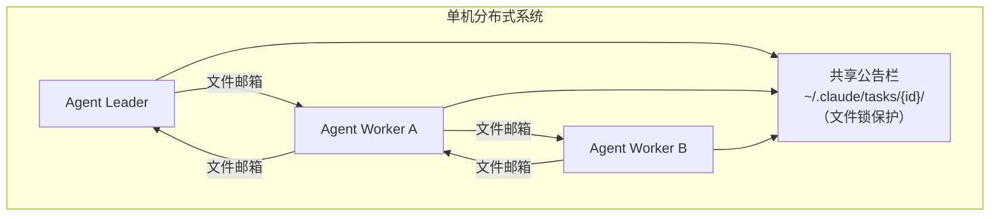
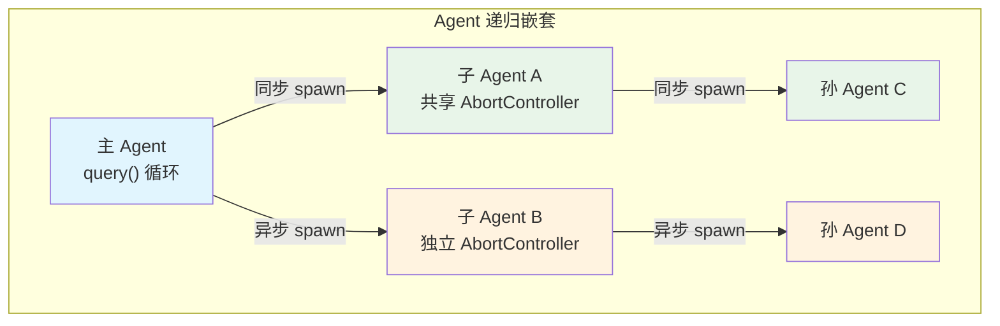
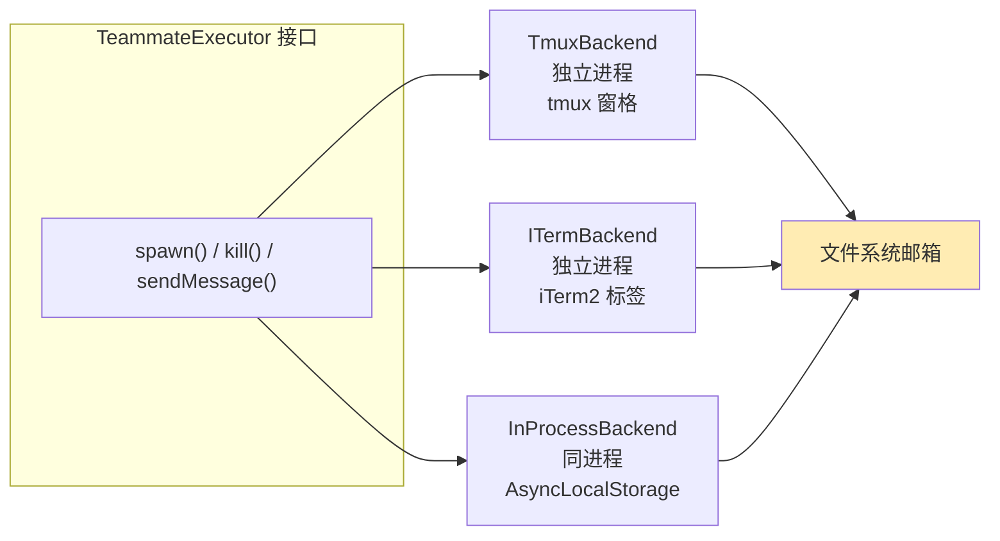
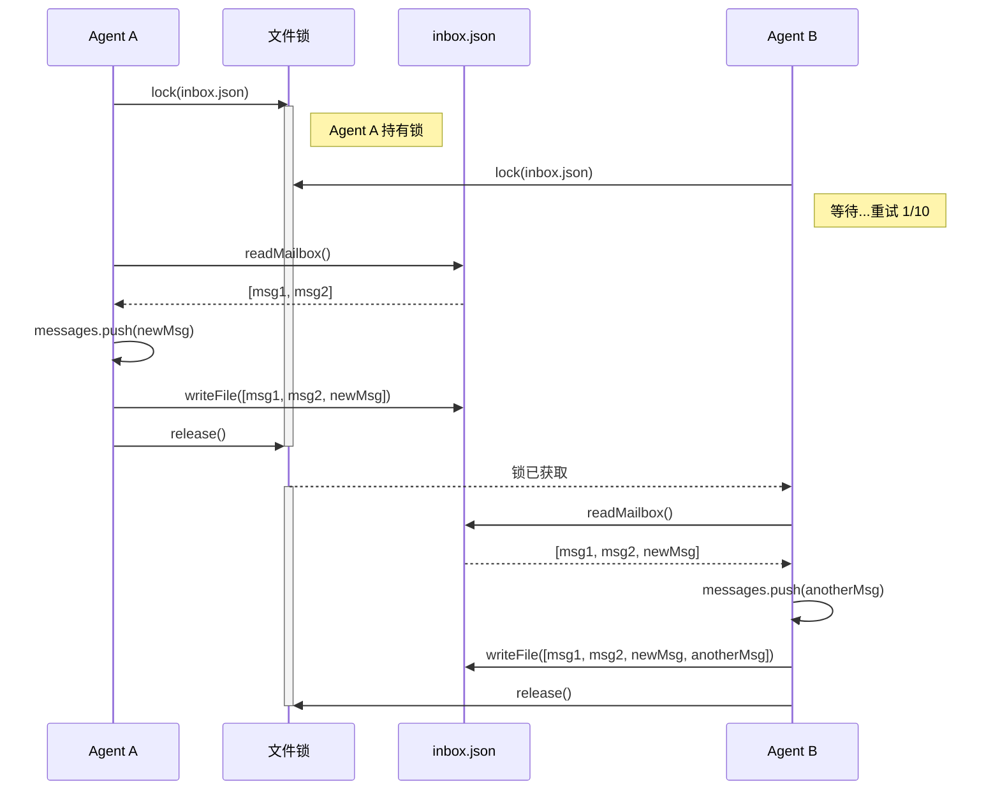
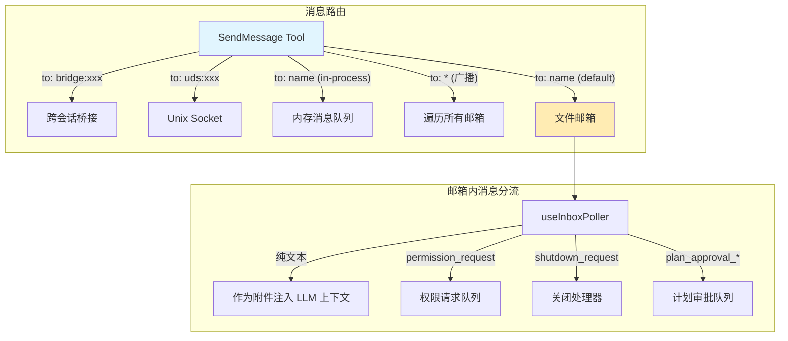
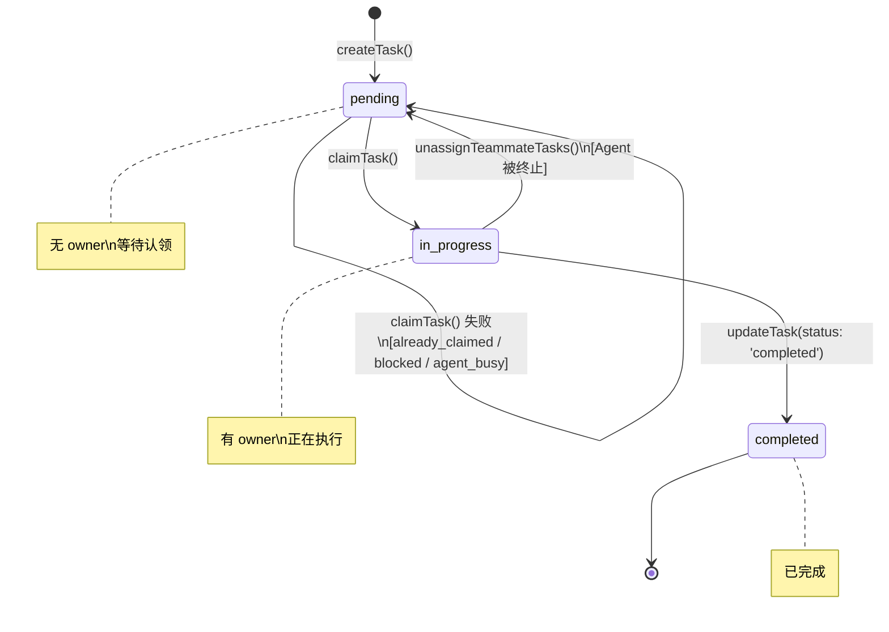
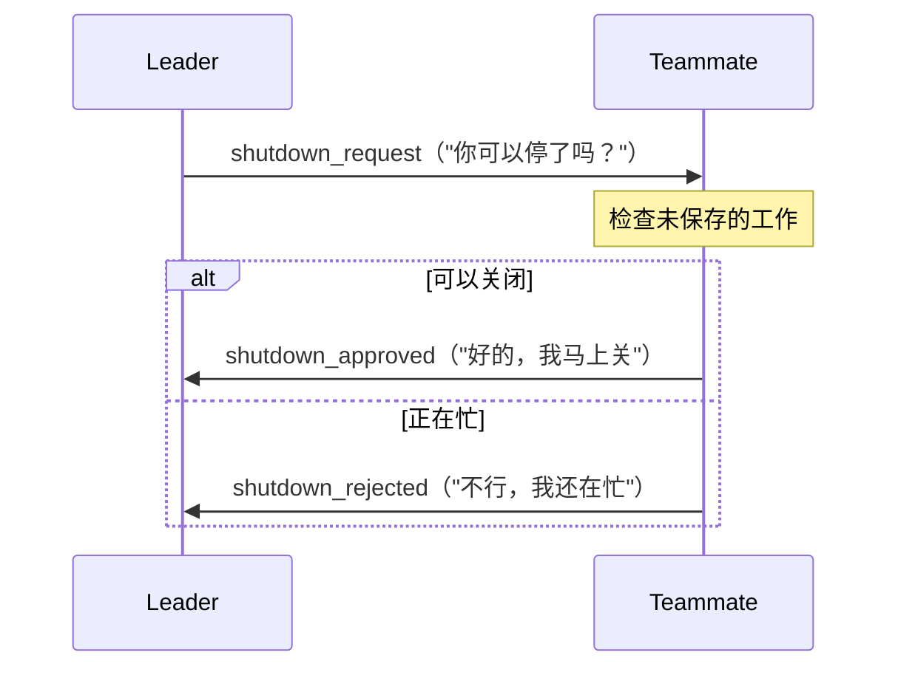

# 第 10 章：多 Agent 协作——从单体到群体智能

> **核心思想**：Claude Code 的群体架构是一个**微型分布式系统**，用文件锁、邮箱和信号量在单机上实现多 Agent 协调。

---

## 心智模型：一栋办公大楼

在深入代码之前，我们先建立一个整体画面。

想象一栋办公大楼。每个 Agent 是一个**办公室**里的员工。大楼里有一面**共享公告栏**（Task 系统），每个员工办公室门口挂着一个**邮箱**（Inbox），大楼前台有一位**协调员**（Coordinator Mode）。员工之间不能直接喊话——他们只能通过往对方邮箱塞纸条来通信。

为什么不能直接喊话？因为这些员工可能在不同的"空间维度"里工作：有的在同一间大厅（In-process），有的在不同楼层的独立终端窗口（tmux pane），有的甚至在隔壁大楼（iTerm2 split）。文件系统是他们唯一可靠的"公共走廊"。

这就是 Claude Code 的群体（Swarm）架构。它是一个**单机分布式系统**——所有经典的分布式系统挑战（消息传递、状态同步、死锁避免、故障处理）都出现了，只不过通信介质不是网络，而是文件系统。



现在我们来逐层拆解这个系统。

---

## 10.1 Agent 的递归本质

一切从 `AgentTool` 开始。当主 Agent 调用 `AgentTool` 时，它实际上在做一件看似简单却意义深远的事情——**递归地启动自己的一个副本**。

### 入口：runAgent 的 AsyncGenerator

`runAgent` 函数是 Agent 执行的核心。它是一个异步生成器，每次 `yield` 一条消息，调用方可以实时消费：

```typescript
// src/tools/AgentTool/runAgent.ts（简化）
export async function* runAgent({
  agentDefinition,
  promptMessages,
  toolUseContext,
  isAsync,
  availableTools,
  allowedTools,
  ...
}): AsyncGenerator<Message, void> {

  const agentId = override?.agentId ? override.agentId : createAgentId()

  // 1. 构建子 Agent 上下文
  const agentToolUseContext = createSubagentContext(toolUseContext, {
    options: agentOptions,
    agentId,
    agentType: agentDefinition.agentType,
    messages: initialMessages,
    readFileState: agentReadFileState,
    abortController: agentAbortController,
    getAppState: agentGetAppState,
    shareSetAppState: !isAsync,  // 同步 Agent 共享状态，异步不共享
  })

  // 2. 递归调用 query() —— 同一套 LLM 循环
  for await (const message of query({
    messages: initialMessages,
    systemPrompt: agentSystemPrompt,
    canUseTool,
    toolUseContext: agentToolUseContext,
    maxTurns: maxTurns ?? agentDefinition.maxTurns,
  })) {
    if (isRecordableMessage(message)) {
      yield message  // 把消息传回父 Agent
    }
  }
}
```

关键洞察：`runAgent` 调用了 `query()`——这正是主循环所用的同一个函数。**一个 Agent 就是另一个 query 循环的嵌套实例**。这就像俄罗斯套娃：每一层都拥有自己的系统提示、工具集、消息历史，但底层的 LLM 调用机制完全相同。

### 同步 vs 异步：两种递归姿态

Agent 有两种运行模式，理解它们的区别至关重要：

| 特征 | 同步 Agent | 异步 Agent |
|------|-----------|-----------|
| AbortController | 共享父 Agent 的 | 独立的，不受父 Agent 中断影响 |
| AppState 写入 | 共享 `setAppState` | 隔离（`setAppState` 是 no-op） |
| 权限提示 | 可以显示 | 自动拒绝（`shouldAvoidPermissionPrompts: true`） |
| 交互性 | `isNonInteractiveSession = false` | `isNonInteractiveSession = true` |
| 比喻 | 在同一间办公室里协作 | 在独立办公室里独立工作 |

```typescript
// 异步 Agent 获得独立的 AbortController
const agentAbortController = override?.abortController
  ? override.abortController
  : isAsync
    ? new AbortController()  // 独立的生命周期
    : toolUseContext.abortController  // 共享父的生命周期
```

这个设计选择意味着：当用户按 Ctrl+C 中断时，同步子 Agent 会立即停止（因为共享同一个 AbortController），而异步 Agent 则继续在后台运行——就像你关上了办公室的门，走廊里的噪音影响不到你。



### 资源清理：finally 块的重要性

`runAgent` 的 `finally` 块是一个精心设计的清理清单，展示了递归 Agent 需要释放的所有资源：

```typescript
// src/tools/AgentTool/runAgent.ts（finally 块，简化）
finally {
  await mcpCleanup()                     // 释放 Agent 专属的 MCP 服务器
  clearSessionHooks(rootSetAppState, agentId)  // 清理钩子
  cleanupAgentTracking(agentId)          // 释放 prompt cache 追踪
  agentToolUseContext.readFileState.clear()     // 释放文件状态缓存
  initialMessages.length = 0             // 释放 fork 上下文消息
  unregisterPerfettoAgent(agentId)       // 释放性能追踪注册

  // 释放这个 Agent 的 todos 条目——防止内存泄漏
  rootSetAppState(prev => {
    if (!(agentId in prev.todos)) return prev
    const { [agentId]: _removed, ...todos } = prev.todos
    return { ...prev, todos }
  })

  // 杀死这个 Agent 生成的后台 bash 任务
  killShellTasksForAgent(agentId, ...)
}
```

这段清理代码的注释透露了一个实际遇到的问题："Whale sessions spawn hundreds of agents; each orphaned key is a small leak that adds up"——大型会话会生成数百个 Agent，每个残留的键都是一个小泄漏。这就是分布式系统的现实：资源管理不是可选的。

---

## 10.2 三种 Teammate 后端

Claude Code 的群体系统支持三种"执行后端"，就像办公大楼里的三种办公室类型。

### 后端接口：TeammateExecutor

所有后端实现同一个接口：

```typescript
// src/utils/swarm/backends/types.ts（简化）
export type BackendType = 'tmux' | 'iterm2' | 'in-process'

export type TeammateExecutor = {
  readonly type: BackendType
  isAvailable(): Promise<boolean>
  spawn(config: TeammateSpawnConfig): Promise<TeammateSpawnResult>
  sendMessage(agentId: string, message: TeammateMessage): Promise<void>
  terminate(agentId: string, reason?: string): Promise<boolean>
  kill(agentId: string): Promise<boolean>
  isActive(agentId: string): Promise<boolean>
}
```

这是经典的策略模式。让我们逐一审视三种实现：

### 后端一：tmux——终端多路复用器

tmux 后端是最成熟的实现。它的工作原理是在 tmux 会话中创建分割窗格（split pane），每个 Teammate 独占一个窗格：

```typescript
// src/utils/swarm/backends/TmuxBackend.ts（简化）
export class TmuxBackend implements PaneBackend {
  readonly type = 'tmux' as const

  async createTeammatePaneInSwarmView(
    name: string, color: AgentColorName
  ): Promise<CreatePaneResult> {
    const releaseLock = await acquirePaneCreationLock()  // 防止并行创建冲突
    try {
      const insideTmux = await this.isRunningInside()
      if (insideTmux) {
        return await this.createTeammatePaneWithLeader(name, color)
      }
      return await this.createTeammatePaneExternal(name, color)
    } finally {
      releaseLock()
    }
  }
}
```

tmux 后端有两种布局策略：
- **在 tmux 内运行**：Leader 占左侧 30%，Teammates 在右侧 70% 区域纵向堆叠
- **在 tmux 外运行**：创建一个独立的 `claude-swarm` 会话，所有 Teammates 平铺（tiled layout）

注意 `acquirePaneCreationLock()`——一个基于 Promise 链的互斥锁，防止并行生成 Teammate 时窗格布局混乱。这是一个微妙的并发控制点。

### 后端二：iTerm2——原生分割窗格

iTerm2 后端使用 `it2` CLI 工具与 iTerm2 的原生分割窗格 API 交互：

```typescript
// src/utils/swarm/backends/ITermBackend.ts（简化）
export class ITermBackend implements PaneBackend {
  readonly type = 'iterm2' as const
  readonly supportsHideShow = false  // 不支持隐藏/显示窗格

  async createTeammatePaneInSwarmView(
    name: string, color: AgentColorName
  ): Promise<CreatePaneResult> {
    const releaseLock = await acquirePaneCreationLock()
    try {
      // ... 使用 it2 session split 创建窗格
      // 包含故障恢复：如果目标窗格已死（用户关闭），
      // 则修剪并重试
      while (true) {
        const splitResult = await runIt2(splitArgs)
        if (splitResult.code !== 0 && targetedTeammateId) {
          // 验证窗格确实死了，而不是系统性故障
          const listResult = await runIt2(['session', 'list'])
          if (!listResult.stdout.includes(targetedTeammateId)) {
            teammateSessionIds.splice(idx, 1)  // 修剪死亡 ID
            continue  // 重试
          }
        }
        break
      }
    } finally {
      releaseLock()
    }
  }
}
```

iTerm2 后端的一个有趣设计是**故障恢复循环**：如果 `it2 session split` 失败，它不会直接报错，而是先检查目标窗格是否已经死亡（用户手动关闭了），如果是，就修剪掉死亡的会话 ID 并重试。注释明确说明了边界："Bounded at O(N+1) iterations"。

### 后端三：In-Process——同进程执行

In-Process 后端是最新也是最有趣的实现。它不创建新进程或终端窗格，而是在**同一个 Node.js 进程**中运行 Teammate，通过 `AsyncLocalStorage` 实现上下文隔离：

```typescript
// src/utils/swarm/backends/InProcessBackend.ts（简化）
export class InProcessBackend implements TeammateExecutor {
  readonly type = 'in-process' as const
  private context: ToolUseContext | null = null

  async isAvailable(): Promise<boolean> {
    return true  // 总是可用——不依赖外部工具
  }

  async spawn(config: TeammateSpawnConfig): Promise<TeammateSpawnResult> {
    const result = await spawnInProcessTeammate({
      name: config.name,
      teamName: config.teamName,
      prompt: config.prompt,
      color: config.color,
      planModeRequired: config.planModeRequired ?? false,
    }, this.context)

    if (result.success && result.taskId && result.teammateContext) {
      // 在后台启动 Agent 执行循环（fire-and-forget）
      startInProcessTeammate({
        identity: { agentId: result.agentId, ... },
        taskId: result.taskId,
        prompt: config.prompt,
        teammateContext: result.teammateContext,
        toolUseContext: { ...this.context, messages: [] },  // 不传递父消息
        abortController: result.abortController,
      })
    }
    return result
  }
}
```

注意 `{ ...this.context, messages: [] }`——In-Process 后端刻意不传递父 Agent 的消息历史。注释解释道："Strip messages: the teammate never reads toolUseContext.messages... Passing the parent's conversation would pin it for the teammate's lifetime." 这是一个精明的内存管理决策。

### 三种后端的比较

| 特征 | tmux | iTerm2 | In-Process |
|------|------|--------|------------|
| 进程隔离 | 完全隔离（独立进程） | 完全隔离 | 无隔离（同进程） |
| 上下文隔离 | 环境变量 | 环境变量 | AsyncLocalStorage |
| 通信方式 | 文件邮箱 | 文件邮箱 | 文件邮箱（统一） |
| 外部依赖 | tmux | iTerm2 + it2 CLI | 无 |
| 可视化 | 分割窗格（有颜色边框） | 分割标签 | UI 中的任务卡片 |
| 终止方式 | kill-pane | session close -f | AbortController.abort() |
| 隐藏/显示 | 支持（break-pane/join-pane） | 不支持 | N/A |
| 资源共享 | 无（独立 Node.js 进程） | 无 | API 客户端、MCP 连接 |



---

## 10.3 文件基邮箱协议

邮箱是 Agent 间通信的基础设施。让我们剖析它的每一层。

### 邮箱的物理结构

```
~/.claude/teams/{team_name}/inboxes/
    ├── team-lead.json        ← Leader 的收件箱
    ├── researcher.json       ← Teammate "researcher" 的收件箱
    ├── implementer.json      ← Teammate "implementer" 的收件箱
    ├── researcher.json.lock  ← 文件锁（proper-lockfile）
    └── implementer.json.lock ← 文件锁
```

每个 JSON 文件是一个消息数组：

```json
[
  {
    "from": "team-lead",
    "text": "请调查 login 流程中的空指针问题",
    "timestamp": "2025-01-15T10:30:00.000Z",
    "read": false,
    "color": "blue",
    "summary": "调查 login 空指针"
  }
]
```

### 写入邮箱：锁保护的读-改-写

邮箱写入是一个经典的读-改-写（Read-Modify-Write）操作，需要锁保护来防止并发写入导致的数据丢失：

```typescript
// src/utils/teammateMailbox.ts（核心写入逻辑）
const LOCK_OPTIONS = {
  retries: {
    retries: 10,      // 最多重试 10 次
    minTimeout: 5,     // 最短等待 5ms
    maxTimeout: 100,   // 最长等待 100ms
  },
}

export async function writeToMailbox(
  recipientName: string,
  message: Omit<TeammateMessage, 'read'>,
  teamName?: string,
): Promise<void> {
  await ensureInboxDir(teamName)
  const inboxPath = getInboxPath(recipientName, teamName)
  const lockFilePath = `${inboxPath}.lock`

  // 确保收件箱文件存在（proper-lockfile 要求目标文件存在）
  try {
    await writeFile(inboxPath, '[]', { encoding: 'utf-8', flag: 'wx' })
  } catch (error) {
    if (getErrnoCode(error) !== 'EEXIST') return
  }

  let release: (() => Promise<void>) | undefined
  try {
    // 获取文件锁
    release = await lockfile.lock(inboxPath, {
      lockfilePath: lockFilePath,
      ...LOCK_OPTIONS,
    })

    // 在获取锁之后重新读取——获取最新状态
    const messages = await readMailbox(recipientName, teamName)
    messages.push({ ...message, read: false })
    await writeFile(inboxPath, jsonStringify(messages, null, 2), 'utf-8')
  } finally {
    if (release) await release()
  }
}
```

这段代码有几个值得注意的设计决策：

1. **先创建再锁定**：`proper-lockfile` 要求目标文件存在，所以先用 `wx` 标志创建（仅在不存在时）。
2. **锁后重读**：获取锁之后重新读取消息列表，而不是用锁前的版本——这是分布式系统中防止 TOCTOU（Time-of-Check Time-of-Use）问题的标准做法。
3. **指数退避重试**：`LOCK_OPTIONS` 配置了 10 次重试，超时从 5ms 到 100ms 指数增长——给并发 Agent 足够的时间轮流写入。



### 读取与标记已读

读取邮箱是幂等的，不需要锁。但标记已读需要锁保护，因为它也是一个读-改-写操作：

```typescript
export async function markMessagesAsRead(
  agentName: string,
  teamName?: string,
): Promise<void> {
  const inboxPath = getInboxPath(agentName, teamName)
  const lockFilePath = `${inboxPath}.lock`

  let release: (() => Promise<void>) | undefined
  try {
    release = await lockfile.lock(inboxPath, {
      lockfilePath: lockFilePath,
      ...LOCK_OPTIONS,
    })
    const messages = await readMailbox(agentName, teamName)
    // 直接修改——jsonParse 返回的是新鲜、无共享的对象
    for (const m of messages) m.read = true
    await writeFile(inboxPath, jsonStringify(messages, null, 2), 'utf-8')
  } finally {
    if (release) await release()
  }
}
```

注意注释 "messages comes from jsonParse --- fresh, unshared objects safe to mutate"——这是一个微妙的性能优化：既然 `jsonParse` 总是返回全新的对象，就不需要创建防御性拷贝，可以直接修改。

### lockfile 的惰性加载

锁实现使用了 `proper-lockfile` 库，但通过一个巧妙的惰性包装避免了启动开销：

```typescript
// src/utils/lockfile.ts
let _lockfile: Lockfile | undefined

function getLockfile(): Lockfile {
  if (!_lockfile) {
    _lockfile = require('proper-lockfile') as Lockfile  // 首次使用时才加载
  }
  return _lockfile
}

export function lock(file: string, options?: LockOptions) {
  return getLockfile().lock(file, options)
}
```

注释解释了原因："proper-lockfile depends on graceful-fs, which monkey-patches every fs method on first require (~8ms)"。8 毫秒看似微不足道，但在 `claude --help` 这样不需要锁的场景中，这是白白浪费的启动时间。

---

## 10.4 结构化消息类型

邮箱不只传递纯文本消息。Claude Code 定义了一套**结构化消息协议**——一种基于 JSON 的消息类型系统，类似于微型的消息队列协议。

### 消息类型总览

```typescript
// src/utils/teammateMailbox.ts 中定义的消息类型

// 1. 空闲通知——Teammate 完成工作后通知 Leader
type IdleNotificationMessage = {
  type: 'idle_notification'
  from: string
  idleReason?: 'available' | 'interrupted' | 'failed'
  summary?: string
}

// 2. 权限请求——Teammate 需要执行危险操作时请求 Leader 批准
type PermissionRequestMessage = {
  type: 'permission_request'
  request_id: string
  tool_name: string
  description: string
  input: Record<string, unknown>
}

// 3. 权限响应
type PermissionResponseMessage =
  | { type: 'permission_response'; subtype: 'success'; ... }
  | { type: 'permission_response'; subtype: 'error'; error: string }

// 4. 关闭请求/批准/拒绝
type ShutdownRequestMessage  = { type: 'shutdown_request'; requestId: string; ... }
type ShutdownApprovedMessage = { type: 'shutdown_approved'; requestId: string; ... }
type ShutdownRejectedMessage = { type: 'shutdown_rejected'; requestId: string; reason: string }

// 5. 计划审批请求/响应
type PlanApprovalRequestMessage  = { type: 'plan_approval_request'; planContent: string; ... }
type PlanApprovalResponseMessage = { type: 'plan_approval_response'; approved: boolean; ... }

// 6. 沙箱权限请求/响应（网络访问）
type SandboxPermissionRequestMessage  = { type: 'sandbox_permission_request'; ... }
type SandboxPermissionResponseMessage = { type: 'sandbox_permission_response'; ... }

// 7. 任务分配
type TaskAssignmentMessage = { type: 'task_assignment'; taskId: string; ... }

// 8. 团队权限更新
type TeamPermissionUpdateMessage = { type: 'team_permission_update'; ... }

// 9. 模式设置请求
type ModeSetRequestMessage = { type: 'mode_set_request'; mode: string; ... }
```

### 消息路由：SendMessageTool

`SendMessageTool` 是消息路由的入口。它的 `call` 方法像一个路由器，根据消息类型和目标分发到不同的处理器：

```typescript
// src/tools/SendMessageTool/SendMessageTool.ts（call 方法，简化）
async call(input, context) {
  // 路由 1: 跨会话桥接（Remote Control）
  if (parseAddress(input.to).scheme === 'bridge') {
    return await postInterClaudeMessage(addr.target, input.message)
  }

  // 路由 2: Unix Domain Socket 对等通信
  if (parseAddress(input.to).scheme === 'uds') {
    return await sendToUdsSocket(addr.target, input.message)
  }

  // 路由 3: In-Process 子 Agent（通过名称注册表查找）
  if (typeof input.message === 'string' && input.to !== '*') {
    const registered = appState.agentNameRegistry.get(input.to)
    const task = appState.tasks[agentId]
    if (isLocalAgentTask(task)) {
      if (task.status === 'running') {
        queuePendingMessage(agentId, input.message, ...)  // 排队到下一个工具轮次
        return { success: true, message: 'Message queued for delivery' }
      }
      // 已停止的 Agent——自动恢复
      return await resumeAgentBackground({ agentId, prompt: input.message, ... })
    }
  }

  // 路由 4: 广播（to: "*"）
  if (input.to === '*') {
    return handleBroadcast(input.message, input.summary, context)
  }

  // 路由 5: 点对点文件邮箱
  return handleMessage(input.to, input.message, input.summary, context)
}
```

这个路由器体现了一个重要的设计原则：**通信路径的透明性**。无论 Teammate 运行在哪种后端（tmux、iTerm2、In-Process），发送消息的 API 都是相同的 `SendMessage({ to: "name", message: "..." })`。路由器负责找到正确的投递路径。

### 结构化消息的过滤

邮箱中同时存在纯文本消息（给 LLM 阅读的）和结构化协议消息（给系统处理的）。`isStructuredProtocolMessage` 函数负责区分它们：

```typescript
// src/utils/teammateMailbox.ts
export function isStructuredProtocolMessage(messageText: string): boolean {
  try {
    const parsed = jsonParse(messageText)
    const type = parsed?.type
    return (
      type === 'permission_request' ||
      type === 'permission_response' ||
      type === 'sandbox_permission_request' ||
      type === 'shutdown_request' ||
      type === 'team_permission_update' ||
      type === 'mode_set_request' ||
      type === 'plan_approval_request' ||
      type === 'plan_approval_response'
    )
  } catch {
    return false  // 不是 JSON = 不是结构化消息
  }
}
```

为什么需要这个区分？因为结构化消息有专门的处理器（在 `useInboxPoller` 中），如果让它们被当作普通文本塞进 LLM 的上下文，它们就永远不会到达正确的处理器。这就像办公大楼里的包裹分拣——写给人看的信件放进邮箱，系统控制信号走专线。



---

## 10.5 任务系统：共享状态的协调

如果邮箱是一对一（或一对多）的通信管道，那么任务系统就是那面**共享公告栏**——所有 Agent 都可以查看任务列表、认领任务、更新状态。

### 任务的数据模型

```typescript
// src/utils/tasks.ts
export type TaskStatus = 'pending' | 'in_progress' | 'completed'

export type Task = {
  id: string
  subject: string
  description: string
  owner: string | undefined      // 认领该任务的 Agent ID
  status: TaskStatus
  blocks: string[]               // 该任务阻塞的其他任务
  blockedBy: string[]            // 阻塞该任务的其他任务
  metadata: Record<string, unknown>
}
```

任务存储为独立的 JSON 文件：

```
~/.claude/tasks/{taskListId}/
    ├── .lock                    ← 列表级锁
    ├── .highwatermark           ← ID 高水位标记
    ├── 1.json                   ← 任务 #1
    ├── 2.json                   ← 任务 #2
    └── 3.json                   ← 任务 #3
```

### 创建任务：两级锁的协调

创建任务需要**列表级锁**来确保 ID 的唯一性：

```typescript
// src/utils/tasks.ts
export async function createTask(
  taskListId: string,
  taskData: Omit<Task, 'id'>,
): Promise<string> {
  const lockPath = await ensureTaskListLockFile(taskListId)

  let release: (() => Promise<void>) | undefined
  try {
    release = await lockfile.lock(lockPath, LOCK_OPTIONS)  // 列表级锁

    // 在持有锁的情况下读取最高 ID
    const highestId = await findHighestTaskId(taskListId)
    const id = String(highestId + 1)
    const task: Task = { id, ...taskData }
    await writeFile(path, jsonStringify(task, null, 2))
    return id
  } finally {
    if (release) await release()
  }
}
```

`LOCK_OPTIONS` 的配置比邮箱更激进，注释解释了原因：

```typescript
// Budget sized for ~10+ concurrent swarm agents: each critical section does
// readdir + N×readFile + writeFile (~50-100ms on slow disks), so the last
// caller in a 10-way race needs ~900ms. retries=30 gives ~2.6s total wait.
const LOCK_OPTIONS = {
  retries: {
    retries: 30,       // 比邮箱的 10 次多三倍
    minTimeout: 5,
    maxTimeout: 100,
  },
}
```

### 认领任务：原子性保障

认领任务（claim）是最复杂的操作，因为它需要同时检查多个条件：

```typescript
// src/utils/tasks.ts
export async function claimTask(
  taskListId: string,
  taskId: string,
  claimantAgentId: string,
  options: ClaimTaskOptions = {},
): Promise<ClaimTaskResult> {
  // 选项：是否检查 Agent 是否已忙
  if (options.checkAgentBusy) {
    return claimTaskWithBusyCheck(taskListId, taskId, claimantAgentId)
  }

  // 普通认领：任务级锁
  let release = await lockfile.lock(taskPath, LOCK_OPTIONS)
  try {
    const task = await getTask(taskListId, taskId)
    if (!task) return { success: false, reason: 'task_not_found' }
    if (task.owner && task.owner !== claimantAgentId)
      return { success: false, reason: 'already_claimed', task }
    if (task.status === 'completed')
      return { success: false, reason: 'already_resolved', task }

    // 检查阻塞关系
    const allTasks = await listTasks(taskListId)
    const blockedByTasks = task.blockedBy.filter(id =>
      allTasks.some(t => t.id === id && t.status !== 'completed')
    )
    if (blockedByTasks.length > 0)
      return { success: false, reason: 'blocked', task, blockedByTasks }

    // 一切就绪——认领
    const updated = await updateTaskUnsafe(taskListId, taskId, {
      owner: claimantAgentId,
    })
    return { success: true, task: updated! }
  } finally {
    await release()
  }
}
```

当 `checkAgentBusy: true` 时，使用**列表级锁**而非任务级锁，以原子性地检查该 Agent 是否已经拥有其他未完成的任务：

```typescript
async function claimTaskWithBusyCheck(...): Promise<ClaimTaskResult> {
  const lockPath = await ensureTaskListLockFile(taskListId)
  let release = await lockfile.lock(lockPath, LOCK_OPTIONS)  // 列表级锁！
  try {
    const allTasks = await listTasks(taskListId)

    // 原子性检查：Agent 是否已经在忙？
    const agentOpenTasks = allTasks.filter(
      t => t.status !== 'completed' && t.owner === claimantAgentId && t.id !== taskId
    )
    if (agentOpenTasks.length > 0) {
      return { success: false, reason: 'agent_busy', busyWithTasks: ... }
    }

    // ... 其余认领逻辑 ...
  } finally {
    await release()
  }
}
```

为什么需要列表级锁？因为"检查 Agent 是否忙"需要扫描所有任务，然后"认领任务"需要修改一个任务。如果用任务级锁，在检查和认领之间另一个 Agent 可能已经完成了自己的任务并认领了同一个任务——这就是经典的 TOCTOU 问题。



### 高水位标记：防止 ID 重用

任务系统有一个微妙的问题：如果 Leader 重置了任务列表（`resetTaskList`），新任务的 ID 会从 1 重新开始，可能与旧的日志记录冲突。高水位标记文件解决了这个问题：

```typescript
export async function resetTaskList(taskListId: string): Promise<void> {
  // 在删除所有任务文件之前，保存当前最高 ID
  const currentHighest = await findHighestTaskIdFromFiles(taskListId)
  if (currentHighest > 0) {
    const existingMark = await readHighWaterMark(taskListId)
    if (currentHighest > existingMark) {
      await writeHighWaterMark(taskListId, currentHighest)
    }
  }
  // 然后删除所有 .json 文件
  // 新任务的 ID 将从 highwatermark + 1 开始
}
```

### 任务列表 ID 的解析

不同角色的 Agent 如何找到同一个任务列表？`getTaskListId()` 定义了优先级：

```typescript
export function getTaskListId(): string {
  // 1. 显式设置的任务列表 ID
  if (process.env.CLAUDE_CODE_TASK_LIST_ID) return process.env.CLAUDE_CODE_TASK_LIST_ID
  // 2. In-Process Teammate：使用 Leader 的团队名
  const teammateCtx = getTeammateContext()
  if (teammateCtx) return teammateCtx.teamName
  // 3. 进程级 Teammate：使用环境变量中的团队名
  // 4. Leader 创建的团队名
  // 5. 回退到会话 ID
  return getTeamName() || leaderTeamName || getSessionId()
}
```

这个解析链确保了无论 Agent 是什么身份（Leader、tmux Teammate、In-Process Teammate），它们都能找到同一个任务列表。

---

## 10.6 权限继承与隔离

Agent 间的权限管理是群体系统中最敏感的部分。核心原则是：**权限不应从子 Agent 泄漏到父 Agent，也不应从父 Agent 无条件地传递到子 Agent**。

### 权限模式的继承链

在 `runAgent` 中，权限模式的继承遵循严格的优先级：

```typescript
// src/tools/AgentTool/runAgent.ts（agentGetAppState 内部，简化）
const agentGetAppState = () => {
  const state = toolUseContext.getAppState()
  let toolPermissionContext = state.toolPermissionContext

  // Agent 定义可以覆盖权限模式...
  // 但 bypassPermissions 和 acceptEdits 模式永远优先——不允许降级
  if (
    agentPermissionMode &&
    state.toolPermissionContext.mode !== 'bypassPermissions' &&
    state.toolPermissionContext.mode !== 'acceptEdits'
  ) {
    toolPermissionContext = { ...toolPermissionContext, mode: agentPermissionMode }
  }

  // 异步 Agent 不能显示权限提示——自动拒绝
  if (isAsync) {
    toolPermissionContext = {
      ...toolPermissionContext,
      shouldAvoidPermissionPrompts: true,
    }
  }

  // 如果提供了 allowedTools，清除父的会话级规则（防止泄漏），
  // 但保留 SDK 级别的 cliArg 规则
  if (allowedTools !== undefined) {
    toolPermissionContext = {
      ...toolPermissionContext,
      alwaysAllowRules: {
        cliArg: state.toolPermissionContext.alwaysAllowRules.cliArg,  // 保留
        session: [...allowedTools],  // 替换
      },
    }
  }

  return { ...state, toolPermissionContext }
}
```

关键设计决策：
1. **不降级**：`bypassPermissions` 和 `acceptEdits` 不能被子 Agent 降级为更严格的模式
2. **不泄漏**：`allowedTools` 显式替换父的会话级规则，而不是合并
3. **保留 SDK 权限**：`cliArg` 级别的权限来自 `--allowedTools` 参数，代表 SDK 消费者的显式意图，必须保留

### 权限冒泡模式

对于 In-Process Teammate，有一种特殊的 "bubble" 权限模式——权限提示会冒泡到父终端，而不是在后台被自动拒绝：

```typescript
const shouldAvoidPrompts =
  canShowPermissionPrompts !== undefined
    ? !canShowPermissionPrompts
    : agentPermissionMode === 'bubble'
      ? false  // bubble 模式：总是显示提示
      : isAsync
```

这意味着 In-Process Teammate 虽然是异步的（`isAsync = true`），但因为它共享同一个终端，所以可以向用户请求权限——就像同一间办公室里的同事可以直接问你一样。

---

## 10.7 AsyncLocalStorage 的妙用

当多个 Teammate 在同一进程中并发运行时，它们共享全局状态，但各自需要独立的身份（Agent 名、团队名等）。Claude Code 用 Node.js 的 `AsyncLocalStorage` 解决这个问题——在异步调用链中隐式传播上下文，无需逐层传参。

核心机制：启动 In-Process Teammate 时，用 `runWithTeammateContext()` 包裹整条执行链。此后该链上的任何异步操作调用 `getTeammateContext()` 都能拿到正确的身份。身份查找遵循三级优先级：AsyncLocalStorage → 动态团队上下文 → 环境变量，确保进程内、运行时加入、tmux 启动三种模式都能正确工作。

> **深入实现**：`AsyncLocalStorage` 的完整代码分析、三层身份解析的源码解剖，以及"为什么不用参数传递"的设计推理，详见第 14 章 14.8 节。

---

## 10.8 设计权衡

### 权衡一：文件系统 vs 内存通道

**为什么用文件系统做邮箱，而不是用内存中的 Channel？**

对于 tmux 和 iTerm2 后端，Teammate 运行在独立的 Node.js 进程中，内存不共享——文件系统是唯一的通信介质。为了保持 API 的统一性，In-Process 后端也使用文件邮箱。

这带来的代价是延迟：每次收发消息都涉及文件 I/O。但好处是：

1. **可观测性**：你可以直接 `cat ~/.claude/teams/my-team/inboxes/researcher.json` 查看消息
2. **持久性**：进程崩溃后消息不丢失
3. **简单性**：一套通信代码服务所有后端

但这并不是没有代价的。注意 In-Process 后端的 `sendMessage` 实际上也写文件：

```typescript
// InProcessBackend.sendMessage()
async sendMessage(agentId: string, message: TeammateMessage): Promise<void> {
  await writeToMailbox(agentName, { ... }, teamName)  // 仍然走文件
}
```

如果未来性能成为瓶颈，In-Process 后端可能会切换到内存通道。但目前"统一胜于最优"。

### 权衡二：列表级锁 vs 任务级锁

任务系统使用两级锁策略：
- **创建任务**：列表级锁（因为需要分配唯一 ID）
- **更新任务**：任务级锁（减少锁竞争）
- **认领任务（带忙碌检查）**：列表级锁（需要原子扫描所有任务）

这意味着当一个 Agent 在认领任务时，所有其他 Agent 的创建和认领操作都会被阻塞。对于 10 个以内的并发 Agent，这是可接受的。但如果 Agent 数量增长到 100+，列表级锁可能成为瓶颈——可能需要引入更细粒度的锁或乐观并发控制。

### 权衡三：关闭协议的复杂性

关闭一个 Teammate 不是简单的 `kill`。Claude Code 实现了一个**协商式关闭协议**：



为什么不直接杀掉？因为 Teammate 可能正在执行关键操作（比如写到一半的文件编辑）。协商式关闭给了 Teammate 机会去完成或回滚当前工作。

当然，如果协商失败或不适用，还有 `kill()` 作为后手：

```typescript
// InProcessBackend.kill()
async kill(agentId: string): Promise<boolean> {
  const task = findTeammateTaskByAgentId(agentId, state.tasks)
  return killInProcessTeammate(task.id, this.context.setAppState)
  // 内部调用 abortController.abort() —— 立即中断
}
```

### 权衡四：Coordinator Mode 的角色分离

Coordinator Mode 引入了一个激进的角色分离：Coordinator **不能直接使用工具**（除了 Agent、SendMessage、TaskStop），所有实际工作都必须委派给 Worker。

```typescript
// src/coordinator/coordinatorMode.ts
export function getCoordinatorSystemPrompt(): string {
  return `You are a coordinator. Your job is to:
- Help the user achieve their goal
- Direct workers to research, implement and verify code changes
- Synthesize results and communicate with the user
- Answer questions directly when possible

## Your Tools
- AgentTool - Spawn a new worker
- SendMessage - Continue an existing worker
- TaskStop - Stop a running worker`
}
```

这种分离的好处是：Coordinator 不需要加载完整的工具链（Bash、FileEdit 等），系统提示更短，推理更聚焦。代价是：即使是简单的 `cat` 操作也需要启动一个 Worker——这在延迟和 token 消耗上都有开销。

系统提示中甚至包含了反模式警告：

```
// Anti-pattern — lazy delegation (bad)
AgentTool({ prompt: "Based on your findings, fix the auth bug", ... })

// Good — synthesized spec
AgentTool({ prompt: "Fix the null pointer in src/utils/auth.ts:89. The user field
on Session is undefined when sessions expire but the token remains cached...", ... })
```

Coordinator 的核心职责是**综合**（synthesis），而不是**转发**（forwarding）。

---

## 10.9 迁移指南

如果你要构建自己的多 Agent 系统，以下是 Claude Code 给我们的启示：

### 从单 Agent 到多 Agent

1. **统一通信协议**：不管 Agent 在同一进程还是不同进程，使用同一套消息传递 API。Claude Code 选择了文件邮箱作为"最小公约数"。
2. **先设计消息类型**：在编写任何调度逻辑之前，定义好所有结构化消息的 schema。Claude Code 的 `teammateMailbox.ts` 定义了 10 种消息类型。
3. **锁的粒度很重要**：根据操作的语义选择锁的粒度——创建需要列表级锁，更新只需要记录级锁。

### 从共享状态到隔离

4. **AsyncLocalStorage 替代全局变量**：任何需要在同进程多 Agent 间区分的状态，都应该通过 AsyncLocalStorage 而非全局变量来管理。
5. **权限不要隐式传递**：子 Agent 的权限应该是显式列出的，而不是从父 Agent "继承"。Claude Code 的 `allowedTools` 参数替换（而非合并）父的规则。
6. **AbortController 的生命周期**：同步子 Agent 共享父的 AbortController，异步子 Agent 必须有独立的——否则用户中断会导致所有后台工作丢失。

### 从粗粒度到精细化

7. **协商式关闭而非强制终止**：给 Agent 机会清理资源和完成原子操作。
8. **高水位标记防止 ID 冲突**：如果允许重置共享状态，记录历史最高值以防止 ID 重用。
9. **结构化消息与纯文本分流**：协议消息和内容消息走不同的处理管道，避免协议消息被当作 LLM 输入。

---

## 10.10 费曼检验

让我们用费曼的三步法来验证理解。

### 第一步：假装你在向不懂编程的人解释

"想象你是一家公司的 CEO。你有一个团队，每个人在自己的办公室工作。你给他们分配任务（Task 系统），他们通过门口的邮箱互相通信（文件邮箱）。有些人在你旁边的隔间（同步 Agent），有些人在不同楼层（异步 Agent）。你们共用一块白板来追踪谁在做什么（共享公告栏）。为了不让两个人同时修改白板上的同一条目，你们用了一个信号灯系统（文件锁）——红灯亮时必须等着。"

### 第二步：找到不能解释的地方

如果有人问："为什么 In-Process Teammate 还要用文件邮箱，而不是直接在内存里传消息？"——这暴露了**统一性 vs 效率**的权衡。答案是：为了让所有三种后端使用同一套通信代码，牺牲了 In-Process 的性能。

如果有人问："文件锁在 NFS 上可靠吗？"——这暴露了**单机假设**。Claude Code 的整个设计假设文件系统是本地的、POSIX 兼容的。在网络文件系统上，`proper-lockfile` 的语义可能失效。

### 第三步：简化类比，再解释一次

"多 Agent 系统就是一个微型分布式系统，用文件替代了网络：文件锁替代了分布式锁，JSON 文件替代了消息队列，目录结构替代了命名服务。好处是不需要运行额外的基础设施（没有 Redis、没有 Kafka），坏处是吞吐量受限于文件 I/O。"

---

## 本章小结

Claude Code 的多 Agent 架构是一个在单机上构建的微型分布式系统。它的核心设计包括：

1. **递归 Agent 架构**：每个子 Agent 就是 `query()` 循环的一个嵌套实例，通过 `AsyncGenerator` 与父 Agent 流式通信。

2. **三种执行后端**：tmux（终端分割窗格）、iTerm2（原生分割标签）、In-Process（同进程 AsyncLocalStorage 隔离），所有后端共享同一个文件邮箱协议。

3. **文件基邮箱**：使用 `proper-lockfile` 实现带重试的文件锁，保护邮箱的读-改-写操作。结构化消息和纯文本消息在同一个邮箱中共存但分流处理。

4. **任务系统**：共享的公告栏，使用两级锁（列表级和任务级）保障并发安全。`claimTask` 支持原子性的忙碌检查，`resetTaskList` 通过高水位标记防止 ID 重用。

5. **权限隔离**：子 Agent 的权限是显式传递的，不从父 Agent 隐式继承。`bypassPermissions` 模式不能被子 Agent 降级。异步 Agent 自动禁止权限提示。

6. **AsyncLocalStorage**：解决同进程多 Agent 身份隔离问题，替代环境变量和全局状态，在异步调用链中透明传播上下文。

7. **协商式生命周期**：关闭 Agent 通过 shutdown_request/approved/rejected 三步协议，而非直接终止，给 Agent 机会完成关键操作。

办公大楼的比喻贯穿始终：邮箱、公告栏、信号灯、独立办公室——这些都是分布式系统概念在单机上的映射。理解了这一章，你就理解了为什么分布式系统的挑战不会因为"所有进程在同一台机器上"而消失——它们只是换了一种形式出现。

---

> **下一章预告**：第 11 章将探讨 Claude Code 的性能工程——从 token 计数到 prompt cache 优化，如何让一个 LLM 应用在数百万次调用中保持高效。
