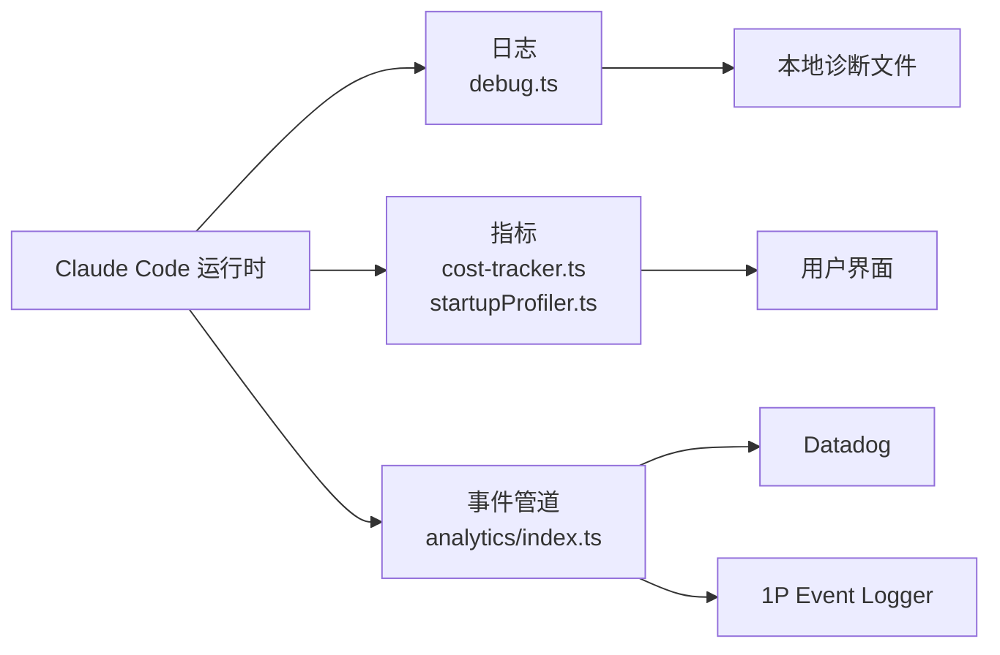

# 第 15 章：可观测性——看见系统的内心

> **核心思想**：**你不能优化你看不见的东西。** Claude Code 构建了一套完整的运行时自省体系——成本追踪、启动剖析、事件分析、诊断日志——让开发者在不中断服务的情况下理解系统行为。

---

## 15.1 为什么 CLI 工具需要可观测性？

想象你驾驶一辆没有仪表盘的汽车。你可以开，但无法知道油量、转速和水温。

Claude Code 面临同样的问题：每次对话消耗数千 token（真金白银），Agent 循环可能因重试延迟几十秒，上下文压缩可能丢失关键信息。没有可观测性，这些都是黑箱。

**可观测性的本质不是"记录日志"——而是让你能回答关于系统行为的任何问题，即使这个问题在设计时没有预见到。**

---

## 15.2 三种可观测信号

| 信号 | 回答的问题 | Claude Code 中的实现 |
|------|-----------|---------------------|
| 日志 | "发生了什么？" | `src/utils/debug.ts` — 分级诊断日志 |
| 指标 | "花了多少钱？多长时间？" | `src/cost-tracker.ts` + `src/utils/startupProfiler.ts` |
| 追踪 | "事件经过了哪些路径？" | `src/services/analytics/` — 事件管道 |



---

## 15.3 成本追踪：每一个 token 都是钱

### 15.3.1 定价公式

`src/utils/modelCost.ts:131-142` 定义了 token 到美元的换算：

```typescript
// src/utils/modelCost.ts:131-142
export function tokensToUSDCost(usage: Usage, modelCosts: CostTier): number {
  return (
    (usage.input_tokens / 1_000_000) * modelCosts.inputTokens +
    (usage.output_tokens / 1_000_000) * modelCosts.outputTokens +
    ((usage.cache_read_input_tokens ?? 0) / 1_000_000) * modelCosts.promptCacheReadTokens +
    ((usage.cache_creation_input_tokens ?? 0) / 1_000_000) * modelCosts.promptCacheWriteTokens +
    (usage.server_tool_use?.web_search_requests ?? 0) * modelCosts.webSearchRequests
  )
}
```

五项相加。注意缓存读取的价格远低于缓存写入——以 Sonnet 为例：

| Token 类型 | 单价（每百万 token） | 相对成本 |
|-----------|---------------------|---------|
| 输入 | $3 | 基准 |
| 输出 | $15 | 5× |
| 缓存写入 | $3.75 | 1.25× |
| 缓存读取 | $0.30 | **0.1×** |

这就是第 13 章提示词缓存分区设计的经济学基础：静态段命中全局缓存时，token 成本降为十分之一。

### 15.3.2 会话级累积

`src/cost-tracker.ts:278-323` 的 `addToTotalSessionCost()` 在每次 API 调用后累积：

```typescript
// src/cost-tracker.ts:278-323（简化）
export function addToTotalSessionCost(
  model: string,
  usage: Usage,
  apiDuration: number,
): TotalSessionCost {
  // 按模型累积 token 统计
  addToTotalModelUsage(model, usage)
  // 记录到分析系统
  logEvent('tengu_advisor_tool_token_usage', { model, ... })
  // 返回含子 Agent 费用的总计
  return { cost: getTotalCostUSD(), ... }
}
```

成本状态持久化到项目配置（`src/cost-tracker.ts:139-175`），恢复会话时自动加载。用户在任意时刻调用 `/cost` 即可看到实时账单。

### 15.3.3 分层定价

`src/utils/modelCost.ts:35-87` 为不同模型定义了价格层级：

| 层级 | 模型 | 输入/输出单价 |
|------|------|-------------|
| COST_TIER_3_15 | Sonnet 4.5/4.6 | $3 / $15 |
| COST_TIER_15_75 | Opus 4.0/4.1 | $15 / $75 |
| COST_TIER_5_25 | Opus 4.5 | $5 / $25 |
| COST_TIER_30_150 | Opus 4.6 Fast | $30 / $150 |
| COST_HAIKU_45 | Haiku 4.5 | $1 / $5 |

---

## 15.4 性能剖析：检查点机制

### 15.4.1 启动 Profiler

`src/utils/startupProfiler.ts` 用检查点（checkpoint）追踪启动性能，而非持续采样——开销极小，但足以定位瓶颈。

核心 API（`src/utils/startupProfiler.ts:65-75`）：

```typescript
// src/utils/startupProfiler.ts:65-75
export function profileCheckpoint(name: string): void {
  perf.mark(name)
  if (DETAILED_PROFILING) {
    memorySnapshots.push({
      name,
      memory: process.memoryUsage(),
    })
  }
}
```

启动路径中每个关键步骤调用一次 `profileCheckpoint()`，系统自动计算步骤间耗时。

### 15.4.2 四个核心阶段

`src/utils/startupProfiler.ts:48-54` 定义了四个被追踪到分析系统的阶段：

| 阶段 | 起点 | 终点 | 衡量什么 |
|------|------|------|---------|
| `import_time` | cli_entry | main_tsx_imports_loaded | 模块加载速度 |
| `init_time` | init_function_start | init_function_end | 初始化逻辑 |
| `settings_time` | eagerLoadSettings_start | eagerLoadSettings_end | 配置加载 |
| `total_time` | cli_entry | main_after_run | 端到端启动 |

`logStartupPerf()`（`src/utils/startupProfiler.ts:159-194`）将这些阶段耗时上报到分析系统，同时附带 `checkpoint_count` 供内部诊断。

### 15.4.3 Headless Profiler：运行时性能

SDK / headless 模式使用另一个 profiler（`src/utils/headlessProfiler.ts:62-178`），追踪每一轮对话的性能：

- **`time_to_first_response_ms`**（TTFT）：从发出请求到模型开始输出的时间
- **`query_overhead_ms`**：query 启动到实际发 API 请求之间的开销
- **`time_to_system_message_ms`**：仅首轮——系统消息准备耗时

这些指标让团队能精确定位"用户觉得慢"的原因是网络延迟、本地处理还是提示词组装。

---

## 15.5 事件分析管道

### 15.5.1 缓冲与路由

`src/services/analytics/index.ts:80-123` 实现了一个带缓冲的事件管道：

```typescript
// src/services/analytics/index.ts:80-81
const eventQueue: Array<QueuedEvent> = []

// src/services/analytics/index.ts:133-144
export function logEvent(name: string, metadata?: Record<string, any>): void {
  if (!analyticsSink) {
    eventQueue.push({ name, metadata })
    return
  }
  analyticsSink.logEvent(name, metadata)
}
```

设计要点：分析 sink 在启动中异步初始化，但事件可能在 sink 就绪前产生。缓冲队列解决了这个时序问题——sink 就绪后通过 `queueMicrotask()` 异步排空。

### 15.5.2 双出口路由

`src/services/analytics/sink.ts:48-86` 将事件路由到两个目标：

```
logEventImpl(name, metadata)
  ├─→ Datadog（采样后，剥离 proto 字段）
  └─→ 1P Event Logger（完整负载，含 PII 标记数据）
```

**Datadog 路由**（`src/services/analytics/datadog.ts:19-64`）有严格的**白名单**：只有 64 个预定义事件名可以发送，防止意外数据泄露。MCP 工具名被统一脱敏为 `'mcp_tool'`（`src/services/analytics/metadata.ts:70-77`）。

### 15.5.3 1P 事件的批处理

`src/services/analytics/firstPartyEventLogger.ts:300-379` 配置了批处理策略：

| 参数 | 默认值 | 可通过 GrowthBook 动态调整 |
|------|--------|--------------------------|
| 刷新间隔 | 10 秒 | `scheduledDelayMillis` |
| 批次大小上限 | 200 事件 | `maxExportBatchSize` |
| 队列上限 | 8192 事件 | `maxQueueSize` |

当配置变化时（`src/services/analytics/firstPartyEventLogger.ts:414-449`），系统先 flush 旧的 provider，再切换到新配置——确保不丢事件。

### 15.5.4 采样控制

并非所有事件都需要 100% 上报。`src/services/analytics/firstPartyEventLogger.ts:57-85` 支持按事件名配置采样率：

```typescript
// src/services/analytics/firstPartyEventLogger.ts:57-85（简化）
export function shouldSampleEvent(eventName: string): number | null {
  const config = getEventSamplingConfig()
  const rate = config?.events?.[eventName]?.sample_rate
  if (rate === 0) return 0     // 完全丢弃
  if (rate) return rate         // 概率采样
  return null                   // 无配置 → 100% 上报
}
```

---

## 15.6 TelemetrySafeError：隐私优先的错误传播

> 完整的实现分析见第 9 章 9.6 节。这里聚焦其在可观测性体系中的角色。

遥测的两难：需要足够的错误信息来诊断问题，但不能泄露用户代码或文件路径。

`src/utils/errors.ts:93-101` 的解决方案是一个名字故意很长的类：

```typescript
class TelemetrySafeError_I_VERIFIED_THIS_IS_NOT_CODE_OR_FILEPATHS extends Error {
  readonly telemetryMessage: string
  constructor(message: string, telemetryMessage?: string) {
    super(message)
    this.telemetryMessage = telemetryMessage ?? message
  }
}
```

每个实例携带两条消息：`message` 供本地日志（可含路径），`telemetryMessage` 供远程上报（已脱敏）。类名本身就是检查清单——开发者在 `throw new TelemetrySafeError_I_VERIFIED_...` 时被迫阅读安全声明，代码审查时它是醒目的审计点。

---

## 15.7 Feature Flag 与渐进式发布

Claude Code 使用两层 Feature Flag：

| 层面 | 工具 | 决定时机 | 开销 |
|------|------|---------|------|
| 编译时 | `bun:bundle` `feature()` | 打包阶段 | 零（死代码消除） |
| 运行时 | GrowthBook | 每次会话 | 微小（远程配置拉取） |

### 15.7.1 编译时消除

`feature('KAIROS')` 在 Bun 打包时被替换为 `true` 或 `false` 常量，分支代码被彻底删除。内部工具不会出现在外部构建中——不是跳过，是不存在。

### 15.7.2 GrowthBook 运行时控制

`src/services/analytics/growthbook.ts:526-545` 创建 GrowthBook 客户端：

```typescript
// src/services/analytics/growthbook.ts:526-545（简化）
const client = new GrowthBook({
  apiHost, clientKey,
  attributes: { id: userId, platform, organizationUUID, ... },
  remoteEval: true,  // 服务端预计算规则
  cacheKeyAttributes: ['id', 'organizationUUID'],  // 用户/组织变化时重取
})
```

`remoteEval: true` 是关键——规则在服务端求值，客户端只拿结果。这避免了客户端暴露完整的 flag 规则集。

**四种访问模式**（`src/services/analytics/growthbook.ts:719-935`）：

| 函数 | 行为 | 用途 |
|------|------|------|
| `getFeatureValue_CACHED_MAY_BE_STALE()` | 内存优先，磁盘兜底 | 启动关键路径（不能阻塞） |
| `checkSecurityRestrictionGate()` | 等待重初始化完成 | 安全相关 gate（必须最新值） |
| `checkGate_CACHED_OR_BLOCKING()` | 缓存 true 则快返，否则等待 | 订阅权限检查 |
| `getFeatureValue_DEPRECATED()` | 等待完整初始化 | 已废弃，会拖慢启动 |

**磁盘缓存**（`src/services/analytics/growthbook.ts:407-417`）：Feature 值写入 `~/.claude.json` 的 `cachedGrowthBookFeatures` 字段，进程重启后可立即使用。整体替换（非合并），确保已删除的 flag 不残留。

---

## 15.8 诊断日志系统

`src/utils/debug.ts` 实现了分级日志，不面向用户，面向开发团队远程诊断。

### 日志级别（`src/utils/debug.ts:18-40`）

```
verbose(0) < debug(1) < info(2) < warn(3) < error(4)
```

默认最低级别 `debug`，通过 `CLAUDE_CODE_DEBUG_LOG_LEVEL` 调整。

### 写入策略（`src/utils/debug.ts:155-196`）

| 模式 | 触发条件 | 行为 |
|------|---------|------|
| 立即写入 | `--debug` 标志 | 同步写磁盘，防退出丢数据 |
| 缓冲写入 | 默认 | ~1 秒刷一次，降低 IO 开销 |

日志文件位于 `~/.claude/debug/{sessionId}.txt`，`~/.claude/debug/latest` 符号链接指向最新会话。

### 日志格式

```
2026-04-01T10:30:45.123Z [DEBUG] GrowthBook: Creating client
```

`--debug=pattern` 支持过滤（`src/utils/debug.ts:73-83`），只输出匹配的日志行。

---

## 15.9 端到端走查：一次请求留下哪些观测信号

用户输入 "fix the bug in auth.ts"，以下信号被产生：

```
[1] 启动 profiler 记录 checkpoint: 'query_started'
    ↓
[2] cost-tracker 记录 API 调用开始时间
    ↓
[3] API 返回 → logEvent('tengu_api_call', {model, tokens, duration})
    ↓
[4] cost-tracker.addToTotalSessionCost() → 累积 token 和费用
    ↓
[5] 工具执行（Read、Edit、Bash）
    ├─ 每个工具: logEvent('tengu_tool_use', {toolName, duration})
    ├─ Bash 工具: 沙箱违规 → logEvent('tengu_sandbox_violation')
    └─ 文件编辑: diagnosticTracking.beforeFileEdited() → 记录基线
    ↓
[6] 编辑后 diagnosticTracking.getNewDiagnostics() → 检测引入的新问题
    ↓
[7] Agent 循环继续 → 重复 [2]-[6]
    ↓
[8] headlessProfiler 记录: TTFT, query_overhead, 总轮次
    ↓
[9] 会话结束 → cost-tracker.saveCurrentSessionCosts() → 持久化
```

如果这次请求中 API 返回了 529 过载错误：
- `withRetry` 记录重试次数和退避时间
- `logEvent('tengu_api_retry', {attempt, delay, error_type: '529'})`
- 用户看到的延迟在 headless profiler 中被准确量化

---

## 15.10 设计权衡

### OpenTelemetry 的重量

大多数 CLI 工具用 `console.log` 就够了。但 Claude Code 需要远程诊断、成本核算和性能优化——这不是"大多数 CLI 工具"。OTel 的依赖代价（多个 `@opentelemetry/*` 包）换来的是与任何 OTLP 后端的标准化集成。

### 隐私过滤的代价

遥测数据不含文件路径和代码，意味着"某个文件的工具调用失败"这种问题无法从遥测中直接定位。团队需要用户手动提供诊断日志（`~/.claude/debug/`），或用 `/share` 上传完整会话。

---

## 15.11 迁移指南

1. **第一天就加成本追踪**。调用付费 API 的系统，一个累积计数器就够——不需要 OTel。
2. **检查点 > 全量采样**。`performance.mark()` + 阶段命名，比持续 profiling 实用得多。
3. **类型系统强制隐私**。为遥测数据创建标记类型（`SafeForTelemetry<T>`），在类型层面防止敏感数据泄露。
4. **双层 Feature Flag**。编译时消除不发布的功能，运行时控制渐进式发布。
5. **事件白名单**。只允许预定义的事件名发送到外部系统，防止意外泄露。

---

## 15.12 本章小结

1. 成本追踪区分五种 token（输入/输出/缓存写入/缓存读取/搜索），缓存读取成本仅为输入的十分之一。
2. 启动 profiler 用检查点而非采样，四个阶段精确定位启动瓶颈。
3. 事件管道双出口（Datadog + 1P），64 个白名单事件 + 工具名脱敏保护隐私。
4. GrowthBook 四种访问模式平衡了"启动速度"和"值新鲜度"。
5. 诊断日志分级写入，`latest` 符号链接让远程诊断一步到位。

---

> **上一章**：[第 14 章：并发模型](./14-concurrency.md) | **下一章**：[第 16 章：测试工程](./16-testing.md)
