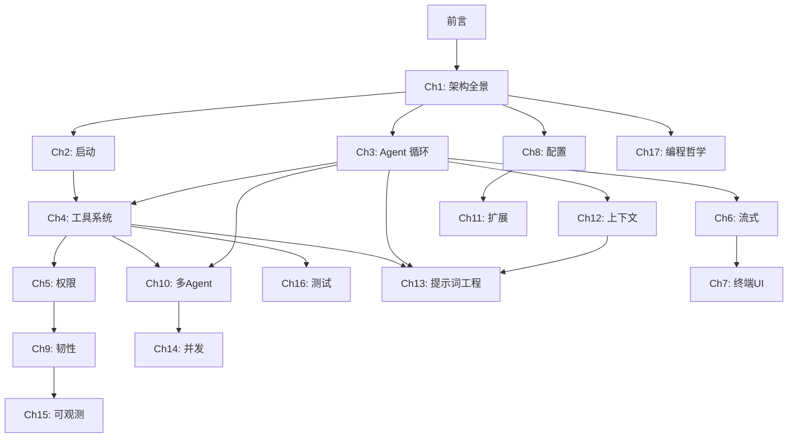

# 《Claude Code 源码编程思想》

> **Thinking in Claude Code: 从 50 万行 AI Agent 源码中提炼的工程哲学**
>
> 对标 Bruce Eckel《Thinking in C++》——每章聚焦一个核心编程思想，从"为什么这样设计"出发。

---

## 阅读指南

### 快速路线（~150 页）
适合有经验的工程师，快速获取核心设计思想：
> [第 1 章](#第-1-章架构全景) → [第 3 章](#第-3-章agent-循环) → [第 4 章](#第-4-章工具系统) → [第 5 章](#第-5-章权限模型) → [第 10 章](#第-10-章多-agent-协作) → [第 17 章](#第-17-章编程哲学)

### 专题路线
| 读者角色 | 推荐章节 |
|---------|---------|
| AI Agent 开发者 | 第 3、4、5、10、12、13 章 |
| CLI 工具开发者 | 第 2、6、7、8 章 |
| 系统架构师 | 第 1、8、9、14、17 章 |
| 安全工程师 | 第 5、9、13、15 章 |

---

## 目录

### 前言
- [前言：为什么要读一个 CLI 工具的源码](./00-preface.md)

### 第一部分：基础架构

#### 第 1 章：架构全景
- [分层、边界与依赖方向](./01-architecture.md)
- 核心思想：**让依赖方向永远指向稳定的一侧**
- 关键词：五层架构、稳定依赖原则、安全失败默认值

#### 第 2 章：启动与生命周期
- [从 main.tsx 到第一个 Token](./02-lifecycle.md)
- 核心思想：**启动是一场依赖注入仪式**
- 关键词：preAction hook、多入口统一、Feature Flag 编译时消除

#### 第 3 章：Agent 循环
- [用 AsyncGenerator 编织思考链](./03-agent-loop.md)
- 核心思想：**Agent 是无界循环，不是单次调用**
- 关键词：AsyncGenerator、queryLoop 状态机、yield 语义、中断传播

### 第二部分：核心系统

#### 第 4 章：工具系统
- [25 个方法的契约](./04-tool-system.md)
- 核心思想：**接口宽度决定表达力，接口约束决定安全性**
- 关键词：Tool 接口、buildTool() 工厂、Zod Schema、结果持久化

#### 第 5 章：权限模型
- [在能力与安全之间走钢丝](./05-permissions.md)
- 核心思想：**安全不是开关，而是频谱**
- 关键词：四层决策、权限规则 DSL、投机性分类器、三条路径

#### 第 6 章：流式架构
- [从第一个 byte 到最后一个 token](./06-streaming.md)
- 核心思想：**数据应该"流过"系统，而不是"存在"系统里**
- 关键词：三层流模型、StreamingToolExecutor、背压、工具批次分区

#### 第 7 章：终端 UI
- [在 80 列 24 行里构建现代界面](./07-terminal-ui.md)
- 核心思想：**约束催生创造力**
- 关键词：内嵌 Ink、React Reconciler、帧渲染、虚拟滚动

### 第三部分：工程实践

#### 第 8 章：配置哲学
- [七层优先级的统一](./08-config.md)
- 核心思想：**配置优先级反映信任层级**
- 关键词：七层配置、合并策略、@include 指令、缓存一致性

#### 第 9 章：韧性设计
- [在不可靠的世界中保持优雅](./09-resilience.md)
- 核心思想：**每一种故障都应该有一个故事**
- 关键词：重试状态机、错误分类学、配置损坏恢复、TelemetrySafeError

#### 第 10 章：多 Agent 协作
- [从单体到群体智能](./10-multi-agent.md)
- 核心思想：**用文件锁、邮箱和信号量在单机上实现分布式协调**
- 关键词：递归 Agent、三种后端、文件基邮箱、AsyncLocalStorage

#### 第 11 章：扩展机制
- [开放而不失控](./11-extension.md)
- 核心思想：**开放接口，封闭内核**
- 关键词：四大扩展通道、Skills、MCP 动态工具、Hook 生命周期

### 第四部分：进阶主题

#### 第 12 章：上下文管理
- [在有限窗口中维持无限对话](./12-context.md)
- 核心思想：**在信息丢失不可避免时，丢失最不重要的信息**
- 关键词：Compaction、Token 预算、提示词缓存稳定性

#### 第 13 章：提示词工程
- [用代码构建 AI 的认知框架](./13-prompt-engineering.md)
- 核心思想：**提示词不是文本，而是架构——它用代码定义 AI Agent 的认知边界、行为契约和能力空间**
- 关键词：Section Builder、静态/动态分界、缓存感知组装、五级覆盖优先级、工具描述契约

#### 第 14 章：并发模型
- [单线程世界中的多任务](./14-concurrency.md)
- 核心思想：**正确的并发不需要线程，需要边界和所有权**
- 关键词：工具并发策略、文件锁退避、Cron 调度器、消息队列

#### 第 15 章：可观测性
- [看见系统的内心](./15-observability.md)
- 核心思想：**你不能优化你看不见的东西**
- 关键词：三支柱、成本追踪、TelemetrySafeError、双层 Feature Flag

#### 第 16 章：测试工程
- [验证一个不确定性系统](./16-testing.md)
- 核心思想：**测试约束而非输出**
- 关键词：_forTesting 模式、Schema-as-Contract、测试隔离

### 第五部分：总结

#### 第 17 章：编程哲学
- [从 Claude Code 中可迁移的设计模式](./17-philosophy.md)
- 核心思想：**每个成熟系统都是设计模式的矿**
- 模式集：AsyncGenerator-as-Pipeline, Permission-as-Spectrum, Prompt-as-Architecture, File-as-IPC, ...

### 附录
- [附录 A：源码导航速查](./appendix-a.md)
- [术语表](./glossary.md)

---

## 关于本书

- **源码版本**：Claude Code v2.1.87
- **技术栈**：TypeScript 5.8 + Bun + React 19 + Ink + Zod v4
- **源码规模**：2,010 文件 / 512,000+ 行 / 57 工具 / 93 命令 / 150 组件

---

## 章节依赖关系

