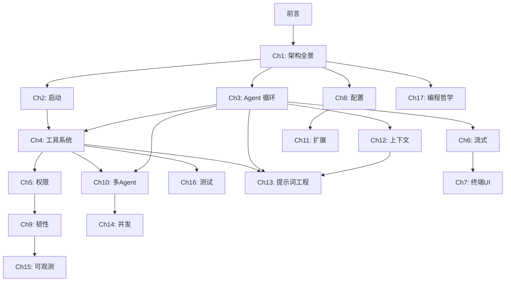

Thinking in Claude Code

<h1 class="home-title">
《Claude Code
源码编程思想》
</h1>

从 50 万行 AI Agent 源码中提炼的工程哲学

这不是用户手册，也不是逐文件注释。它把 Claude Code 当作一套已经长大的 AI Agent 系统来读，重点解释它为什么这样分层、怎样守住边界、以及哪些做法值得迁移到你自己的项目里。

书稿式阅读入口
围绕真实源码组织
适合工程师与架构师

为什么值得读

<h3>不是教你用命令，而是教你看懂一套 AI 系统怎么长大。</h3>
<ul>
<li>把工具、权限、上下文、多 Agent 协作放回真实工程</li>
<li>每章都从"为什么这样设计"出发，而不是停在"这里有什么"</li>
<li>最终收束成可以迁移到你自己项目里的模式和判断</li>
</ul>

<strong>17 章正文</strong>
完整覆盖核心主题

<strong>50 万行+</strong>
分析对象：Claude Code 源码

<strong>2,010 文件</strong>
书中持续映射到真实目录

<strong>57 工具</strong>
工具、权限、并发都有落点

<a class="home-action home-action--primary" href="00-preface.html">
<strong>开始阅读</strong>
从前言进入，先建立整本书的问题意识和阅读方式。
</a>
<a class="home-action" href="01-architecture.html">
<strong>快速进入核心</strong>
直接从第 1 章开始，先看架构，再看循环和工具系统。
</a>
<a class="home-action" href="appendix-a.html">
<strong>按源码导航</strong>
如果你想边看边对照实现，先走附录的索引入口。
</a>
<a class="home-action" href="https://github.com/lexiaoyao20/Thinking-in-Claude-Code">
<strong>查看仓库</strong>
返回 GitHub，看书稿、源码和更新记录。
</a>

<h2 class="home-section-title">先从哪读</h2>

如果你是第一次来，先别急着翻完整目录。按下面的入口进，会比直接硬啃整套源码轻松很多。

<h3>最省时间的读法</h3>

按这个顺序读六章，就能抓住这套系统最有价值的部分：

<a class="home-chip" href="01-architecture.html">Ch1 架构全景</a>
<a class="home-chip" href="03-agent-loop.html">Ch3 Agent 循环</a>
<a class="home-chip" href="04-tool-system.html">Ch4 工具系统</a>
<a class="home-chip" href="05-permissions.html">Ch5 权限模型</a>
<a class="home-chip" href="10-multi-agent.html">Ch10 多 Agent</a>
<a class="home-chip" href="17-philosophy.html">Ch17 编程哲学</a>

<h3>按你的关注点来读</h3>
<ul>
<li><strong>AI Agent 怎么跑起来</strong> → 第 3、4、5、10、12、13 章</li>
<li><strong>终端产品怎么做复杂交互</strong> → 第 2、6、7、8 章</li>
<li><strong>大系统怎么分层收口</strong> → 第 1、8、9、14、17 章</li>
<li><strong>安全、约束和失控边界</strong> → 第 5、9、11、15 章</li>
</ul>

<h2 class="home-section-title">全书结构</h2>

全书分五个部分，从架构到实践再到哲学，每一章都映射到真实源码。

第一部分

<h3>基础架构</h3>

从整体分层到 Agent 循环，先建立对系统骨架的认知。

<ul>
<li><a href="01-architecture.html">第 1 章：架构全景</a></li>
<li><a href="02-lifecycle.html">第 2 章：启动与生命周期</a></li>
<li><a href="03-agent-loop.html">第 3 章：Agent 循环</a></li>
</ul>

第二部分

<h3>核心系统</h3>

工具、权限、流式、终端——Agent 系统的四个关键齿轮。

<ul>
<li><a href="04-tool-system.html">第 4 章：工具系统</a></li>
<li><a href="05-permissions.html">第 5 章：权限模型</a></li>
<li><a href="06-streaming.html">第 6 章：流式架构</a></li>
<li><a href="07-terminal-ui.html">第 7 章：终端 UI</a></li>
</ul>

第三部分

<h3>工程实践</h3>

配置、韧性、多 Agent、扩展——从"能跑"到"能在生产环境跑"。

<ul>
<li><a href="08-config.html">第 8 章：配置哲学</a></li>
<li><a href="09-resilience.html">第 9 章：韧性设计</a></li>
<li><a href="10-multi-agent.html">第 10 章：多 Agent 协作</a></li>
<li><a href="11-extension.html">第 11 章：扩展机制</a></li>
</ul>

第四部分

<h3>进阶主题</h3>

上下文、提示词、并发、可观测、测试——深入系统的细粒度设计。

<ul>
<li><a href="12-context.html">第 12 章：上下文管理</a></li>
<li><a href="13-prompt-engineering.html">第 13 章：提示词工程</a></li>
<li><a href="14-concurrency.html">第 14 章：并发模型</a></li>
<li><a href="15-observability.html">第 15 章：可观测性</a></li>
<li><a href="16-testing.html">第 16 章：测试工程</a></li>
</ul>

第五部分

<h3>总结</h3>

把前面所有章节收束为可迁移的工程判断和设计模式。

<ul>
<li><a href="17-philosophy.html">第 17 章：编程哲学</a></li>
</ul>

辅助阅读

<h3>附录与参考</h3>

源码导航速查和术语表，方便随时查阅。

<ul>
<li><a href="appendix-a.html">附录 A：源码导航速查</a></li>
<li><a href="glossary.html">术语表</a></li>
</ul>

<h2 class="home-section-title">适合谁读</h2>

<strong>正在做 AI Agent、代码助手、自动化工作流的人</strong>
这本书里的分层、循环、权限、上下文管理全部来自真实系统

<strong>想看一套成熟终端产品怎么组织起来的人</strong>
从启动流程到流式渲染到多 Agent 并发，都有完整讲解

<strong>想研究大型 TypeScript 系统的边界和约束处理的人</strong>
权限模型、韧性设计、配置哲学都是从工程角度展开的

<strong>更关心"为什么这样设计"而不只关心"怎么使用"的人</strong>
每一章都优先回答 Why，然后才是 How

<h2 class="home-section-title">关于本书</h2>

源码版本：Claude Code v2.1.87
TypeScript 5.8 + Bun + React 19 + Ink + Zod v4
2,010 文件 / 512,000+ 行
57 工具 / 93 命令 / 150 组件

<h2 class="home-section-title">章节依赖关系</h2>

